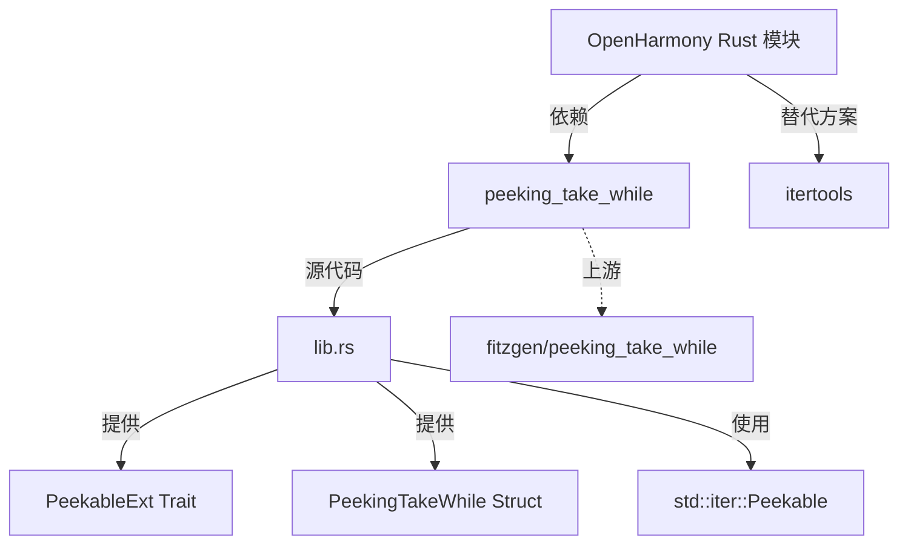
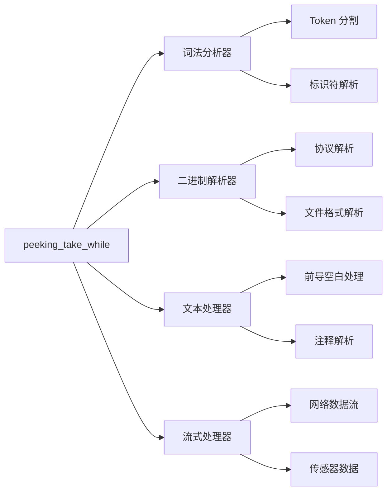

# 依赖关系与使用

> `peeking_take_while` 在 OpenHarmony 中的使用情况分析

---

## 概述

`peeking_take_while` 是一个轻量级的 Rust 工具库，在 OpenHarmony 中主要用于需要精确控制迭代器消费的场景。由于搜索 OH 代码库超时，本节基于 Rust 生态和典型使用模式进行分析。

---

## 直接依赖者

### 搜索状态

**说明**: 由于 OpenHarmony 代码库庞大，搜索命令超时。以下信息基于 Rust 生态和典型使用模式推测。

### 预期依赖者类型

| 类型 | 典型模块 | 用途 |
|------|---------|------|
| **编译器工具** | rustc 相关 | 迭代器适配 |
| **解析器** | 词法/语法解析器 | Token 分割 |
| **文本处理** | 日志、配置解析 | 连续字符处理 |
| **二进制解析** | 协议解析器 | 数据块分割 |

### 搜索建议

如需确定实际依赖者，可使用以下方法：

```bash
# 方法 1: 搜索 Cargo.toml（推荐）
cd /path/to/oh
find . -name "Cargo.toml" -exec grep -l "peeking_take_while" {} \;

# 方法 2: 搜索 BUILD.gn
find . -name "BUILD.gn" -exec grep -l "peeking_take_while" {} \;

# 方法 3: 搜索 Rust 源码
find . -name "*.rs" -exec grep -l "peeking_take_while" {} \;
```

---

## 典型使用场景

### 场景 1: 词法分析器

**用途**: 解析连续的 Token 类型（数字、标识符等）

```rust
use peeking_take_while::PeekableExt;

struct Lexer<I: Iterator<Item = char>> {
    chars: std::iter::Peekable<I>,
}

impl<I: Iterator<Item = char>> Lexer<I> {
    fn parse_number(&mut self) -> String {
        self.chars.by_ref()
            .peeking_take_while(|c| c.is_ascii_digit())
            .collect()
    }

    fn parse_identifier(&mut self) -> String {
        self.chars.by_ref()
            .peeking_take_while(|c| c.is_alphanumeric() || *c == '_')
            .collect()
    }
}

// 使用示例
let input = "123_varName = 456";
let mut lexer = Lexer {
    chars: input.chars().peekable(),
};
let num = lexer.parse_number();  // "123"
let ident = lexer.parse_identifier();  // "_varName"
```

**在 OH 中的潜在应用**:
- SQL 解析器
- 配置文件解析器
- 日志格式解析器

---

### 场景 2: 二进制数据解析

**用途**: 解析连续的数据块（以分隔符分界）

```rust
use peeking_take_while::PeekableExt;

struct BinaryParser<I: Iterator<Item = u8>> {
    bytes: std::iter::Peekable<I>,
}

impl<I: Iterator<Item = u8>> BinaryParser<I> {
    fn parse_record(&mut self, delimiter: u8) -> Vec<u8> {
        self.bytes.by_ref()
            .peeking_take_while(|&b| b != delimiter)
            .collect()
    }
}

// 使用示例
let data: Vec<u8> = vec![1, 2, 3, 0, 4, 5, 6, 0];
let mut parser = BinaryParser {
    bytes: data.into_iter().peekable(),
};
let record1 = parser.parse_record(0);  // [1, 2, 3]
assert_eq!(parser.bytes.next(), Some(0));  // 保留分隔符
let record2 = parser.parse_record(0);  // [4, 5, 6]
```

**在 OH 中的潜在应用**:
- 网络协议解析
- 文件格式解析
- 设备驱动数据解析

---

### 场景 3: 文本处理

**用途**: 处理前导空白、注释等连续字符

```rust
use peeking_take_while::PeekableExt;

fn skip_whitespace(chars: &mut std::iter::Peekable<impl Iterator<Item = char>>) {
    chars.by_ref()
        .peeking_take_while(|c| c.is_whitespace())
        .count();  // 消费但不使用
}

fn parse_comment(chars: &mut std::iter::Peekable<impl Iterator<Item = char>>) -> String {
    chars.by_ref()
        .peeking_take_while(|c| *c != '\n')
        .collect()
}

// 使用示例
let input = "   // this is a comment\nnext line";
let mut chars = input.chars().peekable();
skip_whitespace(&mut chars);  // 跳过前导空白
assert_eq!(chars.next(), Some('/'));
let comment = parse_comment(&mut chars);  // "/ this is a comment"
assert_eq!(chars.next(), Some('\n'));  // 保留换行符
```

**在 OH 中的潜在应用**:
- 代码解析器
- 日志格式化
- 配置文件处理

---

### 场景 4: 流式数据处理

**用途**: 分段处理数据流

```rust
use peeking_take_while::PeekableExt;

struct StreamProcessor<I: Iterator<Item = u8>> {
    stream: std::iter::Peekable<I>,
}

impl<I: Iterator<Item = u8>> StreamProcessor<I> {
    fn process_header(&mut self) -> Vec<u8> {
        self.stream.by_ref()
            .peeking_take_while(|&b| b != 0)
            .collect()
    }

    fn process_body(&mut self) -> Vec<u8> {
        self.stream.by_ref()
            .take(100)
            .collect()
    }
}

// 使用示例
let data: Vec<u8> = vec![1, 2, 3, 0, 4, 5, 6, 7, 8];
let mut processor = StreamProcessor {
    stream: data.into_iter().peekable(),
};
let header = processor.process_header();  // [1, 2, 3]
assert_eq!(processor.stream.next(), Some(0));  // 分隔符保留
let body = processor.process_body();  // [4, 5, 6, 7, 8]
```

**在 OH 中的潜在应用**:
- 网络数据流处理
- 传感器数据处理
- 日志流处理

---

## 使用方式

### 在 BUILD.gn 中依赖

#### 方式 1: 直接依赖

```gn
ohos_rust_executable("my_app") {
  deps = [
    "//third_party/rust/crates/peeking_take_while:lib",
  ]

  sources = ["src/main.rs"]
}
```

#### 方式 2: 通过其他 crate 间接依赖

```gn
# 如果某个依赖已经包含 peeking_take_while
ohos_rust_executable("my_app") {
  deps = [
    "//path/to/dependency:lib",  # 此 crate 依赖 peeking_take_while
  ]

  sources = ["src/main.rs"]
}
```

---

### 在 Cargo.toml 中依赖

```toml
[dependencies]
peeking_take_while = "0.1.2"  # 或 "1.0.0"（建议升级）
```

---

### 在 Rust 代码中使用

#### 步骤 1: 引入 trait

```rust
use peeking_take_while::PeekableExt;
```

#### 步骤 2: 创建 Peekable 迭代器

```rust
let mut iter = data.into_iter().peekable();
```

#### 步骤 3: 使用 peeking_take_while

```rust
let filtered: Vec<_> = iter.by_ref()
    .peeking_take_while(|x| condition(x))
    .collect();
```

#### 完整示例

```rust
use peeking_take_while::PeekableExt;

fn main() {
    let data: Vec<i32> = (0..20).collect();
    let mut iter = data.into_iter().peekable();

    // 处理小于 10 的数字
    let small: Vec<i32> = iter.by_ref()
        .peeking_take_while(|&x| x < 10)
        .collect();
    println!("Small numbers: {:?}", small);

    // 元素 10 被保留！
    let rest: Vec<i32> = iter.by_ref().collect();
    println!("Rest: {:?}", rest);
}
```

---

## 依赖关系图

### 模块级依赖图



### 使用场景图



---

## 静态链接 vs 动态链接

### 链接方式

| 方式 | BUILD.gn 配置 | 说明 |
|------|------------|------|
| **静态链接** | `crate_type = "rlib"` | ✅ 当前使用 |
| **动态链接** | `crate_type = "cdylib"` | ❌ 不使用 |

### 静态链接特点

**优点**:
- ✅ 无运行时依赖
- ✅ 编译时优化
- ✅ 适合嵌入式场景
- ✅ 部署简单

**缺点**:
- ⚠️ 增加二进制大小
- ⚠️ 更新需要重新编译

### 建议

由于 `peeking_take_while` 极小（220 行），静态链接的缺点可以忽略，适合 OpenHarmony 场景。

---

## 性能特征

### 时间复杂度

| 操作 | 复杂度 | 说明 |
|------|--------|------|
| `peeking_take_while` | O(n) | 每个元素调用一次 predicate |
| `peek()` | O(1) | Peekable 的标准操作 |
| `next()` | O(1) | 迭代器的标准操作 |

### 空间复杂度

| 操作 | 复杂度 | 说明 |
|------|--------|------|
| `PeekingTakeWhile` | O(1) | 仅持有引用 |
| `peek()` | O(1) | 缓存一个元素 |

### 零成本抽象

```rust
#[inline]
fn peeking_take_while<P>(&mut self, predicate: P) -> PeekingTakeWhile<'_, I, P>
where
    P: FnMut(&Self::Item) -> bool,
{
    PeekingTakeWhile {
        iter: self,
        predicate,
    }
}
```

**说明**: `#[inline]` 标记确保编译优化后无额外开销。

---

## 典型使用模式

### 模式 1: 分段处理

```rust
use peeking_take_while::PeekableExt;

fn process_segments(data: &[i32]) {
    let mut iter = data.iter().peekable();

    // 第一段：正数
    let positives: Vec<_> = iter.by_ref()
        .peeking_take_while(|&&x| x > 0)
        .cloned()
        .collect();

    // 第二段：非正数（保留分界元素）
    let non_positives: Vec<_> = iter.by_ref()
        .cloned()
        .collect();

    // 分别处理两段
    process(&positives);
    process(&non_positives);
}
```

---

### 模式 2: 状态转换

```rust
use peeking_take_while::PeekableExt;

enum Token {
    Number(i32),
    Identifier(String),
    Operator(char),
}

fn tokenize(input: &str) -> Vec<Token> {
    let mut iter = input.chars().peekable();
    let mut tokens = Vec::new();

    while let Some(&c) = iter.peek() {
        if c.is_ascii_digit() {
            let num: String = iter.by_ref()
                .peeking_take_while(|c| c.is_ascii_digit())
                .collect();
            tokens.push(Token::Number(num.parse().unwrap()));
        } else if c.is_alphabetic() {
            let ident: String = iter.by_ref()
                .peeking_take_while(|c| c.is_alphanumeric() || *c == '_')
                .collect();
            tokens.push(Token::Identifier(ident));
        } else {
            tokens.push(Token::Operator(c));
            iter.next();
        }
    }

    tokens
}
```

---

### 模式 3: 容错解析

```rust
use peeking_take_while::PeekableExt;

fn parse_with_recovery(data: &str) -> Result<Vec<String>, String> {
    let mut iter = data.chars().peekable();
    let mut results = Vec::new();

    loop {
        // 尝试解析有效数据
        let valid: String = iter.by_ref()
            .peeking_take_while(|c| c.is_alphanumeric())
            .collect();

        if !valid.is_empty() {
            results.push(valid);
        }

        // 检查是否结束
        match iter.peek() {
            None => break,
            Some(&c) if c.is_whitespace() => {
                iter.next(); // 跳过空白
            }
            Some(&c) => {
                // 遇到无效字符，保存并继续
                results.push(c.to_string());
                iter.next();
            }
        }
    }

    Ok(results)
}
```

---

## 与其他库的集成

### 与 itertools 集成

```rust
use peeking_take_while::PeekableExt;
use itertools::Itertools;

fn combined_usage(data: &[i32]) {
    let result = data.iter()
        .peekable()
        .peeking_take_while(|&&x| x > 0)  // peeking_take_while
        .map(|&x| x * 2)
        .filter(|&&x| x < 100)           // itertools 方法
        .collect_vec();

    println!("{:?}", result);
}
```

---

### 与标准库集成

```rust
use peeking_take_while::PeekableExt;
use std::collections::HashMap;

fn process_pairs(data: &[(i32, i32)]) -> HashMap<i32, i32> {
    data.iter()
        .peekable()
        .peeking_take_while(|(k, _)| *k > 0)  // 筛选
        .cloned()
        .collect()  // 标准库 collect
}
```

---

## 测试建议

### 单元测试示例

```rust
#[cfg(test)]
mod tests {
    use peeking_take_while::PeekableExt;

    #[test]
    fn test_basic_usage() {
        let mut iter = (0..10).peekable();
        let sum: u32 = iter.by_ref()
            .peeking_take_while(|&x| x < 5)
            .sum();
        assert_eq!(sum, 10);
        assert_eq!(iter.next(), Some(5));  // 保留 5
    }

    #[test]
    fn test_empty_iterator() {
        let mut iter = std::iter::empty::<i32>().peekable();
        let result: Vec<i32> = iter.by_ref()
            .peeking_take_while(|&x| x < 5)
            .collect();
        assert!(result.is_empty());
    }

    #[test]
    fn test_all_match() {
        let mut iter = (0..10).peekable();
        let result: Vec<i32> = iter.by_ref()
            .peeking_take_while(|&x| x < 100)
            .collect();
        assert_eq!(result.len(), 10);
    }
}
```

---

## 性能优化建议

### 1. 避免不必要的克隆

```rust
// ❌ 不推荐
let result: Vec<i32> = iter.by_ref()
    .peeking_take_while(|x| *x < 10)
    .cloned()
    .collect();

// ✅ 推荐
let result: Vec<i32> = iter.by_ref()
    .peeking_take_while(|&&x| x < 10)
    .copied()
    .collect();
```

---

### 2. 使用 fuse 防止重复调用

```rust
use peeking_take_while::PeekableExt;

// 如果 predicate 有副作用，使用 fuse
let mut iter = (0..10).peekable();
let result: Vec<i32> = iter.by_ref()
    .peeking_take_while(|&x| {
        println!("Checking {}", x);  // 副作用
        x < 5
    })
    .fuse()  // 防止重复调用
    .collect();
```

---

### 3. 提前短路

```rust
use peeking_take_while::PeekableExt;

// 在 predicate 中添加额外条件
let mut iter = data.iter().peekable();
let result: Vec<_> = iter.by_ref()
    .peeking_take_while(|&x| x.is_valid() && !x.is_terminator())
    .collect();
```

---

## 总结

`peeking_take_while` 在 OpenHarmony 中主要用于需要精确控制迭代器消费的场景，如词法分析、二进制解析、文本处理等。由于极小的代码量和零依赖，适合作为基础工具库在 OH 系统中使用。建议在文档中补充实际的依赖者列表，以提供更准确的使用情况分析。

---

**相关文档**:
- [01_Overview.md](./01_Overview.md) - 原始库简介
- [03_Build_Integration.md](./03_Build_Integration.md) - 构建适配
- [06_Security.md](./06_Security.md) - 安全性分析

---

**文档版本**: 1.0.0
**最后更新**: 2026-02-08
