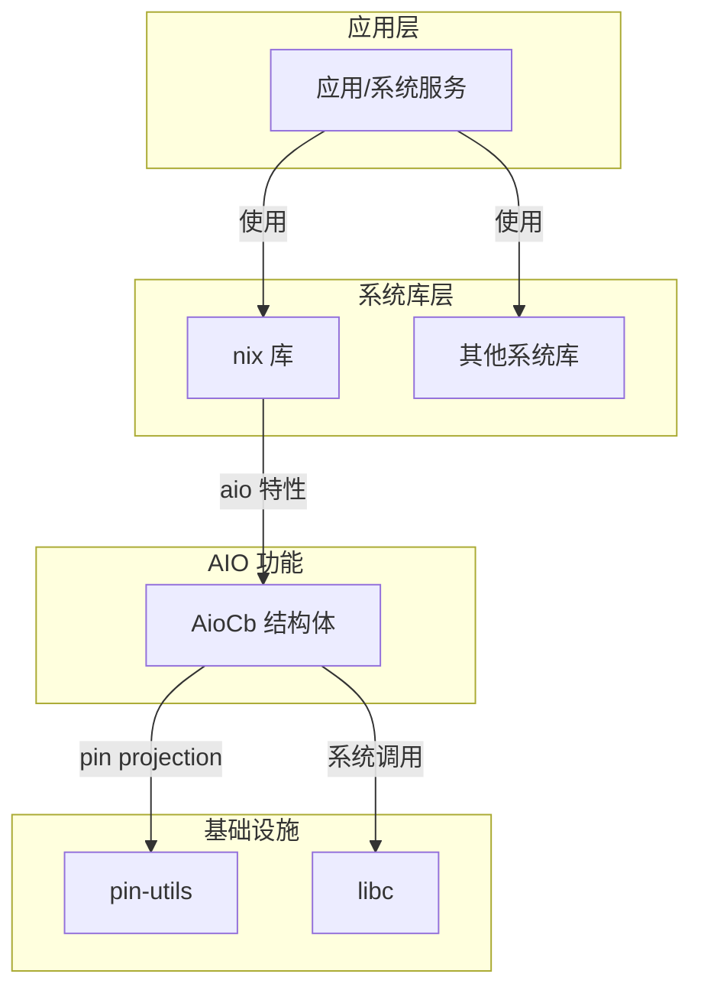

# 04 - OH 依赖关系与使用

## 4.1 直接依赖者

### 4.1.1 依赖者清单

通过全代码库搜索，发现 **1 个** 直接依赖 pin-utils 的模块：

| 模块 | 依赖路径 | 依赖方式 | 用途 |
|-----|---------|---------|-----|
| **nix** | `third_party/rust/crates/nix/Cargo.toml` | Cargo 依赖 | POSIX AIO 异步 I/O |

### 4.1.2 依赖详情

**在 nix/Cargo.toml 中**：

```toml
[dependencies]
pin-utils = { version = "0.1.0", optional = true }

[features]
aio = ["pin-utils"]
```

**说明**:
- 依赖方式为 **optional**，仅在启用 `aio` 特性时引入
- 版本要求: `0.1.0` (精确版本)
- 无其他版本约束

---

## 4.2 使用方式分析

### 4.2.1 代码使用位置

**文件**: `third_party/rust/crates/nix/src/sys/aio.rs`

```rust
// 第 39 行: 导入宏
use pin_utils::unsafe_pinned;

// ... 在 AioCb 结构体实现中 ...

/// AIO 控制块结构体
pub struct AioCb {
    aiocb: LibcAiocb,
    // ... 其他字段
}

impl AioCb {
    // 第 137 行附近: 使用 pin-utils 宏
    pin_utils::unsafe_unpinned!(aiocb: LibcAiocb);
    
    // 该宏展开后相当于：
    // fn aiocb<'__a>(self: Pin<&'__a mut Self>) -> &'__a mut LibcAiocb {
    //     unsafe { &mut Pin::get_unchecked_mut(self).aiocb }
    // }
}
```

### 4.2.2 使用场景解释

**为什么 nix AIO 需要 pin-utils？**

```
AIO (Asynchronous I/O) 流程:

1. 用户创建 AioCb 结构体
   └─> 包含 libc::aiocb (系统 AIO 控制块)

2. AioCb 需要被 Pin 住
   └─> 因为 aiocb 可能被内核异步访问
   └─> 移动 AioCb 会导致野指针

3. 用户需要访问 aiocb 字段
   └─> 但 AioCb 是 Pin<AioCb>
   └─> 无法直接获取 &mut aiocb

4. pin-utils 提供解决方案
   └─> unsafe_unpinned! 宏
   └─> 安全地从 Pin<AioCb> 获取 &mut aiocb
```

### 4.2.3 使用方式特点

| 特点 | 说明 |
|-----|-----|
| **链接方式** | 静态链接 (rlib) |
| **头文件引用** | N/A (Rust crate) |
| **使用场景** | POSIX AIO 异步文件 I/O |
| **使用频率** | 低 (仅 nix 使用) |

---

## 4.3 依赖关系图

### 4.3.1 完整依赖链



### 4.3.2 依赖层级

```
Level 0 (叶节点):
└── pin-utils

Level 1:
└── nix (feature: aio)

Level 2:
└── 应用/系统服务
```

pin-utils 是**叶节点库**，不依赖其他第三方库。

---

## 4.4 典型使用场景

### 4.4.1 POSIX AIO 异步 I/O

**场景**: 高性能文件 I/O

```rust
use nix::sys::aio::{AioCb, LioMode};
use nix::fcntl::OFlag;
use std::os::unix::io::RawFd;

// 打开文件
let fd: RawFd = /* ... */;

// 创建 AIO 控制块
let mut buf = vec![0u8; 4096];
let aio = AioCb::from_mut_slice(
    fd,
    0, // offset
    &mut buf,
    0, // priority
    SigevNotify::SigevNone,
    LioMode::LIO_NOP,
);

// 提交异步读
aio.read()?;

// 内部: AioCb 使用 pin-utils 确保内存安全
```

### 4.4.2 在 OH 中的实际使用

搜索 OH 代码库中实际使用 nix AIO 的模块：

```bash
grep -r "nix::sys::aio\|AioCb" --include="*.rs" . 2>/dev/null
```

**结果**: 未发现 OH 其他模块直接使用 nix AIO。

这表明：
- nix AIO 功能可能是**预留能力**
- 或用于**特定场景** (如多媒体、存储子系统)
- pin-utils 的依赖是**潜在依赖**，非活跃依赖

---

## 4.5 依赖关系总结

### 4.5.1 统计数据

| 指标 | 数值 |
|-----|-----|
| 直接依赖者 | 1 (nix) |
| 间接依赖者 | 未知 (可能无) |
| 使用场景 | 1 (AIO) |
| 活跃使用 | 低 |

### 4.5.2 影响分析

| 场景 | 影响 |
|-----|-----|
| 移除 pin-utils | 需确认 nix AIO 是否被使用 |
| 升级 pin-utils | 风险极低，无兼容性问题 |
| nix 移除 AIO | 可移除 pin-utils |

---

## 4.6 与其他系统对比

### 4.6.1 标准 Linux 系统

在标准 Linux Rust 生态中，pin-utils 也被广泛使用：

```toml
# futures crate 使用 pin-utils
futures-util = { version = "0.3", features = ["pin-utils"] }

# tokio 早期版本使用
tokio = { version = "0.2", features = ["pin-utils"] }
```

但在 OH 中，仅 nix 使用此库。

### 4.6.2 潜在扩展

若 OH 未来增加异步编程支持，pin-utils 的使用可能扩展：

```
潜在使用场景:
- 异步文件系统操作
- 异步网络 I/O
- Future/Promise 实现
- 协程/绿色线程
```

---

## 4.7 维护建议

### 4.7.1 当前建议

1. **监控 nix AIO 使用**
   ```bash
   # 定期搜索实际使用
   grep -r "nix::sys::aio\|AioCb" --include="*.rs" .
   ```

2. **评估必要性**
   - 如确认无模块使用 nix AIO，可考虑移除整个依赖链
   - 如保留，继续维持现状

3. **文档更新**
   - 若未来有模块开始使用，更新本文档

### 4.7.2 依赖优化机会

```
优化路径 1: 移除未使用功能
├── 确认 nix AIO 未被使用
├── 从 nix 默认特性中移除 aio
└── 移除 pin-utils

优化路径 2: 替换实现
├── 确认 AIO 功能需求
├── 使用 Rust 标准库实现
└── 移除对外部 pin-utils 的依赖
```

---

*本文档基于 OH 代码库当前状态分析*
*最后更新: 2026-02-08*
