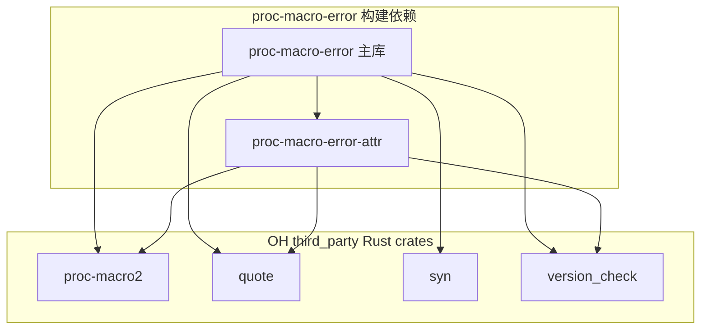
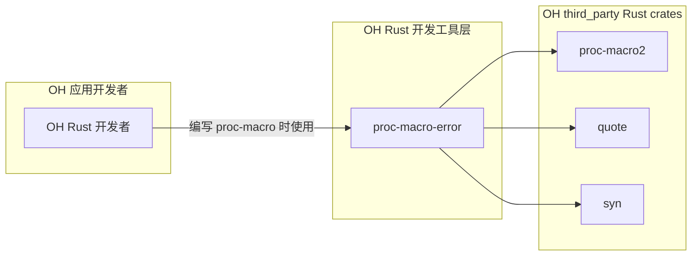

# 依赖关系与使用

## 4.1 依赖关系概览

### 4.1.1 依赖结构

该库在 OpenHarmony 中的依赖关系如下：

```
proc-macro-error
├── 依赖 ────────────────────────────────────────────→ 提供
─────────────────────────────────────────────────────────────
proc-macro2                      ← 抽象 TokenStream
quote                            ← 代码生成
syn                              ← Rust 代码解析
proc-macro-error-attr            ← #[proc_macro_error] 属性
─────────────────────────────────────────────────────────────
version_check (build)            ← Rust 版本检测
```

### 4.1.2 依赖方向

```
                    proc-macro-error (主库)
                           ↑
          ┌────────────────┼────────────────┐
          │                │                │
    proc-macro2         quote            syn
    (OH 提供)         (OH 提供)        (OH 提供)
                           ↑
          ┌────────────────┼────────────────┐
          │                │                │
    proc-macro-error-attr   version_check
    (子 crate)           (build 时)
```

## 4.2 直接依赖者分析

### 4.2.1 当前依赖状态

**搜索结果**：该库目前没有被 OpenHarmony 其他模块直接依赖。

```bash
# 搜索 OH 代码库中对该库的引用
grep -r "proc-macro-error\|rust_proc_macro_error" \
  /Volumes/lexar/code/d/work/oh --include="*.gn" --include="BUILD.gn" \
  2>/dev/null | grep -v "third_party/rust/crates/proc-macro-error"
# 结果：无匹配（仅在自身目录内引用）
```

### 4.2.2 依赖缺失的原因

| 原因 | 说明 |
|-----|------|
| **库的性质** | proc-macro crate 通常作为传递依赖，不被直接引用 |
| **使用场景** | 仅在编写其他过程宏时需要 |
| **生态位置** | 属于 Rust 开发工具层，非运行时依赖 |

### 4.2.3 潜在依赖场景

虽然目前没有直接依赖，但以下场景可能会间接使用：

| 潜在使用者 | 使用方式 | 依赖类型 |
|-----------|---------|---------|
| OH Rust derive 宏 | 通过 Cargo.toml 间接依赖 | 传递依赖 |
| OH 属性宏 | 通过 Cargo.toml 间接依赖 | 传递依赖 |
| OH 代码生成工具 | 通过 Cargo.toml 间接依赖 | 传递依赖 |

## 4.3 依赖关系图

### 4.3.1 内部依赖结构



### 4.3.2 在 OH 生态中的位置



## 4.4 在 OH 中使用该库

### 4.4.1 使用场景

该库适用于以下场景：

| 场景 | 示例 | 说明 |
|-----|------|------|
| **自定义 derive 宏** | `#[derive(MyDerive)]` | 提供更好的错误消息 |
| **自定义属性宏** | `#[my_attr]` | 属性验证错误 |
| **自定义函数宏** | `my_macro!()` | 函数宏参数解析错误 |

### 4.4.2 添加为依赖

#### 方式 1：在 OH Rust 项目中使用

如果你的 Rust 项目在 OH third_party 中：

```toml
# your-crate/Cargo.toml
[dependencies]
proc-macro-error = { path = "../proc-macro-error" }
```

#### 方式 2：在 OH 外部项目中使用

```toml
# 假设使用 crates.io 版本
[dependencies]
proc-macro-error = "1.0"
```

### 4.4.3 完整使用示例

```rust
// your-derive-macro/src/lib.rs

use proc_macro_error::{proc_macro_error, abort, emit_error};
use proc_macro::TokenStream;
use quote::quote;
use syn::{parse_macro_input, DeriveInput};

/// 自定义 derive 宏示例
#[proc_macro_derive(MyDerive)]
#[proc_macro_error]  // <-- 添加此属性
pub fn derive_my_feature(input: TokenStream) -> TokenStream {
    let input = parse_macro_input!(input as DeriveInput);

    // 验证字段
    for field in input.fields.iter() {
        let ty = &field.ty;
        
        if let syn::Type::Path(type_path) = ty {
            if type_path.path.ident == "i32" {
                // 发现不支持的类型，报告错误
                abort!(field,
                    "i32 is not supported in this context";
                    note = "Use i64 instead"
                );
            }
        }
    }

    // 验证属性
    for attr in &input.attrs {
        if attr.path().is_ident("my_attr") {
            if let Err(e) = parse_my_attr(attr) {
                emit_error!(attr, "Invalid #[my_attr]: {}", e);
            }
        }
    }

    // 如果有错误，终止并报告所有错误
    abort_if_dirty!();

    // 生成代码
    let expanded = quote! {
        impl MyDerive for #input {
            fn new() -> Self {
                // 生成代码
            }
        }
    };

    expanded.into()
}

fn parse_my_attr(attr: &syn::Attribute) -> Result<(), String> {
    // 属性解析逻辑
    Ok(())
}
```

### 4.4.4 错误消息对比

#### 不使用 proc-macro-error

```rust
// 错误消息不携带位置信息
if !valid {
    panic!("Invalid input");  // 用户无法定位问题
}
```

#### 使用 proc-macro-error

```rust
// 错误消息携带精确位置
if !valid {
    abort!(span, "Invalid input";  // 用户可看到 ^ 标记
        note = "Check the documentation at ..."  // 额外说明
    );
}
```

**效果对比**：

| 场景 | 不使用 | 使用 proc-macro-error |
|-----|-------|---------------------|
| 错误定位 | 仅显示调用点 | 精确标记问题 token |
| IDE 集成 | 无高亮 | 有高亮和下划线 |
| 用户体验 | 需搜索代码 | 直接看到问题位置 |

## 4.5 版本兼容性

### 4.5.1 Rust 版本要求

| 版本范围 | 支持状态 | 说明 |
|---------|---------|------|
| 1.31 - 1.35 | ✅ | 需要 fallback 模式 |
| 1.36+ | ✅ | 完整功能 |
| 1.38+ | ✅ | 跳过 UI 测试 |
| 稳定版 | ✅ | 使用 compile_error! |
| 夜间版 | ✅ | 使用 proc_macro::Diagnostic |

### 4.5.2 依赖版本

| 依赖 | 最低版本 | 建议版本 | OH 版本 |
|-----|---------|---------|---------|
| proc-macro2 | 1 | 1 | OH third_party 版本 |
| quote | 1 | 1 | OH third_party 版本 |
| syn | 1 | 1 | OH third_party 版本 |
| version_check | 0.9 | 0.9 | OH third_party 版本 |

### 4.5.3 Cargo Features 组合

| 特性组合 | 效果 | 适用场景 |
|---------|------|---------|
| `syn-error` (默认) | 启用 syn 依赖 | 需要 `From<syn::Error>` |
| 无特性 | 禁用 syn 依赖 | 仅使用基本错误类型 |

## 4.6 在 OH 中贡献代码

### 4.6.1 贡献流程

```
1. 在 third_party/rust/crates/ 下克隆仓库
   ↓
2. 修改代码
   ↓
3. 测试构建
   ↓
4. 提交到 OH
```

### 4.6.2 测试验证

```bash
# 构建测试
hb build -p rust_proc_macro_error

# 运行 cargo test (如果支持)
cd third_party/rust/crates/proc-macro-error
cargo test
```

## 4.7 常见问题

### Q1: 为什么要用 proc-macro-error 而不是直接用 panic!？

**答案**：`panic!` 无法携带 span 信息，用户无法定位错误发生的位置。`proc-macro-error` 提供类似语法但保留 span 信息。

### Q2: 这个库会影响编译速度吗？

**答案**：基本没有影响。库本身很小，主要影响是宏展开时的错误处理。

### Q3: 如何调试使用这个库的过程宏？

**答案**：使用标准 Rust 调试方法：
```rust
eprintln!("Debug: {:?}", some_value);
```

### Q4: 在 OH 中使用需要特殊配置吗？

**答案**：不需要特殊配置。只需在 Cargo.toml 中添加依赖即可。

## 4.8 相关资源

### 上游资源

| 资源 | 链接 |
|-----|------|
| 文档 | https://docs.rs/proc-macro-error |
| 源码 | https://gitlab.com/CreepySkeleton/proc-macro-error |
| 指南 | https://docs.rs/proc-macro-error/1.0.4/proc_macro_error/

### 相关 OH 资源

| 资源 | 路径 |
|-----|------|
| Rust crates 目录 | `//third_party/rust/crates/` |
| 构建配置示例 | `//third_party/rust/crates/proc-macro-error/BUILD.gn` |
| 组件配置 | `//third_party/rust/crates/proc-macro-error/bundle.json` |

## 4.9 总结

### 依赖关系总结

| 项目 | 状态 |
|-----|------|
| **直接依赖者** | 无 |
| **传递依赖** | 潜在（通过其他 proc-macro crate） |
| **OH 特有适配** | 无（标准集成） |

### 使用建议

| 场景 | 建议 |
|-----|------|
| 编写 OH proc-macro | ✅ 推荐使用 |
| 运行时库 | ❌ 不适用 |
| 简单错误处理 | ⚠️ 考虑是否需要 span 信息 |

**最终建议**：该库是 OH Rust 生态中过程宏开发的标准工具库，推荐在编写过程宏时使用。
