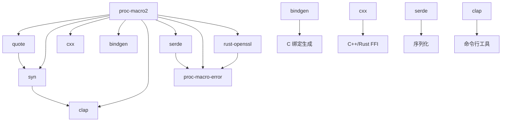

# 在 OpenHarmony 中的使用

## 直接依赖者

### OH Rust Crates

| 模块 | BUILD.gn 路径 | 用途 | span-locations |
|------|--------------|------|----------------|
| quote | //third_party/rust/crates/quote/BUILD.gn | Rust 代码生成 | ❌ |
| syn | //third_party/rust/crates/syn/BUILD.gn | Rust 代码解析 | ❌ |
| cxx | //third_party/rust/crates/cxx/macro/BUILD.gn | C++/Rust FFI | ✅ |
| bindgen | //third_party/rust/crates/bindgen/bindgen/BUILD.gn | C 头文件绑定 | ❌ |
| clap | //third_party/rust/crates/clap/clap_derive/BUILD.gn | 命令行解析 | ❌ |
| serde | //third_party/rust/crates/serde/BUILD.gn | 序列化框架 | ❌ |
| proc-macro-error | //third_party/rust/crates/proc-macro-error/BUILD.gn | 宏错误处理 | ❌ |
| rust-openssl | //third_party/rust/crates/rust-openssl/openssl-macros/BUILD.gn | OpenSSL 派生宏 | ❌ |

### 使用方式统计

- **总依赖者**: 8 个 OH Rust crates
- **启用 span-locations**: 1 个（cxx）
- **静态链接**: 100%

## 依赖图



## 典型使用场景

### 1. 代码生成工具（bindgen）

```rust
// bindgen 用于生成 C 库绑定
use proc_macro2::TokenStream;

// 解析 C 头文件生成的 TokenStream
let tokens: TokenStream = header.parse().unwrap();

// 转换为 Rust 代码
let code = tokens.to_string();
```

### 2. 派生宏（serde_derive, openssl_derive）

```rust
// serde_derive 使用 proc-macro2 生成序列化代码
use proc_macro2::TokenStream;

#[derive(Serialize, Deserialize)]
struct User {
    name: String,
    age: u32,
}

// 编译时生成的 TokenStream:
// impl Serialize for User { ... }
```

### 3. C++/Rust FFI（cxx）

```rust
// cxx 使用 proc-macro2 生成 FFI 代码
use proc_macro2::{TokenStream, Span};

#[cxx::bridge]
mod ffi {
    unsafe extern "C++" {
        type Client;
        fn connect() -> Result<Client>;
    }
}

// 生成的 TokenStream 包含 Rust 和 C++ 桥接代码
```

### 4. 过程宏错误处理（proc-macro-error）

```rust
// proc-macro-error 使用 proc-macro2 报告错误
use proc_macro2::{TokenStream, Span, Diagnostic};

span.error("expected ident").emit_as_type_tokens();
```

## 链接方式

### 静态链接

proc-macro2 在 OH 中通过以下方式静态链接:

```gn
# 下游 crate 的 BUILD.gn
rust_library("my_library") {
    deps = [
        "//third_party/rust/crates/proc-macro2:lib",
    ]
}
```

### 传递性依赖

大多数下游 crate 通过传递性依赖使用 proc-macro2:

```
my_crate
├── syn ───→ proc-macro2
└── serde ───→ proc-macro2
```

## 头文件引用

### 公共接口

```rust
// 从 proc-macro2 导出的主要类型
use proc_macro2::TokenStream;
use proc_macro2::TokenTree;
use proc_macro2::Span;
use proc_macro2::Ident;
use proc_macro2::Punct;
use proc_macro2::Literal;
```

### OH 特有头文件

**无**。proc-macro2 没有 OH 特定的头文件。

## 在 OH Rust 项目中的使用

### 1. 添加依赖

```toml
# Cargo.toml
[dependencies]
proc-macro2 = "1.0.92"
```

### 2. 使用示例

```rust
use proc_macro2::TokenStream;

fn generate_code() -> TokenStream {
    quote::quote! {
        fn hello() {
            println!("Hello from OpenHarmony!");
        }
    }
}

fn main() {
    let code = generate_code();
    println!("Generated code: {}", code);
}
```

### 3. 启用可选特性

```toml
[dependencies]
proc-macro2 = { version = "1.0.92", features = ["span-locations"] }
```

## 依赖管理

### Cargo.toml 配置

```toml
[package]
name = "my_oh_rust_crate"
version = "1.0.0"
edition = "2021"

[dependencies]
proc-macro2 = "1.0.92"

# 下游依赖
syn = { version = "2.0", features = ["full"] }
quote = "1.0"
serde = { version = "1.0", features = ["derive"] }
```

### 版本兼容性

| proc-macro2 版本 | syn 版本 | quote 版本 | cxx 版本 |
|------------------|----------|------------|----------|
| 1.0.92 | 2.0.x | 1.0.x | 1.0.x |
| 1.0.90 | 2.0.x | 1.0.x | 1.0.x |

## 最佳实践

### 1. 避免直接依赖

推荐通过 syn、quote 等高层库间接使用 proc-macro2：

```rust
// ❌ 不推荐：直接依赖底层 API
use proc_macro2::TokenStream;

// ✅ 推荐：使用高层抽象
use syn::parse_derive_input;
use quote::quote;
```

### 2. 特性选择

根据需求选择合适的 features：

| 场景 | 需要的 features |
|------|----------------|
| 基础派生宏 | proc-macro（默认） |
| 代码诊断/错误定位 | span-locations |
| 过程宏单元测试 | proc-macro |

### 3. 错误处理

```rust
use proc_macro2::{TokenStream, Diagnostic};

fn parse_tokens(input: &str) -> Result<TokenStream, Vec<Diagnostic>> {
    input.parse().map_err(|err| {
        vec![err.span().error(format!("Parse error: {}", err))]
    })
}
```

## 常见问题

### Q1: 为什么需要 proc-macro2 而不是直接使用 proc_macro？

proc_macro 只能在过程宏上下文中使用，而 proc-macro2 可以在任何 Rust 代码中使用，包括 `build.rs`、`main.rs` 和单元测试。

### Q2: span-locations 有什么作用？

span-locations 提供了 token 的行/列位置信息，主要用于：
- 编译错误报告
- 源代码定位
- 调试信息生成

### Q3: 如何升级 proc-macro2 版本？

1. 在 OH third_party 目录更新版本
2. 运行 `cargo update` 更新 Cargo.lock
3. 执行构建验证
4. 运行相关测试

## 相关文档

- [上游文档](https://docs.rs/proc-macro2)
- [GitHub 仓库](https://github.com/dtolnay/proc-macro2)
- [Rust 过程宏文档](https://doc.rust-lang.org/reference/procedural-macros.html)
