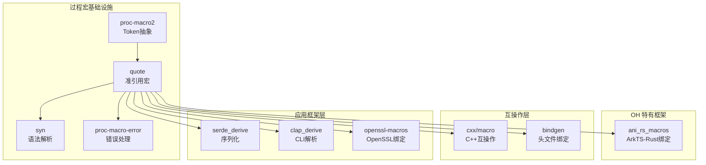

# 01 - quote Crate 概览

## 1.1 原始库基本信息

### 库简介

**quote** 是 Rust 生态系统中用于**准引用（Quasi-Quoting）**的核心库，提供 `quote!` 宏用于将 Rust 语法树数据结构转换为源代码 Token。

| 属性 | 详情 |
|------|------|
| **官方名称** | Rust Quasi-Quoting |
| **Crate 名称** | quote |
| **当前版本** | 1.0.37 |
| **许可证** | Apache-2.0 OR MIT |
| **上游仓库** | https://github.com/dtolnay/quote |
| **维护者** | David Tolnay (dtolnay@gmail.com) |
| **Rust 版本要求** | >= 1.56 |
| **Edition** | 2018 |

### 核心功能

```rust
use quote::quote;

// 在 quote! 宏中编写看起来像代码的内容
let tokens = quote! {
    struct MyStruct {
        field: u32,
    }
    
    impl MyStruct {
        fn new() -> Self {
            Self { field: 0 }
        }
    }
};

// tokens 是 proc_macro2::TokenStream 类型
// 可直接返回给编译器用于代码生成
```

### 主要特性

1. **变量插值**: 使用 `#var` 语法将运行时变量插入到生成的代码中
2. **重复模式**: 使用 `#(...)*` 或 `#(...),*` 进行类似 `macro_rules!` 的重复
3. **卫生（Hygiene）**: 保留 Token 的 Span 信息，支持宏卫生
4. **与 syn 配合**: 与 syn crate 一起构成 Rust 过程宏的标准工具链

### 关键导出项

| 名称 | 类型 | 说明 |
|------|------|------|
| `quote!` | 宏 | 准引用宏，核心功能 |
| `quote_spanned!` | 宏 | 带自定义 Span 的准引用 |
| `format_ident!` | 宏 | 格式化生成标识符 |
| `ToTokens` | Trait | 定义可转换为 TokenStream 的类型 |
| `TokenStreamExt` | Trait | TokenStream 扩展方法 |
| `IdentFragment` | Trait | 标识符片段格式化支持 |

## 1.2 在 OpenHarmony 中的作用

### 核心定位

在 OpenHarmony 中，quote crate 是 **Rust 过程宏生态系统的基础设施**，被定位为**编译期代码生成工具链的核心组件**。

### OH 中的作用域

```
┌─────────────────────────────────────────────────────────────┐
│                   OpenHarmony 系统架构                       │
├─────────────────────────────────────────────────────────────┤
│  应用层 (ArkTS/JS)                                          │
│       ↓                                                     │
│  ArkUI / ArkCompiler                                        │
│       ↓                                                     │
├─────────────────────────────────────────────────────────────┤
│  框架层 (Rust/C++)                                          │
│  ┌─────────────┐  ┌─────────────┐  ┌─────────────────────┐ │
│  │ ANI 框架    │  │ serde       │  │ cxx (C++互操作)      │ │
│  │ (Ark Native │  │ (序列化)     │  │                     │ │
│  │  Interface) │  │             │  │                     │ │
│  └──────┬──────┘  └──────┬──────┘  └──────────┬──────────┘ │
│         │                │                    │            │
│         └────────────────┴────────────────────┘            │
│                          │                                 │
│                   ┌──────┴──────┐                         │
│                   │  syn/quote  │ ← 过程宏基础设施        │
│                   │  (本库)     │                         │
│                   └─────────────┘                         │
├─────────────────────────────────────────────────────────────┤
│  系统服务层 (Rust/C++)                                      │
│  - 网络管理 (netmanager)                                    │
│  - 数据管理 (datamgr)                                       │
│  - 多媒体 (multimedia)                                      │
└─────────────────────────────────────────────────────────────┘
```

### 关键使用场景

#### 1. ANI (Ark Native Interface) 框架支持

OpenHarmony 的 ANI 框架允许 ArkTS 代码调用 Rust 实现的 Native 方法。quote crate 被用于：

- **ani_rs_macros**: 为 Rust 侧 ANI 绑定生成胶水代码
- 自动生成 ArkTS 与 Rust 之间的类型转换代码
- 生成 JNI 风格的函数注册表

**关键路径**: 
```
foundation/communication/netmanager_base/common/ani_rs_macros/
foundation/distributeddatamgr/data_share/common/ani_rs_macros/
```

#### 2. C/C++ 互操作 (cxx)

quote 支持 cxx crate 的过程宏，实现 Rust 与 C++ 的安全互操作：

```rust
// cxx::bridge 宏内部使用 quote 生成
#[cxx::bridge]
mod ffi {
    unsafe extern "C++" {
        type MyClass;
        fn method(self: Pin<&mut MyClass>);
    }
}
// quote 生成上述声明对应的 C++ 头文件和 Rust FFI 绑定
```

**关键路径**:
```
third_party/rust/crates/cxx/macro/
third_party/rust/crates/cxx/gen/cmd/
```

#### 3. 序列化框架 (serde)

serde_derive 使用 quote 生成 `#[derive(Serialize, Deserialize)]` 的实现：

```rust
#[derive(Serialize)]
struct Config {
    name: String,
    value: u32,
}
// quote 在编译期生成 impl Serialize for Config { ... }
```

**关键路径**:
```
third_party/rust/crates/serde/serde_derive/
```

#### 4. 命令行工具 (clap)

clap_derive 使用 quote 生成 CLI 参数解析代码：

```rust
#[derive(Parser)]
struct Args {
    #[arg(short, long)]
    verbose: bool,
}
// quote 生成 Args::parse() 及相关方法
```

**关键路径**:
```
third_party/rust/crates/clap/clap_derive/
```

#### 5. OpenSSL 绑定

openssl-macros 使用 quote 为 OpenSSL 绑定生成辅助代码。

### OH 组件关系图



## 1.3 为什么不需要 Patch

### 原生支持分析

quote crate 在 OpenHarmony 中**无需任何 Patch**，原因如下：

#### 1. 纯编译期工具

quote 仅在编译期运行，不涉及：
- ❌ 系统调用
- ❌ 平台特定 API
- ❌ 运行时库依赖
- ❌ 硬件架构差异

#### 2. 抽象层隔离

```
quote
  ↓ 使用
proc-macro2 (已适配 OH)
  ↓ 使用
rustc 编译器接口
```

quote 通过 proc-macro2 与编译器交互，proc-macro2 已完成 OpenHarmony 适配。

#### 3. TokenStream 统一抽象

所有操作基于 `proc_macro2::TokenStream`，这是跨平台的统一抽象：

```rust
// src/to_tokens.rs
pub trait ToTokens {
    fn to_tokens(&self, tokens: &mut TokenStream);
    // ... 完全平台无关的 Token 操作
}
```

#### 4. 广泛的平台兼容性

quote 设计目标就是支持所有 Rust 支持的平台，包括：
- Windows/Linux/macOS
- iOS/Android
- 嵌入式目标 (no_std)
- **OpenHarmony** (作为标准 Linux 类平台)

### OH 验证情况

| 验证项 | 结果 | 说明 |
|--------|------|------|
| 源码中 `#ifdef OHOS` | 无 | 无需条件编译 |
| 平台特定代码 | 无 | 纯 Rust 实现 |
| 特殊构建配置 | 无 | 标准 BUILD.gn 配置 |
| 依赖项适配状态 | 已适配 | proc-macro2 已适配 OH |

## 1.4 版本与升级

### 当前状态

| 项目 | 版本/状态 |
|------|-----------|
| OH 集成版本 | 1.0.37 |
| 上游最新版本 | 1.0.x (API 稳定) |
| API 兼容性 | SemVer 兼容 |
| 维护状态 | 活跃维护 |

### 升级路径

由于无 Patch，升级流程简单：

1. **同步上游**: 直接替换源码
2. **验证编译**: 确保所有依赖者编译通过
3. **功能测试**: 重点测试 ANI、serde、clap 等关键使用方

### 升级建议

- **频率**: 建议每季度检查上游更新
- **策略**: 小版本可直接升级，大版本需全面测试
- **关注**: 关注 syn/quote/proc-macro2 三者的版本兼容性

## 1.5 相关资源

### 官方文档
- **API Docs**: https://docs.rs/quote/
- **GitHub**: https://github.com/dtolnay/quote
- **Crates.io**: https://crates.io/crates/quote

### 相关 Crate
- **syn**: 语法解析 - https://github.com/dtolnay/syn
- **proc-macro2**: Token 抽象 - https://github.com/dtolnay/proc-macro2
- **proc-macro-error**: 错误处理 - https://gitlab.com/CreepySkeleton/proc-macro-error

### OpenHarmony 相关
- **ANI 框架**: foundation/arkui/ani
- **Rust 组件规范**: OpenHarmony Rust 组件开发指南

---

*文档版本*: 1.0  
*最后更新*: 2026-02-08  
*维护者*: OpenHarmony Wiki Agent
