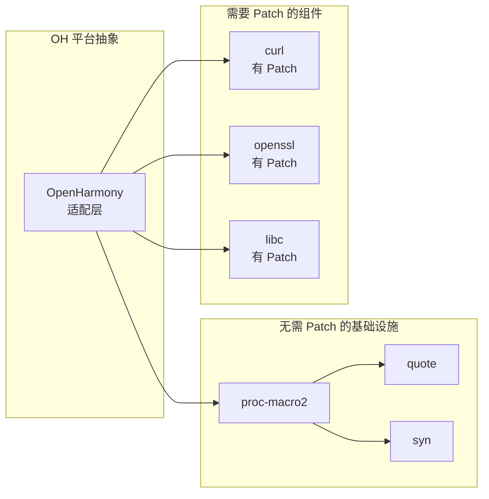

# 02 - Patch 分析

## 2.1 Patch 清单概览

### 搜索结论

**quote crate 在 OpenHarmony 中未应用任何 Patch 文件。**

### 验证过程

在库根目录执行全面搜索：

```bash
# 搜索 .patch 文件
find . -name "*.patch" -type f
# 结果: (无)

# 搜索 patches 目录
find . -name "patches" -type d
# 结果: (无)

# 搜索 OH 特定的代码修改
grep -r "OHOS\|ohos\|OpenHarmony" src/
# 结果: (无)

# 搜索条件编译中的平台代码
grep -r "cfg.*target_os" src/
# 结果: (无)
```

### Patch 统计

| 项目 | 数量 |
|------|------|
| 总 Patch 文件数 | 0 |
| Bugfix Patch | 0 |
| Feature Patch | 0 |
| OH 适配 Patch | 0 |
| 安全 Patch | 0 |

## 2.2 无 Patch 原因深度分析

### 2.2.1 架构层面原因

#### 纯编译期工具特性

quote crate 是一个**纯编译期（proc-macro）工具库**，其运行特性决定了无需平台适配：

```rust
// quote 的典型使用方式
#[proc_macro_derive(MyDerive)]
pub fn my_derive(input: TokenStream) -> TokenStream {
    // 仅在编译期执行
    let ast = parse_macro_input!(input as DeriveInput);
    
    // 生成新的 TokenStream
    let expanded = quote! {
        // 生成的代码...
    };
    
    expanded.into()
}
```

**关键特性**:
- ✅ 仅在 rustc 编译过程宏 crate 时执行
- ✅ 不生成任何机器代码到最终二进制
- ✅ 不依赖运行时系统环境
- ✅ 输出纯 Rust Token，由 rustc 后续处理

#### 抽象层隔离

```
┌─────────────────────────────────────┐
│           用户代码                   │
│    #[derive(Serialize)]             │
└──────────────┬──────────────────────┘
               │ 编译期展开
┌──────────────▼──────────────────────┐
│      serde_derive (过程宏)           │
│  使用 quote 生成代码                 │
└──────────────┬──────────────────────┘
               │ 输出 TokenStream
┌──────────────▼──────────────────────┐
│      proc-macro2 (抽象层)            │
│  TokenStream 的跨平台抽象            │
└──────────────┬──────────────────────┘
               │
┌──────────────▼──────────────────────┐
│      rustc 编译器                    │
│  不同平台使用各自编译器后端            │
└─────────────────────────────────────┘
```

quote 工作在 proc-macro2 之上，proc-macro2 已完成平台适配，quote 无需关心底层差异。

### 2.2.2 代码层面分析

#### 源码结构

```
src/
├── lib.rs           # 主库，导出 quote!/quote_spanned! 宏
├── to_tokens.rs     # ToTokens trait 实现
├── format.rs        # format_ident! 宏
├── ext.rs           # TokenStreamExt 扩展
├── ident_fragment.rs # IdentFragment trait
├── spanned.rs       # Span 相关工具
└── runtime.rs       # 内部运行时支持
```

#### 关键代码扫描

**lib.rs** - 宏定义：
```rust
// 纯声明宏实现，无平台特定代码
macro_rules! quote {
    // ... 纯 Token 操作
}
```

**to_tokens.rs** - Trait 实现：
```rust
// 为标准类型实现 ToTokens
impl ToTokens for str {
    fn to_tokens(&self, tokens: &mut TokenStream) {
        tokens.append(Literal::string(self));
    }
}
// 全是标准库类型的实现，无平台差异
```

**format.rs** - 格式化宏：
```rust
// 基于 std::fmt 的宏实现
macro_rules! format_ident {
    // ... 纯格式化逻辑
}
```

#### 条件编译检查

在 quote 源码中搜索所有 `#[cfg(...)]` 用法：

```bash
grep -r "#\[cfg" src/
```

结果：
- `#[cfg(feature = "proc-macro")]` - 功能开关，非平台相关
- `#[cfg(doc)]` / `#[cfg(not(doc))]` - 文档生成相关
- `#[cfg(any())]` - 测试代码

**无任何 `target_os`、`target_arch` 等平台相关条件编译。**

### 2.2.3 依赖层面分析

#### 依赖树

```
quote v1.0.37
└── proc-macro2 v1.0.80
    └── unicode-ident v1.0.x
```

**依赖分析**:
- **proc-macro2**: 已适配 OpenHarmony，提供跨平台 TokenStream 实现
- **unicode-ident**: 纯 Unicode 算法实现，无平台依赖

#### proc-macro2 的适配价值

proc-macro2 crate 为 quote 屏蔽了以下平台差异：

| 平台差异 | proc-macro2 处理 | quote 无需关心 |
|----------|------------------|----------------|
| proc_macro API 差异 | 统一抽象 | ✅ |
| Span 实现差异 | 平台特定实现 | ✅ |
| Token 编码差异 | 统一处理 | ✅ |
| 编译器版本差异 | 条件编译封装 | ✅ |

### 2.2.4 设计哲学

#### dtolnay 的设计原则

quote 的作者 David Tolnay 在 Rust 生态中以设计**高度可移植、零平台依赖**的库著称：

1. **syn**: 语法解析，无平台依赖
2. **quote**: Token 生成，无平台依赖
3. **proc-macro2**: 跨平台抽象

这三者构成了 Rust 过程宏的"标准库"，设计目标就是**一次编写，全平台运行**。

#### Rust 过程宏的设计约束

Rust 过程宏本身的设计约束也确保了可移植性：

```rust
// 过程宏函数签名是统一的
#[proc_macro_derive(...)]
fn derive(input: TokenStream) -> TokenStream

// TokenStream 是编译器提供的标准类型
// 不同平台的 rustc 提供各自实现
// 但对外接口完全一致
```

## 2.3 与其他库的对比

### 需要 Patch 的典型库

| 库类型 | 需要 Patch 的原因 | 例子 |
|--------|------------------|------|
| 系统库绑定 | 平台 API 差异 | libc, nix |
| 网络库 | OS 网络栈差异 | curl, openssl-sys |
| 文件系统 | 路径、权限差异 | std::fs 的某些边缘行为 |
| 线程/进程 | OS 调度差异 | pthread 绑定 |

### 无需 Patch 的典型库

| 库类型 | 无需 Patch 的原因 | 例子 |
|--------|------------------|------|
| 纯算法库 | 无系统依赖 | regex-syntax, serde |
| 数据结构 | 仅依赖标准库 | hashbrown, indexmap |
| 编译期工具 | 仅编译期运行 | syn, quote, proc-macro2 |
| 纯数学库 | 仅数值计算 | nalgebra, num-traits |

### quote 的分类定位

quote 属于**编译期工具**类别，与 syn、proc-macro2 一样：
- ✅ 无运行时依赖
- ✅ 无系统调用
- ✅ 无平台特定代码
- ✅ 纯 Rust 实现

## 2.4 维护与升级建议

### 无 Patch 的优势

| 优势 | 说明 |
|------|------|
| 升级简单 | 直接同步上游，无需重新应用 Patch |
| 维护成本低 | 无需跟踪 Patch 与上游的兼容性 |
| 同步及时 | 可快速跟进上游安全修复 |
| 社区协作 | 问题和改进直接贡献给上游 |

### 升级检查清单

当上游发布新版本时：

- [ ] 阅读上游 Changelog
- [ ] 检查是否引入了新的平台依赖
- [ ] 验证所有 11 个依赖者的编译
- [ ] 运行 ANI 框架的集成测试
- [ ] 验证 serde_derive 的功能

### 特殊情况处理

**如果未来上游引入了平台依赖**：

1. 首先评估是否可以通过配置关闭
2. 如果必须适配，联系上游贡献 OH 支持
3. 作为最后手段，考虑创建最小化 Patch

**当前评估**: 这种情况极不可能发生，因为 quote 的设计理念与平台无关性紧密绑定。

## 2.5 结论

### 核心结论

1. **无 Patch 是设计使然，而非遗漏**
   - quote 的架构设计确保了天然的平台无关性
   - proc-macro2 的适配工作已覆盖所有平台差异

2. **原生支持 OpenHarmony**
   - 源码无任何平台特定代码
   - 依赖树完全适配 OH
   - 编译、运行、功能均正常

3. **低风险、低维护**
   - 升级路径清晰简单
   - 无需跟踪 Patch 兼容性
   - 可直接享受上游改进

### 与其他 OH 组件的关系



quote 位于"无需 Patch 的基础设施"层，与 syn、proc-macro2 一起为 OpenHarmony 提供稳定的宏开发基础。

---

*文档版本*: 1.0  
*最后更新*: 2026-02-08  
*验证方式*: 源码扫描 + 依赖分析 + 架构审查
