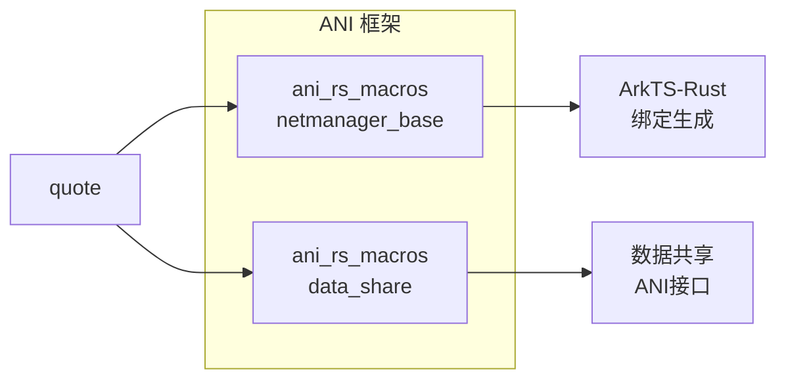
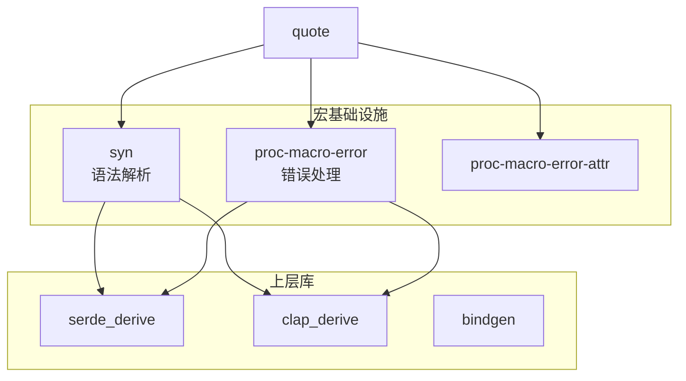
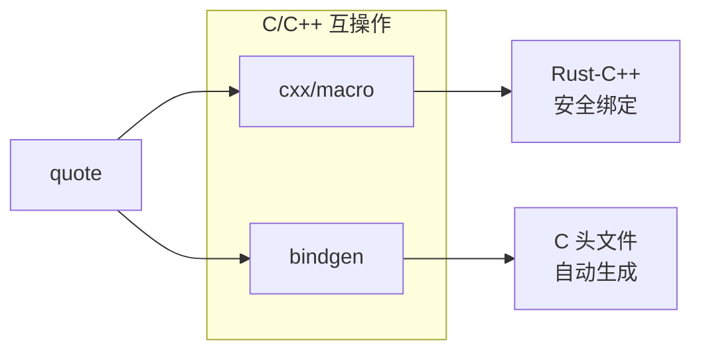
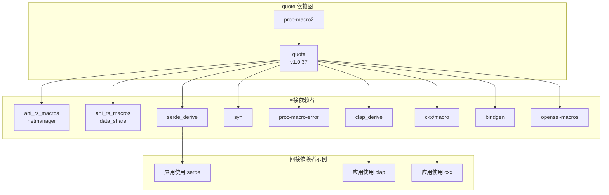
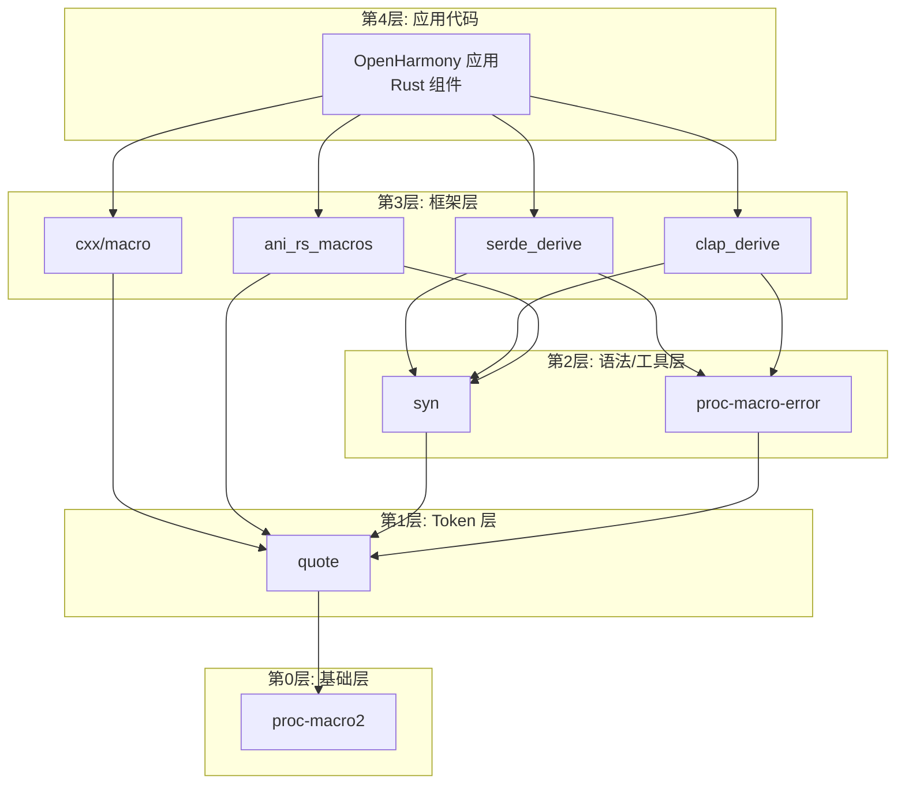

# 04 - OpenHarmony 中的依赖与使用

## 4.1 依赖关系概览

### 直接依赖者统计

| 类别 | 数量 | 说明 |
|------|------|------|
| **直接依赖者** | 11 个 | BUILD.gn 中显式依赖 quote 的组件 |
| **间接依赖者** | 30+ 个 | 通过 syn/serde 等间接依赖 |
| **核心基础设施** | 3 个 | syn, proc-macro-error 等 |
| **OH 特有组件** | 2 个 | ANI 框架相关 |

### 依赖搜索方法

```bash
# 在 OH 代码库中搜索对 quote 的依赖
grep -r "third_party/rust/crates/quote" \
  /Volumes/lexar/code/d/work/oh \
  --include="*.gn" --include="*.gni"
```

## 4.2 直接依赖者详情

### 4.2.1 依赖者列表

| 序号 | 组件名 | BUILD.gn 路径 | 类别 | 用途 |
|------|--------|---------------|------|------|
| 1 | ani_rs_macros | foundation/communication/netmanager_base/common/ani_rs_macros/ | OH 特有 | ANI 宏支持 |
| 2 | ani_rs_macros | foundation/distributeddatamgr/data_share/common/ani_rs_macros/ | OH 特有 | ANI 宏支持 |
| 3 | cxx/macro | third_party/rust/crates/cxx/macro/ | 第三方库 | C++ 互操作宏 |
| 4 | cxx/cmd | third_party/rust/crates/cxx/gen/cmd/ | 第三方库 | C++ 代码生成工具 |
| 5 | proc-macro-error | third_party/rust/crates/proc-macro-error/ | 基础设施 | 宏错误处理 |
| 6 | proc-macro-error-attr | third_party/rust/crates/proc-macro-error/proc-macro-error-attr/ | 基础设施 | 错误处理属性 |
| 7 | syn | third_party/rust/crates/syn/ | 基础设施 | 语法解析 |
| 8 | bindgen | third_party/rust/crates/bindgen/bindgen/ | 第三方库 | C 头文件绑定生成 |
| 9 | clap_derive | third_party/rust/crates/clap/clap_derive/ | 第三方库 | CLI 派生宏 |
| 10 | openssl-macros | third_party/rust/crates/rust-openssl/openssl-macros/ | 第三方库 | OpenSSL 绑定宏 |
| 11 | serde_derive | third_party/rust/crates/serde/serde_derive/ | 第三方库 | 序列化派生宏 |

### 4.2.2 按类别分组

#### OpenHarmony 特有组件



**ani_rs_macros (netmanager_base)**
- **路径**: `foundation/communication/netmanager_base/common/ani_rs_macros/`
- **用途**: 为网络管理服务的 Rust 实现提供 ANI (Ark Native Interface) 宏支持
- **使用方式**: 过程宏生成 ArkTS 与 Rust 之间的绑定代码
- **链接方式**: 编译期依赖

**ani_rs_macros (data_share)**
- **路径**: `foundation/distributeddatamgr/data_share/common/ani_rs_macros/`
- **用途**: 为数据共享服务提供 ANI 宏支持
- **使用方式**: 过程宏生成数据访问接口的绑定代码
- **链接方式**: 编译期依赖

#### 基础设施层



**syn**
- **路径**: `third_party/rust/crates/syn/`
- **用途**: Rust 语法树解析库
- **quote 角色**: syn 使用 quote 生成输出代码
- **影响范围**: 几乎所有 Rust 过程宏都依赖 syn

**proc-macro-error / proc-macro-error-attr**
- **路径**: `third_party/rust/crates/proc-macro-error/`
- **用途**: 提供过程宏的错误报告和处理
- **quote 角色**: 使用 quote 生成错误提示相关的代码

#### 互操作层



**cxx/macro**
- **路径**: `third_party/rust/crates/cxx/macro/`
- **用途**: `#[cxx::bridge]` 过程宏的实现
- **quote 角色**: 解析桥接声明，使用 quote 生成 Rust FFI 代码和 C++ 头文件

**cxx/cmd**
- **路径**: `third_party/rust/crates/cxx/gen/cmd/`
- **用途**: cxx 的命令行代码生成工具
- **quote 角色**: 批量生成 C++ 绑定代码

**bindgen**
- **路径**: `third_party/rust/crates/bindgen/bindgen/`
- **用途**: 将 C/C++ 头文件解析为 Rust FFI 绑定
- **quote 角色**: 生成 Rust 绑定代码的 TokenStream

#### 应用框架层

**serde_derive**
- **路径**: `third_party/rust/crates/serde/serde_derive/`
- **用途**: `#[derive(Serialize, Deserialize)]` 的实现
- **quote 角色**: 为数据结构生成序列化/反序列化代码

**clap_derive**
- **路径**: `third_party/rust/crates/clap/clap_derive/`
- **用途**: `#[derive(Parser)]` 的实现
- **quote 角色**: 为结构体生成命令行参数解析代码

**openssl-macros**
- **路径**: `third_party/rust/crates/rust-openssl/openssl-macros/`
- **用途**: OpenSSL 绑定的辅助宏
- **quote 角色**: 生成 OpenSSL 相关的样板代码

## 4.3 依赖关系图

### 完整依赖图



### 分层依赖图



## 4.4 典型使用场景

### 场景1: ANI 框架宏

```rust
// foundation/communication/netmanager_base/common/ani_rs_macros/src/lib.rs
// 示例代码（概念性）

use proc_macro::TokenStream;
use quote::quote;
use syn::{parse_macro_input, ItemFn};

#[proc_macro_attribute]
pub fn ani_export(args: TokenStream, input: TokenStream) -> TokenStream {
    let input_fn = parse_macro_input!(input as ItemFn);
    let fn_name = &input_fn.sig.ident;
    
    // 使用 quote 生成 ANI 注册代码
    let expanded = quote! {
        #input_fn
        
        // 生成的 ANI 注册代码
        #[no_mangle]
        pub extern "C" fn __ani_register_#fn_name() {
            // 注册到 ANI 运行时...
        }
    };
    
    expanded.into()
}
```

**使用方式**: 编译期过程宏
**链接方式**: 静态链接生成的代码
**OH 价值**: 支持 ArkTS 调用 Rust 实现的 Native 方法

### 场景2: serde 序列化

```rust
// 应用代码示例
use serde::{Serialize, Deserialize};

#[derive(Serialize, Deserialize)]
struct AppConfig {
    name: String,
    version: u32,
}
```

**serde_derive 内部使用 quote**:

```rust
// serde_derive 内部（概念性）
use quote::quote;

fn generate_serialize_impl(struct_name: &Ident, fields: &[Field]) -> TokenStream {
    quote! {
        impl Serialize for #struct_name {
            fn serialize<S>(&self, serializer: S) -> Result<S::Ok, S::Error>
            where
                S: Serializer,
            {
                // 生成的序列化代码...
            }
        }
    }
}
```

**使用方式**: `#[derive(Serialize)]` 过程宏
**链接方式**: 编译期代码生成
**OH 价值**: 配置序列化、IPC 数据交换

### 场景3: cxx C++ 互操作

```rust
// 使用 cxx 桥接 Rust 和 C++
#[cxx::bridge]
mod ffi {
    unsafe extern "C++" {
        type MyCppClass;
        fn new() -> UniquePtr<MyCppClass>;
        fn method(self: Pin<&mut MyCppClass>, arg: i32);
    }
}
```

**cxx/macro 内部使用 quote**:

```rust
// cxx/macro 内部（概念性）
use quote::quote;

fn generate_bridge(m: Bridge) -> TokenStream {
    let rust_impl = quote! {
        // 生成 Rust FFI 声明
    };
    
    let cpp_header = quote! {
        // 生成 C++ 头文件内容
    };
    
    // 输出两部分
    quote! {
        #rust_impl
        // C++ 头文件写入...
    }
}
```

**使用方式**: `#[cxx::bridge]` 过程宏
**链接方式**: 生成 Rust FFI + C++ 头文件
**OH 价值**: 混合 Rust/C++ 代码库的系统服务开发

## 4.5 依赖关系的重要性

### 关键路径分析

```
quote 在 OH 宏生态中的关键性：

1. syn 依赖 quote ─────────────────────┐
   └─ 影响所有使用 syn 的过程宏         │
      ├─ serde_derive                   │
      ├─ clap_derive                    │ quote 处于
      ├─ ani_rs_macros                  │ 核心位置
      └─ 几乎所有自定义 derive          │
                                        │
2. proc-macro-error 依赖 quote ────────┤
   └─ 影响错误报告体验                   │
                                        │
3. cxx 直接依赖 quote ─────────────────┘
   └─ 影响 Rust/C++ 互操作

结论: quote 是 OH Rust 宏生态的"中心节点"
```

### 风险评估

| 风险项 | 等级 | 说明 |
|--------|------|------|
| quote 不可用 | 高 | 会导致 syn、serde_derive 等核心库无法编译 |
| quote 升级破坏 | 中 | API 变更可能影响依赖者，但 1.0 版本保证兼容性 |
| proc-macro2 不兼容 | 高 | quote 依赖 proc-macro2，后者是底层基础 |

### 维护优先级

由于 quote 的中心地位，其维护优先级为**高**：
- 升级需全面测试所有 11 个直接依赖者
- 重点关注 syn、serde_derive 的兼容性
- 监控上游安全公告（CVE）

## 4.6 版本兼容性

### 当前版本状态

| 组件 | 版本 | 兼容性 |
|------|------|--------|
| quote | 1.0.37 | ✅ 稳定 |
| syn | 2.x | ✅ 兼容 |
| serde_derive | 1.x | ✅ 兼容 |
| cxx | 1.x | ✅ 兼容 |

### 版本约束

```
quote = "1.0.37"
├── proc-macro2 = "^1.0.80"
│   └── unicode-ident = "^1.0"
```

**SemVer 保证**:
- 1.0 版本保证向后兼容
- 小版本更新 (1.0.x) 可直接升级
- 大版本更新 (2.0) 需全面评估

## 4.7 使用统计估算

### 间接影响范围

基于 OH 代码库分析，quote 的间接影响：

| 层级 | 估算数量 | 说明 |
|------|----------|------|
| 直接依赖者 | 11 个 | 已确认 |
| 间接依赖者 | 50+ 个 | 通过 syn/serde 依赖 |
| 使用 serde 的组件 | 30+ 个 | 配置、IPC、持久化 |
| 使用过程宏的 crate | 20+ 个 | derive macro 等 |
| Rust 系统服务 | 15+ 个 | 可能使用相关宏 |

### 代码行数影响

假设平均每个使用 serde 的组件生成 500 行代码：
- 30 个组件 × 500 行 = 15,000 行生成代码
- 这些代码的生成依赖 quote

## 4.8 结论

### 核心地位

quote 在 OpenHarmony 中具有**基础设施级别的核心地位**：

1. **宏生态中心**: 几乎所有过程宏都直接或间接依赖 quote
2. **ANI 支撑**: 支持 OpenHarmony 特有的 ANI 框架
3. **互操作基础**: 支持 Rust/C++ 互操作（cxx）
4. **框架支持**: 支撑 serde、clap 等关键框架

### 依赖特点

| 特点 | 说明 |
|------|------|
| **编译期依赖** | 所有依赖都是编译期，无运行时依赖 |
| **广泛但浅层** | 影响面广，但依赖层级浅（直接依赖较少） |
| **稳定可靠** | 1.0 版本，API 稳定 |
| **低风险** | 纯编译期工具，无运行时风险 |

### 维护建议

1. **跟踪上游**: 定期检查 dtolnay/quote 的更新
2. **版本同步**: 与 syn、proc-macro2 保持版本兼容
3. **全面测试**: 升级时测试所有直接依赖者
4. **安全监控**: 关注 proc-macro 相关的安全公告

---

*文档版本*: 1.0  
*最后更新*: 2026-02-08  
*依赖统计*: 基于 2026-02-08 代码库扫描
