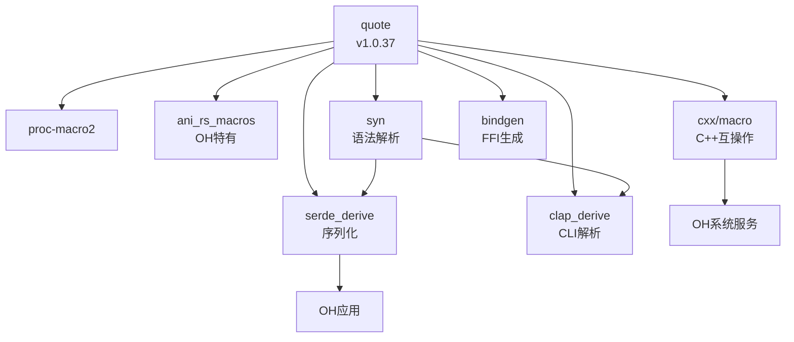

# quote Crate - OpenHarmony Wiki

## 库概览

| 属性 | 详情 |
|------|------|
| **库名称** | Rust Quasi-Quoting |
| **Crate 名称** | quote |
| **版本** | 1.0.37 |
| **许可证** | Apache-2.0 OR MIT |
| **上游地址** | https://github.com/dtolnay/quote |
| **OH 组件名** | @ohos/rust_quote |
| **OH 子系统** | thirdparty |

## 快速导航

### 核心文档

| 文档 | 内容概要 | 推荐阅读 |
|------|----------|----------|
| [01_Overview.md](./01_Overview.md) | 库简介、功能特性、在 OH 中的作用 | ⭐⭐⭐ 必读 |
| [02_Patches.md](./02_Patches.md) | Patch 分析（本库无 Patch） | ⭐⭐⭐ 必读 |
| [03_Build_Integration.md](./03_Build_Integration.md) | BUILD.gn 配置详解 | ⭐⭐ 重要 |
| [04_Usage_in_OH.md](./04_Usage_in_OH.md) | 依赖关系与使用场景 | ⭐⭐⭐ 必读 |

### 工作文档

| 文档 | 说明 |
|------|------|
| [_work/ASSESSMENT.md](./_work/ASSESSMENT.md) | 项目评估报告（原始数据收集） |

## 核心结论

### 1. 无 Patch 设计 ✅

**quote crate 在 OpenHarmony 中无需任何 Patch。**

原因：
- 纯编译期工具，无平台依赖
- 通过 proc-macro2 完成平台抽象
- 原生支持所有 Rust 目标平台（包括 OH）

### 2. 核心基础设施地位 🏗️

**quote 是 OpenHarmony Rust 宏生态的中心节点。**

- 11 个直接依赖者（syn、serde_derive、cxx 等）
- 50+ 间接依赖者
- 支撑 ANI 框架（ArkTS-Rust 互操作）
- 支撑 C++ 互操作（cxx）

### 3. 标准构建配置 🔧

BUILD.gn 为标准模板化配置：

```gn
ohos_cargo_crate("lib") {
  crate_name = "quote"
  crate_type = "rlib"
  edition = "2018"
  features = [ "proc-macro" ]
  deps = [ "//third_party/rust/crates/proc-macro2:lib" ]
}
```

### 4. 低维护成本 📉

- 升级简单：直接同步上游
- 无 CVE 记录
- API 稳定（1.0 版本）
- 依赖树简单（仅 proc-macro2）

## 在 OH 中的关键用途

### ANI 框架支持

```rust
// ani_rs_macros 使用 quote 生成 ArkTS-Rust 绑定
#[ani_export]
fn native_add(a: i32, b: i32) -> i32 {
    a + b
}
```

### serde 序列化

```rust
#[derive(Serialize, Deserialize)]
struct Config {
    name: String,
    value: u32,
}
// serde_derive 内部使用 quote 生成实现
```

### C++ 互操作

```rust
#[cxx::bridge]
mod ffi {
    unsafe extern "C++" {
        type MyClass;
        fn new() -> UniquePtr<MyClass>;
    }
}
// cxx/macro 使用 quote 生成绑定代码
```

## 依赖关系图



## 维护信息

| 项目 | 信息 |
|------|------|
| **上游维护者** | David Tolnay (dtolnay@gmail.com) |
| **OH 维护者** | fangting12@huawei.com |
| **最后更新** | 2026-02-08 |
| **文档版本** | 1.0 |

## 相关资源

### 官方文档
- 📚 [quote API Docs](https://docs.rs/quote/)
- 🐙 [GitHub 仓库](https://github.com/dtolnay/quote)
- 📦 [Crates.io](https://crates.io/crates/quote)

### 相关 Crate
- 🔧 [syn](https://github.com/dtolnay/syn) - Rust 语法解析
- 🔧 [proc-macro2](https://github.com/dtolnay/proc-macro2) - TokenStream 抽象
- 🔧 [proc-macro-error](https://gitlab.com/CreepySkeleton/proc-macro-error) - 错误处理

### OpenHarmony 相关
- 📘 [ANI 框架文档](https://gitee.com/openharmony/arkui_ani)
- 📘 [Rust 组件开发规范](https://gitee.com/openharmony/docs)

## 文档更新记录

| 日期 | 版本 | 更新内容 |
|------|------|----------|
| 2026-02-08 | 1.0 | 初始版本，完成完整评估 |

---

*本 Wiki 专注于 quote crate 在 OpenHarmony 中的集成与适配，不重复上游文档内容。*
