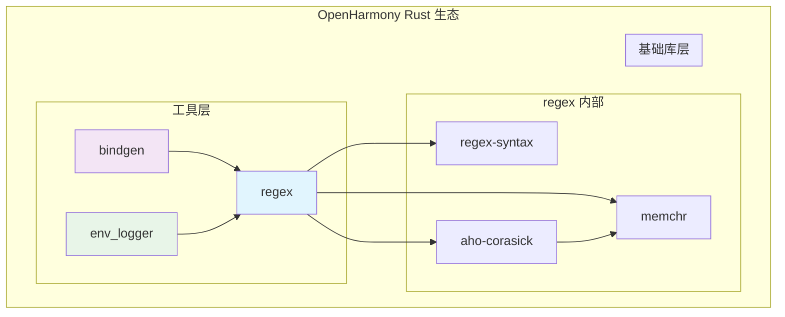

# 依赖关系与使用

## 依赖关系概览

regex 库在 OpenHarmony 生态中作为基础组件，被其他 Rust crates 直接依赖。以下详细说明其依赖关系和使用场景。

## 直接依赖者

### 依赖者列表

| 模块 | BUILD.gn 路径 | 用途 | 依赖方式 |
|------|--------------|------|---------|
| **bindgen** | //third_party/rust/crates/bindgen/bindgen/BUILD.gn | 解析 C/C++ 头文件 | 直接依赖 |
| **env_logger** | //third_party/rust/crates/env_logger/BUILD.gn | 日志模式过滤 | 直接依赖 |
| **regex-syntax** | //third_party/rust/crates/regex/BUILD.gn | 语法解析子组件 | 内部依赖 |

### 依赖关系图



## 主要使用场景详解

### 场景一：bindgen 头文件解析

**依赖模块**：bindgen

**使用方式**：

bindgen 是 Rust FFI（外部函数接口）绑定的核心工具，用于自动生成 C/C++ 库与 Rust 代码之间的接口。regex 库在 bindgen 中用于：

1. **标识符提取**：匹配头文件中的函数名、结构体名、宏定义等
2. **注释匹配**：识别和处理 Doxygen 风格注释
3. **模式验证**：验证类型名称和命名空间是否符合预期模式

**典型使用代码**：

```rust
// bindgen 内部使用示例
use regex::Regex;

fn parse_identifiers(header: &str) -> Vec<&str> {
    // 匹配 C 标识符模式
    let identifier_re = Regex::new(r"[a-zA-Z_][a-zA-Z0-9_]*").unwrap();
    
    identifier_re.find_iter(header)
        .map(|m| m.as_str())
        .collect()
}

fn find_doc_comments(header: &str) -> Vec<&str> {
    // 匹配 Doxygen 注释模式
    let doc_re = Regex::new(r"/\*\*[\s\S]*?\*/").unwrap();
    
    doc_re.find_iter(header)
        .map(|m| m.as_str())
        .collect()
}
```

**在 OH 中的作用**：

- 为 Native API 生成 Rust FFI 绑定
- 支持 OH NDK（Native Development Kit）开发
- 生成系统库的安全 Rust 封装

### 场景二：env_logger 日志过滤

**依赖模块**：env_logger

**使用方式**：

env_logger 是 Rust 生态常用的日志框架，支持通过环境变量配置日志级别和过滤器。regex 库用于：

1. **模式过滤**：支持正则表达式格式的日志过滤
2. **多规则匹配**：同时应用多个过滤规则
3. **动态配置**：运行时解析日志过滤规则

**典型使用代码**：

```rust
// env_logger 内部使用示例
use regex::RegexSet;

fn setup_logging_filter() {
    // 配置日志过滤器
    let filters = vec![
        r"debug",      # debug 级别
        r"info",       # info 级别  
        r"warn",       # warn 级别
        r"ERROR",      # error 级别（不区分大小写）
    ];
    
    let set = RegexSet::new(&filters).unwrap();
    
    // 根据配置启用相应级别的日志
    if set.matches("INFO: something happened").matched(1) {
        // 启用 info 日志
    }
}
```

**在 OH 中的作用**：

- 为 Rust 应用提供结构化日志输出
- 支持按模块和级别过滤日志
- 与 OH 日志系统集成

### 场景三：regex-syntax 语法解析

**使用模块**：regex-syntax（regex 库的子 crate）

**使用方式**：

regex-syntax 提供了正则表达式语法解析的核心功能，包括：

1. **词法分析**：将正则表达式字符串分解为 token
2. **语法解析**：构建抽象语法树（AST）
3. **语义验证**：检查表达式的语义正确性

**典型使用代码**：

```rust
// regex-syntax 使用示例
use regex_syntax::{Parser,ast::Ast};

fn parse_regex_pattern(pattern: &str) -> Result<Ast, regex_syntax::Error> {
    Parser::new().parse(pattern)
}

fn analyze_pattern(pattern: &str) {
    if let Ok(ast) = parse_regex_pattern(pattern) {
        println!("AST: {:?}", ast);
        // 分析表达式复杂度
        // 检查是否有潜在的性能问题
    }
}
```

## 依赖声明方式

### GN 依赖声明

```gn
# 静态链接 regex 库
deps = [
    "//third_party/rust/crates/regex:lib",
]

# 如需使用 regex-syntax 子 crate
deps = [
    "//third_party/rust/crates/regex/regex-syntax:lib",
]
```

### Rust 代码引用

```rust
// 在 Cargo.toml 中声明依赖
[dependencies]
regex = "1.7.1"

// 在代码中使用
use regex::Regex;
```

## 链接方式

| 链接类型 | 说明 |
|---------|------|
| **静态链接** | regex 库及其依赖（aho-corasick, memchr, regex-syntax）会被静态链接到最终二进制 |

## 依赖链深度

```
regex (1.7.1)
├── aho-corasick 0.7.15
│   └── memchr 2.4
├── memchr 2.4
└── regex-syntax 0.6.25
    └── unicode-something (多个 unicode_* crates)
```

完整依赖链深度约 5-7 层，包含大量 Unicode 数据表依赖。

## 使用注意事项

### 版本兼容性

- regex 版本需与 aho-corasick、memchr 版本兼容
- 升级时需同步检查依赖兼容性

### 性能考量

- regex 库编译时启用完整优化，建议在 release 模式下使用
- 避免在热代码路径中频繁编译正则表达式
- 建议使用 `lazy_static` 缓存编译结果

### 安全使用

- 正则表达式解析可能存在 DoS 风险（指数级回溯）
- regex 库使用线性时间算法避免此问题
- 但仍需注意避免编写极端复杂的正则表达式

## 与其他 OH 模块的关系

### 依赖关系矩阵

| 上游模块 | 依赖 regex | 依赖原因 |
|---------|-----------|---------|
| bindgen | ✅ | 头文件模式解析 |
| env_logger | ✅ | 日志过滤 |
| 其他 Rust crates | 视情况 | 文本处理需求 |

### 被间接依赖的情况

部分模块可能通过以下路径间接依赖 regex：

```
某些 Rust crate 
    └── env_logger
        └── regex
```

## 常见问题

### Q1: 如何在新的 Rust 模块中使用 regex？

```gn
# 在 BUILD.gn 中添加依赖
deps = [
    "//third_party/rust/crates/regex:lib",
]
```

```rust
// 在代码中使用
use regex::Regex;

let re = Regex::new(r"\d+").unwrap();
```

### Q2: 为什么 regex 编译时间很长？

regex 库包含大量 Unicode 数据表，用于支持完整的 Unicode 属性和脚本识别。这些数据表在编译时生成，导致编译时间较长。

### Q3: 如何减少二进制文件大小？

如需减小最终二进制文件大小，可在 BUILD.gn 中禁用部分 features：

```gn
features = [
    "std",
    # 禁用 Unicode 相关特性
    # "unicode",
    # "unicode-age",
    # ...
]
```

但这会限制 regex 库的功能。
