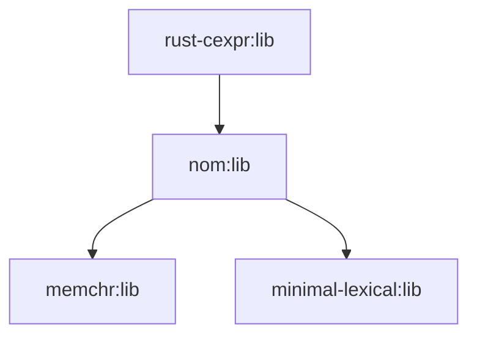

# 03 - OpenHarmony 构建适配

## 3.1 BUILD.gn 完整分析

### 完整配置

```gn
# Copyright (c) 2023 Huawei Device Co., Ltd.
# Licensed under the Apache License, Version 2.0 (the "License");
# you may not use this file except in compliance with the License.
# You may obtain a copy of the License at
#
#     http://www.apache.org/licenses/LICENSE-2.0
#
# Unless required by applicable law or agreed to in writing, software
# distributed under the License is distributed on an "AS IS" BASIS,
# WITHOUT WARRANTIES OR CONDITIONS OF ANY KIND, either express or implied.
# See the License for the specific language governing permissions and
# limitations under the License.

import("//build/ohos.gni")

ohos_cargo_crate("lib") {
  crate_name = "cexpr"
  crate_type = "rlib"
  crate_root = "src/lib.rs"

  sources = [ "src/lib.rs" ]
  edition = "2018"
  cargo_pkg_version = "0.6.0"
  cargo_pkg_authors = "Jethro Beekman <jethro@jbeekman.nl>"
  cargo_pkg_name = "cexpr"
  cargo_pkg_description = "A C expression parser and evaluator"
  deps = [ "//third_party/rust/crates/nom:lib" ]
  module_output_extension = ".rlib"
  part_name = "rust_rust_cexpr"
  subsystem_name = "thirdparty"
}
```

### 配置项详解

| 配置项 | 值 | 说明 |
|--------|-----|------|
| `crate_name` | `cexpr` | Rust crate 名称，与 Cargo.toml 一致 |
| `crate_type` | `rlib` | 生成 Rust 静态库（非动态库） |
| `crate_root` | `src/lib.rs` | 入口文件 |
| `sources` | `["src/lib.rs"]` | 源文件列表 |
| `edition` | `2018` | Rust 版本，与上游一致 |
| `cargo_pkg_version` | `0.6.0` | 包版本 |
| `deps` | `//third_party/rust/crates/nom:lib` | 唯一依赖：nom |
| `module_output_extension` | `.rlib` | 输出格式 |
| `part_name` | `rust_rust_cexpr` | OH 部件名称 |
| `subsystem_name` | `thirdparty` | 所属子系统 |

---

## 3.2 与上游构建系统的差异

### 上游构建方式（Cargo）

```toml
# Cargo.toml
[package]
name = "cexpr"
version = "0.6.0"
edition = "2018"

[dependencies]
nom = { version = "7", default-features = false, features = ["std"] }
```

构建命令：
```bash
cargo build --release
```

### OH 构建方式（GN + Ninja）

```bash
# 通过构建系统调用
ninja -C out/default third_party/rust/crates/rust-cexpr:lib
```

### 差异对比

| 方面 | Cargo | GN/Ninja | 说明 |
|------|-------|---------|------|
| 依赖管理 | Cargo.toml | BUILD.gn deps | GN 使用路径依赖 |
| 特性选择 | `features = ["std"]` | 未显式配置 | GN 模板处理 |
| 构建输出 | target/release/*.rlib | out/default/.../*.rlib | 路径不同 |
| 增量构建 | Cargo 内置 | Ninja 处理 | 两者都支持 |

**关键差异**: OH 使用 `ohos_cargo_crate` GN 模板，它在底层仍然调用 `cargo build`，但通过 GN 管理依赖关系。

---

## 3.3 依赖关系

### 构建依赖图



### 实际链接关系

当 bindgen 使用 rust-cexpr 时：

```mermaid
graph LR
    bindgen --link> cexpr
    cexpr --link> nom
    nom --link> memchr
    nom --link> minimal-lexical
```

---

## 3.4 特殊配置说明

### 无特殊配置

与其他 OH 第三方库相比，rust-cexpr 的 BUILD.gn **非常标准**：

- ❌ 无 `defines`（无需预处理器宏）
- ❌ 无 `configs`（无特殊编译选项）
- ❌ 无 `cflags`（无特殊 C 编译器选项）
- ❌ 无 `rustflags`（无特殊 Rust 编译器选项）
- ✅ 仅标准 `ohos_cargo_crate` 配置

### 为什么如此简单？

1. **纯 Rust 代码**：不需要 C 编译器选项
2. **无特性门控**：没有 `#[cfg(...)]` 条件编译
3. **标准库依赖**：仅使用 `std`，无需特殊配置
4. **无 unsafe 代码**：无需特殊的内存布局控制

---

## 3.5 编译过程详解

### 构建流程

```
1. GN 解析 BUILD.gn
      ↓
2. 识别 ohos_cargo_crate 模板
      ↓
3. 生成 Ninja 规则
      ↓
4. Ninja 执行编译
      ↓
5. ohos_cargo_crate 模板调用 cargo
      ↓
6. cargo 编译 crate
      ↓
7. 输出 .rlib 到 out 目录
```

### 生成的编译命令（简化）

```bash
# GN 生成的命令类似：
rustc \
  --edition 2018 \
  --crate-type rlib \
  --crate-name cexpr \
  src/lib.rs \
  -L dependency=out/default/rust-deps \
  --extern nom=out/default/rust-deps/libnom.rlib \
  -o out/default/third_party/rust/crates/rust-cexpr/libcexpr.rlib
```

---

## 3.6 版本升级指南

### 升级步骤

假设上游发布 0.7.0：

1. **下载新版本源代码**
   ```bash
   cd third_party/rust/crates/rust-cexpr
   # 替换为新版本代码
   ```

2. **更新 BUILD.gn**
   ```gn
   # 修改版本号
   cargo_pkg_version = "0.7.0"
   ```

3. **检查依赖变化**
   ```bash
   # 查看新的 Cargo.toml
cat Cargo.toml | grep -A5 "\[dependencies\]"
   ```

4. **更新 deps（如有必要）**
   ```gn
   # 如果 nom 版本变化，可能需要调整
   deps = [ "//third_party/rust/crates/nom:lib" ]
   ```

5. **构建验证**
   ```bash
   hb build --target rust-cexpr
   # 或
   ninja -C out/default third_party/rust/crates/rust-cexpr:lib
   ```

6. **验证 bindgen**
   ```bash
   # 确保 bindgen 仍能正常工作
   ninja -C out/default third_party/rust/crates/bindgen:lib
   ```

### 升级检查清单

- [ ] 新版本 Cargo.toml 中的依赖变化
- [ ] API 是否有破坏性变更？
- [ ] nom 版本要求是否变化？
- [ ] Rust Edition 是否变化？
- [ ] 构建是否成功？
- [ ] bindgen 是否能正常工作？

---

## 3.7 常见问题排查

### 问题 1: 找不到 nom

**症状**:
```
error: extern location for nom does not exist
```

**原因**: nom 未先构建

**解决**:
```bash
# 确保依赖已构建
ninja -C out/default third_party/rust/crates/nom:lib
```

### 问题 2: 版本不匹配

**症状**:
```
error: failed to select a version for the requirement `nom = "^8"`
```

**原因**: OH 的 nom 版本与 cexpr 要求不符

**解决**:
1. 升级 nom
2. 或等待上游发布兼容版本
3. 或添加临时 Patch 降级版本要求

### 问题 3: 构建缓存问题

**症状**: 代码已更新但构建结果未变化

**解决**:
```bash
# 清理构建缓存
rm -rf out/default/third_party/rust/crates/rust-cexpr
ninja -C out/default -t clean third_party/rust/crates/rust-cexpr:lib
```

---

## 3.8 与其他 Rust crate 的对比

| crate | BUILD.gn 复杂度 | 说明 |
|-------|----------------|------|
| rust-cexpr | ⭐ 极简 | 单一依赖，无配置 |
| bindgen | ⭐⭐⭐ 中等 | 15+ 依赖，有 features |
| nom | ⭐⭐ 简单 | 2 个依赖 |
| syn | ⭐⭐⭐⭐ 复杂 | 多版本共存，特性复杂 |

**rust-cexpr 的 BUILD.gn 是 OH 第三方 Rust crate 中最简单的示例之一**。

---

## 3.9 总结

| 方面 | 结论 |
|------|------|
| 构建复杂度 | **极低** |
| 依赖数量 | **1 个（nom）** |
| 特殊配置 | **无** |
| 维护难度 | **极低** |
| 升级成本 | **低** |

rust-cexpr 的构建适配是 OH 第三方库集成的典范：标准、简单、无侵入。

---

*BUILD.gn 的简洁性反映了 rust-cexpr 本身的设计简洁性*
