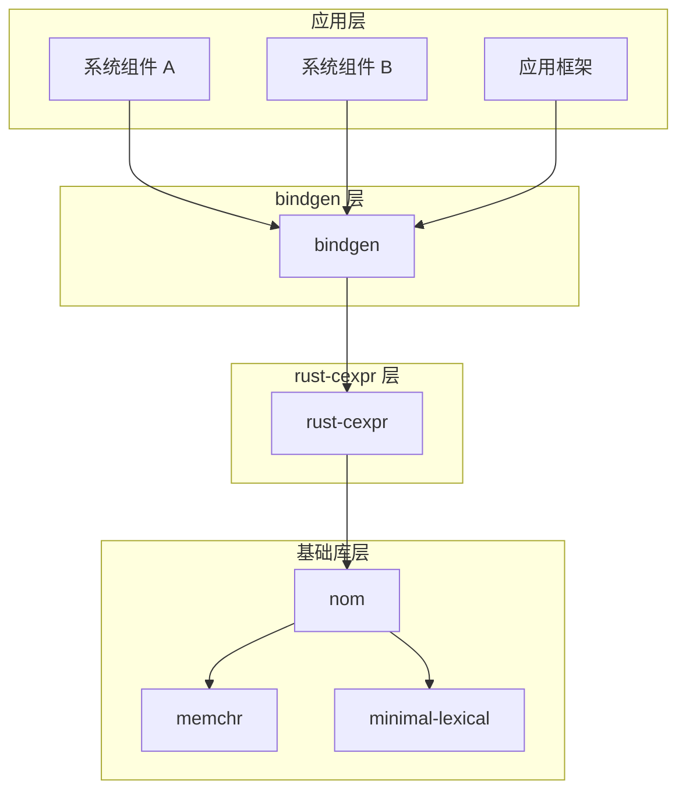

# 04 - OpenHarmony 中的使用

## 4.1 依赖者概览

### 直接依赖者列表

| 模块 | BUILD.gn 路径 | 用途 |
|------|--------------|------|
| bindgen | `third_party/rust/crates/bindgen/bindgen/BUILD.gn` | 解析 C/C++ 头文件宏定义 |

### 统计

- **直接依赖者数量**: 1
- **间接依赖者**: 所有使用 bindgen 的模块（数量众多）

---

## 4.2 依赖关系图

### 完整依赖链



### 简化视图

```mermaid
graph LR
    [使用 bindgen 的组件] --> B[bindgen]
    B --> C[rust-cexpr]
    C --> D[nom 7.x]
```

---

## 4.3 bindgen 中的使用详解

### 使用场景

bindgen 自动生成 Rust FFI 绑定代码，需要解析 C/C++ 头文件中的宏定义：

```c
// 输入：C 头文件
#ifndef MY_HEADER_H
#define MY_HEADER_H

#define VERSION_MAJOR 1
#define VERSION_MINOR 2
#define VERSION_PATCH 3
#define VERSION_STRING "1.2.3"

#define MAX_BUFFER_SIZE 4096
#define DEFAULT_FLAGS (FLAG_A | FLAG_B | FLAG_C)

#endif
```

```rust
// 输出：Rust 绑定（自动生成）
pub const VERSION_MAJOR: u32 = 1;
pub const VERSION_MINOR: u32 = 2;
pub const VERSION_PATCH: u32 = 3;
pub const VERSION_STRING: &[u8; 6] = b"1.2.3\0";
pub const MAX_BUFFER_SIZE: u32 = 4096;
pub const DEFAULT_FLAGS: u32 = 7;  // FLAG_A | FLAG_B | FLAG_C 的计算结果
```

### 核心代码位置

#### 1. `bindgen/ir/var.rs` - 宏解析入口

```rust
// 行 183-210: 使用 cexpr 解析宏定义
use cexpr::expr::EvalResult;
use cexpr::literal::CChar;

fn parse_macro(
    ctx: &mut BindgenContext,
    cursor: &clang::Cursor,
) -> Option<(Vec<u8>, EvalResult)> {
    use cexpr::expr;
    
    // 将 Clang token 转换为 cexpr token
    let cexpr_tokens = cursor.cexpr_tokens();
    
    // 使用 cexpr 解析宏定义
    match parser.macro_definition(&cexpr_tokens) {
        Ok((_, (name, result))) => Some((name.to_vec(), result)),
        Err(_) => None,
    }
}
```

#### 2. `bindgen/clang.rs` - Token 转换

```rust
// 行 952-1060: ClangToken 与 cexpr token 的映射
use cexpr::token;

impl ClangToken {
    /// 转换为 cexpr token
    pub(crate) fn as_cexpr_token(&self) -> Option<expr::Token> {
        use cexpr::token;
        
        let kind = match self.kind() {
            CXToken_Punctuation => token::Kind::Punctuation,
            CXToken_Keyword => token::Kind::Keyword,
            CXToken_Identifier => token::Kind::Identifier,
            CXToken_Literal => token::Kind::Literal,
            CXToken_Comment => token::Kind::Comment,
            _ => return None,
        };
        
        Some(token::Token {
            kind,
            raw: self.spelling().into_bytes().into_boxed_slice(),
        })
    }
}
```

#### 3. `bindgen/ir/context.rs` - 宏存储

```rust
// 行 358: 存储已解析的宏
pub struct BindgenContext {
    // ...
    /// 使用 std::HashMap 因为 cexpr API 需要它
    parsed_macros: StdHashMap<Vec<u8>, cexpr::expr::EvalResult>,
}

// 行 2185-2194: 获取宏解析结果
pub fn parsed_macros(
    &self,
) -> &StdHashMap<Vec<u8>, cexpr::expr::EvalResult> {
    &self.parsed_macros
}
```

### cexpr EvalResult 的处理

bindgen 根据 `EvalResult` 的不同变体生成不同类型的 Rust 常量：

```rust
// bindgen/ir/var.rs 行 230-269
match value {
    EvalResult::Invalid => return Err(ParseError::Continue),
    
    // 浮点数 → Rust f64
    EvalResult::Float(f) => {
        (TypeKind::Float(FloatKind::Double), VarType::Float(f))
    }
    
    // 字符 → Rust u8
    EvalResult::Char(c) => {
        let c = match c {
            CChar::Char(c) => c as u8,
            CChar::Raw(c) => c as u8,
        };
        (TypeKind::Int(IntKind::U8), VarType::Char(c))
    }
    
    // 字符串 → Rust &[u8]
    EvalResult::Str(val) => {
        let char_ty = Item::builtin_type(TypeKind::Int(IntKind::U8), true, ctx);
        (TypeKind::Pointer(char_ty), VarType::String(val))
    }
    
    // 整数 → Rust 整数（根据值选择类型）
    EvalResult::Int(Wrapping(value)) => {
        let kind = default_macro_constant_type(ctx, value);
        (TypeKind::Int(kind), VarType::Int(value))
    }
}
```

---

## 4.4 典型使用示例

### 示例 1: 简单的整数宏

```c
// C 头文件
#define RETRY_COUNT 3
#define TIMEOUT_MS 5000
```

cexpr 解析过程：
```rust
// 1. Token 序列
//    [Identifier("RETRY_COUNT"), Literal("3")]

// 2. cexpr 求值
let result = EvalResult::Int(Wrapping(3));

// 3. bindgen 生成
pub const RETRY_COUNT: u32 = 3;
```

### 示例 2: 表达式宏

```c
// C 头文件
#define FLAG_READ  0x01
#define FLAG_WRITE 0x02
#define FLAG_RDWR  (FLAG_READ | FLAG_WRITE)
```

cexpr 解析过程：
```rust
// 1. 先解析 FLAG_READ = 1, FLAG_WRITE = 2
// 2. 解析 FLAG_RDWR 时，使用 IdentifierParser
let mut identifiers = HashMap::new();
identifiers.insert(b"FLAG_READ", EvalResult::Int(Wrapping(1)));
identifiers.insert(b"FLAG_WRITE", EvalResult::Int(Wrapping(2)));

let parser = IdentifierParser::new(&identifiers);
// 解析 "FLAG_READ | FLAG_WRITE"
let result = parser.expr(&tokens);  // EvalResult::Int(Wrapping(3))

// 3. bindgen 生成
pub const FLAG_READ: u32 = 1;
pub const FLAG_WRITE: u32 = 2;
pub const FLAG_RDWR: u32 = 3;
```

### 示例 3: 字符串宏

```c
// C 头文件
#define LIBRARY_NAME "mylib"
#define VERSION "2.0"
#define FULL_NAME LIBRARY_NAME "-" VERSION
```

cexpr 解析过程：
```rust
// 1. 解析 LIBRARY_NAME = "mylib", VERSION = "2.0"
// 2. 解析 FULL_NAME 时，字符串拼接
let result = EvalResult::Str(b"mylib-2.0".to_vec());

// 3. bindgen 生成
pub const LIBRARY_NAME: &[u8; 6] = b"mylib\0";
pub const VERSION: &[u8; 4] = b"2.0\0";
pub const FULL_NAME: &[u8; 10] = b"mylib-2.0\0";
```

---

## 4.5 使用限制

### cexpr 的局限性

1. **不支持 sizeof**
   ```c
   #define BUFFER_SIZE (1024 * sizeof(int))  // ❌ 无法解析
   ```

2. **不支持类型转换**
   ```c
   #define VALUE (int)3.14  // ❌ 无法解析
   ```

3. **不支持函数调用**
   ```c
   #define MAX(a,b) ((a)>(b)?(a):(b))  // ❌ 函数式宏无法解析
   ```

### bindgen 的处理策略

对于这些无法解析的宏，bindgen 会：
- 跳过该宏（不生成对应 Rust 常量）
- 继续处理其他宏
- 在 verbose 模式下打印警告

---

## 4.6 依赖关系统计

### bindgen 对 rust-cexpr 的依赖程度

```
代码行数统计：
- bindgen/clang.rs: 约 50 行使用 cexpr
- bindgen/ir/var.rs: 约 100 行使用 cexpr
- bindgen/ir/context.rs: 约 5 行使用 cexpr
- 总计: 约 155 行直接调用 cexpr API
```

**结论**: bindgen 对 cexpr 有中度依赖，是宏解析功能的核心依赖。

### 移除 cexpr 的影响

如果移除 rust-cexpr：
- ❌ bindgen 无法解析宏定义
- ❌ 生成的 Rust 绑定缺少常量定义
- ❌ 需要寻找替代库或自行实现

**风险等级**: 高（bindgen 无法正常工作）

---

## 4.7 总结

| 方面 | 结论 |
|------|------|
| 依赖者数量 | **1（仅 bindgen）** |
| 使用场景 | **C 头文件宏解析** |
| 依赖程度 | **高**（bindgen 核心功能） |
| 可替代性 | **低**（无直接替代库） |
| 重要性 | **基础设施级别** |

rust-cexpr 在 OpenHarmony 中的角色是 **bindgen 的基础设施**，虽然不直接面向应用，但通过 bindgen 影响所有需要 FFI 绑定的组件。

---

*rust-cexpr 的价值在于它让 bindgen 能够正确解析 C 头文件中的宏定义，这是自动化 FFI 绑定的关键能力*
