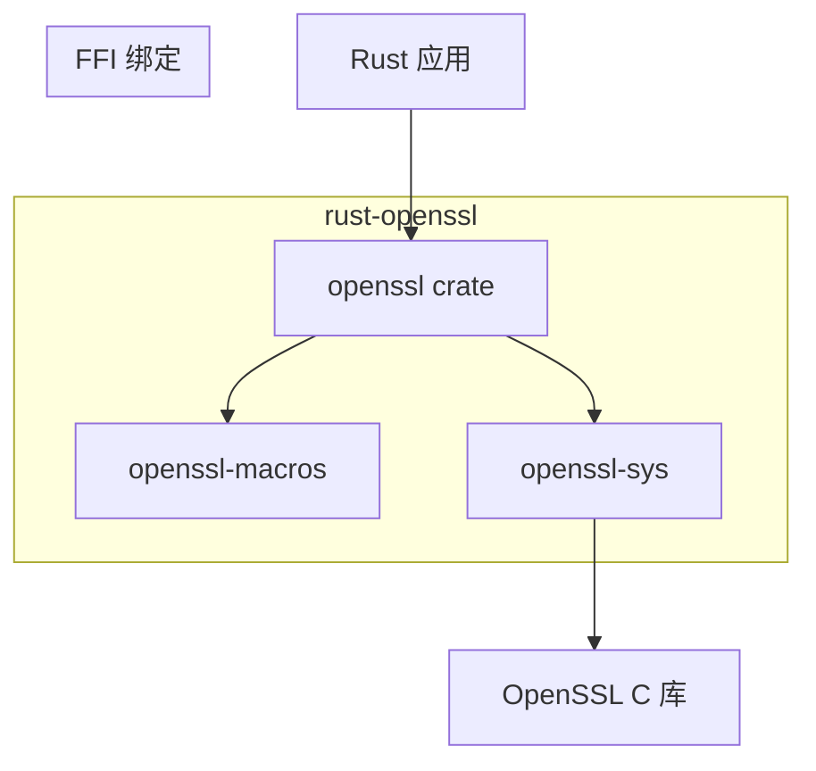
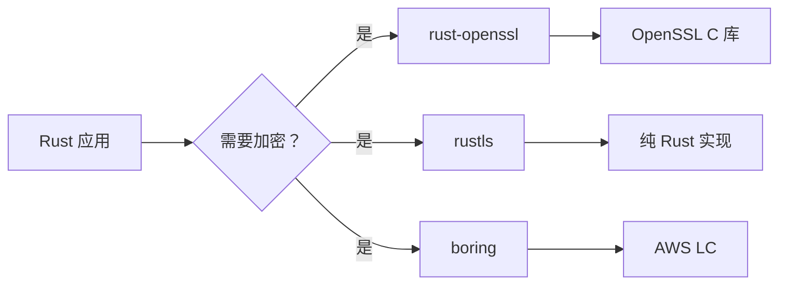

# rust-openssl 原始库简介

> **注意**: 本文档简要介绍 rust-openssl 的原始功能，重点内容请参阅 OH 适配相关文档。

## 库信息

| 属性 | 值 |
|-----|------|
| **名称** | rust-openssl |
| **当前版本** | 0.10.73 (openssl crate), 0.9.109 (openssl-sys crate) |
| **许可证** | Apache-2.0 (主库), MIT (openssl-sys) |
| **上游地址** | https://github.com/sfackler/rust-openssl |
| **首次发布** | 2014年 |
| **维护状态** | 活跃维护 |

## 功能概述

rust-openssl 是 Rust 生态中最成熟的 OpenSSL 绑定库，提供以下核心功能：

### 1. TLS/SSL 功能

```rust
// TLS 客户端连接示例
use openssl::ssl::{SslConnector, SslMethod, SslStream};
use std::net::TcpStream;

fn connect_tls(host: &str, port: u16) -> Result<SslStream<TcpStream>, openssl::error::ErrorStack> {
    let connector = SslConnector::builder(SslMethod::tls())?
        .build();
    
    let stream = TcpStream::connect((host, port))?;
    connector.connect(host, stream)
}
```

### 2. 加密算法

| 类别 | 支持的算法 |
|-----|----------|
| **对称加密** | AES (ECB, CBC, CTR, GCM), ChaCha20, RC4, DES, 3DES |
| **非对称加密** | RSA, EC (secp256k1, P-256, P-384, P-521), DSA |
| **哈希算法** | SHA-256, SHA-512, MD5, BLAKE2 |
| **密钥派生** | PBKDF2, Scrypt, HKDF |
| **消息认证** | HMAC, Poly1305 |

### 3. X.509 证书处理

```rust
use openssl::x509::{X509, X509Store, X509Ref};
use openssl::pkey::PKey;
use openssl::pkey::Public;

// 证书验证
fn verify_certificate(cert: &X509, ca: &X509Store) -> bool {
    cert.verify(ca.issued_by(cert)).unwrap_or(false)
}
```

### 4. 错误处理

```rust
use openssl::error::ErrorStack;

// 错误处理模式
match some_openssl_operation() {
    Ok(result) => result,
    Err(ErrorStack(errors)) => {
        for error in errors {
            println!("Error: {:?}", error);
        }
    }
}
```

## 架构设计

rust-openssl 采用分层架构：



### Crate 职责

| Crate | 职责 |
|-------|------|
| **openssl** | 高层 Rust API，安全封装 |
| **openssl-sys** | FFI 绑定，自动生成 |
| **openssl-macros** | 过程宏，类型安全包装 |
| **openssl-errors** | 错误类型定义 |

## 版本历史

| 版本 | 发布时间 | 主要变更 |
|-----|---------|---------|
| 0.10.x | 2023年 | 支持 OpenSSL 3.x，新的 FFI 绑定 |
| 0.9.x | 2022年 | OpenSSL 1.1.1 兼容 |
| 0.8.x | 2021年 | Rust 2021 Edition 支持 |

## 在 OpenHarmony 中的定位

### 作用

rust-openssl 在 OH 系统中提供 **Rust 应用的加密能力**：

1. **TLS/SSL 通信**: 为 HDC 工具提供安全的网络连接
2. **证书验证**: X.509 证书的解析和验证
3. **数据加密**: 对称和非对称加密支持

### 定位分析

| 方面 | 描述 |
|-----|------|
| **依赖层级** | 工具层（HDC 工具） |
| **是否必需** | 可选（仅 HDC 使用） |
| **替代方案** | rustls, boring (AWS LC) |
| **发展趋势** | 保持维护，关注新版本 |

### 与其他加密库的关系



## 相关资源

- **[上游文档](https://docs.rs/openssl)** - 完整 API 文档
- **[GitHub 仓库](https://github.com/sfackler/rust-openssl)** - 源码和问题
- **[Cargo 注册表](https://crates.io/crates/openssl)** - 版本信息
