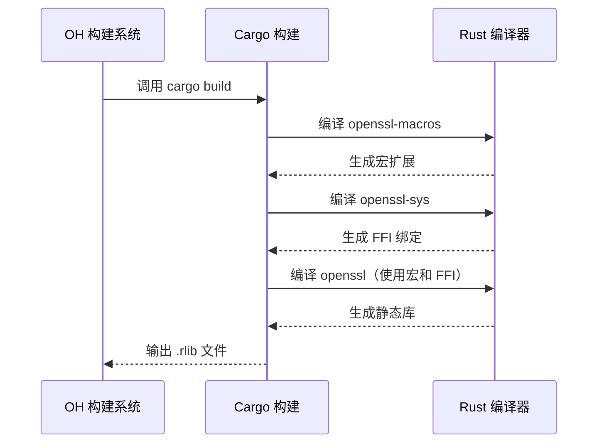
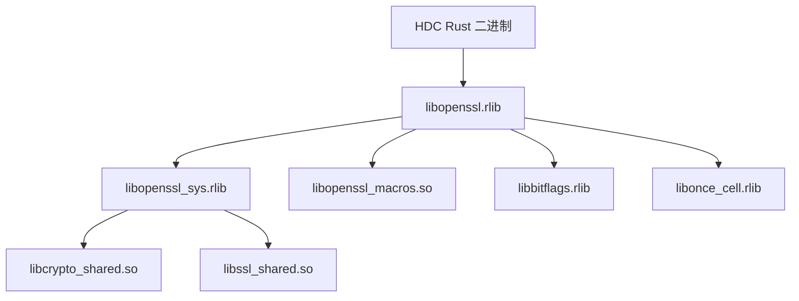

# OH 构建适配详解

> **核心文档**: 本文档详细说明 rust-openssl 如何适配 OpenHarmony 构建系统。

## 构建系统概述

rust-openssl 在 OH 中使用 **OHOS Cargo Crate 构建模板** (`ohos_cargo_crate`) 进行构建，将上游的 Cargo Rust 项目适配到 OH 构建系统 (GN + Cargo)。

### 构建配置清单

| Crate | 构建模板 | 输出类型 | 适配状态 |
|-------|---------|---------|---------|
| **openssl** | ohos_cargo_crate | rlib | ✅ 完整适配 |
| **openssl-sys** | ohos_cargo_crate | rlib | ✅ 完整适配 |
| **openssl-macros** | ohos_cargo_crate | proc-macro | ✅ 完整适配 |
| **openssl-errors** | 无 | - | ⚠️ 需适配 |

## BUILD.gn 详细分析

### 1. openssl/BUILD.gn

**文件路径**: `third_party/rust/crates/rust-openssl/openssl/BUILD.gn`

```gn
# Copyright (c) 2023 Huawei Device Co., Ltd.
ohos_cargo_crate("lib") {
  crate_name = "openssl"
  crate_type = "rlib"                              # 静态库
  crate_root = "src/lib.rs"
  
  edition = "2021"
  cargo_pkg_version = "0.10.73"
  cargo_pkg_authors = "Steven Fackler <sfackler@gmail.com>"
  cargo_pkg_name = "openssl"
  cargo_pkg_description = "OpenSSL bindings"
  
  # 内部依赖
  deps = [
    "//third_party/rust/crates/bitflags:lib",
    "//third_party/rust/crates/cfg-if:lib",
    "//third_party/rust/crates/foreign-types/foreign-types/:lib",
    "//third_party/rust/crates/once_cell:lib",
    "//third_party/rust/crates/rust-openssl/openssl-macros:lib_macros(${host_toolchain})",
    "//third_party/rust/crates/rust-openssl/openssl-sys:lib_sys",
  ]
  
  # 外部依赖（系统库）
  external_deps = [ "rust_libc:lib" ]
  
  # 模块输出配置
  module_output_extension = ".rlib"
  features = [ "default" ]
  install_enable = false
  
  # OpenSSL 版本兼容性配置
  rustflags = [
    "--cfg=osslconf=\"OPENSSL_NO_BF\"",        # 禁用 Blowfish
    "--cfg=osslconf=\"OPENSSL_NO_IDEA\"",      # 禁用 IDEA
    "--cfg=osslconf=\"OPENSSL_NO_CAMELLIA\"", # 禁用 Camellia
    "--cfg=osslconf=\"OPENSSL_NO_CAST\"",      # 禁用 CAST
    "--cfg=osslconf=\"OPENSSL_NO_RMD160\"",    # 禁用 RMD160
    "--cfg=osslconf=\"OPENSSL_NO_SSL3_METHOD\"", # 禁用 SSLv3
    "--cfg=ossl101",                            # OpenSSL 1.0.1 特性
    "--cfg=ossl102",                            # OpenSSL 1.0.2 特性
    "--cfg=ossl110",                            # OpenSSL 1.1.0 特性
    "--cfg=ossl110g",                           # OpenSSL 1.1.0 g 系列
    "--cfg=ossl110h",                           # OpenSSL 1.1.0 h 系列
    "--cfg=ossl111",                            # OpenSSL 1.1.1 特性
    "--cfg=ossl300",                            # OpenSSL 3.0.0 特性
  ]
  
  subsystem_name = "thirdparty"
  part_name = "rust_rust-openssl"
}
```

**关键配置说明**:

| 配置项 | 值 | 说明 |
|-------|-----|------|
| `crate_type` | `rlib` | Rust 静态库，用于链接到其他 Rust 二进制文件 |
| `external_deps` | `rust_libc:lib` | 链接系统的 libc 库 |
| `rustflags` | 见下表 | OpenSSL 版本兼容性配置 |
| `install_enable` | `false` | 不安装到系统目录 |

### 2. openssl-sys/BUILD.gn

**文件路径**: `third_party/rust/crates/rust-openssl/openssl-sys/BUILD.gn`

```gn
ohos_cargo_crate("lib_sys") {
  crate_name = "openssl_sys"
  crate_type = "rlib"
  crate_root = "src/lib.rs"
  
  edition = "2021"
  cargo_pkg_version = "0.9.109"
  cargo_pkg_authors = "Alex Crichton <alex@alexcrichton.com>, Steven Fackler <sfackler@gmail.com>"
  cargo_pkg_name = "openssl-sys"
  cargo_pkg_description = "FFI bindings to OpenSSL"
  
  # 外部依赖 - 关键配置
  external_deps = [
    "openssl:libcrypto_shared",     # OpenSSL crypto 库
    "openssl:libssl_shared",        # OpenSSL ssl 库
    "rust_libc:lib",
  ]
  
  module_output_extension = ".rlib"
  install_enable = false
  
  # 扩展的版本兼容性配置
  rustflags = [
    "--cfg=const_fn",
    "--cfg=openssl",
    "--cfg=osslconf=\"OPENSSL_NO_BF\"",
    "--cfg=osslconf=\"OPENSSL_NO_IDEA\"",
    "--cfg=osslconf=\"OPENSSL_NO_CAMELLIA\"",
    "--cfg=osslconf=\"OPENSSL_NO_CAST\"",
    "--cfg=osslconf=\"OPENSSL_NO_RMD160\"",
    "--cfg=osslconf=\"OPENSSL_NO_SSL3_METHOD\"",
    "--cfg=ossl300",
    "--cfg=ossl101",
    "--cfg=ossl102",
    "--cfg=ossl102f",
    "--cfg=ossl102h",
    "--cfg=ossl110",
    "--cfg=ossl110f",
    "--cfg=ossl110g",
    "--cfg=ossl110h",
    "--cfg=ossl111",
    "--cfg=ossl111b",
    "--cfg=ossl111c",
  ]
  
  subsystem_name = "thirdparty"
  part_name = "rust_rust-openssl"
}
```

**openssl-sys 特有配置**:

| 配置项 | 说明 |
|-------|------|
| `external_deps` | 链接 OpenSSL C 库（关键差异） |
| `ossl102f/h` | OpenSSL 1.0.2 特定修订版 |
| `ossl111b/c` | OpenSSL 1.1.1 特定修订版 |

### 3. openssl-macros/BUILD.gn

**文件路径**: `third_party/rust/crates/rust-openssl/openssl-macros/BUILD.gn`

```gn
ohos_cargo_crate("lib_macros") {
  crate_name = "openssl_macros"
  crate_type = "proc-macro"                    # 过程宏类型
  crate_root = "src/lib.rs"
  
  edition = "2021"
  cargo_pkg_version = "0.1.1"
  cargo_pkg_name = "openssl-macros"
  cargo_pkg_description = "Internal macros used by the openssl crate."
  
  # 宏依赖
  deps = [
    "//third_party/rust/crates/proc-macro2:lib",
    "//third_party/rust/crates/quote:lib",
    "//third_party/rust/crates/syn:lib",
  ]
}
```

## rustflags 详细解释

### OpenSSL 版本配置标志

| 标志 | 对应版本 | 说明 |
|-----|---------|------|
| `--cfg=ossl101` | OpenSSL 1.0.1 | TLS 1.2 支持 |
| `--cfg=ossl102` | OpenSSL 1.0.2 | 硬件加速支持 |
| `--cfg=ossl102f/h` | OpenSSL 1.0.2 特定修订版 | 安全补丁 |
| `--cfg=ossl110` | OpenSSL 1.1.0 | API 变化 |
| `--cfg=ossl110f/g/h` | OpenSSL 1.1.0 特定修订版 | 安全补丁 |
| `--cfg=ossl111` | OpenSSL 1.1.1 | TLS 1.3, SHA-2 |
| `--cfg=ossl111b/c` | OpenSSL 1.1.1 特定修订版 | 安全补丁 |
| `--cfg=ossl300` | OpenSSL 3.0.0 | 新架构, Provider |

### 算法禁用配置

| 标志 | 禁用的算法 | 原因 |
|-----|----------|------|
| `--cfg=osslconf="OPENSSL_NO_BF"` | Blowfish | OH 版本可能不支持 |
| `--cfg=osslconf="OPENSSL_NO_IDEA"` | IDEA | 已废弃 |
| `--cfg=osslconf="OPENSSL_NO_CAMELLIA"` | Camellia | 不常用 |
| `--cfg=osslconf="OPENSSL_NO_CAST"` | CAST | 已废弃 |
| `--cfg=osslconf="OPENSSL_NO_RMD160"` | RMD160 | 碰撞攻击 |
| `--cfg=osslconf="OPENSSL_NO_SSL3_METHOD"` | SSLv3 | POODLE 攻击 |

### 构建流程



## 构建产物

### 编译输出

| 文件 | 类型 | 说明 |
|-----|------|-----|
| `libopenssl.rlib` | 静态库 | OpenSSL Rust 绑定 |
| `libopenssl_sys.rlib` | 静态库 | FFI 绑定 |
| `libopenssl_macros.so` | 动态库 | 过程宏扩展 |

### 依赖链



## 常见问题

### Q1: 为什么需要配置这么多版本标志？

**答**: OH 系统可能使用不同版本的 OpenSSL (1.1.1 或 3.0.x)。通过配置版本标志，rust-openssl 可以在编译时检测可用特性，避免调用不存在的函数。

### Q2: 禁用算法会不会影响功能？

**答**: 不会。这些算法（Blowfish、IDEA 等）已被废弃且存在安全风险。现代 TLS 连接不使用这些算法。

### Q3: openssl-errors 为什么没有 BUILD.gn？

**答**: 这是当前的限制。openssl-errors 的功能在测试代码中被使用，但没有独立的构建目标。建议后续添加完整的 BUILD.gn 支持。

## 最佳实践

1. **版本升级**: 更新 rustflags 配置以匹配新版本
2. **安全配置**: 保持禁用废弃算法
3. **测试验证**: 升级后运行完整的测试套件

## 相关文档

- **[04_Usage_in_OH.md](./04_Usage_in_OH.md)** - 使用场景
- **[06_Security.md](./06_Security.md)** - 安全考虑
- **OH 构建文档** - ohos_crate_crate 模板说明
