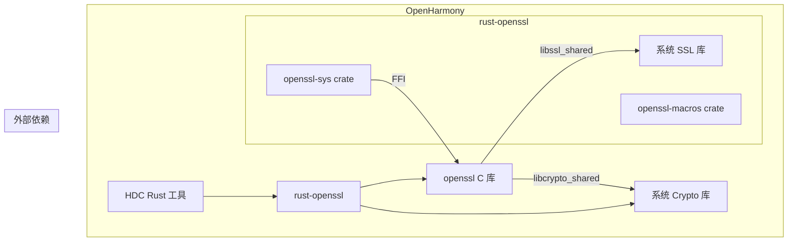

# 依赖关系与使用

> **重点文档**: 本文档说明 rust-openssl 在 OpenHarmony 中的使用情况和依赖关系。

## 概述

rust-openssl 在 OpenHarmony 中主要用于为 **Rust 组件提供 OpenSSL 加密功能**。截至目前，该库的使用范围相对有限，主要服务于 HDC（Huawei Device Connector）工具。

## 直接依赖者

### 主要依赖模块

| 模块 | BUILD.gn 路径 | 依赖类型 | 用途 |
|-----|--------------|---------|------|
| **hdc_rust** | `developtools/hdc/hdc_rust/BUILD.gn` | 静态链接 | HDC 工具的加密通信 |

### 依赖详情

**模块**: hdc_rust

```gn
# developtools/hdc/hdc_rust/BUILD.gn 片段

deps = [
  "//third_party/rust/crates/rust-openssl/openssl:lib",
  "//third_party/rust/crates/rust-openssl/openssl-sys:lib_sys",
]
```

**使用场景**: HDC 工具通过 rust-openssl 实现 TLS/SSL 加密连接，用于设备通信和调试。

## 依赖关系图



## 使用方式详解

### 1. 静态链接

rust-openssl 在 OH 中以 **静态库 (.rlib)** 形式链接：

```gn
# 静态链接 rust-openssl
ohos_rust_binary("hdc") {
  deps = [
    "//third_party/rust/crates/rust-openssl/openssl:lib",
    "//third_party/rust/crates/rust-openssl/openssl-sys:lib_sys",
  ]
}
```

### 2. 头文件引用

Rust 代码直接引用 openssl crate：

```rust
// Cargo.toml
[dependencies]
openssl = { path = "$OHOS_SDK/third_party/rust/crates/rust-openssl/openssl" }
openssl-sys = { path = "$OHOS_SDK/third_party/rust/crates/rust-openssl/openssl-sys" }
```

```rust
// lib.rs
use openssl::ssl::{SslConnector, SslMethod};
use openssl::pkey::PKey;
use openssl::x509::X509;
```

### 3. 动态库链接

openssl-sys 通过 external_deps 链接系统 OpenSSL 动态库：

```gn
external_deps = [
  "openssl:libcrypto_shared",   # 系统 Crypto 动态库
  "openssl:libssl_shared",      # 系统 SSL 动态库
  "rust_libc:lib",
]
```

## 典型使用场景

### 场景一：TLS 客户端连接

```rust
use openssl::ssl::{SslConnector, SslMethod, SslStream};
use std::net::TcpStream;
use std::io::{self, Read, Write};

fn connect_secure(host: &str, port: u16) -> Result<SslStream<TcpStream>, openssl::error::ErrorStack> {
    // 创建 TLS 连接器
    let connector = SslConnector::builder(SslMethod::tls())?
        .build();
    
    // 建立 TCP 连接
    let stream = TcpStream::connect((host, port))?;
    
    // 执行 TLS 握手
    connector.connect(host, stream)
}
```

### 场景二：证书验证

```rust
use openssl::x509::{X509, X509Store};
use openssl::pkey::PKey;

fn verify_remote_certificate(
    remote_cert: &X509,
    ca_cert: &X509
) -> Result<bool, openssl::error::ErrorStack> {
    // 创建证书存储
    let mut store = X509Store::new()?;
    store.add_cert(ca_cert.clone())?;
    
    // 验证证书链
    let ctx = X509StoreContext::new()?;
    ctx.verify(remote_cert, &store)
}
```

### 场景三：数据加密

```rust
use openssl::symm::{Cipher, Crypter, Mode};
use openssl::error::ErrorStack;

fn encrypt_aes_256_gcm(
    key: &[u8],
    iv: &[u8],
    plaintext: &[u8]
) -> Result<Vec<u8>, ErrorStack> {
    let cipher = Cipher::aes_256_gcm();
    let mut crypter = Crypter::new(Mode::Encrypt, cipher, key, Some(iv))?;
    
    // 预分配输出缓冲区
    let mut encrypted = vec![0u8; plaintext.len() + cipher.block_size()];
    let count = crypter.update(plaintext, &mut encrypted)?;
    
    // 添加认证标签
    let mut tag = vec![0u8; cipher.tag_len()];
    crypter.finalize(&mut encrypted[count..], &mut tag)?;
    
    encrypted.truncate(count + tag.len());
    Ok(encrypted)
}
```

## 依赖链详解

### 层级一：应用层

```
HDC Rust 工具
  │
  ├── rust-openssl (openssl crate)
  │     │
  │     ├── openssl-macros (过程宏)
  │     ├── openssl-sys (FFI 绑定)
  │     │     │
  │     │     └── openssl C 库 (运行时链接)
  │     │
  │     ├── bitflags
  │     ├── cfg-if
  │     ├── foreign-types
  │     └── once_cell
  │
  └── 其他 Rust 依赖
```

### 层级二：运行时依赖

```
运行时链接
  │
  ├── libcrypto_shared.so (OpenSSL Crypto)
  │     ├── libcrypto.so.1.1 或 libcrypto.so.3
  │     └── 系统加密服务
  │
  └── libssl_shared.so (OpenSSL SSL)
        ├── libssl.so.1.1 或 libssl.so.3
        └── TLS/SSL 协议栈
```

## 性能考虑

### 静态链接影响

| 方面 | 影响 |
|-----|------|
| **二进制大小** | rust-openssl 静态库增加 ~100KB |
| **启动时间** | 无影响（运行时链接动态库） |
| **内存占用** | 共享 OpenSSL 动态库 |

### 优化建议

1. **按需编译**: 只编译使用的特性
2. **链接优化**: 使用 LTO 减少重复代码
3. **动态库复用**: 多个 Rust 应用共享 OpenSSL 动态库

## 常见问题

### Q1: 如何在新的 OH Rust 项目中使用 rust-openssl？

**答**: 在项目的 `Cargo.toml` 中添加依赖：

```toml
[dependencies]
openssl = { path = "$OHOS_SDK/third_party/rust/crates/rust-openssl/openssl" }
openssl-sys = { path = "$OHOS_SDK/third_party/rust/crates/rust-openssl/openssl-sys" }
```

然后创建对应的 BUILD.gn 依赖配置。

### Q2: rust-openssl 和其他加密库如何选择？

**答**: 选择依据：

- **rust-openssl**: 需要 OpenSSL 兼容性，已有的 OpenSSL 基础设施
- **rustls**: 纯 Rust 实现，无 C 依赖，更轻量
- **boring (AWS LC)**: AWS 场景，Cloudflare 的优化实现

### Q3: 为什么 hdc_rust 使用 rust-openssl 而不是 rustls？

**答**: 历史原因和兼容性考虑。HDC 工具需要与现有的 OpenSSL 基础设施兼容。

## 未来扩展建议

### 潜在使用者

| 模块 | 可能的使用场景 |
|-----|--------------|
| **其他开发工具** | 需要 HTTPS/TLS 功能的工具 |
| **网络组件** | HTTP 客户端库 |
| **安全模块** | 证书管理、加密功能 |

### 扩展建议

1. **添加 openssl-errors BUILD.gn**: 完整支持错误处理
2. **扩大使用范围**: 评估其他组件的加密需求
3. **文档完善**: 提供更详细的使用示例

## 相关文档

- **[01_Overview.md](./01_Overview.md)** - 原始库功能介绍
- **[03_Build_Integration.md](./03_Build_Integration.md)** - 构建适配细节
- **[05_API_Differences.md](./05_API_Differences.md)** - API 使用注意事项
