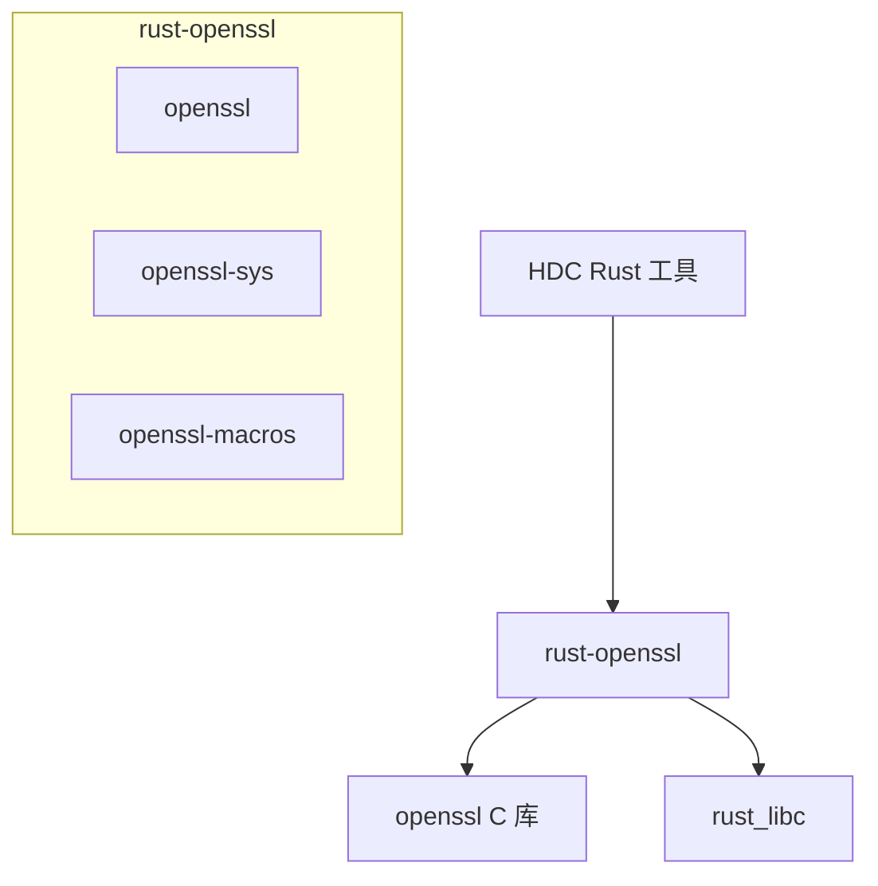

# rust-openssl

[](https://docs.rs/openssl)

## 库概览

rust-openssl 是 Rust 语言的 **OpenSSL 绑定库**，为 Rust 应用提供 OpenSSL/TLS 加密功能。该库本身不包含 OpenSSL 源码，而是通过 FFI（外部函数接口）调用系统级的 OpenSSL 库。

| 项目 | 信息 |
|-----|------|
| **版本** | 0.10.73 (openssl), 0.9.109 (openssl-sys) |
| **许可证** | Apache-2.0 / MIT |
| **上游地址** | [sfackler/rust-openssl](https://github.com/sfackler/rust-openssl) |
| **OH 组件** | @ohos/rust_rust-openssl |

## OpenHarmony 适配概述

### Patch 状态

**本库无任何 OH 特有 Patch**，直接从上游导入。适配工作完全通过 BUILD.gn 构建配置完成。

### 主要适配点

1. **OpenSSL 版本兼容**: 通过 `rustflags` 配置禁用不存在的旧算法
2. **外部依赖链接**: 链接 OH 系统提供的 OpenSSL 动态库
3. **构建系统集成**: 使用 `ohos_cargo_crate` 模板适配 OH 构建

### 依赖关系



## 文档导航

### 必读文档

1. **[README.md](/README.md)** - 本文档，快速了解
2. **[SUMMARY.md](/SUMMARY.md)** - 阅读路线建议
3. **[03_Build_Integration.md](/03_Build_Integration.md)** - 构建适配详解（重点）
4. **[04_Usage_in_OH.md](/04_Usage_in_OH.md)** - 依赖关系和使用场景

### 补充文档

5. **[01_Overview.md](/01_Overview.md)** - 原始库简介
6. **[02_Patches.md](/02_Patches.md)** - Patch 分析（本库无 Patch）
7. **[05_API_Differences.md](/05_API_Differences.md)** - API 差异
8. **[06_Security.md](/06_Security.md)** - 安全风险分析

### 工作文档

- **[ASSESSMENT.md](/_work/ASSESSMENT.md)** - 项目评估报告

## 快速开始

### 在 OH Rust 项目中使用

```toml
# Cargo.toml
[dependencies]
openssl = { path = "$OHOS_SDK/third_party/rust/crates/rust-openssl/openssl" }
```

### 示例代码

```rust
use openssl::ssl::{SslConnector, SslMethod};
use openssl::x509::X509;

fn main() {
    let mut connector = SslConnector::builder(SslMethod::tls()).unwrap();
    // 配置 TLS 连接...
}
```

## 版本兼容性

| rust-openssl | OpenSSL | Rust |
|-------------|---------|------|
| 0.10.x | 1.1.1 / 3.x | 1.63.0+ |
| 0.9.x | 1.1.1 / 3.x | 1.63.0+ |

## 相关资源

- **[上游文档](https://docs.rs/openssl)** - 完整的 API 文档
- **[上游 GitHub](https://github.com/sfackler/rust-openssl)** - 源码和问题追踪
- **[OpenSSL 文档](https://www.openssl.org/docs/)** - OpenSSL 官方文档

---

**最后更新**: 2024年  
**维护者**: xuelei3@huawei.com
