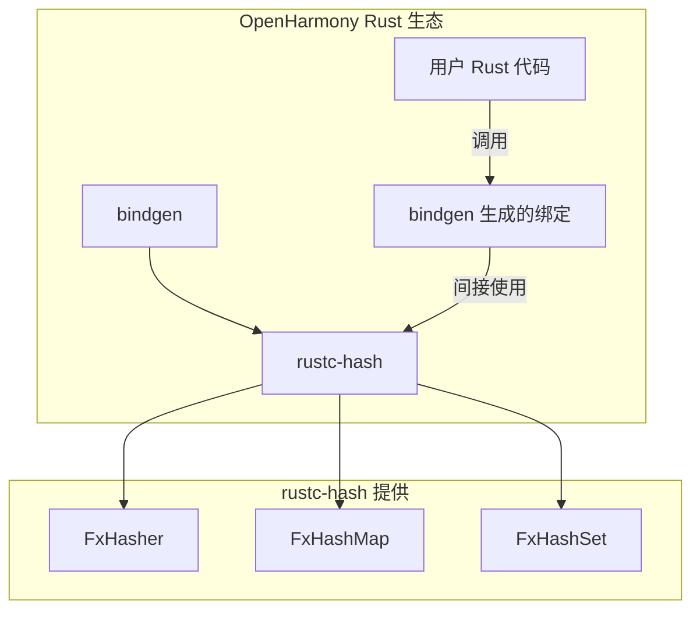

# 依赖关系与使用

## 直接依赖者

### 依赖者列表

| 序号 | 模块 | BUILD.gn 路径 | 用途 |
|------|------|---------------|------|
| 1 | bindgen | //third_party/rust/crates/bindgen/bindgen:BUILD.gn | FFI 绑定生成工具 |

### bindgen 依赖详情

bindgen 是 OpenHarmony 中**唯一**直接依赖 rustc-hash 的模块。

**BUILD.gn 引用**：
```gn
deps = [
    "//third_party/rust/crates/bitflags:lib",
    "//third_party/rust/crates/rustc-hash:lib",
    # ... 其他依赖
]
```

**使用方式**：bindgen 在内部使用 FxHashMap 来存储：
- 标识符映射表
- 类型定义映射
- 符号名称解析
- 编译过程中的临时数据结构

## 使用场景分析

### 主要使用场景：bindgen

bindgen 是一个自动生成 Rust FFI（外部函数接口）绑定到 C/C++ 库的工具。在 OpenHarmony 中，bindgen 被用于：

1. **系统接口绑定**：为 OH 的 C/C++ 系统库生成 Rust 绑定
2. **Native 模块集成**：支持 Rust 代码调用 OH 的 Native 模块
3. **构建时代码生成**：在构建过程中自动生成必要的 FFI 代码

### 选择 rustc-hash 的原因

bindgen 选择 rustc-hash 的 FxHashMap 而非标准 HashMap 的原因：

| 因素 | 说明 |
|------|------|
| **性能优先** | bindgen 需要处理大量的符号和类型信息，F xHashMap 的高速特性能够显著提升代码生成速度 |
| **无安全顾虑** | bindgen 是构建时工具，处理的是可信的编译输入，不需要考虑抗哈希洪水攻击等安全问题 |
| **内存效率** | FxHasher 的实现简洁，内存占用低，适合构建时的临时数据结构 |
| **确定性构建** | FxHash 的确定性输出有助于构建的可重复性 |

## 依赖关系图



## 潜在应用场景

虽然当前仅发现 bindgen 一个依赖者，rustc-hash 在以下 OH 场景中可能具有更大的应用价值：

| 场景 | 适用性 | 说明 |
|------|--------|------|
| **ArkTS/ArkUI 运行时** | ⭐⭐⭐ | 需要高效的数据结构来管理组件树和属性映射 |
| **分布式计算模块** | ⭐⭐⭐ | 需要快速的状态同步和数据传输 |
| **系统服务缓存层** | ⭐⭐⭐ | 需要高性能的键值存储 |
| **Rust 运行时优化** | ⭐⭐⭐ | 为 Rust 组件提供高性能哈希基础设施 |

## 依赖方式详解

### 静态链接

rustc-hash 以**静态链接**方式被集成：

1. rustc-hash 被编译为 `.rlib` 文件
2. 依赖者（bindgen）在编译时链接该静态库
3. 最终产物中包含 rustc-hash 的代码

### 头文件引用

依赖者通过 Cargo 依赖机制引用 rustc-hash：

```rust
// 在依赖者的源码中
use rustc_hash::FxHashMap;
use rustc_hash::FxHashSet;
```

### 版本管理

| 层面 | 版本 |
|------|------|
| OH bundle.json | 6.1（OH 版本标识） |
| Cargo.toml | 1.1.0（实际库版本） |
| 上游 crates.io | 1.1.0（当前最新稳定版） |

## 扩展使用建议

### 推荐的扩展场景

1. **内部缓存实现**：对于性能敏感的缓存模块，使用 FxHashMap 替代标准 HashMap
2. **编译器优化**：Rust 编写的编译器或解析器工具
3. **数据分析工具**：处理大量键值对的数据处理工具

### 不建议的使用场景

1. **用户输入处理**：处理不可信用户输入的场景应使用标准 HashMap
2. **网络服务**：需要 DOS 防护的网络服务接口
3. **安全敏感代码**：需要加密级别哈希安全性的场景

## 相关文档

- [库概述](./01_Overview.md)
- [Patch 分析](./02_Patches.md)
- [构建适配](./03_Build_Integration.md)
- [安全风险分析](./06_Security.md)
