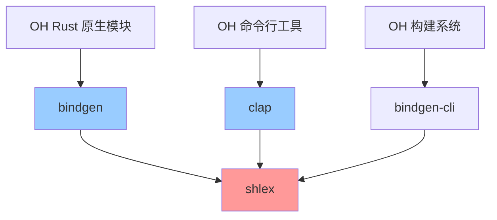

# shlex 在 OpenHarmony 中的使用

## 概述

shlex 在 OpenHarmony 中主要作为**Rust 生态系统的基础库**，通过被其他库（如 bindgen 和 clap）依赖而间接服务于 OH 系统。

本章详细分析 shlex 在 OH 中的依赖关系和使用方式。

---

## 直接依赖者

### 依赖清单

| 模块 | BUILD.gn/Cargo.toml 路径 | 依赖声明 | 用途 |
|-----|------------------------|---------|------|
| bindgen | `third_party/rust/crates/bindgen/bindgen/Cargo.toml` | `shlex = "1"` | 解析编译器参数 |
| bindgen-cli | `third_party/rust/crates/bindgen/bindgen-cli/Cargo.toml` | 间接依赖 | bindgen 命令行工具 |
| bindgen-tests | `third_party/rust/crates/bindgen/bindgen-tests/Cargo.toml` | 间接依赖 | bindgen 测试 |
| clap | `third_party/rust/crates/clap/Cargo.toml` | `shlex = "1.1.0"` | 解析命令行参数 |
| clap_complete | `third_party/rust/crates/clap/clap_complete/Cargo.toml` | 间接依赖 | clap 补全功能 |

### 依赖详情

#### 1. bindgen

**Cargo.toml 依赖声明**:

```toml
shlex = "1"
```

**用途**:
- 解析编译器参数（如 `-DDEBUG`, `-O3` 等）
- 处理包含空格和引号的复杂参数字符串

**使用场景**:
- 构建 OH 系统中的 Rust 原生模块时调用 bindgen
- 自动生成 Rust 绑定代码，将 C/C++ 接口转换为 Rust

#### 2. clap

**Cargo.toml 依赖声明**:

```toml
shlex = "1.1.0"
```

**用途**:
- 解析包含空格和引号的复杂命令行参数
- 支持 shell 风格的参数传递

**使用场景**:
- OH 开发工具链中的命令行工具
- 应用开发辅助工具
- 构建脚本中的参数解析

---

## 使用方式

### 1. 静态链接

shlex 在 OH 中以**静态链接**的方式使用：

- **输出类型**: `rlib`（Rust 静态库）
- **链接方式**: Rust-to-Rust 链接
- **输出文件**: `libshlex-*.rlib`

**优势**:
- 无运行时依赖
- 编译时确定调用关系
- 优化空间大

**限制**:
- 仅可被 Rust 代码使用
- 不能被非 Rust 代码（如 C/C++）直接调用

### 2. 头文件引用方式

shlex 是**纯 Rust 库**，不提供 C 头文件：

- **无 .h 文件**: shlex 仅提供 Rust 接口
- **无 FFI 绑定**: 无 C 兼容接口
- **Rust-only**: 仅可通过 Rust 代码调用

**使用示例**（在 Rust 代码中）:

```rust
use shlex::split;

fn main() {
    let args = "-DDEBUG -O3 \"my program\"";
    if let Some(words) = split(args) {
        println!("Parsed: {:?}", words);
    }
}
```

### 3. 间接依赖

shlex 在 OH 中主要通过**间接依赖**的方式被使用：

```
OH 组件
    ↓ 依赖
bindgen / clap
    ↓ 依赖
shlex
```

**说明**:
- OH 组件不直接依赖 shlex
- 通过 bindgen 和 clap 间接使用
- shlex 对上层不可见

---

## 关键使用场景

### 场景 1: bindgen 解析编译器参数

**背景**:
bindgen 是一个自动生成 Rust 绑定的工具，用于将 C/C++ 接口转换为 Rust 代码。

**shlex 的作用**:
解析编译器参数字符串，将其拆分为单独的参数项。

**示例**:

```rust
// 编译器参数字符串
let args = r#"-I/usr/include -DDEBUG -DVERSION="1.0""#;

// 使用 shlex 解析
use shlex::split;
if let Some(parsed_args) = split(args) {
    // parsed_args = [
    //     "-I/usr/include",
    //     "-DDEBUG",
    //     "-DVERSION=1.0"
    // ]
    bindgen::Builder::default()
        .clang_args(parsed_args)
        // ...
        .generate()
        .unwrap();
}
```

**OH 中的应用**:
- 构建 OH 系统中的 Rust 原生模块
- 生成 OH NDK 接口绑定
- 支持 OH 组件间的跨语言调用

### 场景 2: clap 解析命令行参数

**背景**:
clap 是一个强大的命令行参数解析库，广泛用于 Rust 命令行工具。

**shlex 的作用**:
解析包含空格和引号的复杂命令行参数。

**示例**:

```rust
// 命令行参数字符串
let args = r#"--output "my file.txt" --verbose"#;

// 使用 shlex 解析
use shlex::split;
if let Some(parsed_args) = split(args) {
    // parsed_args = [
    //     "--output",
    //     "my file.txt",
    //     "--verbose"
    // ]
    // 传递给 clap
    let matches = clap::App::new("myapp")
        .args_from_usage(
            "--output <FILE> 'Output file'
             --verbose 'Verbose output'"
        )
        .get_matches_from(parsed_args);
}
```

**OH 中的应用**:
- OH 开发工具链中的命令行工具
- 应用开发辅助工具
- 构建脚本中的参数解析

---

## 依赖关系图

### 完整依赖图



### 层级关系

```
┌─────────────────────────────────────┐
│    OH 系统组件（应用层）             │
│  - Rust 原生模块                     │
│  - 命令行工具                        │
└─────────────────────────────────────┘
              ↓ 依赖
┌─────────────────────────────────────┐
│    中间层库（工具层）                │
│  - bindgen（绑定生成）               │
│  - clap（命令行解析）                │
└─────────────────────────────────────┘
              ↓ 依赖
┌─────────────────────────────────────┐
│    基础库（工具链层）                │
│  - shlex（Shell 词法解析）           │
└─────────────────────────────────────┘
```

---

## shlex 在 OH 生态系统中的定位

### 1. 基础设施角色

shlex 在 OH 中扮演**基础设施**的角色：

- **不直接暴露**: 不向应用层暴露
- **间接服务**: 通过中间层库提供服务
- **稳定依赖**: 作为稳定的基础设施被依赖

### 2. 工具链支持

shlex 主要支持 **OH 工具链**：

- **构建工具**: bindgen 用于生成 Rust 绑定
- **开发工具**: clap 用于命令行工具开发
- **开发者工具**: 支持第三方开发者的工具需求

### 3. 跨语言交互

shlex 支持 **OH 的跨语言交互**：

- **Rust-C/C++**: 通过 bindgen 实现
- **Shell 解析**: 提供标准的 shell 词法解析
- **参数传递**: 支持复杂的参数传递场景

---

## 使用统计

### 被依赖次数

在 `third_party/rust/crates/` 目录下：

- **直接依赖者**: 2 个（bindgen, clap）
- **间接依赖者**: 约 3 个（bindgen-cli, bindgen-tests, clap_complete）
- **总计影响**: 约 5 个 OH Rust 组件

### 影响范围

shlex 的影响范围：

| 层级 | 受影响组件数 | 说明 |
|-----|------------|------|
| 直接依赖 | 2 | bindgen, clap |
| 间接依赖 | 3 | bindgen-cli, bindgen-tests, clap_complete |
| 最终影响 | 数百 | 通过 bindgen 影响所有使用 Rust 绑定的 OH 组件 |

---

## 依赖版本约束

### bindgen 的版本要求

```toml
shlex = "1"
```

**说明**:
- 允许任何 1.x 版本
- OH 当前使用 1.1.0
- 版本灵活性较高

### clap 的版本要求

```toml
shlex = "1.1.0"
```

**说明**:
- 精确要求 1.1.0
- OH 当前使用 1.1.0
- 版本约束较严格

---

## 升级影响

### shlex 版本升级的影响

如果升级 shlex 版本，可能影响：

1. **bindgen**:
   - 需要验证与新版本的兼容性
   - 测试编译器参数解析功能

2. **clap**:
   - 需要验证命令行参数解析功能
   - 可能需要调整版本约束

3. **下游组件**:
   - 可能需要重新编译依赖 shlex 的组件
   - 运行完整的测试套件

### 回归风险

**风险等级**: 低

**原因**:
- shlex 是稳定的基础库
- 上游遵循语义化版本
- API 变化较少

---

## 总结

### 使用特点

1. **间接依赖**: 不直接暴露给上层
2. **基础设施**: 作为工具链的基础设施
3. **稳定依赖**: 版本稳定性高
4. **跨语言支持**: 支持跨语言交互

### 依赖关系

- **直接依赖者**: 2 个（bindgen, clap）
- **间接依赖者**: 约 3 个
- **最终影响**: 数百个 OH 组件

### 维护建议

1. **版本升级**: 需要验证 bindgen 和 clap 的兼容性
2. **测试重点**: 测试编译器参数解析和命令行参数解析
3. **回归风险**: 低，但需要充分测试
