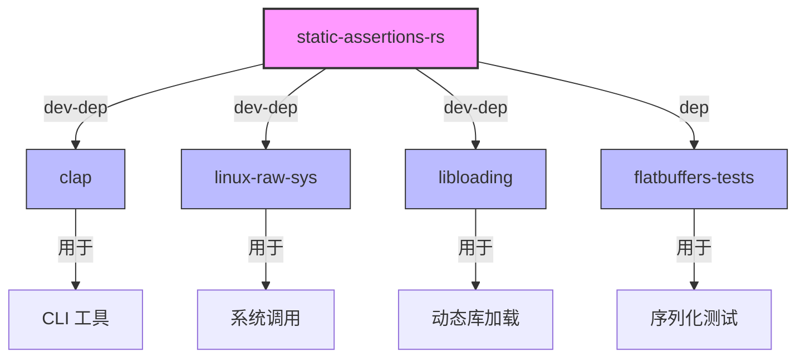

# 04 - 依赖关系与使用

## 4.1 直接依赖者

### GN 构建系统依赖

在 OpenHarmony 代码库中搜索 GN 构建文件对该库的依赖：

```bash
$ grep -r "static-assertions-rs" --include="*.gn" --include="*.gni" /Volumes/lexar/code/d/work/oh
```

**结果**: 仅在自身 BUILD.gn 中找到引用

| 模块 | BUILD.gn 路径 | 依赖方式 | 用途 |
|------|--------------|----------|------|
| static-assertions-rs | BUILD.gn | 自身 | - |

### 结论

该库在 GN 构建系统中**未被其他模块直接依赖**。这是因为：

1. 该库主要作为 **Cargo 开发依赖** 使用
2. OH Rust crate 通常通过 Cargo.toml 而非 GN deps 引用开发依赖
3. 该库为纯宏库，在编译后不会保留在最终二进制中

---

## 4.2 Cargo.toml 依赖关系

在 OpenHarmony 代码库中，以下 crate 在 `Cargo.toml` 中声明了对 `static_assertions` 的依赖：

### 开发依赖列表

| Crate | 路径 | 依赖类型 | 版本要求 | 使用场景 |
|-------|------|----------|----------|----------|
| **clap** | third_party/rust/crates/clap/Cargo.toml | dev-dependencies | 1.1.0 | 单元测试中的类型断言 |
| **linux-raw-sys** | third_party/rust/crates/linux-raw-sys/Cargo.toml | dev-dependencies | 1.1.0 | 测试 FFI 类型布局 |
| **libloading** | third_party/rust/crates/libloading/Cargo.toml | dev-dependencies | 1.1 | 测试动态加载类型 |
| **flatbuffers (tests)** | third_party/flatbuffers/tests/rust_usage_test/Cargo.toml | dependencies | 1.0.0 | Rust API 测试 |

### 依赖详情

#### clap (命令行解析库)

```toml
[dev-dependencies]
static_assertions = "1.1.0"
```

**用途**: 在单元测试中验证命令行解析器的类型安全

#### linux-raw-sys (Linux 原始系统调用绑定)

```toml
[dev-dependencies]
static_assertions = "1.1.0"
libc = "0.2.100"
```

**用途**: 验证生成的 FFI 绑定类型的布局正确性

#### libloading (动态库加载)

```toml
[dev-dependencies]
libc = "0.2"
static_assertions = "1.1"
```

**用途**: 测试动态库句柄类型的 trait 实现

#### flatbuffers (序列化库)

```toml
[dependencies]
static_assertions = "1.0.0"
```

**用途**: Rust API 使用测试中的类型验证

---

## 4.3 代码级参考

### cxx crate 的代码参考

`cxx` crate（C++ 互操作库）的代码中提到了 static-assertions-rs：

```rust
// third_party/rust/crates/cxx/macro/src/expand.rs:426
// Derived from https://github.com/nvzqz/static-assertions-rs.
```

**说明**: cxx crate 参考了 static-assertions-rs 的实现思路，但未直接依赖该库。这表明 static-assertions-rs 的实现模式在 Rust 生态中具有参考价值。

---

## 4.4 使用场景分析

### 典型使用模式

#### 1. 类型 Trait 验证

```rust
// 确保类型可在多线程环境使用
use static_assertions::assert_impl_all;

assert_impl_all!(MyStruct: Send, Sync);
```

#### 2. FFI 类型布局验证

```rust
// 确保 Rust 和 C 结构体大小一致
use static_assertions::assert_eq_size;

assert_eq_size!(RustStruct, CStruct);
```

#### 3. 常量值验证

```rust
// 确保编译期常量符合预期
use static_assertions::const_assert;

const_assert!(MAX_BUFFER_SIZE > MIN_BUFFER_SIZE);
```

### 在 OH 中的具体使用场景

| 场景 | 示例 | 涉及的 crate |
|------|------|-------------|
| CLI 工具类型检查 | 验证 Parser 实现 Send | clap |
| 系统调用绑定 | 验证 syscall 参数类型大小 | linux-raw-sys |
| 动态库句柄 | 验证 Library 类型安全 | libloading |
| 序列化类型 | 验证 FlatBuffer 结构布局 | flatbuffers |

---

## 4.5 依赖关系图

### 简化的依赖关系



### 在 OH Rust 生态中的位置

```
OpenHarmony Rust 生态系统
├── 应用层
│   └── CLI 工具 (依赖 clap)
├── 系统服务层
│   ├── 系统调用封装 (依赖 linux-raw-sys)
│   └── 动态库管理 (依赖 libloading)
├── 第三方库层
│   ├── clap
│   │   └── [dev] static-assertions-rs
│   ├── linux-raw-sys
│   │   └── [dev] static-assertions-rs
│   ├── libloading
│   │   └── [dev] static-assertions-rs
│   └── static-assertions-rs (本库)
└── 构建系统
    └── GN + Cargo 混合构建
```

---

## 4.6 链接方式

### 静态链接 / 动态链接

static-assertions-rs 的特殊性：

| 属性 | 说明 |
|------|------|
| **编译后存在性** | 不存在于最终二进制 |
| **链接方式** | 不参与链接 |
| **输出物** | 无（纯宏库） |

**解释**: 该库只提供宏，宏在编译期展开后，库本身不会进入最终产物。

### 头文件引用方式

在 Rust 中使用：

```rust
// 方式1: 使用 #[macro_use]
#[macro_use]
extern crate static_assertions;

// 方式2: 直接 use（Rust 2018+）
use static_assertions::assert_impl_all;
```

---

## 4.7 依赖影响评估

### 如果移除该库的影响

| 影响范围 | 程度 | 说明 |
|----------|------|------|
| 运行时功能 | 无 | 不影响运行时代码 |
| 编译期检查 | 中 | 影响开发依赖的编译时断言测试 |
| 测试覆盖 | 中 | 可能导致部分测试无法编译 |
| 生产代码 | 无 | 生产代码不依赖该库 |

### 升级影响

| 升级类型 | 影响 | 建议 |
|----------|------|------|
| 补丁版本升级 | 无风险 | 可直接升级 |
| 小版本升级 | 低风险 | 检查上游 changelog |
| 大版本升级 | 中风险 | 需检查破坏性变更 |

---

## 4.8 总结

static-assertions-rs 在 OpenHarmony 中：

1. **无 GN 直接依赖**: 主要通过 Cargo 开发依赖使用
2. **多 crate 使用**: clap、linux-raw-sys、libloading 等均依赖
3. **纯开发依赖**: 不进入最终产物，零运行时影响
4. **类型安全保障**: 为 Rust 生态提供编译时验证能力
5. **低风险**: 移除或升级不会影响生产代码
