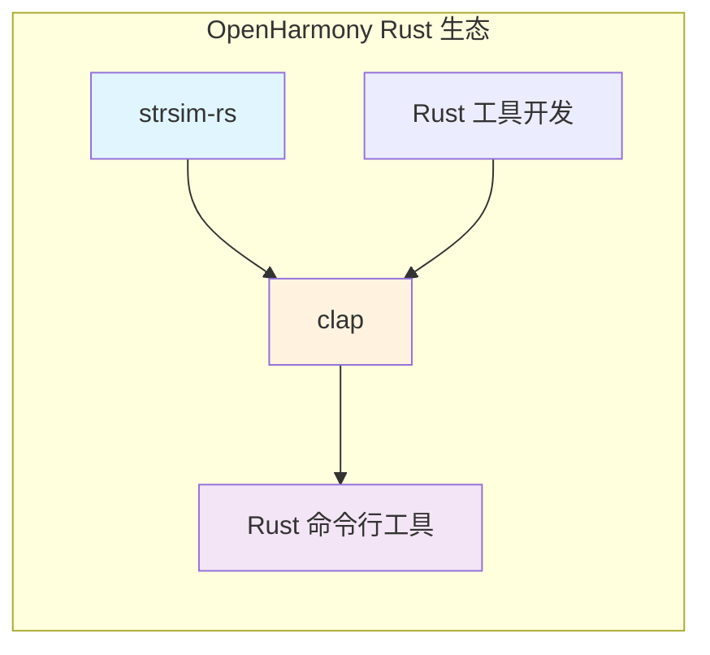

# 依赖关系与使用

## 4.1 依赖关系概览

### 1.1 依赖图



### 1.2 依赖层级

| 层级 | 模块 | 说明 |
|------|------|------|
| **第一层** | strsim-rs | 字符串相似度算法库（底层） |
| **第二层** | clap | 命令行参数解析器（中层） |
| **第三层** | Rust 命令行工具 | 终端应用（应用层） |

## 4.2 直接依赖者

### 2.1 依赖者清单

| 模块名称 | BUILD.gn 路径 | 依赖方式 | 使用特性 |
|----------|---------------|----------|----------|
| **clap** | `//third_party/rust/crates/clap/BUILD.gn` | 静态链接 | `suggestions` |

### 2.2 clap 依赖详情

**文件**：`//third_party/rust/crates/clap/BUILD.gn`

```gn
ohos_cargo_crate("lib") {
    crate_name = "clap"
    crate_type = "rlib"
    # ... 其他配置 ...
    
    deps = [
      "//third_party/rust/crates/bitflags:lib",
      "//third_party/rust/crates/clap/clap_derive:lib(${host_toolchain})",
      "//third_party/rust/crates/clap/clap_lex:lib",
      "//third_party/rust/crates/is-terminal:lib",
      "//third_party/rust/crates/once_cell:lib",
      "//third_party/rust/crates/strsim-rs:lib",  # ← 依赖 strsim-rs
      "//third_party/rust/crates/termcolor:lib",
    ]
    
    features = [
      "color",
      "error-context",
      "help",
      "std",
      "suggestions",  # ← 启用建议功能
      "usage",
      "derive",
    ]
}
```

### 2.3 依赖关系说明

**为什么 clap 需要 strsim-rs**：

clap 的 `suggestions` 特性使用字符串相似度算法来提供命令参数建议。当用户输入的命令参数有拼写错误时，clap 使用 strsim 库计算最相似的有效选项。

```rust
// clap 内部使用示例（概念代码）
use strsim::levenshtein;

// 当用户输入无效参数时
fn suggest_similar<'a>(
    input: &str,
    valid_options: &[&'a str],
) -> Option<&'a str> {
    valid_options
        .iter()
        .min_by_key(|&option| levenshtein(input, option))
        .copied()
}
```

## 4.3 使用场景

### 3.1 核心使用场景

| 场景 | 描述 | 使用算法 |
|------|------|----------|
| **拼写纠正** | 提示用户输入命令的可能正确形式 | Levenshtein / Jaro-Winkler |
| **模糊匹配** | 在命令列表中找到最接近的匹配 | Jaro-Winkler |
| **相似度排序** | 按相似度排序显示候选命令 | Sørensen-Dice |

### 3.2 使用示例

**clap 的 suggestions 功能**：

```rust
use clap::{Arg, Command};

fn main() {
    let matches = Command::new("myapp")
        .arg(Arg::new("output")
            .short('o')
            .long("output")
            .value_name("FILE")
            .help("Output file"))
        .get_matches_from(vec![
            "myapp", "--outpt", "file.txt"  // 拼写错误
        ]);
    
    // clap 会提示：--outpt 可能是 --output 的拼写错误
}
```

**直接使用 strsim**：

```rust
use strsim::{levenshtein, jaro_winkler};

fn main() {
    let input = "helo";
    let options = ["hello", "help", "hold", "hero"];
    
    // Levenshtein 距离示例
    for opt in &options {
        let dist = levenshtein(input, opt);
        println!("{}: distance = {}", opt, dist);
    }
    // 输出:
    // hello: distance = 1 (最接近)
    // help: distance = 1
    // hold: distance = 2
    // hero: distance = 2
    
    // Jaro-Winkler 相似度示例
    for opt in &options {
        let similarity = jaro_winkler(input, opt);
        println!("{}: similarity = {:.2}", opt, similarity);
    }
}
```

## 4.4 集成方式

### 4.1 链接方式

| 方式 | 状态 | 说明 |
|------|------|------|
| **静态链接** | ✅ 使用 | strsim 编译为 .rlib，被 clap 静态链接 |
| **动态链接** | ❌ 不使用 | Rust crates 默认静态链接 |
| **头文件** | N/A | Rust 无头文件概念 |

### 4.2 依赖声明

**clap 中的声明方式**：

```toml
# clap 的 Cargo.toml（上游）
[dependencies]
strsim = "0.10"
```

**OH BUILD.gn 中的声明方式**：

```gn
deps = [
  "//third_party/rust/crates/strsim-rs:lib",  # 直接依赖
]
```

### 4.3 API 访问方式

**间接访问（推荐）**：

用户通过 clap 的高级 API 间接使用 strsim 功能，无需直接引入 strsim：

```rust
// 用户代码 - 不直接依赖 strsim
use clap::Command;

let cmd = Command::new("app")
    .args_conflicts_with_subcommands(true);  // 启用冲突检测
```

**直接访问（需要时）**：

```rust
// 直接使用 strsim
extern crate strsim;
use strsim::{levenshtein, jaro_winkler};
```

## 4.5 依赖链深度

```
用户应用
    ↓
clap (Command::try_matches)
    ↓
clap suggestions (value_parser)
    ↓
strsim-rs (levenshtein/jaro_winkler)
    ↓
Rust 标准库
```

**依赖深度**：3 层（应用 → clap → strsim → stdlib）

## 4.6 性能考虑

### 6.1 计算复杂度

| 算法 | 时间复杂度 | 空间复杂度 | 适用场景 |
|------|------------|------------|----------|
| Hamming | O(n) | O(1) | 等长字符串 |
| Levenshtein | O(n×m) | O(min(n,m)) | 短字符串 |
| OSA | O(n×m) | O(m) | 中等长度字符串 |
| Damerau-Levenshtein | O(n×m) | O(n+m) | 需要完整换位的场景 |
| Jaro | O(n×m) | O(m) | 模糊匹配 |
| Jaro-Winkler | O(n×m) | O(m) | 拼写纠正（推荐） |
| Sørensen-Dice | O(n) | O(1) | 文本相似度 |

### 6.2 性能优化建议

1. **选择合适的算法**：
   - 拼写纠正：使用 Jaro-Winkler
   - 短字符串：使用 Levenshtein
   - 大文本：使用 Sørensen-Dice

2. **限制搜索范围**：
   - 设置最大距离阈值，跳过不相关的候选
   - 使用预过滤减少计算量

## 4.7 注意事项

### 7.1 版本兼容性

| 依赖 | 最低版本 | 测试状态 |
|------|----------|----------|
| clap | 4.0 | ✅ 兼容 |
| Rust | 1.56 | ✅ 兼容 (edition 2015 需要 1.56+) |

### 7.2 安全考虑

strsim-rs 作为一个纯计算库：
- **无网络操作**
- **无文件 I/O**
- **无动态内存分配问题**（使用 Rust 安全机制）
- **无竞态条件**

### 7.3 已知限制

| 限制 | 影响 | 规避方法 |
|------|------|----------|
| 泛型不支持 OSA/Damerau | 仅字符串类型可用 | 使用通用 Levenshtein |
| 最大字符串长度 | 受内存限制 | 对超长字符串进行截断 |

## 4.8 维护建议

### 8.1 更新策略

**建议更新周期**：跟随 clap 更新周期

**触发条件**：
- clap 新版本发布
- 上游 strsim 有重要更新
- 发现性能问题

### 8.2 测试建议

```bash
# 1. 运行 Rust 单元测试
cargo test

# 2. 测试与 clap 的集成
cargo test -p clap --features suggestions

# 3. OH 构建测试
hb build system:thirdparty:rust_clap
```

---

**结论**：strsim-rs 在 OpenHarmony 中通过 clap 被间接使用，为命令行工具提供智能提示功能。该库作为纯算法库，天然具备良好的可移植性和安全性。
