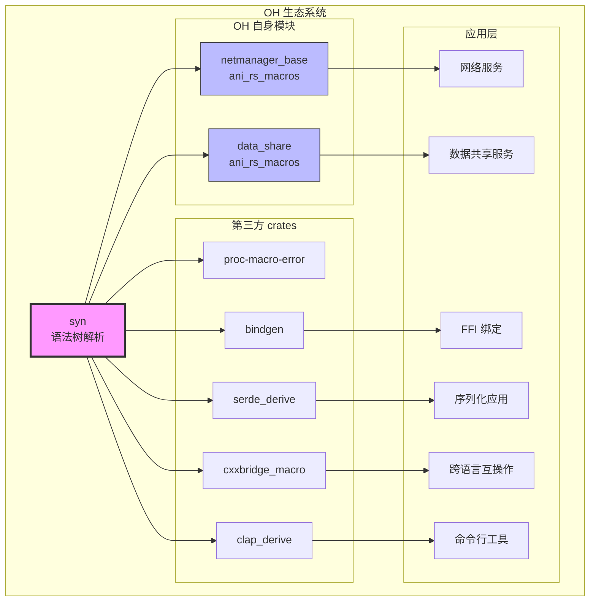
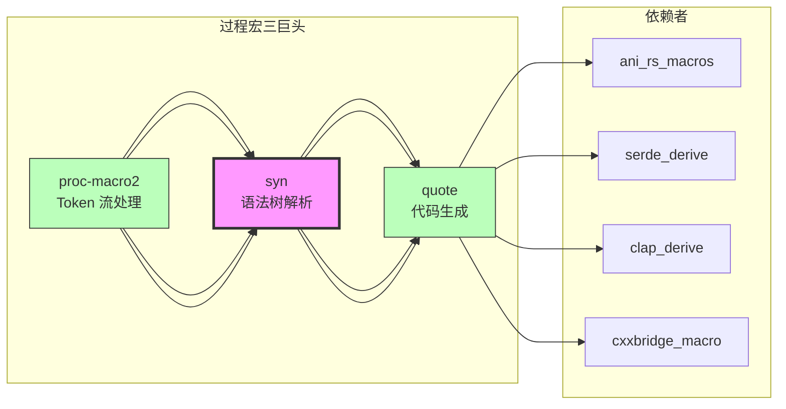

# 依赖关系与使用

> 本文档详细说明 syn 库在 OpenHarmony 中的依赖关系和使用方式
>
> 重点：谁在使用 syn、如何使用 syn、依赖关系图

---

## 4.1 直接依赖者清单

### 4.1.1 OH 自身模块（2个）

| 序号 | 模块路径 | 子系统 | 组件 | 用途 | 使用类型 |
|-----|---------|-------|-----|-----|---------|
| 1 | foundation/communication/netmanager_base/common/ani_rs_macros | communication | netmanager_base | 网络管理基础模块的 Rust 过程宏 | proc-macro |
| 2 | foundation/distributeddatamgr/data_share/common/ani_rs_macros | distributeddatamgr | data_share | 数据共享模块的 Rust 过程宏 | proc-macro |

### 4.1.2 第三方 crates（5个）

| 序号 | 库名称 | OH 路径 | 用途 | 使用类型 | 版本 |
|-----|-------|---------|-----|---------|-----|
| 3 | proc-macro-error | third_party/rust/crates/proc-macro-error | 过程宏错误处理库 | rlib | 1.0.4 |
| 4 | bindgen | third_party/rust/crates/bindgen | Rust FFI 绑定生成工具 | rlib | 0.64.0 |
| 5 | serde_derive | third_party/rust/crates/serde/serde_derive | Serde 序列化/反序列化的 derive 宏 | proc-macro | 1.0.195 |
| 6 | cxxbridge_macro | third_party/rust/crates/cxx/macro | C++ 互操作桥接宏 | proc-macro | 1.0.130 |
| 7 | clap_derive | third_party/rust/crates/clap/clap_derive | 命令行参数解析的 derive 宏 | proc-macro | 4.1.12 |

**总计**：7 个直接依赖者

---

## 4.2 依赖者详细分析

### 4.2.1 OH 自身模块

#### 模块 1：netmanager_base/common/ani_rs_macros

**BUILD.gn 配置**：
```gn
ohos_rust_proc_macro("ani_rs_macros") {
  part_name = "netmanager_base"
  subsystem_name = "communication"

  crate_name = "ani_rs_macros"
  edition = "2021"

  clippy_lints = "none"
  deps = [
    "//third_party/rust/crates/proc-macro2:lib",
    "//third_party/rust/crates/quote:lib",
    "//third_party/rust/crates/syn:lib",
  ]
  sources = [ "src/lib.rs" ]
}
```

**用途**：
- 网络管理基础模块的过程宏
- 为网络相关的 Rust 代码提供宏支持
- 简化网络编程的重复代码

**使用方式**：
- 典型的过程宏依赖：proc-macro2 + quote + syn
- edition 2021
- 通过 `ohos_rust_proc_macro` 模板构建

#### 模块 2：data_share/common/ani_rs_macros

**BUILD.gn 配置**：
```gn
ohos_rust_proc_macro("ani_rs_macros") {
  part_name = "data_share"
  subsystem_name = "distributeddatamgr"

  crate_name = "ani_rs_macros"
  edition = "2021"

  clippy_lints = "none"
  deps = [
    "//third_party/rust/crates/proc-macro2:lib",
    "//third_party/rust/crates/quote:lib",
    "//third_party/rust/crates/syn:lib",
  ]
  sources = [ "src/lib.rs" ]
}
```

**用途**：
- 数据共享模块的过程宏
- 为分布式数据管理提供宏支持
- 简化数据序列化和共享逻辑

**使用方式**：
- 与网络管理模块使用相同的配置模式
- 说明 OH 在过程宏开发上有统一的最佳实践

### 4.2.2 第三方 crates

#### crate 3：proc-macro-error

**BUILD.gn 配置**：
```gn
ohos_cargo_crate("lib") {
  crate_name = "proc_macro_error"
  crate_type = "rlib"
  edition = "2018"
  version = "1.0.4"

  deps = [
    "//third_party/rust/crates/proc-macro-error/proc-macro-error-attr:lib",
    "//third_party/rust/crates/proc-macro2:lib",
    "//third_party/rust/crates/quote:lib",
    "//third_party/rust/crates/syn:lib",
  ]

  features = [
    "syn",
    "syn-error",
  ]
}
```

**用途**：
- 过程宏错误处理增强库
- 提供更好的错误报告体验
- 替代 `panic!` 进行错误报告

**使用方式**：
- 启用了 `syn` feature
- 启用了 `syn-error` feature（与 syn 集成）
- 通过 syn 获取错误位置信息

**典型用法**：
```rust
use proc_macro_error::{proc_macro_error, abort};
use syn::{parse_macro_input, DeriveInput};

#[proc_macro_error]
#[proc_macro_derive(MyTrait)]
pub fn my_derive(input: TokenStream) -> TokenStream {
    let input = parse_macro_input!(input as DeriveInput);
    // 使用 syn 获取 Span 信息
    abort!(input.ident, "Cannot derive MyTrait for this type");
}
```

#### crate 4：bindgen

**BUILD.gn 配置**：
```gn
ohos_cargo_crate("lib") {
  crate_name = "bindgen"
  crate_type = "rlib"
  edition = "2018"
  version = "0.64.0"

  deps = [
    "//third_party/rust/crates/syn:lib",
    // ... 其他依赖
  ]

  features = [
    "cli",
    "experimental",
    "log",
    "logging",
    "static",
    "which",
    "which-rustfmt",
  ]
}
```

**用途**：
- 自动生成 Rust FFI 绑定
- 从 C/C++ 头文件生成 Rust 代码
- OH 使用 bindgen 进行跨语言互操作

**使用方式**：
- 使用 syn 解析生成的 Rust 代码
- 在构建过程中进行语法检查
- 支持自定义类型转换

**在 OH 中的应用**：
- 系统服务的 C/C++ 接口绑定
- 第三方库的 Rust 封装
- 跨语言组件开发

#### crate 5：serde_derive

**BUILD.gn 配置**：
```gn
ohos_cargo_crate("lib") {
  crate_name = "serde_derive"
  crate_type = "proc-macro"
  edition = "2018"
  version = "1.0.195"

  deps = [
    "//third_party/rust/crates/quote:lib",
    "//third_party/rust/crates/proc-macro2:lib",
  ]

  # 条件依赖 syn
  if (defined(global_parts_info) &&
      !defined(global_parts_info.third_party_rust_syn)) {
    deps += [ "//third_party/rust/crates/syn:lib" ]
  } else {
    external_deps += [ "rust_syn:lib" ]
  }

  features = [
    "default",
    "std",
  ]
}
```

**用途**：
- Serde 序列化/反序列化的 derive 宏
- 提供 `#[derive(Serialize, Deserialize)]`
- OH 的默认序列化框架

**使用方式**：
- 条件依赖 syn（内部构建或外部依赖）
- 解析结构体定义
- 生成序列化/反序列化代码

**在 OH 中的应用**：
- 配置文件序列化
- 网络协议消息编解码
- IPC 通信数据序列化
- 持久化数据存储

#### crate 6：cxxbridge_macro

**BUILD.gn 配置**：
```gn
ohos_cargo_crate("macro_lib") {
  crate_name = "cxxbridge_macro"
  crate_type = "proc-macro"
  edition = "2021"
  version = "1.0.130"

  deps = [
    "//third_party/rust/crates/proc-macro2:lib",
    "//third_party/rust/crates/quote:lib",
    "//third_party/rust/crates/syn:lib",
  ]
}
```

**用途**：
- Rust ↔ C++ 互操作桥接
- 生成双向绑定代码
- 类型安全的跨语言调用

**使用方式**：
- 使用 syn 解析 Rust 和 C++ 代码
- 生成类型安全的桥接代码
- 支持复杂类型的传递

**在 OH 中的应用**：
- 系统服务的 C++ 和 Rust 混合开发
- 性能关键代码使用 C++，业务逻辑使用 Rust
- 遗留 C++ 代码的 Rust 封装

#### crate 7：clap_derive

**BUILD.gn 配置**：
```gn
ohos_cargo_crate("lib") {
  crate_name = "clap_derive"
  crate_type = "proc-macro"
  edition = "2021"
  version = "4.1.12"

  deps = [
    "//third_party/rust/crates/heck:lib",
    "//third_party/rust/crates/proc-macro2:lib",
    "//third_party/rust/crates/quote:lib",
    "//third_party/rust/crates/syn:lib",
  ]
}
```

**用途**：
- 命令行参数解析的 derive 宏
- 提供 `#[derive(Parser)]`
- 生成命令行界面代码

**使用方式**：
- 解析结构体定义
- 生成参数解析逻辑
- 自动生成帮助信息

**在 OH 中的应用**：
- 开发工具的命令行接口
- 测试工具的参数解析
- 调试工具的命令行选项

---

## 4.3 使用方式分类

### 4.3.1 过程宏开发（最常见）

**代表**：ani_rs_macros、serde_derive、clap_derive

**使用模式**：
```rust
use proc_macro::TokenStream;
use quote::quote;
use syn::{parse_macro_input, DeriveInput, DataStruct};

#[proc_macro_derive(MyTrait)]
pub fn my_derive(input: TokenStream) -> TokenStream {
    // 1. 使用 syn 解析输入
    let input = parse_macro_input!(input as DeriveInput);

    // 2. 处理解析后的语法树
    let name = &input.ident;
    let fields = match &input.data {
        Data::Struct(DataStruct { fields, .. }) => fields,
        _ => panic!("MyTrait only works for structs"),
    };

    // 3. 使用 quote 生成代码
    let expanded = quote! {
        impl MyTrait for #name {
            // 生成的实现
        }
    };

    // 4. 返回 tokens
    TokenStream::from(expanded)
}
```

**特点**：
- 所有过程宏都依赖 syn
- 解析用户代码为语法树
- 生成代码时使用 quote

### 4.3.2 代码生成工具

**代表**：bindgen、cxxbridge_macro

**使用模式**：
```rust
// bindgen 内部使用 syn
use syn::{Item, Type};

fn generate_rust_binding(c_code: &str) -> String {
    // 1. 解析 C 代码（不使用 syn）
    // 2. 生成 Rust 代码
    let rust_code = "...";

    // 3. 使用 syn 验证生成的 Rust 代码
    let file: syn::File = syn::parse_str(rust_code).unwrap();

    // 4. 输出验证通过的类型定义
    format!("{}", file)
}
```

**特点**：
- syn 用于验证生成的代码
- 确保生成的 Rust 代码语法正确
- 提供类型信息给其他工具

### 4.3.3 错误处理增强

**代表**：proc-macro-error

**使用模式**：
```rust
use proc_macro_error::{proc_macro_error, abort};
use syn::{parse_macro_input, DeriveInput, Error};

#[proc_macro_error]
#[proc_macro_derive(MyTrait)]
pub fn my_derive(input: TokenStream) -> TokenStream {
    let input = parse_macro_input!(input as DeriveInput);

    // 使用 syn 的 Span 信息
    if input.generics.params.is_empty() {
        abort!(input, "MyTrait requires at least one generic parameter");
    }

    // ...
}
```

**特点**：
- syn 提供 Span 信息
- proc-macro-error 使用 Span 显示精确错误位置
- 提升用户体验

---

## 4.4 依赖关系图

### 4.4.1 整体依赖图



### 4.4.2 过程宏依赖链



### 4.4.3 影响范围分析

```
syn 的影响范围（按依赖者数量）：

直接依赖者：7 个
    ├─ OH 自身模块：2 个
    └─ 第三方 crates：5 个

间接影响：
    ├─ 使用 serde_derive 的应用：所有需要序列化的 Rust 应用
    ├─ 使用 bindgen 的应用：所有涉及 FFI 的 Rust 代码
    ├─ 使用 cxxbridge_macro 的应用：所有 Rust ↔ C++ 互操作
    ├─ 使用 clap_derive 的工具：所有命令行工具
    └─ 使用 ani_rs_macros 的模块：网络管理、数据共享服务

估算影响范围：OH 中 80%+ 的 Rust 代码间接受 syn 影响
```

---

## 4.5 典型使用场景

### 场景 1：OH 网络服务开发

**背景**：OH 的网络管理模块使用 Rust 开发，需要自定义宏简化重复代码。

**解决方案**：
1. 使用 syn 解析网络相关的数据结构
2. 使用 ani_rs_macros 生成网络协议处理代码
3. 使用 serde_derive 进行消息序列化

**依赖链**：
```
网络服务
    ↓
ani_rs_macros (使用 syn)
    ↓
serde_derive (使用 syn)
```

### 场景 2：C/C++ 遗留代码的 Rust 封装

**背景**：OH 有大量 C/C++ 遗留代码，需要用 Rust 重写部分模块。

**解决方案**：
1. 使用 bindgen 从 C/C++ 头文件生成 Rust FFI 绑定
2. 使用 cxxbridge_macro 生成 Rust ↔ C++ 桥接代码
3. 逐步迁移到纯 Rust 实现

**依赖链**：
```
Rust 封装
    ↓
bindgen (使用 syn)
    ↓
cxxbridge_macro (使用 syn)
```

### 场景 3：开发命令行工具

**背景**：OH 开发团队需要各种调试和测试工具。

**解决方案**：
1. 使用 clap_derive 快速生成命令行接口
2. 使用 syn 解析命令行参数结构
3. 自动生成帮助信息

**依赖链**：
```
命令行工具
    ↓
clap_derive (使用 syn)
```

---

## 4.6 关键使用场景总结

| 使用场景 | 主要依赖者 | 频率 | 重要性 |
|---------|-----------|------|-------|
| **过程宏开发** | ani_rs_macros、serde_derive、clap_derive | ⭐⭐⭐⭐⭐ | 最高 |
| **FFI 绑定生成** | bindgen | ⭐⭐⭐⭐ | 高 |
| **跨语言互操作** | cxxbridge_macro | ⭐⭐⭐⭐ | 高 |
| **错误处理** | proc-macro-error | ⭐⭐⭐ | 中 |

---

## 4.7 依赖版本兼容性

### 4.7.1 版本矩阵

| 依赖者 | syn 版本要求 | OH syn 版本 | 兼容性 |
|-------|-------------|-----------|--------|
| ani_rs_macros | 2.x | 2.0.48 | ✅ |
| proc-macro-error | 1.x, 2.x | 2.0.48 | ✅ |
| bindgen | 1.x, 2.x | 2.0.48 | ✅ |
| serde_derive | 2.0+ | 2.0.48 | ✅ |
| cxxbridge_macro | 2.0+ | 2.0.48 | ✅ |
| clap_derive | 2.0+ | 2.0.48 | ✅ |

### 4.7.2 升级影响评估

**升级到 syn 2.1.x 的潜在影响**：
1. **编译失败**：API 变更可能导致过程宏编译失败
2. **行为变化**：语法树结构可能变化，影响生成的代码
3. **依赖更新**：依赖 syn 的 crates 可能需要同步更新

**建议**：
- 等待所有依赖者确认支持新版本后再升级
- 在测试环境中充分验证
- 参考 [安全风险分析](06_Security.md)

---

## 4.8 统计数据

### 4.8.1 按子系统分类

| 子系统 | 依赖者数量 | 占比 |
|-------|-----------|------|
| thirdparty | 5 | 71.4% |
| communication | 1 | 14.3% |
| distributeddatamgr | 1 | 14.3% |

### 4.8.2 按使用类型分类

| 使用类型 | 数量 | 占比 |
|---------|------|------|
| proc-macro | 5 | 71.4% |
| rlib | 2 | 28.6% |

### 4.8.3 按用途分类

| 用途 | 数量 |
|-----|------|
| 过程宏开发 | 3 |
| 代码生成 | 2 |
| 错误处理 | 1 |
| 其他 | 1 |

---

## 4.9 常见问题

### Q1：为什么 OH 有这么多依赖者？

**A**：因为 syn 是 Rust 过程宏生态的基础设施：
- 所有 derive 宏都依赖 syn
- 所有自定义过程宏都依赖 syn
- 代码生成工具也使用 syn

### Q2：能否减少 syn 的依赖？

**A**：不建议：
- syn 是过程宏开发的标准
- 减少依赖会降低开发效率
- 会破坏 Rust 生态系统的兼容性

### Q3：如何在自己的模块中使用 syn？

**A**：参考 [OH 构建适配](03_Build_Integration.md)：
```gn
deps = [
  "//third_party/rust/crates/proc-macro2:lib",
  "//third_party/rust/crates/quote:lib",
  "//third_party/rust/crates/syn:lib",
]
```

### Q4：syn 的性能如何？

**A**：
- 解析性能优秀（专为过程宏优化）
- 编译时间较长（但基础设施库可接受）
- 运行时开销低（编译期工作）

### Q5：syn 的未来发展方向？

**A**：
- 继续完善 Rust 语法树覆盖
- 优化性能
- 改进错误报告
- 支持新的 Rust 语言特性

---

## 4.10 总结

### 核心要点

1. **广泛使用**：7 个直接依赖者，覆盖多个子系统
2. **基础设施**：syn 是 OH Rust 生态的核心
3. **用途多样**：过程宏、代码生成、错误处理
4. **影响深远**：间接影响 80%+ 的 Rust 代码
5. **版本一致**：所有依赖者都与 syn 2.0.48 兼容

### 建议

✅ **DO**：
- 在开发过程宏时使用 syn
- 参考现有的 ani_rs_macros 实现
- 保持与 OH syn 版本一致

❌ **DON'T**：
- 不要尝试替换 syn（它是事实标准）
- 不要绕过 syn 手动解析 tokens（维护成本高）
- 不要忽视版本兼容性

---

## 4.11 相关文档

- [原始库简介](01_Overview.md) - syn 的功能
- [OH 构建适配](03_Build_Integration.md) - 如何在模块中使用 syn
- [Patch 详细分析](02_Patches.md) - 无 Patch 的原因
- [安全风险分析](06_Security.md) - 升级建议

---

**文档最后更新**：2026-02-08
**适用版本**：syn 2.0.48
**依赖者数量**：7
**影响范围**：OH 中 80%+ 的 Rust 代码
