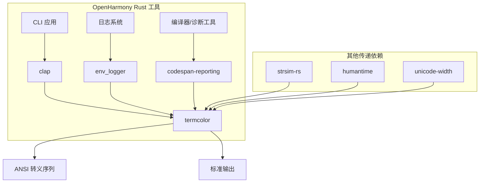

# 依赖关系与使用

## 直接依赖者

termcolor 作为 OpenHarmony 中 Rust 命令行工具的基础设施组件，被以下模块直接依赖：

| 序号 | 模块名称 | BUILD.gn 路径 | 用途 | 依赖类型 |
|------|---------|--------------|------|---------|
| 1 | **clap** | //third_party/rust/crates/clap/BUILD.gn | 命令行参数解析的颜色输出 | 直接依赖 |
| 2 | **env_logger** | //third_party/rust/crates/env_logger/BUILD.gn | 日志格式化器的颜色支持 | 直接依赖 |
| 3 | **codespan-reporting** | //third_party/rust/crates/codespan/codespan-reporting/BUILD.gn | 诊断信息的语法高亮 | 直接依赖 |
| 4 | **strsim-rs** | //third_party/rust/crates/strsim-rs/BUILD.gn | 字符串相似度（可能用于错误提示） | 传递依赖 |
| 5 | **humantime** | //third_party/rust/crates/humantime/BUILD.gn | 人性化时间解析 | 传递依赖 |
| 6 | **unicode-width** | //third_party/rust/crates/unicode-width/BUILD.gn | Unicode 字符宽度 | 传递依赖 |

**注**：strsim-rs、humantime、unicode-width 可能是通过其他库的传递依赖引入的。

## 依赖关系图



## 详细使用场景

### 场景 1: 命令行工具 (clap)

clap 是 Rust 生态中最流行的命令行参数解析库，被多个 OpenHarmony CLI 工具使用：

**典型使用模式**：

```rust
use clap::{Arg, Command};
use termcolor::{Color, ColorChoice, ColorSpec, StandardStream, WriteColor};

fn main() {
    let matches = Command::new("myapp")
        .arg(Arg::new("verbose")
            .short('v')
            .long("verbose"))
        .get_matches();

    // 彩色错误信息
    if let Err(e) = run() {
        let mut stderr = StandardStream::stderr(ColorChoice::Auto);
        stderr.set_color(ColorSpec::new().set_fg(Some(Color::Red))).unwrap();
        writeln!(&mut stderr, "Error: {}", e).unwrap();
    }
}
```

**在 OH 中的应用**：

- `bm` (bundle manager) - 包管理工具
- `aa` (ability agent) - 能力管理工具
- `hidumper` - 系统信息转储工具

### 场景 2: 日志系统 (env_logger)

env_logger 是基于 termcolor 实现的日志格式化库，为 Rust 应用提供带颜色的日志输出：

**典型使用模式**：

```rust
use env_logger;
use log::{info, warn, error};

fn main() {
    env_logger::init();
    
    info!("This is an info message");
    warn!("This is a warning message");
    error!("This is an error message");
}
```

**日志颜色约定**：

| 日志级别 | 颜色 | 用途 |
|---------|------|------|
| ERROR | Red | 错误和失败 |
| WARN | Yellow | 警告 |
| INFO | Green | 信息 |
| DEBUG | Blue | 调试信息 |
| TRACE | Cyan | 跟踪信息 |

**在 OH 中的应用**：

- Rust 组件的运行时日志
- 开发调试输出
- CI/CD 构建日志

### 场景 3: 诊断高亮 (codespan-reporting)

codespan-reporting 用于显示编译器风格的错误信息和诊断数据：

**典型使用模式**：

```rust
use codespan_reporting::term::{self, termcolor};
use codespan_reporting::files::SimpleFiles;

fn display_error<'a>(files: &'a SimpleFiles<&'a str, &'a str>) {
    let writer = termcolor::StandardStream::stderr(
        termcolor::ColorChoice::Always
    );
    
    let config = term::Configuration::default();
    term::emit(&mut writer.lock(), &config, files, &diagnostic).unwrap();
}
```

**在 OH 中的应用**：

- Rust 编译器错误显示
- 静态分析工具输出
- 语法检查器结果

## 静态链接说明

termcolor 在 OpenHarmony 中采用**静态链接**方式集成：

| 链接类型 | 说明 |
|---------|------|
| **静态链接** | termcolor 编译为 .rlib，被链接到最终的二进制文件中 |
| **无动态依赖** | termcolor 不产生动态链接库 (.so) |
| **重复链接安全** | Rust 编译器处理重复的静态库链接 |

**链接示意**：

```
+------------------+
|   CLI Binary     |
|                  |
| +--------------+ |
| | clap (rlib)  | |
| |              | |
| | +----------+ | |
| | |termcolor | | |
| | | (rlib)   | | |
| | +----------+ | |
| +--------------+ |
| +--------------+ |
| |env_logger   | |
| | (rlib)      | |
| |              | |

| +----------+ | |
| |termcolor | | |
| +----------+ | |
| +--------------+ |
+------------------+
```

## 头文件引用方式

termcolor 作为 Rust 库，通过 Cargo 依赖管理进行引用：

```toml
# Cargo.toml
[dependencies]
termcolor = "1.2.0"  # OH 版本与上游一致
```

```rust
// Rust 源代码
use termcolor::{Color, ColorChoice, ColorSpec, StandardStream, WriteColor};
```

**注意**：termcolor 不导出 C/FFI 头文件给 C/C++ 代码使用。它是纯 Rust 库，仅供 Rust 代码依赖使用。

## 使用注意事项

### 1. ColorChoice 选择

```rust
// 推荐：使用 Auto 让库自动检测
let stream = StandardStream::stdout(ColorChoice::Auto);

// 强制颜色输出（CI 环境中可能不需要）
let stream = StandardStream::stdout(ColorChoice::Always);

// 禁用颜色输出
let stream = StandardStream::stdout(ColorChoice::Never);
```

**建议**：除非有特殊需求，否则使用 `ColorChoice::Auto`。

### 2. 多线程使用

termcolor 的 `BufferWriter` 设计用于多线程环境：

```rust
use termcolor::{BufferWriter, ColorChoice};

fn thread_worker(id: usize) {
    let bufwtr = BufferWriter::stderr(ColorChoice::Auto);
    let mut buffer = bufwtr.buffer();
    
    // 每个线程独立操作缓冲区
    buffer.set_color(/* ... */).unwrap();
    writeln!(&mut buffer, "Thread {}: done", id).unwrap();
    
    // 线程安全输出
    bufwtr.print(&buffer).unwrap();
}
```

### 3. 错误处理

```rust
use std::io::{self, Write};
use termcolor::{StandardStream, WriteColor};

fn safe_write() -> io::Result<()> {
    let mut stdout = StandardStream::stdout(ColorChoice::Auto);
    
    // 颜色操作可能失败（如终端不支持）
    if stdout.supports_reset() {
        stdout.set_color(/* ... */)?;
    }
    
    writeln!(&mut stdout, "Message")?;
    
    // 重置颜色状态
    stdout.reset()?;
    
    Ok(())
}
```

## 依赖管理最佳实践

### 版本锁定

建议在 Cargo.toml 中锁定 termcolor 版本：

```toml
[dependencies]
termcolor = "=1.2.0"  # 使用精确版本
```

这样可以确保：
- 所有依赖者使用相同版本
- 避免因版本差异导致的兼容性问题
- 便于问题追踪

### 升级流程

1. 更新 Cargo.toml 版本号
2. 构建验证
3. 运行依赖者的测试
4. 提交变更

## 性能考量

termcolor 是一个轻量级库，性能开销极小：

| 操作 | 开销 |
|------|------|
| ANSI 转义序列生成 | 可忽略（字符串格式化） |
| 缓冲区写入 | 标准 IO 开销 |
| 多线程同步 | 无（每线程独立 Buffer） |

**性能建议**：
- 使用 `Buffer` 进行批量输出
- 多线程场景使用 `BufferWriter`
- 避免频繁的 `set_color` 调用（每批次一次即可）
