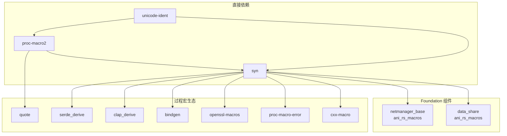

# OpenHarmony 中的使用

## 依赖关系总览

**unicode-ident** 是 OpenHarmony Rust 生态系统的**基础依赖库**，通过 `proc-macro2` 和 `syn` 被广泛间接使用。

---

## 直接依赖者

### 1. proc-macro2

**BUILD.gn 路径**: `//third_party/rust/crates/proc-macro2/BUILD.gn`

```gn
deps = [
    "//third_party/rust/crates/unicode-ident:lib",
]
```

**Cargo.toml**:
```toml
[dependencies]
unicode-ident = "1.0"
```

**用途**:
- 在 TokenStream 实现中验证标识符字符
- 支持 `Ident` 类型的构造和验证
- 为过程宏提供 Unicode 标识符支持

### 2. syn

**BUILD.gn 路径**: `//third_party/rust/crates/syn/BUILD.gn`

```gn
deps = [
    "//third_party/rust/crates/unicode-ident:lib",
    "//third_party/rust/crates/proc-macro2:lib",
    "//third_party/rust/crates/quote:lib",
]
```

**Cargo.toml**:
```toml
[dependencies]
unicode-ident = "1"
```

**用途**:
- 在 Rust 语法解析中识别有效标识符
- 用于解析结构体、函数、变量名等
- Derive 宏的核心依赖

---

## 间接依赖者（通过 syn）

### Foundation 系统组件

| 模块 | BUILD.gn 路径 | 用途 |
|------|--------------|------|
| **netmanager_base** | `foundation/communication/netmanager_base/common/ani_rs_macros/BUILD.gn` | 网络管理组件的 ANI 宏支持 |
| **data_share** | `foundation/distributeddatamgr/data_share/common/ani_rs_macros/BUILD.gn` | 数据共享组件的 ANI 宏支持 |

**说明**: 这些组件使用 `ani_rs_macros`，后者依赖 syn 进行代码生成。

### 第三方库（过程宏类）

| Crate | BUILD.gn 路径 | 用途 |
|-------|--------------|------|
| **serde_derive** | `third_party/rust/crates/serde/serde_derive/BUILD.gn` | 序列化/反序列化的 derive 宏 |
| **clap_derive** | `third_party/rust/crates/clap/clap_derive/BUILD.gn` | 命令行参数解析的 derive 宏 |
| **openssl-macros** | `third_party/rust/crates/rust-openssl/openssl-macros/BUILD.gn` | OpenSSL 的 derive 宏 |
| **proc-macro-error** | `third_party/rust/crates/proc-macro-error/BUILD.gn` | 过程宏错误处理 |
| **proc-macro-error-attr** | `third_party/rust/crates/proc-macro-error/proc-macro-error-attr/BUILD.gn` | 错误处理属性宏 |
| **cxx-macro** | `third_party/rust/crates/cxx/macro/BUILD.gn` | C++ 互操作性宏 |
| **cxx-gen-cmd** | `third_party/rust/crates/cxx/gen/cmd/BUILD.gn` | C++ 代码生成 |
| **bindgen** | `third_party/rust/crates/bindgen/bindgen/BUILD.gn` | C/C++ 头文件绑定生成器 |

### 其他依赖

| Crate | BUILD.gn 路径 | 用途 |
|-------|--------------|------|
| **quote** | `third_party/rust/crates/quote/BUILD.gn` | 准引用宏支持（依赖 proc-macro2） |

---

## 依赖关系图

### 简化依赖图



### 完整依赖链示例

#### serde_derive 依赖链

```
application
    ↓
serde = { features = ["derive"] }
    ↓
serde_derive (proc-macro)
    ↓
syn (解析 Rust 语法)
    ↓
├─ unicode-ident (标识符验证) ← 【当前库】
├─ proc-macro2 (TokenStream 包装)
│   ↓
│   unicode-ident ← 【当前库】
└─ quote (代码生成)
```

#### clap_derive 依赖链

```
CLI 应用
    ↓
clap = { features = ["derive"] }
    ↓
clap_derive (proc-macro)
    ↓
syn (解析属性宏)
    ↓
├─ unicode-ident ← 【当前库】
├─ proc-macro2
│   ↓
│   unicode-ident ← 【当前库】
└─ quote
```

---

## 使用场景分析

### 场景 1: 序列化框架（serde）

```rust
// 应用代码
use serde::{Serialize, Deserialize};

#[derive(Serialize, Deserialize)]  // ← 使用 serde_derive
struct UserData {
    name: String,
    age: u32,
}
```

**unicode-ident 的作用**:
- `serde_derive` 使用 syn 解析 `UserData` 结构体定义
- syn 使用 unicode-ident 验证 `UserData`、`name`、`age` 是否为有效标识符

### 场景 2: 命令行解析（clap）

```rust
use clap::Parser;

#[derive(Parser)]  // ← 使用 clap_derive
struct Args {
    #[arg(short, long)]
    name: String,
}
```

**unicode-ident 的作用**:
- `clap_derive` 解析 `Args` 和属性宏
- 验证所有标识符的合法性

### 场景 3: C++ 互操作（cxx）

```rust
#[cxx::bridge]
mod ffi {
    unsafe extern "C++" {
        type MyClass;
        fn method(self: Pin<&mut MyClass>);
    }
}
```

**unicode-ident 的作用**:
- `cxx-macro` 解析 bridge 模块中的 Rust 标识符
- 确保跨语言绑定的标识符有效性

### 场景 4: Foundation 组件（netmanager_base）

```rust
// ani_rs_macros 生成的代码
#[derive(AniInterface)]  // ← 使用 ani_rs_macros
pub struct NetworkManager {
    // ...
}
```

**unicode-ident 的作用**:
- `ani_rs_macros` 使用 syn 解析组件定义
- 生成 JNI/ANI 绑定代码时验证标识符

---

## 链接方式

### 静态链接

所有 Rust crate 在 OpenHarmony 中均以**静态链接**方式使用：

```
unicode-ident (rlib)
    ↓ 静态链接
proc-macro2 (rlib)
    ↓ 静态链接
syn (rlib)
    ↓ 静态链接
serde_derive (proc-macro)
    ↓ 编译时展开
应用二进制
```

### 过程宏的特殊性

过程宏 crate（如 serde_derive）在编译时执行：

1. **编译阶段**: 编译器加载 proc-macro crate
2. **展开阶段**: 过程宏代码执行，生成新代码
3. **运行时**: 生成的代码执行，过程宏代码不包含在最终二进制中

**unicode-ident 的角色**:
- 在编译阶段被过程宏代码调用
- 用于解析输入的 Rust 代码
- 不进入最终运行时二进制

---

## 头文件引用

### Rust Crate 无头文件

Rust 库不使用头文件，依赖通过以下方式声明：

```rust
// 在 Cargo.toml 中声明（上游方式）
[dependencies]
unicode-ident = "1"

// 在 BUILD.gn 中声明（OH 方式）
deps = ["//third_party/rust/crates/unicode-ident:lib"]
```

### 使用方式

```rust
// 上游 crate 中使用（如 proc-macro2）
use unicode_ident::is_xid_start;

if is_xid_start(ch) {
    // 字符可以作为标识符起始
}
```

---

## 影响范围评估

### 关键性评级: 🔴 极高

**原因**:
1. **基础设施级别**: 是 proc-macro2 和 syn 的基础依赖
2. **广泛传播**: 通过 derive 宏影响几乎所有 Rust 代码
3. **编译期必需**: 没有它，无法使用任何过程宏

### 变更影响分析

| 变更类型 | 影响范围 | 风险等级 |
|----------|----------|----------|
| **API 变更** | 所有 syn/proc-macro2 用户 | 🔴 极高 |
| **性能优化** | 编译速度提升 | 🟢 低 |
| **Unicode 更新** | 标识符规则变更 | 🟡 中 |
| **Bug 修复** | 编译行为修正 | 🟢 低 |

---

## 依赖统计

### 直接依赖统计

- **直接依赖者数量**: 2
  - proc-macro2
  - syn

### 间接依赖统计

- **通过 proc-macro2**: 10+ crates
- **通过 syn**: 20+ crates
- **Foundation 组件**: 2+ (netmanager_base, data_share)

### 估算影响范围

假设 OpenHarmony 中有 **100 个 Rust 组件/应用**:
- **使用 serde**: ~80 个（影响 80 个组件）
- **使用 clap**: ~30 个（影响 30 个组件）
- **使用 bindgen**: ~20 个（影响 20 个组件）
- **使用 cxx**: ~10 个（影响 10 个组件）

**总计**: unicode-ident 间接影响约 **90%** 的 Rust 代码。

---

## 维护建议

### 升级策略

1. **保守策略**（推荐）
   - 仅在必要时升级（如安全修复）
   - 优先测试 proc-macro2 和 syn
   - 验证 Foundation 组件构建

2. **测试矩阵**
   ```
   unicode-ident 升级
       ↓
   proc-macro2 测试
       ↓
   syn 测试
       ↓
   serde_derive 测试
       ↓
   Foundation 组件测试
   ```

### 监控清单

- [ ] 上游 Unicode 版本更新公告
- [ ] proc-macro2 版本兼容性
- [ ] syn 版本兼容性
- [ ] Foundation 组件构建状态

---

## 总结

| 指标 | 值 |
|------|-----|
| **直接依赖者** | 2 (proc-macro2, syn) |
| **间接依赖者** | 30+ crates |
| **Foundation 组件使用者** | 2+ (netmanager_base, data_share) |
| **影响范围** | ~90% 的 Rust 代码 |
| **关键性** | 🔴 极高（基础设施级别） |
| **链接方式** | 静态链接（rlib） |

**unicode-ident 是 OpenHarmony Rust 生态的基石**，虽然它不直接出现在应用代码中，但通过 proc-macro 系统支撑着整个 Rust 开发体验。

---

*返回: [README](README.md) | [概览](01_Overview.md) | [Patch分析](02_Patches.md) | [BUILD集成](03_Build_Integration.md)*
