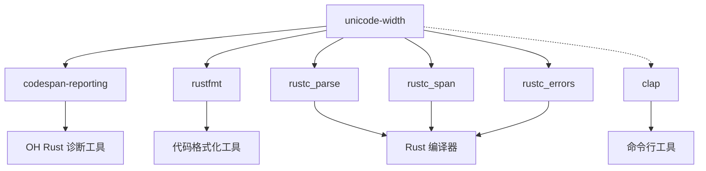
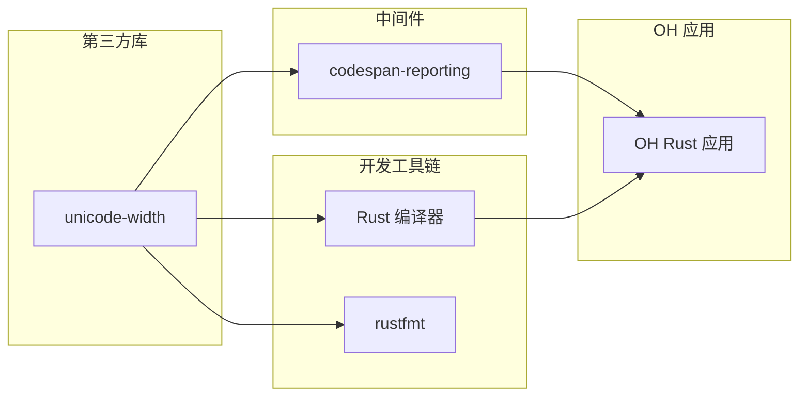

# 04 - 依赖关系与使用

## 概述

unicode-width 在 OpenHarmony 中被多个 Rust 组件依赖，主要用于文本宽度计算和格式化对齐。

## 直接依赖者（GN 构建系统）

### 依赖清单

| 模块 | BUILD.gn 路径 | 用途 |
|------|--------------|------|
| **codespan-reporting** | `//third_party/rust/crates/codespan/codespan-reporting/BUILD.gn` | 诊断报告的美化打印 |

### codespan-reporting 详解

**BUILD.gn 配置**：
```gn
ohos_cargo_crate("lib") {
    crate_name = "codespan_reporting"
    # ...
    deps = [
        "//third_party/rust/crates/termcolor:lib",
        "//third_party/rust/crates/unicode-width:lib",
    ]
}
```

**使用场景**：
- 错误消息的对齐和美化
- 源代码位置标记（`^~~~`）的精确定位
- 多语言错误信息的格式化

**示例**：
```rust
// codespan-reporting 使用 unicode-width 计算文本宽度
// 确保错误标记能正确对齐到源代码列
error[E0001]: 类型不匹配
   --> src/main.rs:10:5
    |
10  |     let x: i32 = "hello";
    |                  ^^^^^^^ 期望 i32，找到 &str
```

## 间接使用者（Cargo.toml 依赖）

在 OpenHarmony 的 Rust 工具链中，以下组件依赖 unicode-width：

### Rust 编译器组件

| 模块 | Cargo.toml 路径 | 用途 |
|------|----------------|------|
| **rustfmt** | `//third_party/rust/rust/src/tools/rustfmt/Cargo.toml` | 代码格式化对齐 |
| **rustc_parse** | `//third_party/rust/rust/compiler/rustc_parse/Cargo.toml` | 解析错误消息格式化 |
| **rustc_span** | `//third_party/rust/rust/compiler/rustc_span/Cargo.toml` | 源码位置显示 |
| **rustc_errors** | `//third_party/rust/rust/compiler/rustc_errors/Cargo.toml` | 错误消息格式化 |

### 详细说明

#### rustfmt
```toml
# Cargo.toml
unicode-width = "0.1"
```
**用途**：
- 计算代码缩进宽度
- 处理包含 Unicode 字符的代码对齐
- 确保格式化后的代码在不同终端正确显示

#### rustc_parse
```toml
# Cargo.toml
unicode-width = "0.1.4"
```
**用途**：
- 语法错误提示的位置标记
- 解析错误消息的格式化输出

#### rustc_span
```toml
# Cargo.toml
unicode-width = "0.1.4"
```
**用途**：
- 源码位置的显示对齐
- 诊断信息的列计算

#### rustc_errors
```toml
# Cargo.toml
unicode-width = "0.1.4"
```
**用途**：
- 错误消息的美观输出
- 处理多语言错误信息

### 其他工具

| 模块 | Cargo.toml 路径 | 用途 | 依赖类型 |
|------|----------------|------|----------|
| **clap** | `//third_party/rust/crates/clap/Cargo.toml` | 命令行帮助文本格式化 | 可选依赖 |

```toml
# clap Cargo.toml
unicode-width = { version = "0.1.9", optional = true }
```

**用途**：
- 帮助信息的列对齐
- 参数说明的格式化

## 依赖关系图

### 简化依赖图



### 在 OH 中的位置



## 使用场景分析

### 场景一：编译错误提示

```rust
// Rust 编译器生成错误信息
fn main() {
    let x = "你好";  // 中文字符
         // ^^^^^^ unicode-width 确保这个标记对齐正确
}
```

**unicode-width 的作用**：
- 计算 "你好" 的显示宽度（4 列）
- 确保 `^` 标记位置准确

### 场景二：诊断报告

```rust
// codespan-reporting 生成的诊断
  ┌─> src/test.rs:3:9
  │
3 │     let x = "测试字符串";
  │             ^^^^^^^^^^^^
  │
  = 帮助: 这里是帮助信息
```

**unicode-width 的作用**：
- 计算源码行的显示宽度
- 绘制正确的边框和标记

### 场景三：代码格式化

```rust
// rustfmt 格式化后的代码
fn example() {
    let 变量 = "值";  // 中文变量名
    let x    = "y";   // 对齐
}
```

**unicode-width 的作用**：
- 计算中文字符宽度
- 确保等号对齐

## 依赖统计

### 按类型统计

| 类型 | 数量 | 模块 |
|------|------|------|
| GN 直接依赖 | 1 | codespan-reporting |
| Cargo 依赖 | 5 | rustfmt, rustc_parse, rustc_span, rustc_errors, clap |
| 可选依赖 | 1 | clap |

### 按用途统计

| 用途 | 模块数量 | 代表模块 |
|------|----------|----------|
| 错误格式化 | 3 | rustc_errors, rustc_parse, codespan-reporting |
| 源码定位 | 1 | rustc_span |
| 代码格式化 | 1 | rustfmt |
| CLI 工具 | 1 | clap |

## 接口使用方式

### Trait 接口

所有依赖者都通过以下 trait 使用 unicode-width：

```rust
use unicode_width::UnicodeWidthStr;

// 计算字符串宽度
let width = text.width();

// CJK 上下文
let cjk_width = text.width_cjk();
```

```rust
use unicode_width::UnicodeWidthChar;

// 计算单个字符宽度
if let Some(width) = ch.width() {
    // 使用宽度
}
```

### 典型使用模式

```rust
// 模式一：计算行宽进行对齐
fn pad_to_width(s: &str, target_width: usize) -> String {
    let current_width = s.width();
    let padding = target_width.saturating_sub(current_width);
    format!("{}{}", s, " ".repeat(padding))
}

// 模式二：计算列位置
fn column_to_byte_index(line: &str, target_column: usize) -> usize {
    let mut current_col = 0;
    for (idx, ch) in line.char_indices() {
        if current_col >= target_column {
            return idx;
        }
        current_col += ch.width().unwrap_or(0);
    }
    line.len()
}
```

## 依赖管理建议

### 版本一致性

确保所有依赖者使用兼容的版本：

```toml
# 推荐所有模块使用相同版本
unicode-width = "0.1.14"
```

### Feature 一致性

- 默认启用 `cjk` feature（用于中文字符）
- 如需减小体积，可考虑统一禁用

### 升级策略

升级 unicode-width 时，需要：
1. 检查 API 兼容性
2. 验证所有依赖者编译通过
3. 测试文本显示效果

## 总结

| 项目 | 数据 |
|------|------|
| GN 直接依赖 | 1 个 |
| Cargo 依赖 | 5 个 |
| 主要使用场景 | 编译错误格式化、代码格式化 |
| 核心用途 | 计算文本显示宽度 |

unicode-width 虽然是小众库，但在 Rust 工具链中扮演重要角色。在 OpenHarmony 中，它主要用于：
1. 支持中文等 CJK 字符的编译错误提示
2. 确保诊断信息的正确对齐
3. 支持代码格式化工具处理 Unicode 代码
