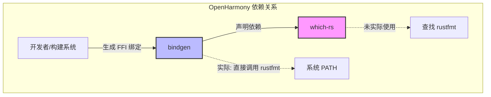

# OH 中的依赖关系与使用

## 概述

经过全面搜索 OpenHarmony 代码库，**仅发现 1 个模块**直接依赖 `which-rs`：

| 模块 | BUILD.gn 路径 | 用途 |
|------|--------------|------|
| bindgen | `//third_party/rust/crates/bindgen/bindgen/BUILD.gn` | Rust FFI 绑定生成器 |

## 依赖者详情

### bindgen

**模块信息**:
- **名称**: bindgen
- **版本**: 0.64.0 (OH 集成版本)
- **上游**: https://github.com/rust-lang/rust-bindgen
- **功能**: 自动生成 C/C++ 头文件的 Rust FFI 绑定代码

**BUILD.gn 依赖声明**:
```gn
# third_party/rust/crates/bindgen/bindgen/BUILD.gn
rust_crate("bindgen") {
    # ... 其他配置 ...
    
    deps = [
        # ... 其他依赖 ...
        "//third_party/rust/crates/which-rs:lib",  # 第41行
    ]
    
    # 特性标志
    features = [
        "which",
        "which-rustfmt",
        # ... 其他特性 ...
    ]
}
```

**which-rs 预期用途**:
- 在 bindgen 的 `which-rustfmt` 特性下，用于查找 `rustfmt` 可执行文件的路径
- 以便在生成 Rust 绑定代码后自动格式化输出

**实际使用情况**:

经过代码审查发现：

```rust
// bindgen/lib.rs 第943-954行
pub fn rustfmt_path(&self) -> Option<PathBuf> {
    self.opts.rustfmt_path.as_ref().map(|p| p.clone())
}

// bindgen/lib.rs 第1627-1635行
fn rustfmt_generated_string(...)
    // ...
    let rustfmt = command
        .arg("rustfmt")  // 直接使用字符串，非 which 查找
        // ...
```

**关键发现**: 当前 OpenHarmony 的 bindgen 实现中，**并未实际使用 `which-rs`**。代码直接调用 `"rustfmt"` 字符串，依赖系统 PATH 环境变量查找可执行文件。

## 依赖关系图



## 历史背景

### which-rs 在 bindgen 中的演变

| 版本 | which-rs 使用情况 | 说明 |
|------|-------------------|------|
| 0.60.x 之前 | ✅ 活跃使用 | 用于查找 rustfmt 可执行文件 |
| 0.64.0 (OH) | ⚠️ 声明但未使用 | BUILD.gn 保留依赖，但代码已简化 |
| 0.70.1+ | ❌ 已移除 | CHANGELOG: "Remove which and lazy-static dependencies" |

### 相关 CHANGELOG 记录

```
# bindgen/CHANGELOG.md 摘录

## 0.70.1
- Remove which and lazy-static dependencies (#2809, #2817)

## 0.60.0
- Add which-rustfmt feature to avoid which dependency (#1615, #1625)
```

### 结论

**OpenHarmony 中的 `which-rs` 是一个遗留依赖**：

1. bindgen 的 BUILD.gn 中声明了 `which-rs` 依赖
2. 启用了 `which` 和 `which-rustfmt` 特性
3. 但实际源码中已不使用 `which` crate 的 API
4. 这是版本迁移过程中的遗留，新版 bindgen 已完全移除 which 依赖

## 潜在优化建议

### 方案 1: 移除遗留依赖（推荐）

验证 bindgen 源码确实未使用 which 后，可从 BUILD.gn 移除：

```gn
# bindgen/BUILD.gn
rust_crate("bindgen") {
    deps = [
        # 移除: "//third_party/rust/crates/which-rs:lib",
        # ...
    ]
    
    features = [
        # 移除: "which",
        # 移除: "which-rustfmt",
        # ...
    ]
}
```

**优点**:
- 减少构建依赖
- 缩短构建时间
- 清理技术债务

**注意**: 需完整验证 bindgen 的所有代码路径确实未使用 which。

### 方案 2: 保留现状

**适用场景**: 如果计划升级 bindgen 到新版，新版已移除 which 依赖。

**优点**:
- 无需修改当前配置
- 升级后自动清理

### 方案 3: 启用 which 功能

如果 bindgen 的代码生成需要精确定位 rustfmt，可修改 bindgen 源码使用 which：

```rust
// 修改后的 rustfmt_path 实现
use which::which;

pub fn rustfmt_path(&self) -> Option<PathBuf> {
    self.opts.rustfmt_path.clone()
        .or_else(|| which("rustfmt").ok())
}
```

**优点**:
- 更精确地查找 rustfmt 路径
- 提供更好的错误信息

## 使用场景示例

虽然当前 OH 代码中未直接使用 which-rs，以下是该库的典型使用场景：

### 场景 1: 构建工具查找编译器

```rust
use which::which;

fn find_llvm_tools() -> Result<PathBuf, Error> {
    // 查找 clang 编译器
    let clang = which("clang")
        .or_else(|_| which("clang-14"))
        .or_else(|_| which("clang-15"))?;
    
    println!("Using clang at: {:?}", clang);
    Ok(clang)
}
```

### 场景 2: 运行时检查工具可用性

```rust
use which::which;

fn check_dev_tools() {
    let tools = vec!["git", "python3", "ninja", "gn"];
    
    for tool in &tools {
        match which(tool) {
            Ok(path) => println!("✓ {} found at {:?}", tool, path),
            Err(_) => println!("✗ {} not found in PATH", tool),
        }
    }
}
```

### 场景 3: 跨平台工具路径处理

```rust
use which::which;
use std::process::Command;

fn run_tool(tool_name: &str, args: &[&str]) -> std::io::Result<Output> {
    let tool_path = which(tool_name)
        .map_err(|e| std::io::Error::new(
            std::io::ErrorKind::NotFound,
            format!("Tool '{}' not found in PATH: {}", tool_name, e)
        ))?;
    
    Command::new(tool_path)
        .args(args)
        .output()
}
```

## 总结

| 项目 | 内容 |
|------|------|
| **直接依赖者数量** | 1 个 (bindgen) |
| **实际使用者数量** | 0 个 (遗留依赖) |
| **主要用途** | 原定用于查找 rustfmt (未实际使用) |
| **建议操作** | 考虑从 bindgen BUILD.gn 中移除 |

which-rs 在 OpenHarmony 当前状态下是一个**待清理的遗留依赖**。该库本身设计良好，但 bindgen 的代码演进使其不再需要此功能。建议在未来的 bindgen 升级或依赖清理工作中移除该依赖。
