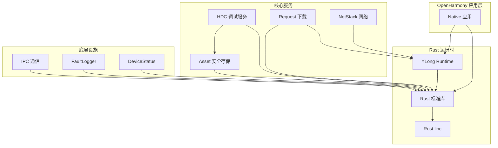

# 依赖关系与使用

本文档说明 Rust 工具链在 OpenHarmony 中的使用方式和依赖关系。

## 使用场景概述

Rust 工具链在 OpenHarmony 中扮演 **基础设施组件** 的角色，主要用于：

1. **构建 OpenHarmony 系统** - 为 OH 系统组件提供 Rust 编译能力
2. **开发 Rust 应用** - 为 OHOS 设备交叉编译 Rust 程序
3. **集成第三方 Rust crate** - 提供常用 Rust 库的 OHOS 支持
4. **系统级开发** - 性能敏感的底层模块开发

## 直接依赖者

### 核心子系统

| 模块 | BUILD.gn 路径 | 用途 | Rust 使用方式 |
|-----|--------------|------|--------------|
| **HDC** | `developtools/hdc/hdc_rust/` | 调试客户端 | 完整 Rust 重写 |
| **Asset** | `base/security/asset/` | 资产安全存储 | 加密模块 |
| **Request** | `base/request/request/` | 下载管理器 | HTTP 客户端 |
| **FaultLogger** | `base/hiviewdfx/faultloggerd/` | 故障日志 | 栈展开、demangle |
| **DeviceStatus** | `base/msdp/device_status/` | 设备状态服务 | 事件处理 |
| **IPC** | `foundation/communication/ipc/` | 进程间通信 | Rust 绑定 |
| **NetStack** | `foundation/communication/netstack/` | 网络协议栈 | HTTP/WebSocket |
| **YLong Runtime** | `commonlibrary/rust/` | 异步运行时 | 完整库 |
| **Telephony** | `base/telephony/` | 电话服务 | ANI 绑定 |

### 详细使用场景

#### 1. HDC (Huawei Debug Client)

```
路径: developtools/hdc/hdc_rust/
用途: 设备调试通信
Rust 组件:
  - hdcd (守护进程)
  - hdc (客户端工具)
  - libhdc (共享库)
依赖库:
  - cxx (C++/Rust 互操作)
  - clap (命令行解析)
  - rand (随机数)
```

#### 2. Asset (资产安全服务)

```
路径: base/security/asset/
用途: 安全存储敏感数据
Rust 组件:
  - libasset_crypto (加密模块)
  - asset_access (访问控制)
依赖库:
  - rust-openssl (加密)
  - serde (序列化)
  - libc (系统调用)
```

#### 3. Request (下载管理)

```
路径: base/request/request/
用途: HTTP 下载管理
Rust 组件:
  - download_engine (下载引擎)
  - cache_service (缓存服务)
依赖库:
  - ylong_http (HTTP 客户端)
  - serde_json (JSON 处理)
```

#### 4. FaultLogger (故障日志)

```
路径: base/hiviewdfx/faultloggerd/
用途: 收集和分析故障信息
Rust 组件:
  - rustc_demangle (符号 demangle)
  - stacktrace (栈展开)
  - panic_handler (panic 处理)
依赖库:
  - libc (系统调用)
  - backtrace (栈回溯)
```

#### 5. YLong Runtime (异步运行时)

```
路径: commonlibrary/rust/ylong_runtime/
用途: 异步 I/O 运行时
Rust 组件:
  - ylong_runtime (核心运行时)
  - ylong_http (HTTP 客户端)
  - ylong_time (时间工具)
依赖库:
  - mio (I/O 多路复用)
  - tokio (async 框架基础)
```

## 依赖关系图



## 第三方 Crate 使用情况

### 高频使用 Crate

| Crate | 版本 | 使用场景 | 依赖模块数 |
|-------|------|---------|-----------|
| **serde** | 1.0.195 | 序列化/反序列化 | 12+ |
| **libc** | 0.2.155 | C 库绑定 | 15+ |
| **cxx** | 1.0.130 | C++ 互操作 | 8+ |
| **rand** | 0.8.5 | 随机数生成 | 5+ |
| **regex** | 1.7.1 | 正则表达式 | 6+ |
| **openssl** | 0.10.73 | TLS/加密 | 3+ |
| **clap** | 4.1.13 | CLI 解析 | 2+ |
| **nix** | 0.26.2 | Unix 系统调用 | 4+ |

### Crate 依赖网络

```
                    ┌─────────────────┐
                    │     serde       │
                    └────────┬────────┘
                             │
              ┌──────────────┼──────────────┐
              │              │              │
     ┌────────▼────┐  ┌──────▼──────┐  ┌────▼────────┐
     │ serde_json  │  │ serde_derive │ │ toml_value  │
     └─────────────┘  └─────────────┘  └─────────────┘
```

## 构建方式

### 静态链接 vs 动态链接

| 链接方式 | 使用场景 | 优点 | 缺点 |
|---------|---------|------|------|
| **静态链接 (.rlib)** | 系统组件 | 无运行时依赖 | 二进制膨胀 |
| **动态链接 (.so)** | 应用模块 | 代码共享 | 运行时依赖 |
| **FFI 静态 (.a)** | C 互操作 | 与 C 代码集成 | 符号冲突风险 |
| **FFI 动态 (.so)** | 服务插件 | 插件化 | 版本管理 |

### GN 构建示例

```gn
# 静态库
ohos_rust_static_library("my_rust_lib") {
  sources = [ "src/lib.rs" ]
  deps = [
    "//third_party/rust/crates:serde",
    "//third_party/rust/crates:rand",
  ]
}

# 可执行文件
ohos_rust_executable("my_rust_tool") {
  sources = [ "src/main.rs" ]
  deps = [
    ":my_rust_lib",
    "//third_party/rust/crates:clap",
  ]
}

# FFI 共享库
ohos_rust_shared_ffi("native_module") {
  sources = [ "src/lib.rs" ]
  crate_type = "cdylib"
  deps = [
    "//third_party/rust/crates:cxx",
  ]
}
```

## 开发工作流

### 1. 添加新 Rust 模块

```bash
# 1. 创建 Rust 项目
mkdir -p my_rust_module/src
cd my_rust_module

# 2. 初始化 Cargo
cargo init --lib

# 3. 添加依赖到 Cargo.toml
[dependencies]
serde = { version = "1.0", features = ["derive"] }

# 4. 编写代码
# 编辑 src/lib.rs

# 5. 本地测试
cargo test

# 6. 转换为 GN (使用 cargo2gn.py)
python3 $OH_ROOT/build/scripts/cargo2gn.py \
    --cargo Cargo.toml \
    --output BUILD.gn

# 7. 添加到子系统 BUILD.gn
```

### 2. 交叉编译到 OHOS

```bash
# 方法 1: 使用 cargo build
cargo build --target aarch64-unknown-linux-ohos

# 方法 2: 使用 OpenHarmony 构建系统
hb set
hb build
```

### 3. 依赖版本管理

```bash
# 更新单个 crate
cd third_party/rust/crates/serde
git pull origin master

# 同步到 cargo2gn
python3 $OH_ROOT/build/scripts/cargo2gn.py \
    --cargo Cargo.toml \
    --output BUILD.gn --sync-deps

# 更新 lock 文件
cargo update
```

## 最佳实践

### 1. 依赖管理

```toml
# Cargo.toml 推荐配置
[package]
name = "my_module"
version = "1.0.0"
edition = "2021"

[dependencies]
# 锁定版本范围
serde = "=1.0.195"           # 精确版本
libc = "0.2.155"             # 固定版本
rand = "0.8"                 # 次要版本范围

[target.'cfg(target_os = "ohos")'.dependencies]
# OHOS 特定依赖
ohos_utils = { path = "../../ohos_utils" }
```

### 2. 构建优化

```gn
# BUILD.gn 优化配置
ohos_rust_executable("optimized_bin") {
  sources = [ "src/main.rs" ]
  
  # 启用 LTO
  rustflags = [
    "-C", "lto=thin",
    "-C", "codegen-units=1",
  ]
  
  # 发布配置
  config = "release"
}
```

### 3. 测试策略

```gn
# 单元测试
ohos_rust_unittest("module_unit_test") {
  sources = [ "src/lib.rs" ]
  test_only = true
  deps = [ ":module" ]
}

# 系统测试
ohos_rust_systemtest("module_sys_test") {
  sources = [ "tests/integration_test.rs" ]
  deps = [ ":module" ]
}
```

## 常见问题

### Q1: Rust 代码如何与 C/C++ 互操作?

**推荐方案**: 使用 `cxx` crate

```rust
// lib.rs
#[cxx::bridge]
mod ffi {
    unsafe extern "C++" {
        fn call_from_cpp();
        fn rust_call() -> i32;
    }
}

fn rust_call() -> i32 {
    42
}
```

```cpp
// cpp_code.cpp
#include "lib.rs.h"

void call_from_cpp() {
    int result = rust_call();
}
```

### Q2: 如何调试 Rust 代码?

```bash
# 1. 安装调试工具
cargo install cargo-flamegraph  # 性能分析

# 2. 启用调试符号
cargo build --target aarch64-unknown-linux-ohos -Zbuild-std

# 3. 使用 lldb 调试
lldb ./target/aarch64-unknown-linux-ohos/debug/my_bin
```

### Q3: 如何处理 OHOS 特有的平台检测?

```rust
// 运行时检测
#[cfg(target_os = "ohos")]
fn ohos_specific_function() {
    // OHOS 特定实现
}

#[cfg(not(target_os = "ohos"))]
fn ohos_specific_function() {
    // 回退实现
}

// 或使用 target_env
#[cfg(target_env = "ohos")]
fn ohos_api_call() {
    // 使用 ohos_syscall
}
```

## 参考资源

| 资源 | 链接 |
|------|------|
| Rust 官方文档 | https://doc.rust-lang.org/ |
| Cargo 手册 | https://doc.rust-lang.org/cargo/ |
| cxx 文档 | https://docs.rs/cxx/latest/cxx/ |
| serde 文档 | https://serde.rs/ |
| OpenHarmony Rust 指南 | 内部 docs |
