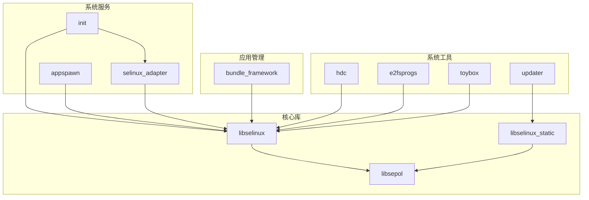
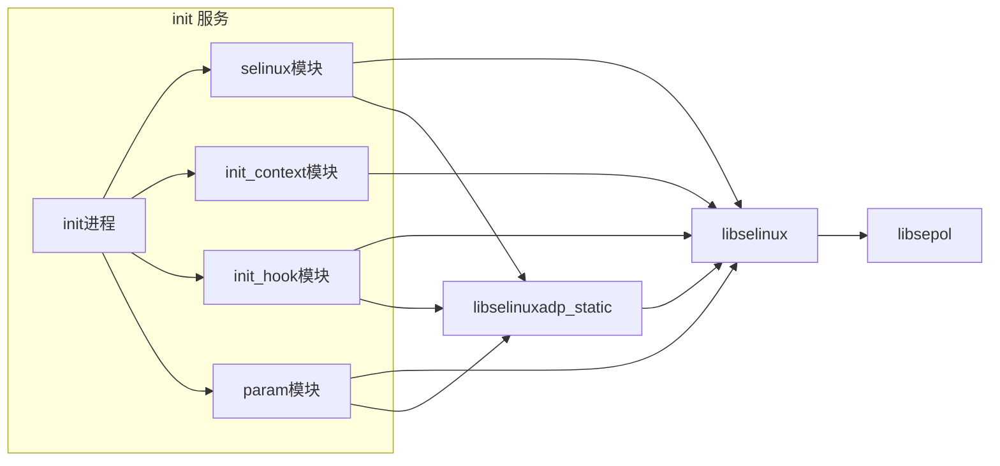
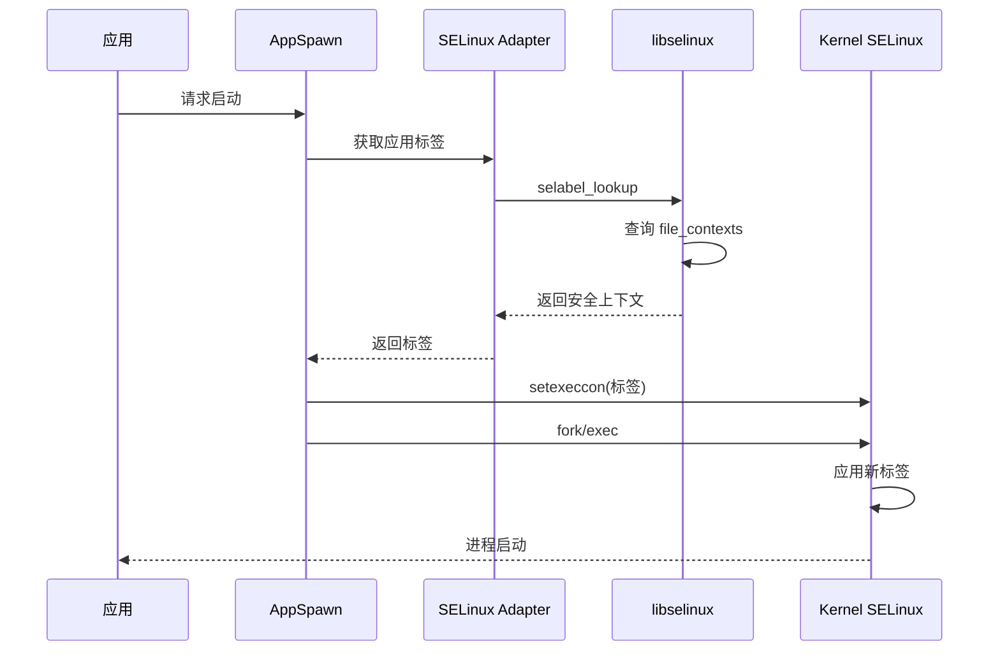

# 依赖关系与使用

## 直接依赖者列表

### 核心依赖模块

| 模块 | BUILD.gn 路径 | 用途 | 依赖组件 |
|-----|--------------|-----|---------|
| init | base/startup/init/services/modules/selinux/BUILD.gn | 初始化阶段 SELinux 策略加载、标签管理 | libselinux, libselinuxadp_static |
| appspawn | base/startup/appspawn/standard/BUILD.gn | 应用进程启动标签设置 | libselinux |
| selinux_adapter | base/security/selinux_adapter/BUILD.gn | SELinux 参数管理和适配层 | libselinux, libselinux_parameter_static |
| bundle_framework | foundation/bundlemanager/bundle_framework/services/bundlemgr/BUILD.gn | 应用安装时标签设置 | libselinux |
| hdc | developtools/hdc/BUILD.gn | 调试工具 SELinux 支持 | libselinux |
| updater | base/update/updater/services/BUILD.gn | 系统更新时标签恢复 | libselinux_static |

### 系统工具依赖

| 模块 | BUILD.gn 路径 | 用途 |
|-----|--------------|-----|
| e2fsprogs | third_party/e2fsprogs/BUILD.gn | 文件系统标签支持 |
| toybox | third_party/toybox/BUILD.gn | 命令行工具 SELinux 支持 |
| ipc | foundation/communication/ipc/.../BUILD.gn | IPC 安全检查 |
| netmanager_base | foundation/communication/netmanager_base/.../BUILD.gn | 网络标签管理 |
| faultloggerd | base/hiviewdfx/faultloggerd/.../BUILD.gn | 日志系统标签 |

### 测试依赖

大量测试模块依赖 selinux 进行权限相关的单元测试和 fuzz 测试，主要集中在：
- `foundation/bundlemanager/bundle_framework/test/`
- `base/startup/init/test/`
- `base/security/selinux_adapter/test/`

---

## 依赖关系图

### 整体依赖关系



### init 模块详细依赖



### 应用启动流程中的 SELinux



---

## 主要使用场景

### 场景 1：系统启动 (init)

**位置**：`base/startup/init/services/modules/selinux/`

**功能**：
1. 早期启动时加载 SELinux 策略
2. 挂载文件系统后执行 restorecon
3. 设置 init 进程自身的安全上下文

**代码示例**（概念）：
```c
// 加载策略
selinux_load_policy();

// 恢复文件标签
selinux_restorecon("/system", ...);
selinux_restorecon("/data", ...);

// 设置进程标签
setcon("u:r:init:s0");
```

### 场景 2：应用沙箱 (appspawn)

**位置**：`base/startup/appspawn/`

**功能**：
1. 应用进程启动前设置执行上下文
2. 为应用数据目录设置标签
3. 实现应用间隔离

**代码示例**（概念）：
```c
// 根据应用 UID 计算上下文
char *context;
selabel_lookup(handle, &context, "/data/app/com.example.app", ...);

// 设置执行上下文
setexeccon(context);

// 启动应用进程
execv(app_path, argv);
```

### 场景 3：应用安装 (bundle_framework)

**位置**：`foundation/bundlemanager/bundle_framework/`

**功能**：
1. 安装应用时设置文件标签
2. 更新应用时重新标签
3. 卸载时清理标签

**使用方式**：
- 调用 `setfilecon()` 设置特定文件标签
- 使用 `restorecon()` 批量设置目录标签

### 场景 4：系统更新 (updater)

**位置**：`base/update/updater/`

**特点**：
- 使用静态库 `libselinux_static`（避免动态链接依赖）
- 在 recovery 模式下执行标签恢复

**原因**：
- 更新过程中系统分区可能不完整
- 静态库不依赖系统动态库

### 场景 5：调试工具 (hdc)

**位置**：`developtools/hdc/`

**功能**：
1. 开发者模式下查询 SELinux 状态
2. 临时设置 SELinux 为 permissive 模式
3. 帮助开发者调试权限问题

---

## 静态链接 vs 动态链接

### 使用场景对比

| 模块 | 链接方式 | 原因 |
|-----|---------|-----|
| init（早期） | 静态 | 系统启动早期动态库不可用 |
| updater | 静态 | recovery 模式环境受限 |
| 普通服务 | 动态 | 节省内存、便于更新 |
| 调试工具 | 动态 | 灵活性优先 |

### 头文件引用

**动态库使用**：
```gn
deps = [ "selinux:libselinux" ]
```

**静态库使用**：
```gn
deps = [ "selinux:libselinux_static" ]
```

**头文件路径**：
```gn
include_dirs = [
    "//third_party/selinux/libselinux/include",
    "//third_party/selinux/libsepol/include",
]
```

---

## 安全上下文示例

### 典型标签定义

在 OH 的 file_contexts 中：

```
# 系统文件
/system/bin/init    u:object_r:init_exec:s0
/system/etc/selinux u:object_r:selinux_config_file:s0

# 应用数据
/data/app(/.*)?     u:object_r:app_data_file:s0
/data/system(/.*)?  u:object_r:system_data_file:s0

# 设备节点
/dev/socket/init    u:object_r:init_socket:s0
```

### 进程标签

```
u:r:init:s0              # init 进程
u:r:appspawn:s0          # appspawn 进程
u:r:app_1000:s0          # UID 为 1000 的应用进程
```

---

## 常见问题

### Q1: 为什么需要 libselinux_static？

**A**: 在系统启动早期或 recovery 模式下，动态链接器可能不可用或系统库不完整。静态链接确保工具可以独立运行。

### Q2: selinux_adapter 的作用是什么？

**A**: selinux_adapter 是 OH 的适配层，提供：
- 参数管理（SELinux 开关、模式）
- 日志适配（Hilog 集成）
- 错误处理封装
- 避免直接修改 libselinux

### Q3: 如何查看当前 SELinux 状态？

**A**: 使用 getenforce 工具：
```bash
getenforce
# 输出: Enforcing, Permissive, 或 Disabled
```

或在代码中：
```c
int enforcing = security_getenforce();
```

### Q4: 应用标签如何确定？

**A**: 通过 file_contexts 规则匹配应用路径，结合应用的 UID/GID 计算最终标签。由 appspawn 在进程启动时设置。

