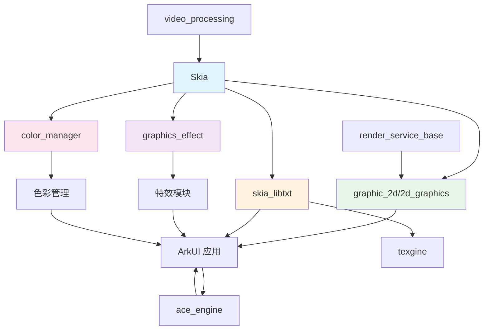
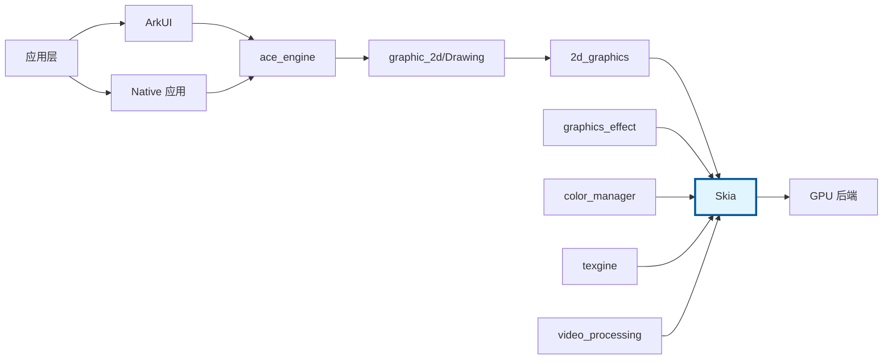
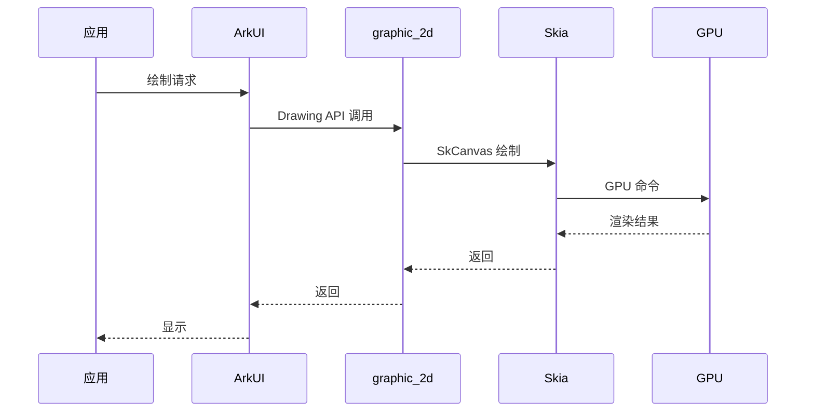

# 04. 依赖关系与使用

> **文档版本**: 1.0
> **最后更新**: 2026-02-08
> **阅读时间**: 15 分钟

---

## 目录

- [1. 直接依赖者](#1-直接依赖者)
- [2. 典型使用场景](#2-典型使用场景)
- [3. 依赖关系图](#3-依赖关系图)
- [4. 代码调用示例](#4-代码调用示例)
- [5. 集成指南](#5-集成指南)

---

## 1. 直接依赖者

### 1.1 核心依赖模块

| 排名 | 模块 | BUILD.gn 路径 | 用途 | 依赖强度 |
|------|------|--------------|------|---------|
| 1 | **2d_graphics** | foundation/graphic/graphic_2d/rosen/modules/2d_graphics/ | 2D 图形核心，Drawing API 封装 | 核心依赖，多处引用 |
| 2 | **skia_libtxt** | foundation/graphic/graphic_2d/frameworks/text/adapter/skia/ | 文本渲染引擎（基于 skparagraph） | 强依赖，含 skparagraph |
| 3 | **graphics_effect** | foundation/graphic/graphics_effect/ | 图形特效库（模糊、滤镜等） | 中等依赖 |
| 4 | **color_manager** | foundation/graphic/graphic_2d/utils/color_manager/ | 颜色空间管理 | 中等依赖 |
| 5 | **ace_engine** | foundation/arkui/ace_engine/frameworks/base/base64/ | ArkUI 框架，Base64 工具 | 轻量依赖 |
| 6 | **platform** | foundation/graphic/graphic_2d/rosen/modules/platform/ | 平台抽象层（ace_skia） | 中等依赖 |
| 7 | **texgine** | foundation/graphic/graphic_2d/frameworks/text/service/texgine/ | 文本引擎服务 | 强依赖 |
| 8 | **render_service_base** | foundation/graphic/graphic_2d/rosen/modules/render_service_base/src/render_backend/ | 渲染服务后端 | 间接依赖 |
| 9 | **video_processing** | foundation/multimedia/video_processing_engine/framework/ | 视频处理引擎 | 中等依赖 |

### 1.2 依赖类型分析

#### 直接 deps 依赖
```gn
deps = [
  "//third_party/skia:skia_<platform>",  # 动态库
  "//third_party/skia:skia_canvaskit",  # 动态库
  "//third_party/skia:skia_canvaskit_static",  # 静态库
]
```

#### external_deps 依赖
```gn
external_deps = [
  "skia:skia_canvaskit",
]
```

#### Skia 模块依赖
```gn
deps = [
  "//third_party/skia/m133/modules/skparagraph:skia_paragraph_ohos_new",
]
```

### 1.3 依赖版本

| 依赖版本 | 控制方式 | 使用场景 |
|---------|---------|---------|
| `//third_party/skia` | `skia_feature_upgrade=false` | 旧版本（兼容性） |
| `//third_party/skia/m133` | `skia_feature_upgrade=true` | M133 版本（当前默认） |

---

## 2. 典型使用场景

### 2.1 2D 图形渲染

#### 场景描述
graphic_2d 模块使用 Skia 作为核心 2D 渲染引擎，提供 Drawing API 供上层应用使用。

#### 使用方式
```cpp
// graphic_2d/src/drawing/engine_adapter/skia_adapter/skia_canvas.cpp
#include "include/core/SkCanvas.h"

void SkiaCanvas::DrawRect(const RSRect& rect)
{
    SkRect skRect = SkRect::MakeLTRB(rect.left, rect.top, rect.right, rect.bottom);
    skCanvas_->drawRect(skRect, *skPaint_);
}

void SkiaCanvas::DrawPath(const RSPath& path)
{
    SkPath skPath = ToSkPath(path);
    skCanvas_->drawPath(skPath, *skPaint_);
}
```

#### 关键 API
- `SkCanvas` - 绘制上下文
- `SkPaint` - 绘制属性
- `SkPath` - 路径表示
- `SkImage` - 图像表示

---

### 2.2 文本渲染

#### 场景描述
skia_libtxt 和 texgine 模块使用 Skia 的 skparagraph 模块实现复杂的文本排版和渲染。

#### 使用方式
```cpp
// skia_libtxt/src/libtxt/skia/paragraph_builder_skia.cpp
#include "modules/skparagraph/include/Paragraph.h"

void ParagraphBuilderSkia::PushStyle(const TextStyle& style)
{
    skTextStyle_ = ToSkTextStyle(style);
    skParagraphBuilder_->pushStyle(skTextStyle_);
}

void ParagraphBuilderSkia::AddText(const std::u16string& text)
{
    skParagraphBuilder_->addText(text.c_str(), text.size());
}

std::unique_ptr<Paragraph> ParagraphBuilderSkia::Build()
{
    return skParagraphBuilder_->Build();
}
```

#### 关键 API
- `Paragraph` - 段落
- `ParagraphBuilder` - 段落构建器
- `TextStyle` - 文本样式
- `FontCollection` - 字体集合

---

### 2.3 图形特效

#### 场景描述
graphics_effect 模块使用 Skia 的 ImageFilter 和 Shader 系统实现模糊、阴影等特效。

#### 使用方式
```cpp
// graphics_effect/src/effect/image_filter/blur_image_filter.cpp
#include "include/effects/SkImageFilters.h"

sk_sp<SkImageFilter> CreateBlurFilter(float sigmaX, float sigmaY)
{
    return SkImageFilters::Blur(sigmaX, sigmaY, nullptr);
}

sk_sp<SkImageFilter> CreateDropShadowFilter(
    float dx, float dy, float sigma, SkColor color)
{
    return SkImageFilters::DropShadow(dx, dy, sigma, color, nullptr);
}
```

#### 关键 API
- `SkImageFilters` - 图像滤镜工厂
- `SkColorFilter` - 颜色滤镜
- `SkPathEffect` - 路径特效

---

### 2.4 颜色管理

#### 场景描述
color_manager 模块使用 Skia 的 skcms 色彩管理库实现颜色空间转换。

#### 使用方式
```cpp
// color_manager/src/color_space_converter.cpp
#include "include/core/SkColorSpace.h"

sk_sp<SkColorSpace> CreateSRGBColorSpace()
{
    return SkColorSpace::MakeSRGB();
}

sk_sp<SkColorSpace> CreateDisplayP3ColorSpace()
{
    return SkColorSpace::MakeRGB(
        SkNamedTransferFn::kSRGB,
        SkNamedGamut::kDisplayP3
    );
}

bool ConvertColorSpace(
    const SkBitmap& src,
    SkBitmap& dst,
    sk_sp<SkColorSpace> targetCS)
{
    return src.readPixels(
        src.info().makeColorSpace(targetCS),
        dst.getPixels(),
        dst.rowBytes()
    );
}
```

#### 关键 API
- `SkColorSpace` - 颜色空间
- `SkImageInfo` - 图像信息
- `skcms` - 色彩管理库

---

### 2.5 ArkUI 组件渲染

#### 场景描述
ace_engine 模块使用 Skia 渲染 ArkUI 组件，如文本、图片、形状等。

#### 使用方式
```cpp
// ace_engine/frameworks/core/render/node/render_image.cpp
#include "include/core/SkCanvas.h"

void RenderImage::Render(RenderContext& context)
{
    auto skCanvas = context.GetSkCanvas();
    if (!skCanvas) {
        return;
    }

    SkRect skRect = MakeSkRect(GetPaintRect());
    SkPaint skPaint;
    skPaint.setFilterQuality(SkFilterQuality::kHigh_SkFilterQuality);

    skCanvas->drawImageRect(
        skImage_,
        skImageSrcRect_,
        skRect,
        SkSamplingOptions(),
        &skPaint,
        SkCanvas::kFast_SrcRectConstraint
    );
}
```

---

### 2.6 视频帧处理

#### 场景描述
video_processing 模块使用 Skia 进行视频帧的绘制和处理。

#### 使用方式
```cpp
// video_processing/src/frame_render.cpp
#include "include/core/SkCanvas.h"
#include "include/core/SkSurface.h"

void RenderVideoFrame(
    const VideoFrame& frame,
    SkCanvas* canvas,
    const SkRect& dstRect)
{
    // 转换视频帧为 SkImage
    sk_sp<SkImage> skImage = CreateSkImageFromVideoFrame(frame);

    // 绘制到 Canvas
    canvas->drawImageRect(
        skImage,
        dstRect,
        SkSamplingOptions(),
        nullptr,
        SkCanvas::kStrict_SrcRectConstraint
    );
}
```

---

## 3. 依赖关系图

### 3.1 模块依赖关系



### 3.2 架构层次关系



### 3.3 数据流向



---

## 4. 代码调用示例

### 4.1 基础绘制示例

```cpp
#include "include/core/SkCanvas.h"
#include "include/core/SkPaint.h"

void DrawBasicShapes(SkCanvas* canvas)
{
    // 绘制红色矩形
    SkPaint paint;
    paint.setColor(SK_ColorRED);
    canvas->drawRect(SkRect::MakeWH(100, 100), paint);

    // 绘制蓝色圆形
    paint.setColor(SK_ColorBLUE);
    canvas->drawCircle(150, 150, 50, paint);

    // 绘制绿色路径
    paint.setColor(SK_ColorGREEN);
    SkPath path;
    path.moveTo(200, 100);
    path.lineTo(300, 200);
    path.lineTo(200, 200);
    path.close();
    canvas->drawPath(path, paint);
}
```

### 4.2 文本绘制示例

```cpp
#include "include/core/SkCanvas.h"
#include "include/core/SkTextBlob.h"
#include "modules/skparagraph/include/Paragraph.h"

void DrawText(SkCanvas* canvas, const std::string& text)
{
    // 使用 Paragraph（推荐方式）
    ParagraphStyle paragraphStyle;
    paragraphStyle.setMaxLines(10);

    ParagraphBuilder builder(paragraphStyle, fontCollection_);
    builder.pushStyle(TextStyle());
    builder.addText(text.c_str());
    auto paragraph = builder.Build();

    paragraph->layout(400);  // 宽度限制
    paragraph->paint(canvas, 0, 0);
}
```

### 4.3 图像绘制示例

```cpp
#include "include/core/SkCanvas.h"
#include "include/core/SkImage.h"
#include "include/codec/SkCodec.h"

void DrawImage(SkCanvas* canvas, const char* path)
{
    // 解码图像
    auto data = SkData::MakeFromFileName(path);
    auto codec = SkCodec::MakeFromData(data);
    if (!codec) {
        return;
    }

    auto image = codec->getImage();
    if (!image) {
        return;
    }

    // 绘制图像
    SkRect dstRect = SkRect::MakeWH(image->width(), image->height());
    canvas->drawImageRect(
        image,
        dstRect,
        SkSamplingOptions(),
        nullptr,
        SkCanvas::kStrict_SrcRectConstraint
    );
}
```

### 4.4 滤镜效果示例

```cpp
#include "include/core/SkCanvas.h"
#include "include/effects/SkImageFilters.h"

void DrawWithBlur(SkCanvas* canvas)
{
    // 创建模糊滤镜
    auto blurFilter = SkImageFilters::Blur(10, 10, nullptr);

    SkPaint paint;
    paint.setImageFilter(blurFilter);

    // 绘制带模糊的矩形
    canvas->drawRect(
        SkRect::MakeWH(200, 200),
        paint
    );
}
```

---

## 5. 集成指南

### 5.1 BUILD.gn 集成

#### 共享库集成
```gn
# 你的模块 BUILD.gn
ohos_shared_library("my_module") {
  sources = [
    "my_module.cpp",
  ]

  deps = [
    "//third_party/skia:skia_canvaskit",
  ]

  external_deps = [
    "hilog:libhilog",
  ]
}
```

#### 静态库集成（ArkUI-X）
```gn
ohos_static_library("my_module") {
  sources = [
    "my_module.cpp",
  ]

  deps = [
    "//third_party/skia:skia_canvaskit_static",
  ]
}
```

### 5.2 头文件包含

```cpp
// 核心头文件
#include "include/core/SkCanvas.h"
#include "include/core/SkPaint.h"
#include "include/core/SkPath.h"
#include "include/core/SkImage.h"

// 编解码头文件
#include "include/codec/SkCodec.h"
#include "include/encode/SkEncoder.h"

// 特效头文件
#include "include/effects/SkImageFilters.h"
#include "include/effects/SkColorFilters.h"

// 文本头文件
#include "modules/skparagraph/include/Paragraph.h"
```

### 5.3 日志集成

```cpp
#include "src/ports/SkDebug_ohos.h"

// 使用 HiLog
SkDebugf("Skia initialization succeeded\n");

// OHOS 特定日志
#ifdef SKIA_OHOS_SINGLE_OWNER
if (GetEnableSkiaSingleOwner()) {
    SkDebugf("Single owner mode enabled\n");
}
#endif
```

### 5.4 字体管理

```cpp
#include "src/ports/skia_ohos/SkFontMgr_ohos.h"

// 创建 OHOS 字体管理器
const char* fontConfigPath = "/etc/fonts/fontconfig_ohos.json";
auto fontMgr = SkFontMgr_OHOS(fontConfigPath);

// 使用字体管理器
SkFont font(fontMgr, 12);
canvas->drawString("Hello World", 0, 20, font, paint);
```

---

## 附录

### A. 依赖统计

| 依赖类型 | 数量 |
|---------|------|
| 直接依赖模块 | 9 个 |
| 间接依赖模块 | 20+ 个 |
| 总引用次数 | 32 次 |

### B. 使用频率

| API 类 | 使用频率 | 主要使用者 |
|--------|---------|-----------|
| SkCanvas | 高 | graphic_2d, ace_engine |
| SkPaint | 高 | graphic_2d, ace_engine |
| SkPath | 中 | graphic_2d, graphics_effect |
| SkImage | 高 | graphic_2d, video_processing |
| SkCodec | 中 | graphic_2d, ace_engine |
| Paragraph | 中 | skia_libtxt, texgine |
| SkImageFilters | 中 | graphics_effect |

---

**下一节**: [05. API/接口差异](05_API_Differences.md)
