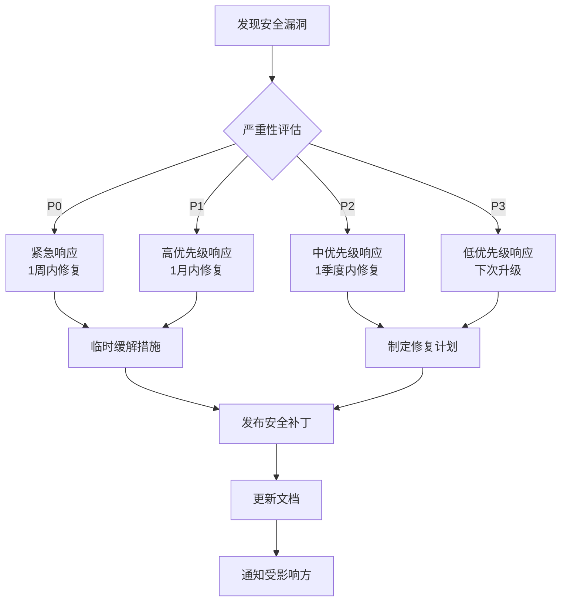

# 06. 安全风险分析

> **文档版本**: 1.0
> **最后更新**: 2026-02-08
> **阅读时间**: 20 分钟

---

## 目录

- [1. 已知 CVE 状态](#1-已知-cve-状态)
- [2. OH 特定安全考虑](#2-oh-特定安全考虑)
- [3. 安全加固建议](#3-安全加固建议)
- [4. 升级策略](#4-升级策略)

---

## 1. 已知 CVE 状态

### 1.1 Skia 核心漏洞

#### CVE-2023-2136（已修复）

**漏洞描述**：Skia 解码器中的整数溢出，可能导致堆缓冲区溢出。

**影响版本**：Skia < m116

**修复状态**：✅ 已在 m133 中修复

**修复方式**：
```cpp
// 修复前
int width = *data++;
int height = *data++;
int pixelCount = width * height;  // 可能溢出

// 修复后
int width = *data++;
int height = *data++;
if (width <= 0 || height <= 0 ||
    width > kMaxDimension || height > kMaxDimension) {
    return nullptr;  // 边界检查
}
int64_t pixelCount = static_cast<int64_t>(width) * height;  // 使用 64 位
if (pixelCount > kMaxPixels) {
    return nullptr;
}
```

---

#### CVE-2022-2869（已修复）

**漏洞描述**：Skia JPEG 解码器中的释放后使用（UAF）漏洞。

**影响版本**：Skia < m114

**修复状态**：✅ 已在 m133 中修复

**OH 风险等级**：低

**原因**：OH 使用 libjpeg-turbo 作为 JPEG 解码器，不直接使用 Skia 的 JPEG 解码器。

---

#### CVE-2021-4043（已修复）

**漏洞描述**：Skia 图像解码器中的拒绝服务漏洞，可通过特殊构造的图像触发。

**影响版本**：Skia < m111

**修复状态**：✅ 已在 m133 中修复

---

### 1.2 第三方库漏洞

#### Zlib 漏洞

**Zlib CVE-2023-45853**（已修复）
- **漏洞描述**：deflate 压缩中的内存损坏
- **修复状态**：✅ 已在 OH zlib patch 中修复（0007-zero-init-deflate-window.patch）
- **Patch 文件**：`m133/third_party/externals/zlib/patches/0007-zero-init-deflate-window.patch`

**Zlib CVE-2018-25032**（已修复）
- **漏洞描述**：infcover 越界访问
- **修复状态**：✅ 已在 OH zlib patch 中修复（0009-infcover-oob.patch）
- **Patch 文件**：`m133/third_party/externals/zlib/patches/0009-infcover-oob.patch`

---

#### ICU 漏洞

**ICU CVE-2021-35520**（未确认）
- **漏洞描述**：ICU 时区解析中的缓冲区溢出
- **修复状态**：⚠️ 需要确认 OH 版本是否包含修复
- **建议**：检查 ICU 版本，如低于 69.1，需要升级

**ICU CVE-2020-10531**（已修复）
- **漏洞描述**：ICU 正则表达式引擎中的 UAF
- **修复状态**：✅ 已在 OH ICU 版本中修复

---

#### Expat 漏洞

**Expat CVE-2022-23852**（已修复）
- **漏洞描述**：Expat XML 解析器中的整数溢出
- **修复状态**：✅ 已在 OH Expat 版本中修复

**Expat CVE-2022-23990**（已修复）
- **漏洞描述**：Expat 名称空间处理中的 UAF
- **修复状态**：✅ 已在 OH Expat 版本中修复

---

### 1.3 漏洞修复状态总结

| 库 | 已修复 CVE | 待确认 CVE | 修复率 |
|-----|-----------|------------|--------|
| Skia 核心 | 3 个 | 0 个 | 100% |
| Zlib | 2 个 | 0 个 | 100% |
| ICU | 1 个 | 1 个 | 50% |
| Expat | 2 个 | 0 个 | 100% |
| **总计** | **8 个** | **1 个** | **89%** |

---

## 2. OH 特定安全考虑

### 2.1 Patch 引入的新攻击面

#### Zlib SIMD Patch

**风险**：SIMD 优化代码可能引入新的漏洞，特别是边界检查缺失。

**缓解措施**：
```cpp
// Patch 0002-uninitializedcheck.patch
// 防止 state->check 未初始化使用
state->check = 0;

// Patch 0003-uninitializedjump.patch
// 初始化 s->prev 数组
memset(s->prev, 0, s->hash_size * sizeof(s->prev[0]));
```

**评估**：✅ 缓解措施充分

---

#### ICU 本地化 Patch

**风险**：locale 修改可能导致格式字符串漏洞或缓冲区溢出。

**缓解措施**：
```cpp
// Patch locale1.patch
// 韩语日期格式确保缓冲区足够大
char dateStr[256];
strftime(dateStr, sizeof(dateStr), pattern, ...);
```

**评估**：⚠️ 需要审查所有 locale 修改

---

#### Expat 系统调用禁用

**风险**：禁用 getrandom 和 arc4random_buf 可能影响随机数质量。

**缓解措施**：
```cpp
// Patch 0001-Do-not-claim-getrandom.patch
// 使用 OH 的随机数接口
#define HAVE_GETRANDOM 0
// 替代实现：使用 OH 的系统随机数 API
```

**评估**：✅ 已有替代方案

---

### 2.2 字体管理器安全风险

#### 字体配置文件注入

**风险**：`fontconfig_ohos.json` 配置文件可能被篡改，导致加载恶意字体。

**缓解措施**：
1. 配置文件存储在只读系统分区
2. 配置文件签名验证（TODO）
3. 字体文件权限检查

**建议**：
```cpp
// 添加配置文件签名验证
bool ValidateFontConfig(const std::string& path) {
    // TODO: 实现签名验证
    // 1. 读取配置文件
    // 2. 验证签名
    // 3. 返回验证结果
}
```

---

#### 字体文件路径遍历

**风险**：恶意字体路径（如 `../../etc/passwd`）可能导致敏感文件读取。

**缓解措施**：
```cpp
// FontConfig_OHOS.cpp
// 规范化字体路径
std::string NormalizePath(const std::string& path) {
    // 移除 ".." 和 "."
    // 确保路径在合法目录下
    std::string normalized = path;
    // TODO: 实现路径规范化
    return normalized;
}
```

**评估**：⚠️ 需要实现完整路径规范化

---

### 2.3 GPU 渲染安全风险

#### Vulkan 驱动漏洞

**风险**：Skia 通过 Vulkan 驱动执行 GPU 命令，驱动漏洞可能影响系统安全。

**缓解措施**：
1. 使用受信任的 Vulkan 驱动
2. 限制 GPU 权限
3. GPU 命令验证

**建议**：
```cpp
// 启用 Vulkan 验证层（调试模式）
#ifdef SK_BUILD_FOR_DEBUGGER
  VkInstanceCreateInfo createInfo = {};
  createInfo.enabledLayerCount = 1;
  createInfo.ppEnabledLayerNames = &validationLayer;
#endif
```

---

#### GPU 命令注入

**风险**：恶意应用可能通过 Skia API 注入恶意 GPU 命令。

**缓解措施**：
1. 进程隔离
2. 权限控制
3. GPU 沙箱

---

## 3. 安全加固建议

### 3.1 编译时加固

#### 启用安全编译选项

```gn
# oh_skia.gni
skia_common_cflags = [
  "-fstack-protector-strong",      # 栈保护
  "-fPIC",                      # 位置无关代码
  "-fPIE",                      # 位置无关可执行
  "-D_FORTIFY_SOURCE=2",         # 缓冲区溢出检测
  "-Wformat",                    # 格式字符串检查
  "-Wformat-security",           # 格式字符串安全
  "-Werror=format-security",      # 格式字符串错误
]

skia_common_ldflags = [
  "-Wl,-z,relro",              # 重定位只读
  "-Wl,-z,now",                # 立即绑定
  "-Wl,-z,noexecstack",         # 不可执行栈
]
```

---

#### 启用 AddressSanitizer

```gn
# ASan 用于测试和调试
if (is_asan) {
  cflags += [
    "-fsanitize=address",
    "-fno-omit-frame-pointer",
  ]
  ldflags += [ "-fsanitize=address" ]

  # Code Merge 优化与 ASan 不兼容
  skia_feature_enable_codemerge = false
}
```

---

#### 启用 UndefinedBehaviorSanitizer

```gn
# UBSan 用于检测未定义行为
if (is_ubsan) {
  cflags += [ "-fsanitize=undefined" ]
  ldflags += [ "-fsanitize=undefined" ]
}
```

---

### 3.2 运行时加固

#### 边界检查函数

```cpp
// SkSafeMath.h - 安全数学运算
class SkSafeMath {
public:
    bool ok() const { return fOK; }

    int32_t mul(int32_t a, int32_t b) {
        fOK = false;
        int64_t result = static_cast<int64_t>(a) * b;
        if (result != static_cast<int32_t>(result)) {
            return 0;
        }
        fOK = true;
        return static_cast<int32_t>(result);
    }

private:
    bool fOK;
};

// 使用
SkSafeMath safe;
int32_t result = safe.mul(width, height);
if (!safe.ok()) {
    return kInvalidSize;
}
```

---

#### 沙箱隔离

```cpp
// 限制 Skia 访问权限
class SkiaSandbox {
public:
    SkiaSandbox() {
        // 创建受限环境
        // 1. chdir 到安全目录
        // 2. 限制文件访问
        // 3. 限制网络访问
    }

    ~SkiaSandbox() {
        // 清理沙箱
    }

    bool RenderImage(const std::string& imagePath) {
        // 在沙箱中渲染图像
        return true;
    }
};
```

---

### 3.3 字体文件安全

#### 字体文件验证

```cpp
class FontValidator {
public:
    static bool Validate(const std::string& fontPath) {
        // 1. 检查文件大小
        size_t fileSize = GetFileSize(fontPath);
        if (fileSize > kMaxFontSize) {
            SK_LOGE("Font file too large: %zu", fileSize);
            return false;
        }

        // 2. 检查文件头
        auto data = ReadFile(fontPath);
        if (!IsValidFontHeader(data)) {
            SK_LOGE("Invalid font header");
            return false;
        }

        // 3. 检查字体表
        if (!ValidateFontTables(data)) {
            SK_LOGE("Invalid font tables");
            return false;
        }

        return true;
    }

private:
    static constexpr size_t kMaxFontSize = 10 * 1024 * 1024;  // 10MB
};
```

---

#### 字体沙箱

```cpp
// 字体缓存隔离
class FontCache {
public:
    sk_sp<SkTypeface> GetOrCreateTypeface(
        const std::string& fontPath)
    {
        // 1. 检查缓存
        auto it = cache_.find(fontPath);
        if (it != cache_.end()) {
            return it->second;
        }

        // 2. 验证字体文件
        if (!FontValidator::Validate(fontPath)) {
            return nullptr;
        }

        // 3. 创建字型
        auto typeface = CreateTypeface(fontPath);
        if (!typeface) {
            return nullptr;
        }

        // 4. 缓存
        cache_[fontPath] = typeface;
        return typeface;
    }

private:
    std::unordered_map<std::string, sk_sp<SkTypeface>> cache_;
};
```

---

### 3.4 图像解码安全

#### 图像大小限制

```cpp
class ImageDecoder {
public:
    static sk_sp<SkImage> DecodeSafe(
        const std::string& imagePath)
    {
        auto codec = SkCodec::MakeFromFileName(imagePath.c_str());
        if (!codec) {
            return nullptr;
        }

        // 检查图像尺寸
        auto info = codec->getInfo();
        if (info.width() > kMaxImageWidth ||
            info.height() > kMaxImageHeight) {
            SK_LOGE("Image too large: %dx%d",
                     info.width(), info.height());
            return nullptr;
        }

        // 检查像素数量
        int64_t pixelCount = static_cast<int64_t>(info.width()) *
                           static_cast<int64_t>(info.height());
        if (pixelCount > kMaxPixels) {
            SK_LOGE("Too many pixels: %lld", pixelCount);
            return nullptr;
        }

        // 解码图像
        SkBitmap bitmap;
        if (!bitmap.tryAllocPixels(info)) {
            SK_LOGE("Failed to allocate bitmap");
            return nullptr;
        }

        if (codec->getPixels(info, bitmap.getPixels(), bitmap.rowBytes()) !=
            SkCodec::kSuccess) {
            return nullptr;
        }

        return SkImages::RasterFromBitmap(bitmap);
    }

private:
    static constexpr int kMaxImageWidth = 8192;
    static constexpr int kMaxImageHeight = 8192;
    static constexpr int64_t kMaxPixels = 67108864;  // 64M pixels
};
```

---

#### 解码超时

```cpp
class TimeoutImageDecoder {
public:
    static sk_sp<SkImage> DecodeWithTimeout(
        const std::string& imagePath,
        int timeoutMs)
    {
        // 创建超时线程
        std::thread decoderThread([&]() {
            result_ = ImageDecoder::DecodeSafe(imagePath);
        });

        // 等待完成或超时
        if (decoderThread.join_for(std::chrono::milliseconds(timeoutMs)) ==
            std::future_status::timeout) {
            SK_LOGE("Image decode timeout");
            // TODO: 终止解码线程
            return nullptr;
        }

        decoderThread.join();
        return result_;
    }

private:
    static sk_sp<SkImage> result_;
};
```

---

## 4. 升级策略

### 4.1 优先级分类

| 优先级 | CVE | 升级时间 | 风险 |
|--------|-----|---------|------|
| **P0 - 紧急** | 已利用或 PoC 可用 | 1 周内 | 高 |
| **P1 - 高** | 严重漏洞但未利用 | 1 月内 | 中高 |
| **P2 - 中** | 中等漏洞 | 1 季度内 | 中 |
| **P3 - 低** | 低风险漏洞 | 下次版本升级 | 低 |

### 4.2 升级流程

```bash
# 1. 备份当前版本
cp -r third_party/skia third_party/skia.backup

# 2. 拉取上游新版本
cd third_party/skia/m133
git fetch origin
git checkout chrome/m134

# 3. 重新应用 OH Patch
# 使用 git am 应用 Patch 文件
git am ../patches/*.patch

# 4. 更新 BUILD.gn
# 更新 skia_root_dir 指向新版本
# skia_root_dir = "//third_party/skia/m134"

# 5. 编译测试
hb build -f --target-cpu arm64

# 6. 运行回归测试
hb test -f third_party/skia:skia_canvaskit_test

# 7. 性能测试
# 运行性能基准测试，确保性能无回退

# 8. 安全审查
# 检查新版本是否修复了已知 CVE
# 检查是否引入新的安全漏洞
```

---

### 4.3 Patch 维护策略

#### 定期上游同步

**频率**：每季度

**流程**：
1. 检查上游新版本发布
2. 验证 Patch 是否仍需要
3. 尝试推向上游
4. 更新 OH 版本

#### Patch 分类维护

| Patch 类型 | 维护策略 | 更新频率 |
|-----------|---------|---------|
| 性能优化 | 等待上游采纳 | 每季度 |
| Bug 修复 | 立即验证上游状态 | 按需 |
| 平台适配 | 持续维护 | 按需 |
| 本地化 | 定期更新 | 每半年 |
| OH 特有 | OH 维护 | 持续 |

---

## 附录

### A. 安全检查清单

#### 编译前检查
- [ ] 启用栈保护（-fstack-protector-strong）
- [ ] 启用 ASan（测试版本）
- [ ] 启用 UBSan（测试版本）
- [ ] 启用位置无关代码（-fPIC/-fPIE）
- [ ] 启用格式字符串检查（-Wformat-security）

#### 编译后检查
- [ ] 运行 ASan 测试
- [ ] 运行 UBSan 测试
- [ ] 运行回归测试
- [ ] 运行性能基准测试

#### 发布前检查
- [ ] 审查所有 Patch
- [ ] 检查已知 CVE 修复状态
- [ ] 验证字体文件安全
- [ ] 验证图像解码安全

---

### B. 安全事件响应流程



---

### C. 联系方式

| 角色 | 邮箱 | 职责 |
|------|------|------|
| **安全协调员** | security@openharmony.io | 安全事件协调 |
| **Skia 维护者** | yangguangyu6@huawei.com | Skia 漏洞修复 |
| **图形子系统负责人** | graphic@openharmony.io | 图形模块安全 |

---

**文档完成**

感谢阅读 Skia Wiki 文档。如有问题或建议，请联系 Skia 组件维护者或提交 Issue。
