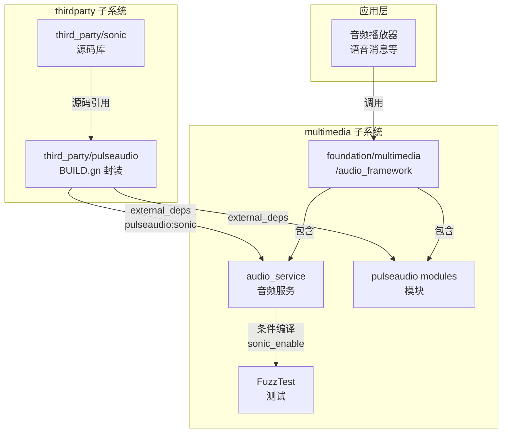

# Sonic 在 OpenHarmony 中的依赖关系与使用

## 1. 直接依赖者

### 1.1 依赖关系汇总

经过对 OpenHarmony 代码库的全面搜索，发现以下模块依赖 sonic：

| 模块 | BUILD.gn 路径 | 引用方式 | 所属子系统 |
|------|--------------|----------|-----------|
| **sonic** (自身) | `third_party/sonic/BUILD.gn` | `ohos_shared_library("sonic")` | thirdparty |
| **pulseaudio** | `third_party/pulseaudio/sonic/BUILD.gn` | `include_dirs = ["../sonic/"]` | thirdparty |
| **audio_service** | `foundation/multimedia/audio_framework/services/audio_service/BUILD.gn` | `external_deps += ["pulseaudio:sonic"]` | multimedia |
| **pulseaudio modules** | `foundation/multimedia/audio_framework/frameworks/native/pulseaudio/modules/BUILD.gn` | `external_deps += ["pulseaudio:sonic"]` | multimedia |
| **FuzzTest (50+个)** | `foundation/multimedia/audio_framework/test/fuzztest/*/BUILD.gn` | 条件依赖 `sonic_enable == true` | multimedia |

### 1.2 依赖层次结构

```
Level 0: third_party/sonic (源码)
    ↓ 提供源码
Level 1: third_party/pulseaudio/sonic (BUILD.gn 封装)
    ↓ 封装为 pulseaudio:sonic
Level 2: foundation/multimedia/audio_framework/* (音频框架)
    ↓ 使用 external_deps 依赖
Level 3: 应用层 (通过音频框架间接使用)
```

---

## 2. 依赖详情分析

### 2.1 Sonic 自身构建

**文件**: `third_party/sonic/BUILD.gn`

```gn
ohos_shared_library("sonic") {
  branch_protector_ret = "pac_ret"
  sources = [ "./sonic.c" ]
  license_file = "./NOTICE"
  configs = [ ":sonic_config" ]
  public_configs = [ ":sonic_include_config" ]
  innerapi_tags = [ "platformsdk" ]
  subsystem_name = "thirdparty"
  part_name = "sonic"
}
```

**说明**:
- 定义了 `ohos_shared_library("sonic")` 目标
- 标记为 `platformsdk` 内部 API
- 子系统归属 `thirdparty`

### 2.2 PulseAudio 的封装

**文件**: `third_party/pulseaudio/sonic/BUILD.gn`

```gn
ohos_shared_library("sonic") {
  sources = ["../sonic/sonic.c"]
  include_dirs = [
    "../sonic/",
    "//third_party/pulseaudio/src",
    ...
  ]
  ...
}
```

**说明**:
- PulseAudio 定义了自己的 sonic 库目标
- 源码直接引用 `../sonic/sonic.c`（third_party/sonic 的源码）
- 向上提供 `pulseaudio:sonic` 外部依赖

**文件**: `third_party/pulseaudio/ohosbuild/BUILD.gn`

```gn
deps = [
  "../sonic:sonic",
  ...
]
```

### 2.3 音频服务的依赖

**文件**: `foundation/multimedia/audio_framework/services/audio_service/BUILD.gn`

```gn
# config 部分
if (sonic_enable == true) {
  cflags += [ "-DSONIC_ENABLE" ]
  external_deps += [ "pulseaudio:sonic" ]
}

# target 部分
if (sonic_enable == true) {
  external_deps += [ "pulseaudio:sonic" ]
}
```

**关键发现**:
- **条件编译**: 通过 `sonic_enable` 标志控制是否启用
- **宏定义**: 启用时定义 `SONIC_ENABLE` 宏
- **依赖路径**: audio_service → pulseaudio:sonic → third_party/sonic (源码)

### 2.4 FuzzTest 测试依赖

**文件模式**: `foundation/multimedia/audio_framework/test/fuzztest/*/BUILD.gn`

约 50+ 个 fuzzer 测试模块都包含：

```gn
if (sonic_enable == true) {
  external_deps += [ "pulseaudio:sonic" ]
}
```

**涉及的 Fuzzer 模块**:
- haudiomanagerlistenerstubimpl_fuzzer
- audioperformancemonitor_fuzzer
- hpaeoffloadrenderermanager_fuzzer
- audiopolicyservermanager_fuzzer
- ... (约 50 个)

---

## 3. 使用场景分析

### 3.1 功能开关控制

**sonic_enable 条件编译**

Sonic 的集成采用了条件编译策略：

```gn
if (sonic_enable == true) {
  cflags += [ "-DSONIC_ENABLE" ]
  external_deps += [ "pulseaudio:sonic" ]
}
```

**推测用途**:
- 某些产品形态可能不需要变速功能，可以关闭以减小镜像大小
- 便于功能裁剪和模块化

### 3.2 典型使用场景

#### 场景 1: 音频播放器倍速播放
```
用户操作 (调整播放速度)
    ↓
音频播放器应用
    ↓
audio_framework (audio_service)
    ↓
pulseaudio:sonic (变速算法)
    ↓
音频输出
```

#### 场景 2: 语音消息变速
```
IM 应用 → 语音消息组件 → audio_service (通过 SONIC_ENABLE 宏控制)
    ↓
sonic (变速处理)
    ↓
播放
```

### 3.3 在代码中的使用模式

**条件编译示例** (推测):
```c
#ifdef SONIC_ENABLE
#include "sonic.h"

void process_audio_speed(sonicStream stream, float speed) {
    sonicSetSpeed(stream, speed);
    // ... 处理音频
}
#endif
```

---

## 4. 依赖关系图

### 4.1 完整依赖图



### 4.2 依赖层级

```
Level 0: sonic 源码 (third_party/sonic)
    ↑ 被引用
Level 1: pulseaudio 封装 (third_party/pulseaudio/sonic)
    ↑ 提供 external_deps: pulseaudio:sonic
Level 2: audio_service / pulseaudio modules
    ↑ 条件依赖 (sonic_enable == true)
Level 3: FuzzTest (50+ 个测试模块)
    ↑ 测试验证
Level 4: 应用层 (通过音频框架使用)
```

---

## 5. 库的集成方式

### 5.1 链接方式

| 方式 | 状态 | 说明 |
|------|------|------|
| **动态链接** | 是 | 通过 `ohos_shared_library` 构建共享库 |
| **源码引用** | 是 | pulseaudio 直接引用 sonic 源码编译 |

### 5.2 头文件引用

**通过 public_configs 暴露**:
```gn
public_configs = [ ":sonic_include_config" ]

config("sonic_include_config") {
  include_dirs = [ "./" ]
}
```

**使用者引用**:
```c
#include "sonic.h"
```

### 5.3 依赖声明方式

**BUILD.gn 中声明**:
```gn
ohos_executable("my_audio_app") {
  sources = [ "main.cpp" ]
  
  if (sonic_enable == true) {
    cflags += [ "-DSONIC_ENABLE" ]
    external_deps = [
      "pulseaudio:sonic",
    ]
  }
}
```

---

## 6. 与其他音频组件的关系

### 6.1 组件关系图

```
┌─────────────────────────────────────────────────────────────┐
│                      应用层                                  │
│  (音频播放器、语音消息、有声读物等)                           │
└─────────────────────────────────────────────────────────────┘
                              ↓
┌─────────────────────────────────────────────────────────────┐
│              audio_framework (多媒体框架)                    │
│  ┌─────────────────┐  ┌─────────────────────────────────┐   │
│  │ audio_service   │  │ pulseaudio modules              │   │
│  │ (音频服务)       │  │ (音频模块)                       │   │
│  │                 │  │                                 │   │
│  │ #ifdef          │  │ #ifdef SONIC_ENABLE             │   │
│  │ SONIC_ENABLE    │  │   sonicStream stream;           │   │
│  │   sonicSetSpeed │  │   sonicSetSpeed(stream, 2.0);   │   │
│  │ #endif          │  │ #endif                          │   │
│  └────────┬────────┘  └────────────────┬────────────────┘   │
└───────────┼────────────────────────────┼────────────────────┘
            │                            │
            └────────────┬───────────────┘
                         ↓
         ┌───────────────────────────────┐
         │  pulseaudio:sonic             │
         │  (封装层，引用 sonic 源码)      │
         └───────────────┬───────────────┘
                         ↓
         ┌───────────────────────────────┐
         │  third_party/sonic            │
         │  (核心算法库)                  │
         │  - sonic.h (API 定义)         │
         │  - sonic.c (算法实现)         │
         └───────────────────────────────┘
```

### 6.2 功能分工

| 组件 | 功能 | 与 sonic 的关系 |
|------|------|----------------|
| **sonic** | 语音变速算法 | 核心算法库 |
| **audio_service** | 音频服务管理 | 条件编译使用 sonic |
| **pulseaudio modules** | 音频模块 | 条件编译使用 sonic |
| **pulseaudio:sonic** | 封装层 | 封装 sonic 提供标准接口 |

---

## 7. 使用分析总结

### 7.1 依赖关系总结

| 统计项 | 状态 |
|--------|------|
| **直接依赖模块** | audio_service, pulseaudio modules |
| **测试依赖** | 50+ 个 FuzzTest 模块 |
| **条件编译** | 是 (sonic_enable 控制) |
| **封装层** | pulseaudio:sonic |
| **所属子系统** | multimedia (音频框架), thirdparty (pulseaudio) |

### 7.2 关键发现

1. **间接依赖**: 模块不直接依赖 `//third_party/sonic:sonic`，而是通过 `pulseaudio:sonic`
2. **条件编译**: 所有使用点都通过 `sonic_enable` 标志控制，便于功能裁剪
3. **测试覆盖**: 大量 FuzzTest 测试模块引用，说明功能被充分测试
4. **封装设计**: pulseaudio 作为中间层封装 sonic，提供统一接口

### 7.3 使用建议

**对于开发者**:
- 在 BUILD.gn 中使用 `external_deps += ["pulseaudio:sonic"]` 添加依赖
- 使用 `#ifdef SONIC_ENABLE` 包裹 sonic 相关代码
- 参考 audio_service 的实现方式

**对于升级维护**:
- 升级 sonic 版本时需验证 pulseaudio 层的兼容性
- 需测试 `sonic_enable=true` 和 `sonic_enable=false` 两种构建配置
- 运行 FuzzTest 确保功能正常
