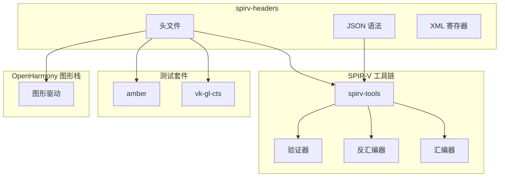

# 依赖关系与使用

## 直接依赖者

### 依赖者清单

| 模块 | BUILD.gn 路径 | 用途 |
|------|---------------|------|
| **spirv-tools** | `//third_party/spirv-tools/BUILD.gn` | SPIR-V 汇编器/反汇编器构建 |
| **vk-gl-cts** | `//third_party/vk-gl-cts/.../BUILD.gn` | Vulkan/OpenGL 一致性测试 |
| **amber** | `//third_party/vk-gl-cts/external/amber/.../BUILD.gn` | Vulkan 测试框架 |

### 依赖者分析

#### 1. spirv-tools

`s`pirv-tools` 是 SPIR-V 工具链的核心组件，提供：

- `spirv-as`：SPIR-V 汇编器
- `spirv-dis`：SPIR-V 反汇编器
- `spirv-val`：SPIR-V 验证器
- `spirv-opt`：SPIR-V 优化器

**依赖方式**：

```gn
# spirv-tools/BUILD.gn
core_json_file = "//third_party/spirv-headers/include/spirv/$version/spirv.core.grammar.json"
debuginfo_insts_file = "//third_party/spirv-headers/include/spirv/unified1/extinst.debuginfo.grammar.json"
glsl_json_file = "//third_party/spirv-headers/include/spirv/${version}/extinst.glsl.std.450.grammar.json"
```

**依赖文件**：

| 文件 | 用途 |
|------|------|
| `spirv.core.grammar.json` | 核心指令语法解析 |
| `extinst.glsl.std.450.grammar.json` | GLSL 扩展指令语法 |
| `extinst.debuginfo.grammar.json` | 调试信息扩展语法 |
| `extinst.opencl.debuginfo.100.grammar.json` | OpenCL 调试信息语法 |

#### 2. vk-gl-cts

`vk-gl-cts` 是 Vulkan 和 OpenGL 的一致性测试套件，用于验证 OH Vulkan 实现的正确性。

**依赖方式**：

```gn
# vk-gl-cts/.../BUILD.gn
include_dirs = [ "//third_party/spirv-headers/include" ]
```

**使用场景**：

- 测试着色器编译生成的 SPIR-V
- 验证 SPIR-V 指令的规范性
- 执行图形渲染一致性测试

#### 3. amber

`amber` 是一个 Vulkan 测试脚本框架，用于执行预定义的测试用例。

**依赖方式**：

```gn
# amber/.../BUILD.gn
include_dirs = [ "//third_party/spirv-headers/include" ]
```

**使用场景**：

- 解析测试脚本中的 SPIR-V 着色器
- 验证着色器字节码的正确性
- 执行渲染和计算测试

## 依赖图



## 使用方式

### 静态链接

spirv-headers 作为头文件库，通过包含目录被引用：

```gn
spirv_headers = "//third_party/spirv-headers:spv_headers"

cc_library {
    name = "my_module",
    deps = [ spirv_headers ]
}
```

### 头文件引用

```cpp
// SPIR-V 核心指令
#include "spirv/unified1/spirv.h"
#include "spirv/unified1/spirv.hpp"

// GLSL 标准函数
#include "spirv/unified1/GLSL.std.450.h"

// OpenCL 标准函数
#include "spirv/unified1/OpenCL.std.h"

// 调试扩展
#include "spirv/unified1/NonSemanticDebugPrintf.h"
```

### JSON 语法引用

```cpp
// spirv-tools 内部使用
const char* core_grammar = "include/spirv/unified1/spirv.core.grammar.json";
const char* glsl_grammar = "include/spirv/unified1/extinst.glsl.std.450.grammar.json";
```

## 典型使用场景

### 场景 1：着色器编译

```
应用程序 → 着色器编译器 → SPIR-V 中间码 → spirv-val 验证 → GPU 执行
               ↑                                    ↑
          spirv-headers                          spirv-headers
          （定义指令集）                         （定义验证规则）
```

### 场景 2：Vulkan 测试

```
vk-gl-cts 测试套件
    ↓
加载着色器文件
    ↓
使用 spirv-dis 反汇编（依赖 spirv-headers 定义）
    ↓
验证 SPIR-V 指令规范性
    ↓
报告测试结果
```

### 场景 3：着色器调试

```
着色器运行时
    ↓
遇到 NonSemanticDebugPrintf 调用
    ↓
解析调试信息（依赖 spirv-headers 扩展定义）
    ↓
输出调试信息
```

## 依赖版本兼容性

### 版本匹配要求

| 组件 | 推荐版本 | 说明 |
|------|----------|------|
| spirv-headers | vulkan-sdk-1.3.275.0 | 基础规范定义 |
| spirv-tools | 对应版本 | 工具链版本匹配 |
| Vulkan SDK | 1.3.275+ | 与 headers 版本一致 |

### 升级注意事项

1. **同步升级**：spirv-headers 和 spirv-tools 应同步升级
2. **CTS 验证**：升级后运行 vk-gl-CTS 验证兼容性
3. **头文件更新**：同时更新 BUILD.gn 的 sources 列表

## 总结

spirv-headers 在 OpenHarmony 中处于 SPIR-V 工具链的底层位置：

- **被依赖者**：spirv-tools、vk-gl-cts、amber 都依赖其定义
- **无运行时依赖**：纯头文件库，不引入运行时依赖
- **核心基础设施**：为图形和计算着色器提供标准规范

这种依赖结构确保了 OpenHarmony 图形栈与 Khronos 标准的兼容性。
