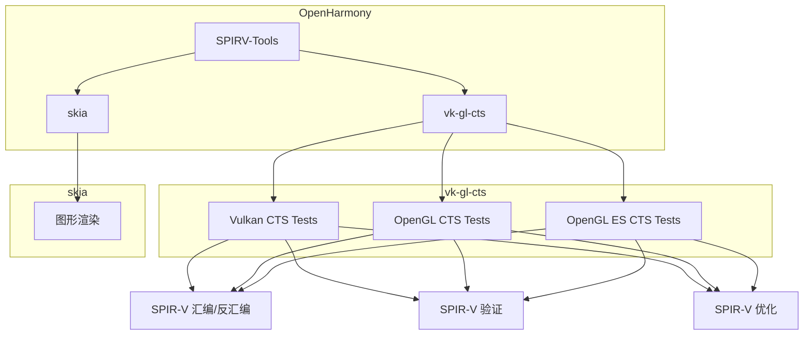
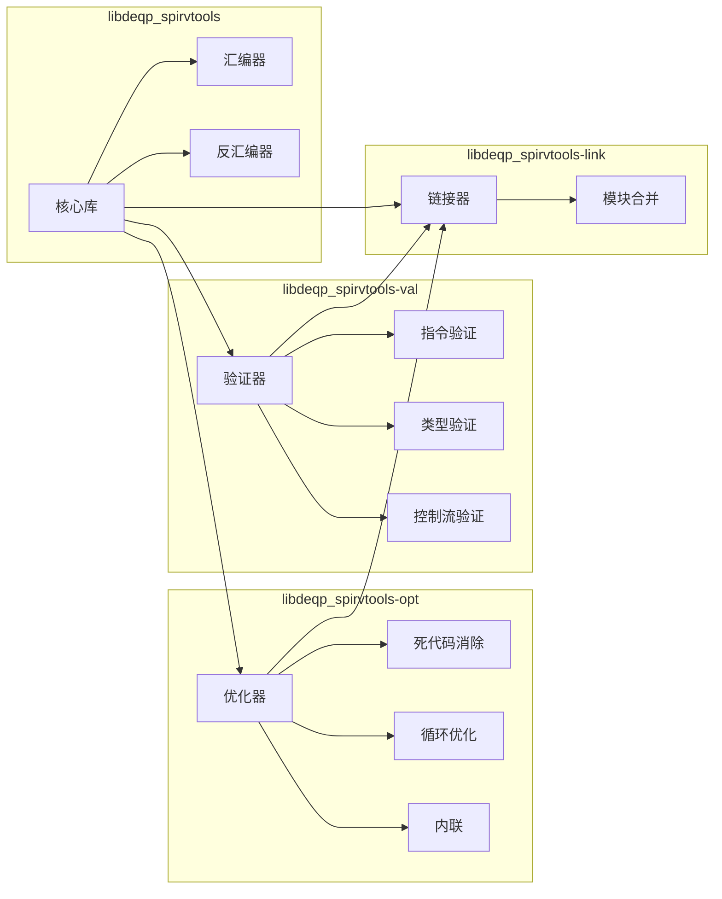
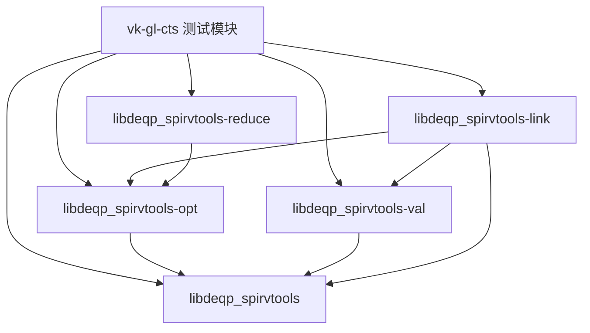

# 依赖关系与使用

本文档详细介绍 SPIRV-Tools 在 OpenHarmony 中的依赖关系和使用场景。

---

## 目录

- [直接依赖者](#直接依赖者)
- [依赖关系图](#依赖关系图)
- [使用方式](#使用方式)
- [典型使用场景](#典型使用场景)
- [集成示例](#集成示例)
- [链接方式](#链接方式)

---

## 直接依赖者

### 依赖者列表

| 模块 | BUILD.gn 路径 | 用途 | 依赖方式 |
|------|--------------|------|---------|
| **vk-gl-cts** | `third_party/vk-gl-cts/...` | 主要依赖者，一致性测试 | 静态链接 |
| **skia** | `third_party/skia/...` | 潜在依赖者，图形渲染 | 可选依赖 |

### vk-gl-cts 详细依赖

vk-gl-cts 是 SPIRV-Tools 在 OpenHarmony 中的**主要依赖者**：

```
vk-gl-cts/
├── external/
│   └── spirv-tools/              # 引用 spirv-tools
├── modules/
│   ├── common/                  # 通用模块
│   │   └── BUILD.gn            # 依赖 spirv-tools
│   ├── vulkan/                  # Vulkan 模块
│   │   └── BUILD.gn            # 依赖 spirv-tools
│   └── opengl/                  # OpenGL 模块
│       └── BUILD.gn            # 依赖 spirv-tools
└── framework/
    ├── platform/               # 平台框架
    │   └── BUILD.gn           # 依赖 spirv-tools
    └── vulkan/                # Vulkan 框架
        └── BUILD.gn           # 依赖 spirv-tools
```

### 依赖模块详情

| vk-gl-cts 模块 | 使用功能 | BUILD.gn 路径 |
|---------------|---------|--------------|
| **framework/platform** | SPIR-V 处理 | `framework/platform/BUILD.gn` |
| **framework/vulkan** | Vulkan SPIR-V | `framework/vulkan/BUILD.gn` |
| **modules/common** | 通用着色器 | `modules/common/BUILD.gn` |
| **modules/vulkan** | Vulkan 测试 | `modules/vulkan/BUILD.gn` |
| **modules/opengl** | OpenGL 测试 | `modules/opengl/BUILD.gn` |

---

## 依赖关系图

### 全局依赖关系



### 内部模块依赖



---

## 使用方式

### 静态链接

SPIRV-Tools 在 OH 中以**静态库**方式使用：

```gn
ohos_static_library("libdeqp_spirvtools") {
  deps = [ ":deqp_spirvtool_source" ]
  part_name = "graphic_2d"
  subsystem_name = "graphic"
}
```

### 头文件引用

```cpp
// 核心 API
#include "spirv-tools/libspirv.h"
#include "spirv-tools/libspirv.hpp"

// 优化器 API
#include "spirv-tools/optimizer.hpp"

// 验证器 API
#include "spirv-tools/compile_options.hpp"

// 链接器 API
#include "spirv-tools/linker.hpp"
```

---

## 典型使用场景

### 场景 1: 着色器测试

在 vk-gl-CTS 测试中，Spirv-Tools 用于验证着色器的正确性：

```cpp
// 测试用例中使用 SPIRV-Tools
#include "spirv-tools/libspirv.hpp"

// 1. 汇编着色器
std::vector<uint32_t> AssembleShader(const std::string& assembly) {
    spvtools::SpirvTools tool(SPV_ENV_VULKAN_1_2);
    std::vector<uint32_t> binary;
    tool.Assemble(assembly, &binary);
    return binary;
}

// 2. 验证着色器
bool ValidateShader(const std::vector<uint32_t>& binary) {
    spvtools::SpirvTools tool(SPV_ENV_VULKAN_1_2);
    return tool.Validate(binary);
}

// 3. 优化着色器
std::vector<uint32_t> OptimizeShader(const std::vector<uint32_t>& binary) {
    spvtools::Optimizer optimizer(SPV_ENV_VULKAN_1_2);
    optimizer.RegisterPass(
        spvtools::CreateAggressiveDeadCodeElimPass()
    );
    
    std::vector<uint32_t> optimized;
    optimizer.Run(binary.data(), binary.size(), &optimized);
    return optimized;
}
```

### 场景 2: 调试着色器问题

当着色器测试失败时，用于诊断问题：

```cpp
// 诊断着色器问题
#include "spirv-tools/libspirv.hpp"
#include "spirv-tools/diagnostic.hpp"

void DiagnoseShader(const std::vector<uint32_t>& binary) {
    spvtools::SpirvTools tool(SPV_ENV_VULKAN_1_2);
    
    // 1. 获取错误信息
    std::string disassembly;
    tool.Disassemble(binary, &disassembly);
    
    // 2. 详细验证
    spv_diagnostic diagnostic = nullptr;
    spv_result_t result = tool.Validate(binary, &diagnostic);
    
    if (result != SPV_SUCCESS) {
        spvDiagnosticPrint(diagnostic);
        spvDiagnosticDestroy(diagnostic);
    }
}
```

### 场景 3: 着色器模块链接

在复杂的着色器流水线中，合并多个模块：

```cpp
// 链接多个着色器模块
#include "spirv-tools/linker.hpp"

std::vector<uint32_t> LinkModules(
    const std::vector<std::vector<uint32_t>>& modules
) {
    spvtools::Linker linker(SPV_ENV_VULKAN_1_2);
    
    std::vector<uint32_t> linked;
    linker.Link(modules, &linked);
    
    return linked;
}
```

---

## 集成示例

### 示例 1: 在测试模块中添加依赖

```gn
# //third_party/vk-gl-cts/modules/vulkan/BUILD.gn

ohos_source_set("vulkan_spirv_test") {
  sources = [
    "spirv_test.cpp",
  ]
  
  deps = [
    ":test_framework",
    "//third_party/spirv-tools:libdeqp_spirvtools",
    "//third_party/spirv-tools/source/opt:libdeqp_spirvtools-opt",
    "//third_party/spirv-tools/source/val:libdeqp_spirvtools-val",
  ]
  
  include_dirs = [
    "//third_party/spirv-tools/include",
  ]
}
```

### 示例 2: 包含头文件

```cpp
// spirv_test.cpp

// SPIRV-Tools 头文件
#include "spirv-tools/libspirv.hpp"
#include "spirv-tools/optimizer.hpp"
#include "spirv-tools/linker.hpp"

// 测试代码
class SpirvTest {
public:
    void SetUp() {
        tool_ = std::make_unique<spvtools::SpirvTools>(
            SPV_ENV_VULKAN_1_2
        );
    }
    
    bool Validate(const std::vector<uint32_t>& binary) {
        return tool_->Validate(binary);
    }
    
private:
    std::unique_ptr<spvtools::SpirvTools> tool_;
};
```

### 示例 3: 配置优化器

```cpp
// 配置优化器选项
spvtools::Optimizer optimizer(SPV_ENV_VULKAN_1_2);

// 注册优化 pass
optimizer.RegisterPass(spvtools::CreateInlineExhaustivePass());
optimizer.RegisterPass(spvtools::CreateAggressiveDeadCodeElimPass());
optimizer.RegisterPass(spvtools::CreateLocalSingleBlockElimPass());
optimizer.RegisterPass(spvtools::CreateLocalSingleStoreElimPass());
optimizer.RegisterPass(spvtools::CreateCompactIdsPass());

// 运行优化
std::vector<uint32_t> optimized;
optimizer.Run(input.data(), input.size(), &optimized);
```

---

## 链接方式

### 静态库链接

SPIRV-Tools 在 OH 中以**静态库**方式链接到依赖模块：

```
依赖模块 (vk-gl-cts)
    ↓
静态链接
    ↓
libdeqp_spirvtools.a      # 核心库 (~1MB)
libdeqp_spirvtools-opt.a  # 优化器库 (~2MB)
libdeqp_spirvtools-val.a  # 验证器库 (~3MB)
libdeqp_spirvtools-link.a # 链接器库 (~500KB)
libdeqp_spirvtools-reduce.a  # Reducer 库 (~500KB)
```

### 链接依赖关系



---

## 资源使用

### ROM/RAM 占用

| 组件 | ROM 估计 | RAM 估计 |
|------|---------|---------|
| 核心库 | ~100KB | ~50KB |
| 优化器 | ~200KB | ~100KB |
| 验证器 | ~300KB | ~150KB |
| 链接器 | ~50KB | ~25KB |
| **总计** | **~650KB** | **~325KB** |

### 依赖树

```
third_party/spirv-tools
├── libdeqp_spirvtools (核心)
│   └── spirv-headers (头文件依赖)
│
├── libdeqp_spirvtools-opt (优化器)
│   └── libdeqp_spirvtools
│
├── libdeqp_spirvtools-val (验证器)
│   └── libdeqp_spirvtools
│
├── libdeqp_spirvtools-link (链接器)
│   ├── libdeqp_spirvtools
│   ├── libdeqp_spirvtools-opt
│   └── libdeqp_spirvtools-val
│
└── libdeqp_spirvtools-reduce (Reducer)
    ├── libdeqp_spirvtools
    └── libdeqp_spirvtools-opt
```

---

## 常见问题

### Q: 需要链接所有库吗？

**A**: 根据需求选择：

| 需求 | 需要的库 |
|------|---------|
| 汇编/反汇编 | libdeqp_spirvtools |
| + 验证 | + libdeqp_spirvtools-val |
| + 优化 | + libdeqp_spirvtools-opt |
| + 链接 | + libdeqp_spirvtools-link |
| + Reducer | + libdeqp_spirvtools-reduce |

### Q: 如何只使用汇编器？

**A**: 只链接核心库：

```gn
deps = [
  "//third_party/spirv-tools:libdeqp_spirvtools",
]
```

### Q: 为什么使用静态链接？

**A**: 有以下优势：

- ✅ 更快的运行时（无 dlopen 开销）
- ✅ 更容易部署（无额外 .so 依赖）
- ✅ 更适合嵌入式系统
- ✅ 更好的优化机会（链接时优化）

---

## 参考信息

### 相关文档

- [构建适配](./03_Build_Integration.md) - BUILD.gn 配置
- [Patch 分析](./02_Patches.md) - 无 Patch 适配说明
- [原始库简介](./01_Overview.md) - 原始功能介绍

### 相关文件

- `BUILD.gn` - 构建配置
- `bundle.json` - OH 组件配置
- `README.OpenSource` - 开源声明

### 外部资源

- [SPIRV-Tools GitHub](https://github.com/KhronosGroup/SPIRV-Tools)
- [SPIRV-Tools 文档](https://github.com/KhronosGroup/SPIRV-Tools/tree/master/docs)

---

## 版本历史

| 版本 | 日期 | 修改内容 |
|------|------|---------|
| 3.2 | 2026-02-07 | 初始版本，完整依赖关系说明 |

---

*最后更新: 2026-02-07*

*相关内容:*
- *上一章: [OH 构建适配](./03_Build_Integration.md)*
- *相关: [Patch 详细分析](./02_Patches.md)*
- *相关: [原始库简介](./01_Overview.md)*
