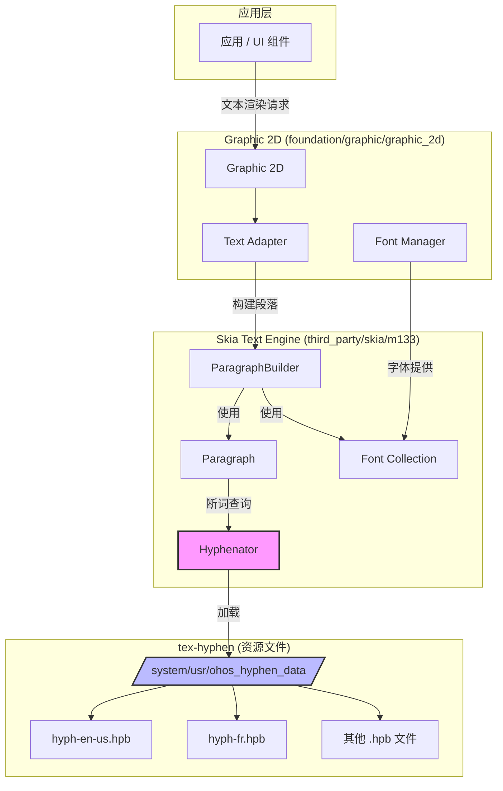

# 依赖关系与使用

> tex-hyphen 在 OpenHarmony 中的依赖关系和使用场景

---

## 概述

tex-hyphen 在 OpenHarmony 中以资源文件形式提供，被 **Skia 文本引擎** 加载和使用，最终服务于 **Graphic 2D** 模块的文本排版功能。它是一个底层依赖库，不直接面向应用开发者。

**依赖链**:
```
应用层（UI 组件）
    ↓ [文本渲染]
Graphic 2D (foundation/graphic/graphic_2d)
    ↓ [文本排版]
Skia Text Engine (third_party/skia/m133/modules/skparagraph)
    ↓ [断词查询]
Hyphenator (加载 .hpb)
    ↓ [读取资源]
tex-hyphen (/system/usr/ohos_hyphen_data/)
```

---

## 直接依赖者

### 依赖清单

| 模块 | 路径 | 依赖方式 | 使用方式 |
|-----|------|---------|---------|
| **skia_paragraph** | third_party/skia/m133/modules/skparagraph/ | 间接（代码级） | 加载 .hpb 文件，提供断词 API |
| **graphic_2d** | foundation/graphic/graphic_2d/ | 间接（GN 依赖） | 通过 Skia 间接使用 |

### 依赖分析

#### skia_paragraph

**文件位置**: `third_party/skia/m133/modules/skparagraph/BUILD.gn`

**依赖声明**:
```gn
# 无直接声明对 tex-hyphen 的依赖
# 通过运行时加载 .hpb 文件实现松耦合
```

**使用方式**:
```cpp
// third_party/skia/m133/modules/skparagraph/src/Hyphenator.cpp

const std::vector<uint8_t>& Hyphenator::loadPatternFile(const std::string& langCode) {
    std::string filename = "/system/usr/ohos_hyphen_data/" + hpbFileName;

    // 从系统路径加载 .hpb 文件
    std::ifstream file(filename, std::ios::binary);
    // ...
}
```

**集成方式**:
- **编译时**: 无依赖（资源文件）
- **运行时**: 动态加载 .hpb 文件
- **接口**: Hyphenator 类

#### graphic_2d

**文件位置**: `foundation/graphic/graphic_2d/frameworks/text/adapter/skia/BUILD.gn`

**依赖声明**:
```gn
if (graphic_2d_feature_upgrade_skia) {
  deps += [
    "//third_party/skia/m133/modules/skparagraph:skia_paragraph_ohos_new",
  ]
}
```

**使用方式**:
- 通过 Skia 的文本排版接口
- 使用 ParagraphBuilder 构建段落
- 自动应用断词规则

---

## Skia 集成详解

### Hyphenator 类

**文件位置**: `third_party/skia/m133/modules/skparagraph/include/Hyphenator.h`

**核心功能**:
```cpp
class Hyphenator {
public:
    // 单例模式
    static Hyphenator& getInstance();

    // 获取语言对应的断词数据
    const std::vector<uint8_t>& getHyphenatorData(const std::string& locale);

    // 查找断词位置
    std::vector<uint8_t> findBreakPositions(const SkString& locale,
                                         const SkString& text,
                                         size_t startPos,
                                         size_t endPos);

private:
    // 加载 .hpb 文件
    const std::vector<uint8_t>& loadPatternFile(const std::string& langCode);

    // 缓存已加载的语言
    std::map<std::string, std::vector<uint8_t>> fHyphenMap;
};
```

### 语言映射

**文件位置**: `third_party/skia/m133/modules/skparagraph/src/Hyphenator.cpp` (line 36-95)

**映射表**:
```cpp
const std::map<std::string, std::string> HPB_FILE_NAMES = {
    {"as", "hyph-as.hpb"},                 // Assamese
    {"be", "hyph-be.hpb"},                 // Belarusian
    {"bg", "hyph-bg.hpb"},                 // Bulgarian
    {"bn", "hyph-bn.hpb"},                 // Bengali
    // ...
    {"en-us", "hyph-en-us.hpb"},           // American English
    {"en-gb", "hyph-en-gb.hpb"},           // British English
    // ...
    {"pinyin", "hyph-zh-latn-pinyin.hpb"}, // Chinese Pinyin
};
```

**语言数量**: 51 种

### 加载机制

#### 懒加载（Lazy Loading）

**流程**:
```cpp
const std::vector<uint8_t>& Hyphenator::getHyphenatorData(const std::string& locale) {
    // 1. 尝试提取语言代码
    std::string langCode = getLanguageCode(locale, 2);
    if (langCode.empty()) {
        langCode = getLanguageCode(locale, 1);
    }

    // 2. 查找已缓存的数据
    auto search = fHyphenMap.find(langCode);
    if (search != fHyphenMap.end()) {
        return search->second;
    }

    // 3. 懒加载：首次使用时才加载
    return loadPatternFile(langCode);
}
```

**优势**:
- 减少启动时间
- 仅加载需要的语言
- 节省内存

#### 加载路径

**系统路径**: `/system/usr/ohos_hyphen_data/`

**文件名映射**:
```cpp
std::string filename = "/system/usr/ohos_hyphen_data/" + hpbFileName;
```

**示例**:
- locale="en-US" → 文件: `/system/usr/ohos_hyphen_data/hyph-en-us.hpb`
- locale="zh-CN-pinyin" → 文件: `/system/usr/ohos_hyphen_data/hyph-zh-latn-pinyin.hpb`

### 断词接口

#### findBreakPositions

**签名**:
```cpp
std::vector<uint8_t> findBreakPositions(const SkString& locale,
                                     const SkString& text,
                                     size_t startPos,
                                     size_t endPos);
```

**参数**:
- `locale`: 语言标识（如 "en-US"）
- `text`: 待断词的文本
- `startPos`: 起始位置
- `endPos`: 结束位置

**返回值**:
```cpp
std::vector<uint8_t> breakPositions;
// breakPositions[i] = 断词权重
// 0 表示不可断，>0 表示可断
```

**使用示例**:
```cpp
// 构造文本
SkString text = "extraordinary";

// 查找断词位置
std::vector<uint8_t> breaks = Hyphenator::getInstance()
    .findBreakPositions("en-US", text, 0, text.size());

// 处理断词结果
for (size_t i = 0; i < breaks.size(); i++) {
    if (breaks[i] > 0) {
        // 可以在位置 i 处断词
        printf("Can break at position %zu\n", i);
    }
}
```

---

## 使用场景

### 场景 1: 文本排版（Text Layout）

**典型应用**: 电子书阅读器、文档查看器、富文本编辑器

**需求**:
- 自动断词提升排版质量
- 支持多语言文本
- 适应不同屏幕宽度

**实现流程**:
```
1. 应用创建 Paragraph 对象
   ↓
2. Skia ParagraphBuilder 构建
   ↓
3. 根据语言选择断词策略
   ↓
4. Hyphenator 查找断词位置
   ↓
5. 应用断词优化行宽
   ↓
6. 渲染文本
```

**代码示例** (Skia Paragraph API):
```cpp
// 创建 ParagraphBuilder
ParagraphBuilder builder(paragraphStyle, fontCollection);

// 添加文本
builder.addText("This is an extraordinarily long word.");

// 构建段落
std::unique_ptr<Paragraph> paragraph = builder.Build();

// 布局（自动应用断词）
paragraph->layout(width);

// 渲染
paragraph->paint(canvas, x, y);
```

### 场景 2: 小屏设备优化

**典型应用**: 智能手机、可穿戴设备、平板电脑

**需求**:
- 在窄屏上显示更多内容
- 减少手动换行
- 提升阅读体验

**对比效果**:

**无断词**:
```
This is an
extraordinarily
long word
```

**有断词**:
```
This is an ex-
traordinarily
long word
```

**优势**:
- 行宽更均匀
- 减少空白区域
- 提升信息密度

### 场景 3: 多语言支持

**典型应用**: 国际化应用、系统 UI

**需求**:
- 支持多种语言
- 自动切换断词规则
- 符合语言习惯

**语言切换流程**:
```
1. 用户切换系统语言
   ↓
2. Graphic 2D 更新 locale
   ↓
3. Skia Paragraph 接收新 locale
   ↓
4. Hyphenator 加载对应 .hpb 文件
   ↓
5. 应用新的断词规则
```

**示例**:
```cpp
// 英语
ParagraphBuilder builder1(ParagraphStyle(), fontCollection);
builder1.addText("extraordinary");
builder1.Build()->layout(width);
// 输出: ex-traor-di-nary

// 法语
ParagraphBuilder builder2(ParagraphStyle(), fontCollection);
builder2.addText("extraordinaire");
builder2.Build()->layout(width);
// 输出: ex-tra-or-di-naire
```

### 场景 4: 自定义断词

**典型应用**: 专用排版软件、印刷出版

**需求**:
- 支持自定义断词规则
- 允许用户干预

**实现方式**:
```cpp
// Skia 支持自定义断词回调
class CustomHyphenator : public SkParagraph::Hyphenator {
public:
    std::vector<uint8_t> findBreaks(
        const char* text, size_t length,
        const char* locale) override {
        // 自定义断词逻辑
        // 可以调用 tex-hyphen 或实现自定义规则
    }
};
```

---

## 依赖关系图

### 完整依赖图



### 模块调用关系

```
应用 (ACE / NDK)
  │
  ├─> ArkUI / Graphic 2D
  │     │
  │     ├─> Skia Text Adapter
  │     │     │
  │     │     ├─> ParagraphBuilder
  │     │     │     │
  │     │     │     └─> Paragraph
  │     │     │           │
  │     │     │           └─> Hyphenator (断词)
  │     │     │                 │
  │     │     │                 └─> 加载 .hpb 文件
  │     │     │                       │
  │     │     │                       └─> tex-hyphen
  │     │     │
  │     │     └─> FontCollection
  │     │
  │     └─> FontManager
  │
  └─> 其他渲染路径
```

---

## 配置与控制

### ENABLE_TEXT_ENHANCE 宏

**定义位置**:
- `third_party/skia/m133/modules/skparagraph/BUILD.gn`
- `foundation/graphic/graphic_2d/frameworks/text/adapter/skia/BUILD.gn`

**启用条件**:
```gn
config("skia_libtxt_config") {
  if (graphic_2d_feature_upgrade_skia) {
    defines = [
      "ENABLE_TEXT_ENHANCE",  // 启用断词功能
    ]
  }
}
```

**控制层级**:
```
graphic_2d_feature_upgrade_skia (GN 配置)
    ↓
ENABLE_TEXT_ENHANCE (编译宏)
    ↓
#ifdef ENABLE_TEXT_ENHANCE (代码条件编译)
    ↓
Hyphenator 功能
```

### graphic_2d_feature_upgrade_skia

**作用**: 控制 Graphic 2D 是否使用升级版 Skia

**影响**:
- `true`: 使用 Skia m133，启用断词功能
- `false`: 使用旧版 Skia，禁用断词功能

### 运行时控制

**语言选择**:
- 通过 locale 参数控制
- 自动映射到对应的 .hpb 文件
- 失败时静默降级

**示例**:
```cpp
// 自动断词
paragraph = builder.Build();
paragraph->layout(width);  // 根据当前 locale 自动断词

// 手动控制（如果支持）
ParagraphStyle style;
style.setHyphenationEnabled(true);  // 启用断词
```

---

## 性能影响

### 内存占用

**加载开销**:
- 每个语言 .hpb 文件: ~5-10 KB
- 已缓存语言: 驻留内存
- 未使用语言: 不加载

**估算**:
```
场景 1: 单语言应用
  内存占用: ~5 KB

场景 2: 多语言应用（10 种语言）
  内存占用: ~50 KB
```

### 加载时间

**首次加载**:
- 文件读取: < 1ms
- 内存解析: < 1ms
- 总计: < 2ms

**后续使用**:
- 从缓存读取: < 0.1ms

### 查询性能

**断词查找**:
- 单词长度: 10-20 字符
- Trie 查找: O(单词长度)
- 总耗时: < 0.1ms

---

## 使用限制

### 1. 语言支持限制

**限制**: 仅支持预装的 51 种语言

**影响**:
- 不在支持列表的语言无法断词
- 需要手动回退到不使用断词

**解决方案**:
- 添加新语言的 .tex 文件
- 重新编译 tex-hyphen
- 更新 ROM

### 2. 断词质量限制

**限制**: 依赖上游断词模式的准确性

**影响**:
- 某些专业词汇可能断词不正确
- 需要手动调整

**解决方案**:
- 上报问题给上游
- 使用自定义断词规则

### 3. 安装路径限制

**限制**: 固定安装在 `/system/usr/ohos_hyphen_data/`

**影响**:
- 运行时无法更新
- 需要 OTA 更新

**解决方案**:
- 预留空间
- OTA 更新包含新语言

---

## 最佳实践

### 1. 语言选择

**建议**:
- 使用标准的 BCP 47 语言标签
- 例如: "en-US", "zh-CN", "fr-FR"

**反例**:
- ❌ "english", "chinese" (非标准)
- ✅ "en", "zh" (标准)

### 2. 降级处理

**建议**:
- 假设断词可能失败
- 提供降级方案

**代码示例**:
```cpp
Paragraph paragraph = builder.Build();
paragraph->layout(width);

// 检查是否需要重新布局（断词失败）
if (paragraph->didExceedMaxLines()) {
    // 降级方案 1: 增加行宽
    paragraph->layout(width * 1.2);

    // 降级方案 2: 禁用断词
    style.setHyphenationEnabled(false);
    paragraph = builder.Build();
    paragraph->layout(width);
}
```

### 3. 性能优化

**建议**:
- 缓存 Paragraph 对象
- 避免重复布局

**代码示例**:
```cpp
// ❌ 不好的做法
for (int i = 0; i < 100; i++) {
    Paragraph paragraph = builder.Build();  // 重复构建
    paragraph->layout(width);
}

// ✅ 好的做法
Paragraph paragraph = builder.Build();  // 构建一次
paragraph->layout(width);  // 布局一次
// 复用 paragraph 对象
```

---

## 总结

### 依赖关系特点

1. **松耦合**: Skia 通过文件路径加载，无编译时依赖
2. **可选功能**: 通过宏控制，可启用/禁用
3. **懒加载**: 按需加载语言，节省资源

### 使用场景覆盖

- **文本排版**: 提升排版质量
- **小屏优化**: 改善窄屏显示
- **多语言支持**: 国际化基础

### 关键优势

- **自动化**: 应用无需手动处理断词
- **高性能**: 懒加载 + 缓存机制
- **易维护**: 集中管理，易于升级

---

**相关文档**:
- [01_Overview.md](./01_Overview.md) - 原始库简介
- [03_Build_Integration.md](./03_Build_Integration.md) - OH 构建适配
- [_work/ASSESSMENT.md](_work/ASSESSMENT.md) - 0.3 节依赖分析
