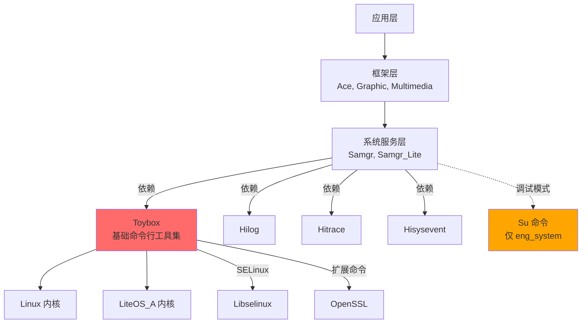
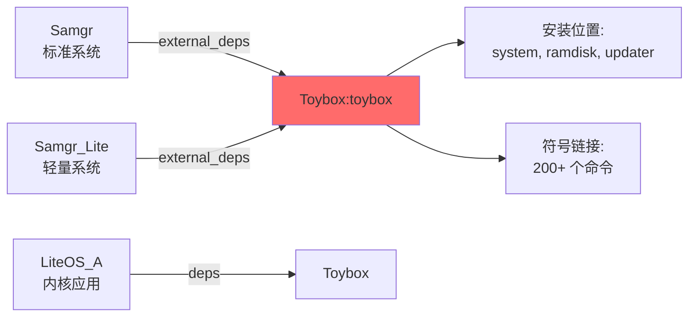

# Toybox 在 OpenHarmony 中的依赖关系与使用

> Toybox 是 OH 系统的基础命令行工具集，被多个核心模块依赖。

---

## 4.1 直接依赖者汇总

### 依赖者统计

**总计：3 个核心模块直接依赖 toybox**

| 序号 | 模块名称 | 模块路径 | 依赖类型 | 构建条件 | 适用系统类型 |
|------|---------|---------|---------|---------|------------|
| 1 | samgr | `foundation/systemabilitymgr/samgr/services/samgr/native` | external_deps: `toybox:toybox` | `use_musl` | standard（标准系统） |
| 2 | samgr_lite | `foundation/systemabilitymgr/samgr_lite/samgr` | external_deps: `toybox:toybox` | `ohos_kernel_type == "linux"` | small（轻量系统） |
| 3 | liteos_a | `kernel/liteos_a/apps` | deps: `toybox` | `LOSCFG_SHELL` | small（LiteOS-A 内核） |

### 依赖者详细说明

#### 1. SAMGR（标准系统能力管理器）

**模块路径**：`foundation/systemabilitymgr/samgr/services/samgr/native`

**BUILD.gn 依赖配置**：
```gn
# 文件：foundation/systemabilitymgr/samgr/services/samgr/native/BUILD.gn
# 位置：第 167 行

if (use_musl) {
  external_deps += [ "toybox:toybox" ]
}
```

**依赖条件**：
- `use_musl` 为 true 时启用
- 标准系统默认使用 musl libc

**使用场景**：
- samgr 可执行文件需要 toybox 提供的 shell 命令支持
- 系统启动和服务管理需要基础命令

**安装位置**：
- samgr 可执行文件：`/system/bin/samgr`
- toybox 可执行文件：`/system/bin/toybox`

#### 2. SAMGR_LITE（轻量系统能力管理器）

**模块路径**：`foundation/systemabilitymgr/samgr_lite/samgr`

**BUILD.gn 依赖配置**：
```gn
# 文件：foundation/systemabilitymgr/samgr_lite/samgr/BUILD.gn
# 位置：第 91 行

if (ohos_kernel_type == "linux") {
  external_deps = [ "toybox:toybox" ]
}
```

**依赖条件**：
- `ohos_kernel_type == "linux"` 时启用
- 仅在 Linux 内核的轻量系统中启用

**使用场景**：
- 轻量级系统能力管理器需要基础 shell 命令
- 用于进程管理和系统调试

**安装位置**：
- samgr_lite 可执行文件：`/bin/samgr`
- toybox 可执行文件：`/bin/toybox`

#### 3. LiteOS-A 内核应用

**模块路径**：`kernel/liteos_a/apps`

**BUILD.gn 依赖配置**：
```gn
# 文件：kernel/liteos_a/apps/BUILD.gn
# 位置：第 39 行

if (defined(LOSCFG_SHELL)) {
  deps += [ "toybox" ]
}
```

**依赖条件**：
- `LOSCFG_SHELL` 宏定义时启用
- 启用 LiteOS-A 的 shell 功能

**使用场景**：
- LiteOS-A 内核的用户空间 shell 环境
- 提供基础的文件操作和系统管理命令

**安装位置**：
- toybox 可执行文件：`/bin/toybox`
- 通过符号链接提供各个命令

---

## 4.2 Bundle.json 组件依赖声明

### 依赖 toybox 的组件

以下组件在 bundle.json 中声明了对 toybox 的依赖：

#### 1. samgr 组件

**文件路径**：`foundation/systemabilitymgr/samgr/bundle.json`

```json
{
  "component": {
    "name": "samgr",
    "subsystem": "systemabilitymgr",
    "deps": {
      "components": [
        "toybox",
        "hitrace",
        "hilog",
        "hisysevent",
        "param_watcher"
      ]
    }
  }
}
```

**依赖位置**：第 52 行

**依赖类型**：组件依赖（deps.components）

#### 2. samgr_lite 组件

**文件路径**：`foundation/systemabilitymgr/samgr_lite/bundle.json`

```json
{
  "component": {
    "name": "samgr_lite",
    "subsystem": "systemabilitymgr",
    "deps": {
      "components": [
        "toybox"
      ]
    }
  }
}
```

**依赖位置**：第 36 行

**依赖类型**：组件依赖（deps.components）

#### 3. liteos_a 组件

**文件路径**：`kernel/liteos_a/bundle.json`

```json
{
  "component": {
    "name": "liteos_a",
    "subsystem": "kernel",
    "deps": {
      "components": [
        "toybox",
        "bounds_checking_function",
        "wpa_supplicant"
      ]
    }
  }
}
```

**依赖位置**：第 41 行

**依赖类型**：组件依赖（deps.components）

---

## 4.3 产品定义中的 toybox 组件

toybox 被以下产品类型继承（通过 productdefine/common/inherit/*.json）：

### 标准系统产品

| 产品类型 | 配置文件 |
|---------|---------|
| phone（手机） | productdefine/common/inherit/phone.json |
| tablet（平板） | productdefine/common/inherit/tablet.json |
| 2in1（二合一设备） | productdefine/common/inherit/2in1.json |
| wearable（穿戴设备） | productdefine/common/inherit/wearable.json |
| ipcamera（IP 摄像头） | productdefine/common/inherit/ipcamera.json |
| rich（富设备） | productdefine/common/inherit/rich.json |
| standard_system（标准系统基座） | productdefine/common/base/standard_system.json |

### 轻量系统产品

| 产品类型 | 配置文件 |
|---------|---------|
| small_system（轻量系统基座） | productdefine/common/base/small_system.json |

### 继承示例

```json
{
  "parts": {
    "thirdparty:toybox": {}
  }
}
```

所有标准系统和轻量系统产品都默认继承 toybox 组件。

---

## 4.4 主要使用场景

### 1. 系统基础 shell 命令

**使用模块**：所有产品

**功能**：
- 提供基础的文件操作命令（ls, cp, mv, rm, mkdir, etc.）
- 提供文本处理命令（cat, grep, sed, awk, etc.）
- 提供系统管理命令（ps, kill, mount, umount, etc.）
- 提供网络工具（ifconfig, netstat, ping, etc.）

**典型用途**：
- 系统启动脚本执行
- 系统配置和初始化
- 开发和调试
- 日志分析

### 2. 系统服务管理

**使用模块**：samgr, samgr_lite

**功能**：
- samgr 使用 toybox 命令进行进程管理
- 系统服务启动和停止
- 服务状态检查

**典型用途**：
```bash
# samgr 使用示例
ps -ef | grep samgr
kill -SIGTERM <pid>
dmesg | tail
```

### 3. 内核 shell 环境

**使用模块**：liteos_a

**功能**：
- 为 LiteOS-A 内核提供用户空间 shell 环境
- 支持基础的文件操作和系统管理
- 提供嵌入式设备的调试接口

**典型用途**：
- 嵌入式设备调试
- 文件系统操作
- 进程管理
- 系统监控

### 4. 权限切换

**使用模块**：su 模块（仅调试版）

**功能**：
- 提供用户切换功能
- 仅允许 root (uid=0) 和 shell (uid=2000) 切换用户

**典型用途**：
```bash
# 切换到 root 用户
su - root

# 执行单个命令
su - root -c "dmesg | tail"
```

**安全说明**：
- su 命令仅安装在 eng_system 镜像（调试版）
- 生产版本不包含 su 命令
- 权限限制严格，防止权限滥用

### 5. 开发与调试

**使用模块**：开发者工具

**功能**：
- 提供丰富的命令行工具用于开发和调试
- 网络测试（ping, ifconfig, netstat）
- 性能分析（top, free, vmstat）
- 日志分析（dmesg, logger）

**典型用途**：
- 应用调试
- 系统性能分析
- 网络问题排查
- 日志收集和分析

---

## 4.5 依赖关系图

### 完整依赖关系图



### toybox 被依赖的模块关系



### toybox 内部结构

```mermaid
graph TB
    A[Toybox 可执行文件] --> B[main.c]
    B --> C[toy_exec]

    C -->|根据 argv[0] 选择| D[命令调度器]

    D --> E[lib/<br/>基础库]
    D --> F[toys/posix/<br/>标准命令]
    D --> G[toys/lsb/<br/>LSB 命令]
    D --> H[toys/other/<br/>其他命令]
    D --> I[toys/net/<br/>网络命令]
    D --> J[toys/pending/<br/>扩展命令]

    E --> K[TOYBOX_OH_ADAPT<br/>OH 适配层]

    style A fill:#ff6b6b
    style K fill:#ffa502
```

---

## 4.6 符号链接机制

### 符号链接结构

#### 标准系统

```
/system/bin/
├── toybox           (可执行文件，~73KB)
├── ls -> toybox     (符号链接)
├── cat -> toybox    (符号链接)
├── cp -> toybox     (符号链接)
├── mv -> toybox     (符号链接)
├── ps -> toybox     (符号链接)
├── grep -> toybox   (符号链接)
├── sed -> toybox    (符号链接)
└── ... (200+ 个符号链接)
```

#### 轻量系统

```
/bin/
├── toybox           (可执行文件，~73KB)
├── ls -> toybox     (符号链接)
├── cat -> toybox    (符号链接)
├── cp -> toybox     (符号链接)
├── mv -> toybox     (符号链接)
├── ps -> toybox     (符号链接)
├── grep -> toybox   (符号链接)
├── sed -> toybox    (符号链接)
└── ... (200+ 个符号链接)

/usr/bin/            (可选，toybox_feature_support_usr_symlink)
├── ls -> /bin/toybox
├── cat -> /bin/toybox
├── cp -> /bin/toybox
└── ...
```

### 符号链接示例

#### 创建符号链接

**标准系统**（OH 构建系统自动创建）：
```bash
# OH 构建系统自动创建
ln -s toybox ls
ln -s toybox cat
ln -s toybox cp
...
```

**LiteOS_A**（通过 install.py 脚本创建）：
```bash
# 通过 install.py 脚本创建
exec_script("install.py", ["--long_path", "bin/ls", ...])
```

#### 执行命令

```bash
# 用户执行
$ ls -l /bin/ls

# 符号链接指向
lrwxrwxrwx 1 root root 6 Feb  8 03:17 /bin/ls -> toybox

# 实际执行
$ /bin/ls -l

# toybox 内部处理
argv[0] = "/bin/ls"
-> 提取命令名："ls"
-> 查找并调用 ls_main() 函数
```

### 符号链接数量

| 系统类型 | 符号链接数量 | 主要命令 |
|---------|------------|---------|
| **标准系统** | ~200+ | ls, cat, ps, mount, ifconfig, grep, sed, etc. |
| **轻量系统** | ~200+ | ls, cat, ps, mount, ifconfig, grep, sed, etc. |
| **扩展命令** | +20+ | wget, awk, diff, telnet, traceroute, etc. |

---

## 4.7 依赖类型分析

### 1. external_deps（外部依赖）

**使用模块**：samgr, samgr_lite

**依赖声明**：
```gn
external_deps = [ "toybox:toybox" ]
```

**特点**：
- 通过 OH 组件系统管理
- 需要在 bundle.json 的 deps.components 中声明
- 编译时解析依赖关系
- 支持条件编译

**优势**：
- 组件级别的依赖管理
- 清晰的依赖关系
- 易于维护和更新

### 2. deps（直接依赖）

**使用模块**：liteos_a

**依赖声明**：
```gn
deps += [ "toybox" ]
```

**特点**：
- 直接依赖同一目录下的构建目标
- 不需要 bundle.json 声明
- 用于同一子系统内的依赖

**优势**：
- 简单直接
- 适用于同一子系统内的模块

### 3. 编译时依赖

**所有依赖类型**：
- toybox 的依赖都是编译时依赖
- 不存在运行时动态链接（toybox 本身是静态链接）
- 符号链接在运行时提供命令入口

---

## 4.8 toybox 的依赖

### toybox 依赖的组件

| 组件 | 用途 | 条件 |
|-----|------|------|
| **selinux** | SELinux 安全策略支持 | build_selinux = true |
| **openssl** | 加密功能支持（扩展命令） | toybox_extended_cmd = true |

### 依赖配置

```gn
# SELinux 支持
if (build_selinux) {
  external_deps = [
    "selinux:libselinux",
  ]
}

# 扩展命令支持
if (toybox_extended_cmd) {
  external_deps = [
    "openssl:libcrypto_shared",
    "openssl:libssl_shared",
  ]
}
```

---

## 4.9 依赖关系总结

### 依赖层级

```
┌─────────────────────────────────────┐
│ 应用层                               │
│ (应用、服务、脚本)                   │
└─────────────────────────────────────┘
              ↓ 依赖
┌─────────────────────────────────────┐
│ 系统服务层                           │
│ - Samgr (标准系统)                  │
│ - Samgr_Lite (轻量系统)             │
└─────────────────────────────────────┘
              ↓ 依赖
┌─────────────────────────────────────┐
│ Toybox 基础命令行工具集              │
│ - 200+ 个命令                      │
│ - 多调用二进制                      │
└─────────────────────────────────────┘
              ↓ 依赖
┌─────────────────────────────────────┐
│ 内核层                               │
│ - Linux 内核                       │
│ - LiteOS_A 内核                    │
└─────────────────────────────────────┘
```

### 关键依赖关系

| 依赖关系 | 类型 | 说明 |
|---------|------|------|
| **应用 → Toybox** | 间接 | 应用通过 Shell 调用 toybox 命令 |
| **Samgr → Toybox** | external_deps | Samgr 可执行文件依赖 toybox |
| **Samgr_Lite → Toybox** | external_deps | Samgr_Lite 可执行文件依赖 toybox |
| **LiteOS_A → Toybox** | deps | LiteOS_A shell 环境依赖 toybox |
| **Toybox → SELinux** | external_deps | SELinux 支持时依赖 |
| **Toybox → OpenSSL** | external_deps | 扩展命令时依赖 |

---

## 4.10 使用 toybox 的最佳实践

### 1. 脚本编写

**推荐做法**：
- 使用 toybox 提供的命令编写 shell 脚本
- 避免依赖非 toybox 命令
- 使用 POSIX 兼容的语法

**示例**：
```bash
#!/bin/sh
# 依赖 toybox 命令
ls -l /system/bin
ps -ef | grep myapp
cat /etc/config.txt
```

### 2. 调试工具

**推荐做法**：
- 使用 toybox 命令进行系统调试
- 结合 dmesg, ps, top 等命令分析问题

**示例**：
```bash
# 查看系统日志
dmesg | tail -100

# 查看进程状态
ps -ef

# 查看系统资源
free -m
vmstat 1 5
```

### 3. 网络调试

**推荐做法**：
- 使用 toybox 网络工具进行网络调试
- ping, ifconfig, netstat 等工具

**示例**：
```bash
# 测试网络连接
ping -c 4 8.8.8.8

# 查看网络接口
ifconfig

# 查看网络连接
netstat -an
```

---

## 参考文档

- [01_Overview.md](./01_Overview.md) - Toybox 库简介
- [02_Patches.md](./02_Patches.md) - OH Patch 详细分析
- [03_Build_Integration.md](./03_Build_Integration.md) - OH 构建适配
- [_work/ASSESSMENT.md](./_work/ASSESSMENT.md) - 项目评估结果
