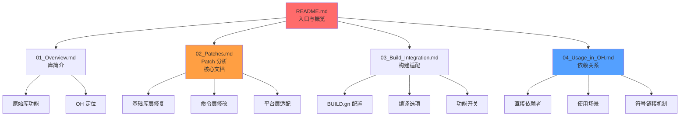

# Toybox 文档阅读路线

> 本文档提供针对不同角色的 Toybox 阅读建议。

---

## 🎯 我是谁？

### 场景 1：开发者 - 了解 toybox 的 OH 适配

**目标**：理解 OH 对 toybox 的修改和定制化内容

**阅读路径**：
1. ⏱️ **5 分钟**：[README.md](./README.md) - 快速了解 toybox 在 OH 中的定位和关键修改
2. ⏱️ **15 分钟**：[02_Patches.md](./02_Patches.md) - 重点查看 Patch 清单表和关键代码修改
3. ⏱️ **10 分钟**：[03_Build_Integration.md](./03_Build_Integration.md) - 了解构建配置和功能开关

**输出**：能够识别 OH 特有的修改点，理解为什么需要这些修改

---

### 场景 2：系统工程师 - 升级 toybox 版本

**目标**：评估升级风险，制定升级计划

**阅读路径**：
1. ⏱️ **5 分钟**：[README.md](./README.md) - 查看维护与升级章节
2. ⏱️ **30 分钟**：[02_Patches.md](./02_Patches.md) - 逐个检查所有 Patch，评估是否需要保留
3. ⏱️ **15 分钟**：[03_Build_Integration.md](./03_Build_Integration.md) - 检查 BUILD.gn 配置差异
4. ⏱️ **10 分钟**：[_work/ASSESSMENT.md](./_work/ASSESSMENT.md) - 查看回归风险评估

**输出**：升级清单、需要重新应用的修改、测试重点

---

### 场景 3：集成工程师 - 添加 toybox 命令

**目标**：在 OH 中启用新的 toybox 命令或修改现有命令

**阅读路径**：
1. ⏱️ **20 分钟**：[03_Build_Integration.md](./03_Build_Integration.md) - 理解 BUILD.gn 结构和命令列表管理
2. ⏱️ **15 分钟**：[02_Patches.md](./02_Patches.md) - 参考现有 Patch 的实现方式
3. ⏱️ **10 分钟**：[_work/ASSESSMENT.md](./_work/ASSESSMENT.md) - 了解适配策略和代码组织

**输出**：修改方案、BUILD.gn 更新步骤、测试计划

---

### 场景 4：安全工程师 - 评估 toybox 安全性

**目标**：了解 toybox 的安全加固和 CVE 风险

**阅读路径**：
1. ⏱️ **10 分钟**：[README.md](./README.md) - 查看安全加固章节（PIE/RELRO/NX, su 限制）
2. ⏱️ **15 分钟**：[03_Build_Integration.md](./03_Build_Integration.md) - 分析链接安全标志和编译选项
3. ⏱️ **10 分钟**：[02_Patches.md](./02_Patches.md) - 检查是否有安全相关的 Patch

**输出**：安全评估报告、已知 CVE 状态、安全加固建议

---

### 场景 5：架构师 - 理解 toybox 在 OH 中的地位

**目标**：全面了解 toybox 的设计决策、依赖关系和维护成本

**阅读路径**：
1. ⏱️ **5 分钟**：[README.md](./README.md) - 整体概览
2. ⏱️ **20 分钟**：[01_Overview.md](./01_Overview.md) - 了解 toybox 的功能和 OH 中的定位
3. ⏱️ **15 分钟**：[04_Usage_in_OH.md](./04_Usage_in_OH.md) - 分析依赖关系和使用场景
4. ⏱️ **15 分钟**：[_work/ASSESSMENT.md](./_work/ASSESSMENT.md) - 查看适配策略和维护建议

**输出**：架构评估报告、维护成本分析、替代方案建议

---

### 场景 6：测试工程师 - 编写测试用例

**目标**：基于 OH 适配编写针对性的测试

**阅读路径**：
1. ⏱️ **30 分钟**：[02_Patches.md](./02_Patches.md) - 提取所有修改点和修复的问题
2. ⏱️ **15 分钟**：[03_Build_Integration.md](./03_Build_Integration.md) - 了解功能开关和编译选项组合
3. ⏱️ **10 分钟**：[04_Usage_in_OH.md](./04_Usage_in_OH.md) - 了解主要使用场景

**输出**：测试用例清单、回归测试计划、不同构建配置的测试矩阵

---

### 场景 7：新手 - 从零开始学习

**目标**：系统性地了解 toybox 在 OH 中的集成

**阅读路径**：
1. ⏱️ **10 分钟**：[README.md](./README.md) - 快速入门
2. ⏱️ **20 分钟**：[01_Overview.md](./01_Overview.md) - 理解 toybox 的基本概念
3. ⏱️ **30 分钟**：[02_Patches.md](./02_Patches.md) - 深入了解 OH 适配内容
4. ⏱️ **20 分钟**：[03_Build_Integration.md](./03_Build_Integration.md) - 理解构建系统
5. ⏱️ **15 分钟**：[04_Usage_in_OH.md](./04_Usage_in_OH.md) - 了解依赖关系

**输出**：全面理解 toybox 在 OH 中的集成

---

## 📚 文档结构说明

### 核心文档关系图

### 文档特点

| 文档 | 特点 | 适合人群 |
|-----|------|---------|
| README.md | 🚀 快速入门、导航清晰 | 所有人 |
| SUMMARY.md | 🗺️ 场景化阅读路线 | 所有人 |
| 01_Overview.md | 📖 简洁明了、聚焦 OH 作用 | 架构师、新手 |
| 02_Patches.md | 🔧 详细、证据优先 | 开发者、测试工程师 |
| 03_Build_Integration.md | 🔨 实操性强、配置清晰 | 集成工程师、系统工程师 |
| 04_Usage_in_OH.md | 🔗 关系图清晰、场景明确 | 架构师、集成工程师 |
| _work/ASSESSMENT.md | 📊 全面评估、决策参考 | 系统工程师、架构师 |

---

## ⚡ 快速参考

### 常见问题速查

| 问题 | 查看文档 |
|-----|---------|
| toybox 是什么？ | [01_Overview.md](./01_Overview.md) |
| OH 修改了哪些内容？ | [02_Patches.md](./02_Patches.md) |
| 如何启用/禁用某个命令？ | [03_Build_Integration.md](./03_Build_Integration.md) |
| 哪些模块依赖 toybox？ | [04_Usage_in_OH.md](./04_Usage_in_OH.md) |
| 升级 toybox 版本有什么风险？ | [README.md](./README.md) 维护与升级章节 |
| su 命令的权限限制是什么？ | [_work/ASSESSMENT.md](./_work/ASSESSMENT.md) 0.2 节 |

### 关键修改索引

| 修改类型 | 影响范围 | 查看位置 |
|---------|----------|---------|
| **稳定性修复** | 所有命令 | [02_Patches.md](./02_Patches.md) - 基础库层修复 |
| **命令优化** | ls, cp/mv, ps, top | [02_Patches.md](./02_Patches.md) - 命令层修改 |
| **64 位适配** | 参数解析 | [02_Patches.md](./02_Patches.md) - lib/args.c |
| **LiteOS_A 适配** | 20+ 命令 | [_work/ASSESSMENT.md](./_work/ASSESSMENT.md) 0.2 节 |
| **SELinux 集成** | chcon, restorecon | [03_Build_Integration.md](./03_Build_Integration.md) |

---

## 📝 文档使用建议

### 1. 先读 README.md
快速了解 toybox 的定位和关键修改，确定是否需要深入了解。

### 2. 按场景选择文档
根据你的角色和目标，参考上方的阅读路径。

### 3. 关注 Patch 分析
[02_Patches.md](./02_Patches.md) 是核心文档，包含所有 OH 定制化内容的详细说明。

### 4. 理解构建系统
[03_Build_Integration.md](./03_Build_Integration.md) 解释了 toybox 如何集成到 OH 构建系统。

### 5. 掌握依赖关系
[04_Usage_in_OH.md](./04_Usage_in_OH.md) 展示了 toybox 在 OH 系统中的位置和使用场景。

---

## 🔄 文档更新记录

| 日期 | 版本 | 更新内容 |
|-----|------|---------|
| 2026-02-08 | 1.0 | 初始版本，完成所有核心文档 |
