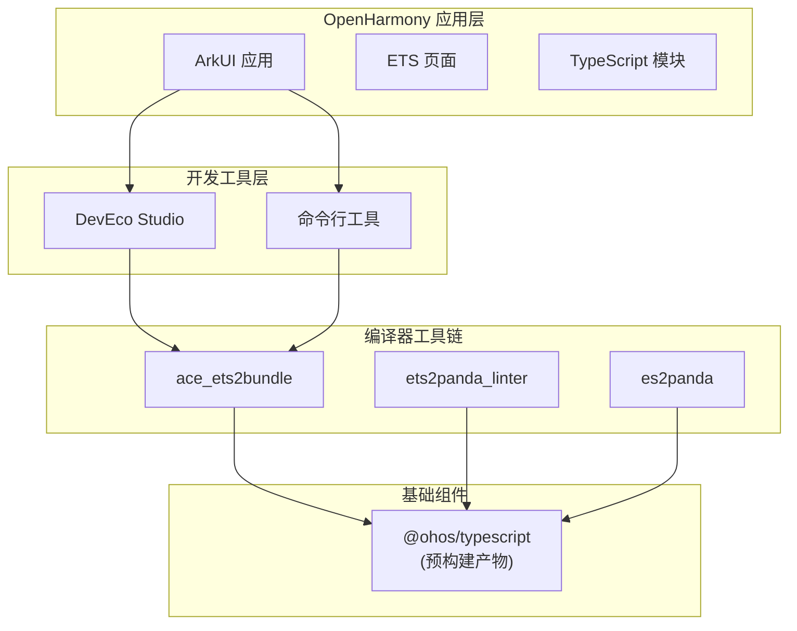

# OpenHarmony 中的使用场景与依赖关系

## 4.1 依赖关系概览

### 4.1.1 直接依赖者

TypeScript 在 OpenHarmony 中被以下模块直接依赖：

| 模块名称 | 路径 | 用途 |
|---------|------|------|
| **ace_ets2bundle** | `//developtools/ace_ets2bundle` | eTS 应用打包工具 |
| **ets2panda_linter** | `//arkcompiler/ets_frontend/ets2panda/linter` | eTS 代码检查工具 |
| **es2panda** | `//arkcompiler/ets_frontend/es2panda` | eTS 到 Panda IR 编译器 |

### 4.1.2 间接依赖者

除直接依赖外，TypeScript 还通过上述模块被间接依赖：

- **DevEco Studio**：通过 ace_ets2bundle 提供 IDE 中的 TypeScript/eTS 支持
- **etsc 编译器**：通过 es2panda 提供编译能力
- **单元测试框架**：通过 linter 集成类型检查

### 4.1.3 依赖关系图



## 4.2 ace_ets2bundle 使用方式

### 4.2.1 模块介绍

**路径**：`//developtools/ace_ets2bundle`

**功能**：eTS 应用打包工具，负责将 eTS/TypeScript 源码和资源打包为 HAP（Harmony Ability Package）格式。

### 4.2.2 BUILD.gn 配置

```gn
# developtools/ace_ets2bundle/BUILD.gn

# 获取 TypeScript 产物路径
typescript_dir = get_label_info("//third_party/typescript:build_typescript",
                                 "target_out_dir")

# 声明对 TypeScript 的依赖
ohos_prebuilt_etc("ets2bundle_prebuilt") {
    source = "${typescript_dir}/ohos-typescript-4.9.5-r4.tgz"
    # 提取到本地使用
}

# 构建目标
group("ace_ets2bundle") {
    deps = [
        ":ets2bundle_prebuilt",
        ":其他依赖",
    ]
}
```

### 4.2.3 使用场景

**场景一：编译 eTS 源码**

```typescript
// ace_ets2bundle 内部调用 tsc
import * as ts from 'typescript';

// 配置编译选项
const compilerOptions: ts.CompilerOptions = {
    target: ts.ScriptTarget.ES2017,
    module: ts.ModuleKind.CommonJS,
    strict: true,
    esModuleInterop: true,
};

// 编译文件
const result = ts.compile(
    sourceCode,
    compilerOptions,
    (fileName) => readFile(fileName),
    (fileName, data) => writeFile(fileName, data)
);
```

**场景二：类型检查**

```typescript
// 在打包过程中进行类型检查
function runTypeCheck(projectDir: string): TypeCheckResult {
    const program = ts.createProgram(
        findTSFiles(projectDir),
        compilerOptions
    );

    const diagnostics = ts.getPreEmitDiagnostics(program);

    return {
        success: diagnostics.length === 0,
        errors: diagnostics.map(d => formatDiagnostic(d)),
    };
}
```

### 4.2.4 调用链路

```
用户点击"构建"
        │
        ▼
DevEco Studio / hdc 命令
        │
        ▼
ace_ets2bundle
        │
        ├── 读取项目配置
        ├── 调用 tsc 编译
        │       │
        │       ▼
        │   @ohos/typescript
        │
        ├── 打包资源
        └── 生成 HAP
```

## 4.3 ets2panda_linter 使用方式

### 4.3.1 模块介绍

**路径**：`//arkcompiler/ets_frontend/ets2panda/linter`

**功能**：eTS 代码检查工具，使用 TypeScript 编译器进行静态代码分析，检查类型错误、代码规范问题等。

### 4.3.2 BUILD.gn 配置

```gn
# arkcompiler/ets_frontend/ets2panda/linter/BUILD.gn

# 获取 TypeScript 路径
typescript_dir = get_label_info("//third_party/typescript:build_typescript",
                                 "target_out_dir")

# 使用 tsc 进行类型检查
ohos_executable("ets2panda_linter") {
    sources = ["linter_main.cpp"]

    # 传递 tsc 路径作为参数
    args = [
        "--typescript",
        rebase_path("${typescript_dir}/ohos-typescript-4.9.5-r4.tgz"),
    ]

    deps = [
        "//third_party/typescript:build_typescript_etc",
        "//其他依赖",
    ]
}
```

### 4.3.3 使用场景

**场景一：增量类型检查**

```bash
# 命令行调用
ets2panda_linter --typescript path/to/typescript.tgz --project myproject

# 输出
error TS2304: Cannot find name 'State'
error TS2304: Cannot find name 'Prop'
```

**场景二：CI/CD 集成**

```yaml
# .ci/workflows/lint.yml
- name: Run eTS Linter
  run: |
    ets2panda_linter \
        --typescript third_party/typescript/ohos-typescript-4.9.5-r4.tgz \
        --project ./features/myfeature \
        --strict
```

### 4.3.4 与 tsc 的关系

`ets2panda_linter` 使用 TypeScript 编译器的能力，但不直接调用 `tsc` 命令行。而是通过 Node.js API 调用 TypeScript 编译器：

```typescript
// 内部实现（伪代码）
import * as ts from 'typescript';

function runLint(projectPath: string): LintResult {
    // 创建虚拟文件系统
    const host = ts.createCompilerHost(compilerOptions);

    // 创建程序
    const program = ts.createProgram({
        rootNames: findETSFiles(projectPath),
        options: compilerOptions,
        host: host,
    });

    // 获取诊断信息
    const diagnostics = ts.getPreEmitDiagnostics(program);

    return formatLintResults(diagnostics);
}
```

## 4.4 es2panda 使用方式

### 4.4.1 模块介绍

**路径**：`//arkcompiler/ets_frontend/es2panda`

**功能**：eTS 到 Panda IR 的编译器前端，将 eTS/TypeScript 源码编译为 Panda VM 的中间表示（IR）。

### 4.4.2 BUILD.gn 配置

```gn
# arkcompiler/ets_frontend/es2panda/BUILD.gn

# TypeScript 核心类型文件（编译到 C++ 二进制中）
ts_sources = [
    "typescript/checker.cpp",
    "typescript/core/binaryLikeExpression.cpp",
    "typescript/core/destructuringContext.cpp",
    "typescript/core/function.cpp",
    "typescript/core/helpers.cpp",
    "typescript/core/object.cpp",
    "typescript/core/typeCreation.cpp",
    "typescript/core/typeElaborationContext.cpp",
    "typescript/core/typeRelation.cpp",
    "typescript/core/util.cpp",
    # ... 更多类型相关文件
]

# 类型系统源文件
ts_type_sources = [
    "typescript/types/anyType.cpp",
    "typescript/types/arrayType.cpp",
    "typescript/types/bigintLiteralType.cpp",
    "typescript/types/bigintType.cpp",
    "typescript/types/booleanType.cpp",
    "typescript/types/classType.cpp",
    # ... 更多类型文件
]

# 编译为 C++ 库
source_set("es2panda_typescript") {
    sources = ts_sources + ts_type_sources

    deps = [
        "//third_party/libpandabase:libpandabase",
        "//third_party/libpandamisc:libpandamisc",
    ]
}
```

### 4.4.3 使用场景

**场景一：编译 eTS 到 IR**

```bash
# 命令行调用
es2panda --input-path mycomponent.ets --output-path mycomponent.ir

# 内部流程
1. 解析 eTS 源码
2. 使用 TypeScript 类型系统进行类型检查
3. 生成 Panda IR
4. 优化 IR
5. 输出 .abc 文件
```

**场景二：作为库集成**

```cpp
// 在 C++ 代码中使用 TypeScript 类型系统
#include "typescript/checker.h"

void compileETS(const std::string& source, PandaIR& ir) {
    // 1. 创建 TypeScript 编译器实例
    auto checker = std::make_unique<typescript::Checker>();

    // 2. 解析源码
    auto sourceFile = checker->parse(source);

    // 3. 类型检查
    checker->check(sourceFile);

    // 4. 生成 IR
    ir = checker->emitIR();
}
```

### 4.4.4 TypeScript 类型系统的 C++ 移植

es2panda 不仅仅调用 TypeScript，它**移植了 TypeScript 的类型系统到 C++**：

| TypeScript (JS) | es2panda (C++) |
|----------------|---------------|
| `checker.ts` | `typescript/checker.cpp` |
| `types/classType.ts` | `typescript/types/classType.cpp` |
| `core/typeRelation.ts` | `typescript/core/typeRelation.cpp` |

**原因**：es2panda 是 C++ 编译器，无法直接调用 JavaScript。通过移植类型系统，实现了：
- 统一的类型检查逻辑
- 与 Panda VM 的无缝集成
- 高效的编译性能

## 4.5 使用方式汇总

### 4.5.1 静态链接 vs 动态调用

| 使用方式 | 模块 | 说明 |
|---------|------|------|
| **静态链接** | es2panda | TypeScript 类型系统编译到 C++ 二进制 |
| **预构建产物** | ace_ets2bundle | 运行时解压并调用 tsc |
| **命令行参数** | ets2panda_linter | 作为命令行参数传递 tgz 路径 |

### 4.5.2 头文件引用

**TypeScript 层面**：

```typescript
// 标准的 TypeScript 引用
import * as ts from 'typescript';

// OH 特定扩展引用
import { StructDeclaration, EtsComponent } from './ets-extensions';
```

**C++ 层面**（es2panda）：

```cpp
// TypeScript 类型系统头文件
#include "typescript/checker.h"
#include "typescript/types/classType.h"
```

## 4.6 依赖关系详细图

```mermaid
graph LR
    subgraph "应用层"
        App[ArkUI 应用]
    end

    subgraph "开发工具"
        IDE[DevEco Studio]
        CLI[命令行工具]
    end

    subgraph "打包工具"
        Bundle[ace_ets2bundle]
    end

    subgraph "编译器前端"
        Linter[ets2panda_linter]
        Es2panda[es2panda]
    end

    subgraph "运行时"
        PandaVM[Panda VM]
    end

    subgraph "TypeScript"
        TSC[@ohos/typescript]
        TS_CPP[es2panda Typescript]
    end

    App --> IDE
    App --> CLI

    IDE --> Bundle
    CLI --> Bundle

    Bundle --> TSC

    Linter --> TSC

    Es2panda --> TS_CPP

    Bundle --> PandaVM
    Es2panda --> PandaVM
```

## 4.7 版本兼容性

### 4.7.1 模块版本要求

| 模块 | TypeScript 版本要求 | 兼容说明 |
|-----|-------------------|---------|
| ace_ets2bundle | 4.9.5-r4+ | 需要完整的 tsc 功能 |
| ets2panda_linter | 4.9.5-r4+ | 需要语言服务 API |
| es2panda | 4.9.5-r4+ | 需要类型系统 C++ 接口 |

### 4.7.2 升级影响评估

升级 TypeScript 版本时，各模块的兼容性影响：

| 升级类型 | 影响模块 | 风险等级 |
|---------|---------|---------|
| 上游 patch 更新 | 所有模块 | 低 |
| 上游 minor 更新 | es2panda | 高 |
| 上游 major 更新 | 所有模块 | 极高 |

**说明**：
- **低风险**：通常只需要更新版本号即可
- **高风险**：es2panda 依赖 TypeScript 内部结构，可能需要修改 C++ 代码
- **极高风险**：可能涉及 API 变更，需要全面测试
