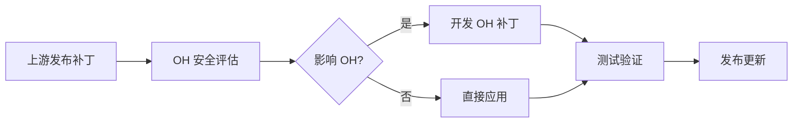

# 安全风险分析

## 6.1 漏洞管理概述

### 6.1.1 上游安全状态

TypeScript 作为微软维护的开源项目，拥有活跃的安全响应机制。其安全状态总体良好，但作为大型 JavaScript 项目，仍存在一些潜在风险。

**上游已知漏洞**：截至当前版本（4.9.5），TypeScript 上游未报告严重安全漏洞。JavaScript 编译器类项目的漏洞通常集中在：
- 正则表达式拒绝服务（ReDoS）
- 路径遍历
- 代码注入

**漏洞修复策略**：微软通过 GitHub Security Advisory 和 npm Security Advisory 跟踪和发布安全修复。OH 需要同步上游的安全更新。

### 6.1.2 OH 适配影响

OH 对 TypeScript 的适配可能引入新的安全考量：

**新攻击面**：eTS 特有语法（@Builder、struct 等）可能引入新的解析边界情况
**配置变更**：OH 特定的编译器选项可能改变默认安全行为
**集成风险**：与 es2panda、ace_ets2bundle 的集成可能引入额外风险

## 6.2 上游已知 CVE

### 6.2.1 CVE 列表

截至 TypeScript 4.9.5，TypeScript 上游公开披露的 CVE 较少。以下是相关安全公告：

| CVE ID | 严重程度 | 描述 | 影响版本 | 修复版本 |
|--------|---------|------|---------|---------|
| 无公开 CVE | - | - | - | - |

**说明**：TypeScript 作为编译器，其安全风险相对较低。主要风险在于编译过程中处理恶意代码的能力。

### 6.2.2 安全公告跟踪

建议关注以下渠道获取 TypeScript 安全信息：

| 渠道 | URL | 说明 |
|-----|-----|------|
| GitHub Security Advisory | github.com/Microsoft/TypeScript/security/advisories | 官方安全公告 |
| npm Security Alerts | npmjs.com/advisories | npm 包安全 |
| GitHub Dependabot | github.com/Microsoft/TypeScript/pulls?q=dependabot | 依赖更新 |

## 6.3 OH 适配风险

### 6.3.1 新增攻击面

**风险一：eTS 语法解析**

OH 新增的 eTS 语法（struct、装饰器等）可能引入解析器层面的安全风险：

| 风险场景 | 描述 | 风险等级 |
|---------|------|---------|
| 深度嵌套结构 | struct 嵌套层数过多可能导致栈溢出 | 低 |
| 复杂装饰器 | 装饰器参数解析可能存在边界情况 | 低 |
| 状态样式递归 | stateStyles 循环引用 | 低 |

**缓解措施**：

```typescript
// 示例：添加解析深度限制
const MAX_STRUCT_NESTING = 50;
const MAX_DECORATOR_DEPTH = 20;

function parseStructDeclaration(node: StructDeclaration): void {
    if (currentNestingDepth > MAX_STRUCT_NESTING) {
        throw new DiagnosticError(
            DiagnosticCode.StructNestingTooDeep,
            "Struct nesting exceeds maximum depth"
        );
    }
    // 继续解析
}
```

**风险二：代码生成安全**

eTS 编译到 Panda IR 的过程可能引入代码注入风险：

| 风险场景 | 描述 | 风险等级 |
|---------|------|---------|
| 字符串注入 | 用户输入被错误地包含在生成的代码中 | 低 |
| 符号注入 | 恶意符号名干扰代码生成 | 低 |
| 元编程滥用 | 使用 eval 替代品执行动态代码 | 中 |

**缓解措施**：es2panda 使用类型检查和代码审计来防止注入攻击。

### 6.3.2 配置相关风险

**风险三：宽松的类型检查配置**

| 配置风险 | 描述 | 影响 |
|---------|------|------|
| `noImplicitAny: false` | 隐式 any 类型绕过类型检查 | 增加运行时错误风险 |
| `strictNullChecks: false` | 空值检查禁用 | 增加空指针异常风险 |
| `skipLibCheck: true` | 跳过库类型检查 | 可能忽略类型错误 |

**建议**：OH 应强制使用严格类型检查配置：

```json
{
    "compilerOptions": {
        "strict": true,
        "noImplicitAny": true,
        "strictNullChecks": true,
        "noImplicitThis": true,
        "alwaysStrict": true
    }
}
```

### 6.3.3 依赖链风险

**风险四：npm 依赖安全**

TypeScript 编译过程可能使用 npm 依赖（虽然预构建版本不直接使用）：

| 风险 | 描述 | 缓解措施 |
|-----|------|---------|
| 恶意依赖 | 依赖包包含恶意代码 | 依赖审计、定期更新 |
| 供应链攻击 | 依赖包被劫持 | 锁定依赖版本、使用哈希校验 |
| 依赖混淆 | 私有包名与公共包冲突 | 使用 scoped 包 |

## 6.4 安全最佳实践

### 6.4.1 构建时安全

**代码审查**：
- 所有 eTS 代码应经过静态分析
- 避免使用 `eval()` 和类似动态代码执行
- 敏感操作应使用类型安全的 API

**编译器配置**：

```json
{
    "compilerOptions": {
        // 安全相关选项
        "noEmitOnError": true,           // 错误时禁止输出
        "noImplicitAny": true,            // 禁止隐式 any
        "strictNullChecks": true,        // 严格空值检查
        "noUncheckedIndexedAccess": true, // 严格索引访问

        // 性能安全
        "maxNodeModuleJsDepth": 0,        // 限制模块解析深度

        // 禁用的危险功能
        "allowJs": false,                 // 禁止混合 JS
        "checkJs": false                  // 禁用 JS 类型检查
    }
}
```

### 6.4.2 运行时安全

**沙箱环境**：
eTS 代码在运行时受到 Panda VM 沙箱的限制：

- 无原生代码执行能力
- 内存访问受控
- 系统调用受限

**类型安全**：
编译时的类型检查在运行时通过以下方式保证：
- 类型断言被编译时移除
- 运行时类型检查（如 @State 观察者）
- HarmonyOS 特权机制

### 6.4.3 依赖管理安全

**依赖审查**：

```bash
# 定期审计依赖漏洞
npm audit
# 或使用 OH 构建系统的依赖检查
```

**版本锁定**：

```json
// package-lock.json 或等效机制
{
    "dependencies": {
        "typescript": {
            "version": "4.9.5",
            "integrity": "sha512-... 校验和 ..."
        }
    }
}
```

## 6.5 补丁管理策略

### 6.5.1 安全补丁来源

| 来源 | 说明 | 延迟时间 |
|-----|------|---------|
| 上游补丁 | Microsoft 发布的安全修复 | 1-2 周 |
| OH 特定补丁 | OH 安全团队修复 | 即时 |
| 临时缓解 | 配置或使用方法缓解 | 即时 |

### 6.5.2 补丁应用策略

**策略一：同步上游补丁**



**策略二：应急响应**

对于严重安全漏洞，采用以下流程：

1. **评估**（4小时内）：确定漏洞影响范围
2. **缓解**（24小时内）：提供临时规避方案
3. **修复**（1-2周）：发布正式补丁
4. **回顾**（2周后）：发布安全事件报告

### 6.5.3 补丁测试要求

应用任何补丁前需通过：

| 测试类型 | 要求 | 通过标准 |
|---------|------|---------|
| 单元测试 | 所有 eTS 测试用例 | 通过率 100% |
| 集成测试 | ace_ets2bundle、es2panda | 功能正常 |
| 安全测试 | 静态分析、渗透测试 | 无高危漏洞 |
| 性能测试 | 编译性能基准 | 无明显退化 |

## 6.6 安全配置建议

### 6.6.1 项目级配置

```json
// tsconfig.json 安全配置
{
    "compilerOptions": {
        // 强制安全设置
        "strict": true,
        "noImplicitAny": true,
        "strictNullChecks": true,
        "noUncheckedIndexedAccess": true,

        // 推荐设置
        "forceConsistentCasingInFileNames": true,
        "noImplicitReturns": true,
        "noUnusedLocals": true,
        "noUnusedParameters": true,

        // 禁用的危险选项
        "allowJs": false,
        "checkJs": false,
        "suppressExcessPropertyErrors": false,
        "suppressImplicitAnyIndexErrors": false
    },
    "etsOptions": {
        "enableStrictNullChecks": true,
        "disableUnsafeTypeCasts": true
    }
}
```

### 6.6.2 CI/CD 安全检查

```yaml
# .github/workflows/security.yml
name: Security Check

on:
    push:
        branches: [main, release/*]
    pull_request:

jobs:
    security:
        runs-on: ubuntu-latest
        steps:
            - uses: actions/checkout@v3

            - name: Install TypeScript
              run: npm install

            - name: Run Static Analysis
              run: |
                  npm run type-check
                  npm run lint

            - name: Security Audit
              run: |
                  npm audit --production
                  npm audit --dev

            - name: Dependency Scan
              run: |
                  snyk test
                  # 或其他依赖扫描工具
```

## 6.7 报告安全问题

### 6.7.1 报告渠道

如发现 TypeScript OH 适配版的安全问题，请通过以下渠道报告：

| 渠道 | 说明 |
|-----|------|
| OpenHarmony 安全团队 | security@openharmony.io |
| GitHub Issue | 在相关仓库创建 Issue |

### 6.7.2 报告模板

```markdown
## 安全问题报告

### 问题描述
[简要描述安全漏洞]

### 影响范围
- 受影响的版本：
- 可能受影响的组件：

### 重现步骤
1. [步骤1]
2. [步骤2]
3. [...]

### 预期行为
[描述安全行为]

### 实际行为
[描述观察到的安全风险]

### 严重程度
[高/中/低]

### 建议修复
[如有建议]
```

## 6.8 安全更新日志

### 6.8.1 OH 特定安全修复

| 日期 | 修复 | 严重程度 | 说明 |
|-----|------|---------|------|
| - | 无 OH 特定安全修复 | - | 当前版本暂无 |

### 6.8.2 上游安全同步

| 上游版本 | OH 版本 | 安全变更 |
|---------|--------|---------|
| 4.9.5 | 3.1 | 无已知安全变更 |
