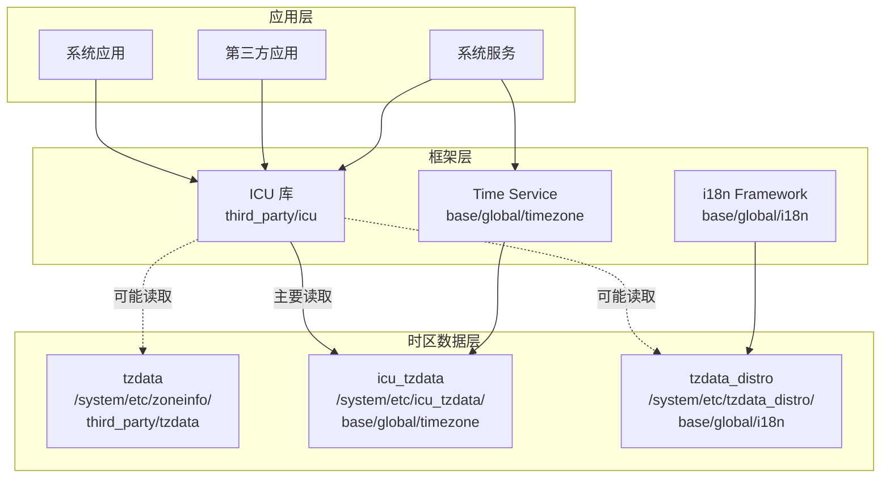

# 04_Usage_in_OH.md - 依赖关系与使用

## 1. 直接依赖者

### 1.1 依赖分析结果

通过对整个 OH 代码库的搜索，发现 tzdata 的依赖关系如下：

#### 显式依赖

| 模块 | BUILD.gn 路径 | 引用方式 | 说明 |
|-----|--------------|---------|------|
| **tzdata (自身)** | `third_party/tzdata/data/BUILD.gn` | 定义 | 定义 zoneinfo target |

#### 间接相关组件（通过构建系统）

| 模块 | 路径 | 关系类型 | 说明 |
|-----|------|---------|------|
| **manifest_tag.xml** | 多个位置 | 项目定义 | 定义 tzdata 在 manifest 中的位置和版本 |

### 1.2 无直接 GN 依赖的原因

**重要发现**：没有在其他模块的 BUILD.gn 中直接找到对 `//third_party/tzdata/data:zoneinfo` 的依赖声明。

这说明：
1. tzdata 作为**基础系统组件**，通过系统镜像直接提供
2. 其他模块**假设时区数据已存在**，而不是显式声明依赖
3. 依赖关系在**系统级别**管理，而非模块级别

---

## 2. 间接使用者

虽然其他模块不显式依赖 tzdata，但以下组件**实际使用**时区数据功能：

### 2.1 ICU (International Components for Unicode)

**路径**: `third_party/icu/icu4c/BUILD.gn`

```gn
# 相关配置
defines = [
  "DISTRO_TZDATA_DIR=\"${distro_tzdata_dir}\"",
  "SYSTEM_TZDATA_DIR=\"${system_tzdata_dir}\"",
]
```

**分析**：
- ICU 定义了 `DISTRO_TZDATA_DIR` 和 `SYSTEM_TZDATA_DIR` 宏
- 这些宏指向时区数据的安装路径
- ICU 的时区功能**可能**会读取 tzdata 提供的数据作为回退

**依赖关系**：
```
icu (third_party/icu)
├── 主要使用: icu_tzdata (base/global/timezone/data)
│   └── /system/etc/icu_tzdata/zoneinfo64.res
└── 可能回退: tzdata (本库)
    └── /system/etc/zoneinfo/tzdata
```

### 2.2 global/timezone 模块

**路径**: `base/global/timezone/data/BUILD.gn`

```gn
ohos_prebuilt_etc("zoneinfo64") {
  source = "//base/global/timezone/data/prebuild/icu/zoneinfo64.res"
  module_install_dir = "etc/icu_tzdata"
}

group("icu_tzdata") {
  deps = [ ":zoneinfo64" ]
}
```

**分析**：
- 提供 ICU 格式的时区数据
- 安装到 `/system/etc/icu_tzdata/`
- 与 tzdata 是**互补关系**，而非依赖关系

### 2.3 global/i18n 模块

**路径**: `base/global/i18n/frameworks/intl/parameter_upgrade/BUILD.gn`

```gn
module_install_dir = "etc/tzdata_distro/"
```

**分析**：
- 安装时区相关数据到 `etc/tzdata_distro/`
- 可能被 ICU 的 `DISTRO_TZDATA_DIR` 宏引用

---

## 3. 依赖关系图

### 3.1 系统级依赖图



### 3.2 简化依赖链

```
应用/框架
    ↓ 调用时区 API
ICU 库 (third_party/icu)
    ↓ 读取时区数据
┌─────────────────────────────────────┐
│  优先: /system/etc/icu_tzdata/      │
│  回退: /system/etc/zoneinfo/        │
└─────────────────────────────────────┘
```

---

## 4. 使用方式

### 4.1 数据文件的使用方式

#### 方式 1：ICU 库间接使用

大多数 OH 应用通过 ICU 库使用时区功能：

```cpp
// 伪代码示例
#include "unicode/timezone.h"

// ICU 会自动查找时区数据
TimeZone* tz = TimeZone::createTimeZone("Asia/Shanghai");
```

ICU 的查找路径（根据 BUILD.gn 中的宏定义）：
1. 首先查找 `/system/etc/icu_tzdata/zoneinfo64.res`
2. 如果配置了回退，可能查找 `/system/etc/zoneinfo/`

#### 方式 2：直接读取 tzdata

部分系统组件可能直接读取 IANA 格式的时区数据：

```c
// 伪代码示例 - 使用 tzfile.h 定义解析
#include <tzfile.h>

// 直接读取 /system/etc/zoneinfo/tzdata
// 解析时区规则
```

### 4.2 使用场景

| 场景 | 使用组件 | 数据格式 | 说明 |
|-----|---------|---------|------|
| 应用时区显示 | ICU | ICU 格式 | 通过 ICU API |
| 系统时间设置 | Time Service | ICU 格式 | 系统设置 |
| 时区列表展示 | System UI | timezone_list.cfg | 读取时区名称列表 |
| 底层时间计算 | Native 代码 | IANA 格式 | 直接解析 tzdata |

### 4.3 timezone_list.cfg 的使用

`timezone_list.cfg` 可能被以下场景使用：

1. **系统设置应用**
   - 显示可用时区列表
   - 让用户选择时区

2. **时区检测服务**
   - 根据地理位置确定时区
   - 验证时区名称有效性

3. **日志和调试**
   - 记录时区信息
   - 故障诊断

---

## 5. 静态链接 / 动态链接分析

### 5.1 tzdata 的特殊性

tzdata **既不是静态库也不是动态库**，它是：
- **纯数据组件**
- **运行时数据文件**
- 不参与链接过程

### 5.2 与代码库的对比

| 库 | 类型 | 链接方式 | 说明 |
|---|------|---------|------|
| **tzdata** | 数据 | 不适用 | 运行时读取数据文件 |
| icu | 代码+数据 | 动态链接 | libicuuc.so, libicui18n.so |
| libc | 代码 | 动态链接 | libc.so |

### 5.3 数据加载方式

```
ICU 库 (libicui18n.so)
    ↓ 运行时加载
/system/etc/icu_tzdata/zoneinfo64.res (数据文件)
    或
/system/etc/zoneinfo/tzdata (数据文件)
```

---

## 6. 头文件引用方式

### 6.1 tzdata 提供的头文件

tzdata 源码包含以下头文件（但 OH 可能不使用）：

| 头文件 | 内容 | OH 使用情况 |
|-------|------|------------|
| `tzfile.h` | 时区文件格式定义 | 可能被直接使用 |
| `private.h` | tzcode 内部定义 | 内部使用 |

### 6.2 实际使用的头文件

在 OH 中，应用通常**不直接包含 tzdata 的头文件**，而是通过以下方式：

```cpp
// 方式 1：通过 ICU
#include "unicode/timezone.h"

// 方式 2：通过标准 C 库（如果可用）
#include <time.h>

// 方式 3：直接读取（极少数情况）
// 可能需要包含 tzfile.h
```

---

## 7. 关键使用场景详解

### 7.1 时区设置流程

```
用户设置时区
    ↓
系统设置应用
    ↓
Time Service (base/global/timezone)
    ↓
更新系统时区配置
    ↓
通知各组件时区变更
    ↓
ICU 库更新内部时区缓存
```

### 7.2 时区转换流程

```
应用请求时间转换
    ↓
ICU API 调用 (e.g., TimeZone::getOffset)
    ↓
ICU 读取时区数据
    ├─ 从 /system/etc/icu_tzdata/zoneinfo64.res
    └─ 或从 /system/etc/zoneinfo/tzdata (回退)
    ↓
返回转换结果
```

### 7.3 系统启动时

```
系统启动
    ↓
挂载 /system 分区
    ↓
时区数据可用
    ├─ /system/etc/zoneinfo/tzdata
    ├─ /system/etc/zoneinfo/timezone_list.cfg
    └─ /system/etc/icu_tzdata/zoneinfo64.res
    ↓
ICU 初始化
    ↓
应用可以使用时区功能
```

---

## 8. 依赖管理建议

### 8.1 当前问题

1. **无显式依赖声明**
   - 其他模块不显式依赖 tzdata
   - 可能导致系统裁剪时遗漏

2. **版本耦合**
   - ICU 时区数据版本应与 tzdata 版本兼容
   - 但两者独立更新

### 8.2 改进建议

#### 建议 1：添加显式依赖（可选）

在需要时区功能的模块中添加：

```gn
deps = [
    "//third_party/tzdata/data:zoneinfo",
]
```

#### 建议 2：版本兼容性检查

建立自动化检查：
- 确保 ICU 数据与 tzdata 版本兼容
- 检查 timezone_list.cfg 与时区数据一致性

#### 建议 3：文档化依赖关系

在相关模块的文档中说明：
- 依赖时区数据
- 需要 tzdata 组件

---

## 9. 总结

| 项目 | 说明 |
|-----|------|
| **直接依赖者** | 无（作为基础系统组件） |
| **主要使用者** | ICU 库（third_party/icu） |
| **互补组件** | global/timezone（提供 ICU 格式数据） |
| **使用方式** | 运行时读取数据文件，不参与链接 |
| **关键文件** | `/system/etc/zoneinfo/tzdata`, `/system/etc/zoneinfo/timezone_list.cfg` |
| **数据格式** | IANA 原生格式（非 ICU 格式） |

### 关键要点

1. tzdata 是**基础设施**，被系统隐式依赖
2. 应用通常通过 **ICU 库** 间接使用时区功能
3. ICU 优先使用自己的数据格式，tzdata 作为**备用**
4. `timezone_list.cfg` 可能用于系统设置和时区列表展示
5. 维护时需要注意 ICU 数据与 tzdata 的版本兼容性

