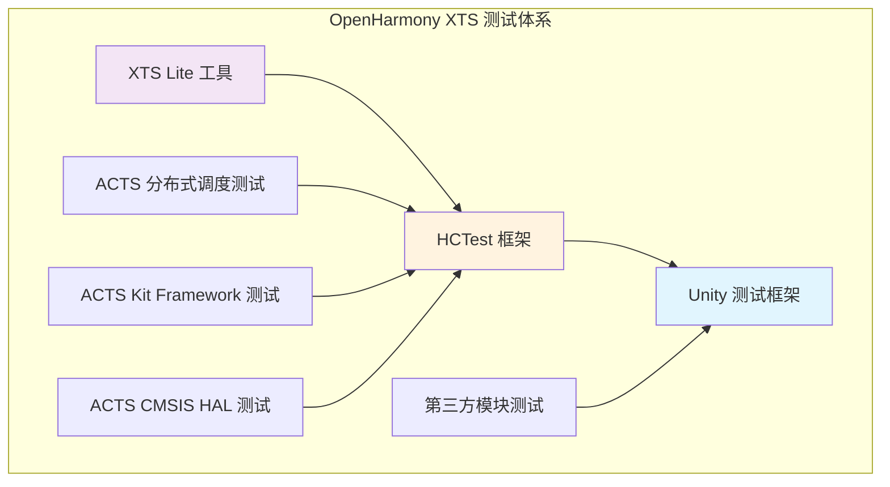
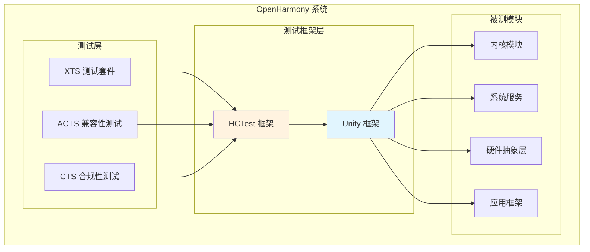

# 依赖关系与使用

## 一、直接依赖者

### 1.1 依赖模块清单

Unity 库在 OpenHarmony 生态系统中的直接依赖者主要分布在 XTS（Xtended Test Suite）测试体系中。以下是已确认的依赖模块：

| 模块 | BUILD.gn 路径 | 引用方式 | 用途 |
|------|---------------|----------|------|
| XTS Lite 工具 | `//test/xts/tools/lite/BUILD.gn` | 整体引用 | XTS Lite 测试工具链 |
| HCTest 框架 | `//test/xts/tools/lite/hctest/BUILD.gn` | 源码引用 | HCTest Lite 核心实现 |
| 系统能力管理 HAL | `//test/xts/acts/distributed_schedule_lite/system_ability_manager_hal/BUILD.gn` | 头文件引用 | 系统能力管理测试 |
| ACTS 构建配置 | `//test/xts/acts/build_lite/BUILD.gn` | 整体引用 | ACTS 测试构建配置 |
| Kit Framework 测试 | `//test/xts/acts/applications/kitframework/BUILD.gn` | 头文件引用 | 框架套件测试 |
| CMSIS HAL 测试 | `//test/xts/acts/kernel_lite/kernelcmsis_hal/BUILD.gn` | 头文件引用 | 内核 CMSIS 抽象层测试 |

### 1.2 核心依赖者分析

**HCTest（HarmonyOS Compatible Test）** 是 Unity 在 OpenHarmony 中最核心的应用场景。HCTest 是 OpenHarmony 的兼容性测试框架，用于验证应用和系统组件是否符合 OpenHarmony 规范。HCTest Lite 版本针对资源受限设备，使用 Unity 作为测试用例的执行引擎。

HCTest 对 Unity 的引用方式为直接源码级引用：

```gn
# //test/xts/tools/lite/hctest/BUILD.gn

sources = [
  "hctest.c",
  "hctest_output.c",
  "hctest_info.c",
  "//third_party/unity/src/unity.c",  # 直接引用 Unity 源码
]

include_dirs = [
  "//third_party/unity/src",          # Unity 头文件路径
]
```

### 1.3 依赖关系概览



## 二、使用方式详解

### 2.1 静态链接方式

在 OpenHarmony 项目中，Unity 最常用的集成方式是**静态链接**。测试代码与 Unity 源码一起编译链接成可执行文件或库。

**优点**：
- 构建简单，无需额外依赖管理
- 调试方便，可以单步跟踪 Unity 代码
- 运行时无动态链接开销

**缺点**：
- 每个测试模块都包含 Unity 代码副本
- 更新 Unity 需要重新编译所有测试模块

**集成示例**：

```gn
# 模块级测试 BUILD.gn 示例

ohos_unittest("my_module_test") {
  sources = [
    "test/test_my_module.c",
    "test/test_my_module_utils.c",
    "//third_party/unity/src/unity.c",
  ]
  
  include_dirs = [
    "//third_party/unity/src",
  ]
  
  defines = [
    "UNITY_SUPPORT_64",
  ]
  
  cflags = [
    "-Wall",
    "-Wextra",
  ]
}
```

### 2.2 头文件引用方式

Unity 的头文件引用是使用框架的基础。所有测试文件都需要包含 `unity.h` 头文件：

```c
// test_my_module.c

#include "unity.h"

// 测试前置设置
void setUp(void) {
  // 初始化测试环境
}

// 测试后置清理
void tearDown(void) {
  // 清理测试环境
}

// 测试用例
void test_ModuleFunction_Xxx(void) {
  int result = my_module_function(10);
  TEST_ASSERT_EQUAL_INT(20, result);
}

// 另一个测试用例
void test_ModuleFunction_Yyy(void) {
  bool status = my_module_init();
  TEST_ASSERT_TRUE(status);
}

// 测试组定义
TEST_GROUP(MyModule);
```

### 2.3 集成层次结构

Unity 在 OpenHarmony 测试体系中的集成层次如下：

```
应用程序层
    ↓
XTS 测试套件
    ↓
HCTest 框架（测试运行器）
    ↓
Unity 框架（断言和执行）
    ↓
硬件抽象层 / 内核
```

## 三、典型使用场景

### 3.1 内核模块测试

Unity 广泛用于 OpenHarmony 内核模块的单元测试。以下是内核模块测试的典型模式：

```c
// kernel_lite/kernel/src/test/test_klist.c

#include "unity.h"
#include "los_list.h"

void setUp(void) {
  // 初始化链表头
  LOS_LIST_INIT(&test_list);
}

void tearDown(void) {
  // 清理链表
  // 释放已分配的节点
}

void test_LosList_AddNode(void) {
  LIST_HEAD test_node;
  
  LOS_LIST_INIT(&test_node);
  LOS_ListAdd(&test_list, &test_node);
  
  TEST_ASSERT_TRUE(LOS_ListEmpty(&test_list) == FALSE);
}

void test_LosList_DelNode(void) {
  LIST_HEAD test_node;
  
  LOS_LIST_INIT(&test_node);
  LOS_ListAdd(&test_list, &test_node);
  LOS_ListDel(&test_node);
  
  TEST_ASSERT_TRUE(LOS_ListEmpty(&test_list));
}
```

### 3.2 系统服务测试

系统服务模块的测试用例通常涉及多个组件的协作：

```c
// distributed_schedule_lite/test/test_samgr.c

#include "unity.h"
#include "samgr_lite.h"

void test_Samgr_RegisterService(void) {
  IUnknown *service = (IUnknown *)CreateMyService();
  int result = SAMGR_RegisterFactory(service);
  
  TEST_ASSERT_EQUAL_INT(0, result);
}

void test_Samgr_GetService(void) {
  IUnknown *service = SAMGR_GetInstance()->GetService("MyService");
  TEST_ASSERT_NOT_NULL(service);
}
```

### 3.3 硬件抽象层测试

HAL 层测试需要模拟硬件行为：

```c
// kernel_lite/kernelcmsis_hal/test/test_cmsis_gpio.c

#include "unity.h"
#include "cmsis_gpio.h"

void setUp(void) {
  // 模拟 GPIO 初始化
  CMSIS_GPIO_Init();
}

void test_GPIO_WriteHigh(void) {
  CMSIS_GPIO_SetMode(PIN_LED, GPIO_MODE_OUTPUT);
  CMSIS_GPIO_WritePin(PIN_LED, GPIO_HIGH);
  
  TEST_ASSERT_EQUAL(GPIO_ReadPin(PIN_LED), GPIO_HIGH);
}

void test_GPIO_ReadPin(void) {
  CMSIS_GPIO_SetMode(PIN_BUTTON, GPIO_MODE_INPUT);
  
  // 模拟按钮按下
  SimulateButtonPress(PIN_BUTTON);
  TEST_ASSERT_EQUAL(GPIO_ReadPin(PIN_BUTTON), GPIO_LOW);
}
```

## 四、依赖关系图

### 4.1 整体依赖结构



### 4.2 具体依赖路径

| 依赖路径 | 说明 |
|----------|------|
| `//test/xts/tools/lite` | → `//third_party/unity` |
| `//test/xts/tools/lite/hctest` | → `//third_party/unity/src/unity.c` |
| `//test/xts/tools/lite/hctest` | → `//third_party/unity/src/unity.h` |
| `//test/xts/acts/*` | → `//third_party/unity/src` |

## 五、最佳实践

### 5.1 测试用例组织

建议按照以下方式组织测试用例文件：

```
module/
├── src/                    # 被测源代码
│   ├── module.c
│   └── module.h
├── test/                   # 测试代码
│   ├── BUILD.gn           # 测试构建配置
│   ├── test_module.c      # 测试用例
│   ├── test_module_utils.c # 测试工具函数
│   └── test_module.h      # 测试私有头文件
└── BUILD.gn               # 模块构建配置
```

### 5.2 测试断言选择

根据测试场景选择合适的断言：

| 测试场景 | 推荐断言 |
|----------|----------|
| 整数结果验证 | `TEST_ASSERT_EQUAL_INT` |
| 浮点结果验证（容差） | `TEST_ASSERT_FLOAT_WITHIN` |
| 字符串比较 | `TEST_ASSERT_EQUAL_STRING` |
| 数组批量比较 | `TEST_ASSERT_EQUAL_INT_ARRAY` |
| 内存块比较 | `TEST_ASSERT_EQUAL_MEMORY` |
| 布尔条件验证 | `TEST_ASSERT_TRUE` / `TEST_ASSERT_FALSE` |
| 指针验证 | `TEST_ASSERT_NOT_NULL` |

### 5.3 常见陷阱

**陷阱一：忘记调用 setUp/tearDown**

```c
// 错误示例
void test_Example(void) {
  setup_internal_state();  // 应该在 setUp 中调用
  TEST_ASSERT_TRUE(condition);
}

// 正确示例
void setUp(void) {
  setup_internal_state();
}

void test_Example(void) {
  TEST_ASSERT_TRUE(condition);
}
```

**陷阱二：断言顺序错误**

```c
// 错误示例（参数顺序反了）
TEST_ASSERT_EQUAL_INT(actual, expected);  // 不符合习惯

// 正确示例
TEST_ASSERT_EQUAL_INT(expected, actual);  // 符合习惯
```

**陷阱三：浮点比较不使用容差**

```c
// 错误示例
TEST_ASSERT_EQUAL_FLOAT(3.14f, result);  // 可能因精度问题失败

// 正确示例
TEST_ASSERT_FLOAT_WITHIN(0.001f, 3.14f, result);
```

## 六、总结

Unity 框架在 OpenHarmony 中扮演着**测试基础设施**的关键角色。通过静态链接和头文件引用的方式，Unity 为 XTS 测试体系提供了可靠的单元测试执行能力。框架的轻量级设计和跨平台特性使其特别适合 OpenHarmony 的 mini 和 small 系统配置，是资源受限环境下进行单元测试的理想选择。
