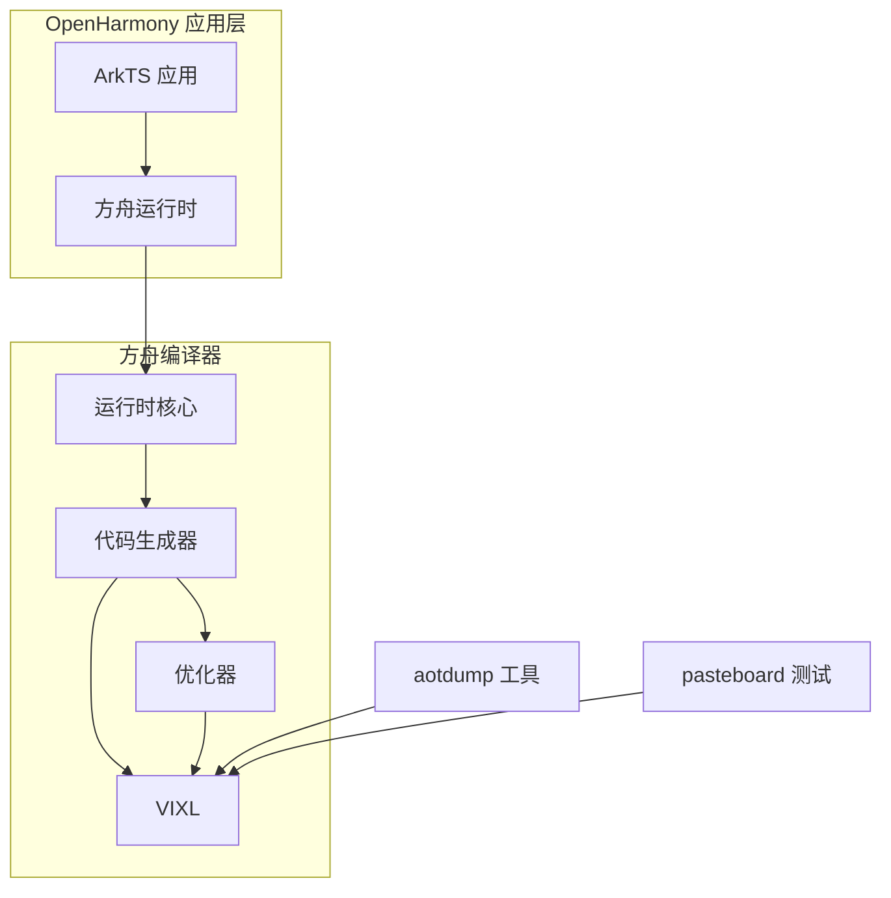

# OH 使用情况分析

## 依赖关系概览

### 直接依赖者

VIXL 库在 OpenHarmony 中的主要使用者是**方舟编译器 (arkcompiler)**，这是 OH 官方 JavaScript/TypeScript 编译器的核心组件。

| 模块 | BUILD.gn 路径 | 用途 | 依赖方式 |
|-----|--------------|------|---------|
| **arkcompiler** | `arkcompiler/runtime_core/static_core/compiler/optimizer/code_generator/BUILD.gn` | AArch64/AArch32 代码生成 | 静态链接 |
| **aotdump** | `arkcompiler/runtime_core/static_core/compiler/tools/aotdump/BUILD.gn` | AOT 镜像反编译 | 静态链接 |
| **pasteboard** | `foundation/distributeddatamgr/pasteboard/services/BUILD.gn` | 剪贴板服务测试 | 条件链接 |

### 依赖关系图



##方舟编译器集成

### 主要使用场景

VIXL 在方舟编译器中主要用于以下场景：

#### 1. 指令生成 (Code Generation)

方舟编译器的代码生成器使用 VIXL 生成 ARM 指令：

```cpp
// 示例：使用 VIXL MacroAssembler 生成指令
#include "aarch64/macro-assembler-aarch64.h"

void GenerateCode(vixl::aarch64::MacroAssembler *masm) {
    vixl::aarch64::Label start;

    masm->Bind(&start);
    masm->Mov(vixl::aarch64::x0, vixl::aarch64::Operand(42));
    masm->Ret();
}
```

#### 2. 寄存器操作

VIXL 提供了对 ARM 寄存器的抽象：

```cpp
// AArch64 寄存器使用
vixl::aarch64::Register xreg = vixl::aarch64::x0;
vixl::aarch64::Register xzr = vixl::aarch64::xzr;  // Zero Register

// AArch32 寄存器使用
vixl::aarch32::Register r0 = vixl::aarch32::r0;
```

#### 3. 标签和跳转

```cpp
vixl::aarch64::Label loop_start;
vixl::aarch64::Label loop_end;

masm->Bind(&loop_start);
masm->Cmp(vixl::aarch64::x0, vixl::aarch64::Operand(0));
masm->B(vixl::aarch64::EQ, &loop_end);
masm->Sub(vixl::aarch64::x0, vixl::aarch64::x0, vixl::aarch64::Operand(1));
masm->B(&loop_start);
masm->Bind(&loop_end);
```

### 集成文件

| 文件 | 用途 |
|-----|------|
| `target/aarch64/target.h` | AArch64 目标架构适配 |
| `target/aarch32/target.h` | AArch32 目标架构适配 |
| `vixl_exec_module.h` | VIXL 执行模块测试 |

## aotdump 工具使用

### 工具用途

`aotdump` 是 AOT (Ahead-of-Time) 镜像分析工具，用于反编译和分析方舟编译器生成的二进制文件。

### 依赖配置

```gn
# aotdump/BUILD.gn 中的 VIXL 路径配置
include_dirs = [
  "$ark_third_party_root/vixl/src/aarch64",
  "$ark_third_party_root/vixl/src",
  "$ark_root/vixl/src/aarch32",
  "$ark_root/vixl/src",
]
```

## pasteboard 服务使用

### 使用场景

pasteboard 服务的测试用例中使用 VIXL 进行一些底层的指令测试：

```gn
# BUILD.gn 中的条件依赖
if (pasteboard_vixl_part_enabled) {
  external_deps += [ "vixl:libvixl" ]
}
```

## 内存分配适配

### OH 特定实现

VIXL 在 OH 中使用 `mmap` 进行代码缓冲区分配：

```cpp
// code-buffer-vixl.cc
#ifdef VIXL_CODE_BUFFER_MMAP
CodeBuffer::CodeBuffer(size_t capacity) {
    buffer_ = reinterpret_cast<byte*>(mmap(NULL,
                                           capacity,
                                           PROT_READ | PROT_WRITE,
                                           MAP_PRIVATE | MAP_ANONYMOUS,
                                           -1,
                                           0));
}
#endif
```

### 分配器对比

| 分配器 | 用途 | 特点 |
|-------|------|------|
| `mmap` | 代码缓冲区 | 可执行内存，支持大块分配 |
| `malloc` | 备用分配 | 标准 C 分配，不推荐用于代码 |

## 工具链兼容适配

### stpcpy 函数重实现

OHOS 工具链缺失 `stpcpy` 函数，VIXL 提供了重实现：

```cpp
// code-buffer-vixl.cc (第 111-117 行)
// For some reason OHOS toolchain doesn't have this function
#ifdef PANDA_TARGET_MOBILE
char* stpcpy (char *dst, const char *src) {
    const size_t len = strlen (src);
    return (char *) memcpy (dst, src, len + 1) + len;
}
#endif
```

## 最佳实践

### 1. 使用 MacroAssembler 而非 Assembler

```cpp
// ✅ 推荐：使用 MacroAssembler
vixl::aarch64::MacroAssembler masm;
masm.Mov(vixl::aarch64::x0, vixl::aarch64::Operand(42));

// ❌ 不推荐：直接使用 Assembler
vixl::aarch64::Assembler asm;
// ... 需要手动处理编码细节
```

### 2. 正确处理 CPU 特性

```cpp
// 检查并启用 CPU 特性
vixl::aarch64::CPUFeatures features;
if (features.Has(vixl::aarch64::CPUFeatures::kNEON)) {
    masm.GetCPUFeatures()->Combine(vixl::aarch64::CPUFeatures::kNEON);
}
```

### 3. 代码缓冲区管理

```cpp
// 创建代码缓冲区
vixl::CodeBuffer buffer(64 * 1024);  // 64KB

// 使用后确保正确释放
buffer.~CodeBuffer();
```

## 常见问题

### Q1: 如何调试生成的指令？

使用 VIXL 的反汇编器：

```cpp
vixl::aarch64::Disassembler disasm;
disasm.SetStreamer(/* 您的输出流 */);

// 解码单条指令
vixl::aarch64::Instruction *inst = /* 获取指令地址 */;
disasm.InstructionDecoder(inst);
```

### Q2: 如何在非 ARM 平台上测试？

使用 VIXL 模拟器：

```cpp
vixl::aarch64::Simulator simulator;
simulator.set_xreg(0, 42);  // 设置 x0 = 42
simulator.Run(start_addr);   // 从指定地址运行
int result = simulator.xreg(0);  // 获取返回值
```

### Q3: 如何添加新的指令支持？

通过 MacroAssembler 的辅助函数：

```cpp
// 在宏汇编器中添加新指令序列
void MacroAssembler::CustomOperation(Register rd, Operand op) {
    // 实现指令序列
    Mov(rd, op);
    // ... 其他操作
}
```

## 性能考量

### 1. 指令生成开销

VIXL 的指令生成在编译时完成，运行时仅执行生成的代码。

### 2. 代码缓冲区大小

- 默认 64KB 缓冲区适用于大多数场景
- 大型函数可能需要更大缓冲区
- 使用 `Grow()` 方法可以扩展缓冲区

### 3. 多线程安全

VIXL **不是线程安全的**：
- 每个线程应使用独立的 `MacroAssembler` 实例
- 共享代码缓冲区需要外部同步
