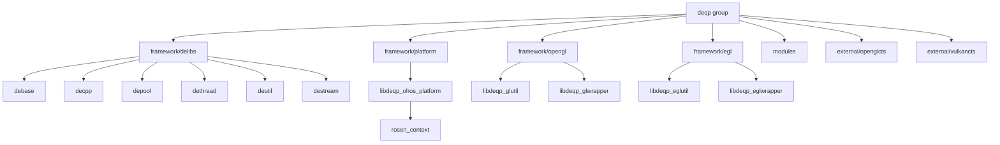

# VK-GL-CTS 在 OpenHarmony 中的依赖关系与使用

## 直接依赖者

VK-GL-CTS 在 OpenHarmony 中主要用于图形测试，以下是主要的依赖模块：

| 模块 | BUILD.gn 路径 | 用途 |
|------|--------------|------|
| **gltest** | `test/xts/acts/graphic/gltest/BUILD.gn` | OpenGL ES 一致性测试套件 |
| **vkgl** | `test/xts/acts/graphic/vkgl/BUILD.gn` | Vulkan/OpenGL 综合测试 |
| **vktest** | `test/xts/acts/graphic/vktest/BUILD.gn` | Vulkan 专项测试 |
| **gl42master** | `test/xts/acts/graphic/gltest/.../gl42master/BUILD.gn` | OpenGL 4.2 测试 |
| **gl30master** | `test/xts/acts/graphic/gltest/.../gl30master/BUILD.gn` | OpenGL ES 3.0 测试 |

### 依赖详情

#### 1. gltest (OpenGL ES 测试)

```gn
# test/xts/acts/graphic/gltest/BUILD.gn
deps = [
    "//third_party/vk-gl-cts/framework/platform:glcts",
    # ... 其他依赖
]
```

**功能**:
- OpenGL ES 2.0/3.0/3.1/3.2 一致性测试
- 功能测试、压力测试、性能测试
- XTS 自动化测试框架集成

#### 2. vkgl (综合图形测试)

```gn
# test/xts/acts/graphic/vkgl/comm.gni
deqp_deps = [
    "//third_party/vk-gl-cts",
    "//third_party/vk-gl-cts/framework/delibs/debase",
    "//third_party/vk-gl-cts/framework/delibs/decpp",
    "//third_party/vk-gl-cts/framework/delibs/depool",
    "//third_party/vk-gl-cts/framework/delibs/dethread",
    "//third_party/vk-gl-cts/framework/delibs/deutil",
    "//third_party/vk-gl-cts/framework/delibs/destream",
    "//third_party/vk-gl-cts/framework/common",
    "//third_party/vk-gl-cts/framework/qphelper",
    "//third_party/vk-gl-cts/framework/xexml",
    "//third_party/vk-gl-cts/framework/egl",
    "//third_party/vk-gl-cts/framework/egl/wrapper",
    "//third_party/vk-gl-cts/framework/opengl",
    "//third_party/vk-gl-cts/framework/opengl/wrapper",
    "//third_party/vk-gl-cts/framework/opengl/simplereference",
    "//third_party/vk-gl-cts/framework/platform/ohos",
    "//third_party/vk-gl-cts/external/openglcts/modules",
    "//third_party/vk-gl-cts/external/openglcts/modules/common",
    # ... GL 版本模块
    "//third_party/vk-gl-cts/external/vulkancts/framework/vulkan",
    # ... 平台模块
]
```

#### 3. vktest (Vulkan 专项测试)

```gn
# test/xts/acts/graphic/vktest/BUILD.gn
deps = [
    "//third_party/vk-gl-cts/external/vulkancts/modules/vulkan:deqp_vk_execute",
    # ... 其他依赖
]
```

**测试类别** (50+ 个测试模块)：
- `apitest` - API 测试
- `bindingmodeltest` - 绑定模型测试
- `computetest` - 计算着色器测试
- `drawtest` - 绘制测试
- `imagetest` - 图像测试
- `memorytest` - 内存测试
- `pipelinetest` - 管线测试
- `raytracingtest` - 光线追踪测试
- `synchronizationtest` - 同步测试
- `texturetest` - 纹理测试
- ... 等

## 依赖关系图

### 整体依赖结构

```mermaid
graph TD
    A[XTS 测试框架] --> B[gltest]
    A --> C[vkgl]
    A --> D[vktest]
    
    B --> E[//third_party/vk-gl-cts/framework/platform:glcts]
    C --> F[//third_party/vk-gl-cts/framework/platform:libdeqp_ohos_platform]
    D --> G[//third_party/vk-gl-cts/external/vulkancts/modules/vulkan:deqp_vk_execute]
    
    E --> H[框架库]
    F --> H
    G --> H
    
    H --> I[libdeqp_tcutil]
    H --> J[libdeqp_glutil]
    H --> K[libdeqp_eglutil]
    H --> L[libdeqp_vkutil]
    
    H --> M[Rosen 框架]
    M --> N[foundation/graphic/graphic_2d/rosen]
```

### VK-GL-CTS 内部模块依赖



## 使用方式

### 1. 静态链接

VK-GL-CTS 在 OpenHarmony 中以静态库形式被依赖：

```gn
# 静态库目标示例
ohos_static_library("libdeqp_glutil") {
    sources = [ ... ]
    deps = [ ... ]
}
```

### 2. 头文件引用

```cpp
// 使用 VK-GL-CTS 功能的头文件引用
#include "tcuDefs.hpp"              // 基础定义
#include "tcuPlatform.hpp"          // 平台抽象
#include "tcuTestContext.hpp"       // 测试上下文
#include "gluDefs.hpp"              // OpenGL 工具
#include "vkDefs.hpp"               // Vulkan 工具
```

### 3. 典型使用场景

#### 场景 1：运行 OpenGL ES 测试

```cpp
// gltest 执行流程
1. 初始化 OHOS 平台
   tcu::Platform* platform = new tcu::OHOS_ROSEN::OhosPlatform();

2. 创建测试执行器
   tcu::TestExecutor executor(*platform);

3. 执行测试用例
   executor.execute("dEQP-GLES2.functional.texture");

4. 输出结果 (qpa 格式)
   // 生成 .qpa 文件用于分析
```

#### 场景 2：运行 Vulkan 测试

```cpp
// vktest 执行流程
1. 初始化 Vulkan 平台层
   vk::Platform vkPlatform(platform);

2. 创建 Vulkan 实例
   vk::Instance instance = vkPlatform.createInstance();

3. 执行测试用例
   // 运行 vk-default 测试集
   // 测试 API、渲染、计算等

4. 生成测试报告
```

#### 场景 3：XTS 集成测试

```python
# XTS 测试框架调用示例
# test/xts/acts/graphic/gltest/

def run_gl_tests():
    # 1. 复制测试数据
    copy_test_data()
    
    # 2. 启动 deqp 执行器
    deqp_runner = DeqpRunner()
    
    # 3. 执行测试套件
    results = deqp_runner.run_suite("gles3-functional")
    
    # 4. 解析 qpa 结果
    parse_qpa_results(results)
    
    # 5. 生成测试报告
    generate_report()
```

## 测试数据文件

### 数据文件分布

| 数据目录 | 用途 | 复制脚本 |
|----------|------|----------|
| `external/openglcts/data/` | OpenGL CTS 测试数据 | `cpOpenGL.sh` |
| `external/vulkancts/data/` | Vulkan CTS 测试数据 | `cpVulkan.sh` |
| `data/` | dEQP 通用测试数据 | - |

### 数据复制脚本

```bash
# test/xts/acts/graphic/gltest/cpOpenGL.sh
cp -rf "$root_opengl_path/third_party/vk-gl-cts/external/openglcts/data" \
    "suites/acts/acts/testcases/opengldata"

cp -rf "$root_opengl_path/third_party/vk-gl-cts/external/openglcts/data/mustpass" \
    "suites/acts/acts/testcases/opengldata"
```

```bash
# test/xts/acts/graphic/vktest/cpVulkan.sh
cp -rf "$root_vulkan_path/third_party/vk-gl-cts/external/vulkancts/data" \
    "suites/acts/acts/testcases/vulkandata"

cp -rf "$root_vulkan_path/third_party/vk-gl-cts/external/vulkancts/mustpass/main/vk-default" \
    "suites/acts/acts/testcases/vulkandata"
```

### mustpass 测试集

```
# 必须通过的测试列表
external/vulkancts/mustpass/main/vk-default/
├── master.txt              # 主测试列表
├── test-issues.txt         # 已知问题
└── fraction-mandatory-tests.txt  # 强制测试子集
```

## CI/CD 集成

### 编译白名单

VK-GL-CTS 在以下白名单中：

```json
// build/indep_component_whitelist.json
"vk-gl-cts",
"third_party_vk-gl-cts"
```

```json
// build/compile_standard_whitelist.json
"//third_party/vk-gl-cts/framework/platform:libdeqp_ohos_platform",
"//third_party/vk-gl-cts/external/vulkancts/modules/vulkan:libdeqp_vk_package",
// ... 更多目标
```

### XTS 配置

```json
// test/xts/tools/config/ci_target_white_list.json
{
    "path": "third_party/vk-gl-cts",
    "bundle_name": "vk-gl-cts"
}
```

## 测试结果分析

### QPA 文件格式

VK-GL-CTS 生成 `.qpa` 格式的测试结果：

```xml
<?xml version="1.0" encoding="UTF-8"?>
<TestCaseResult CasePath="dEQP-GLES2.functional.texture" Result="Pass">
    <Image Name="Reference" Description="Reference image" Format="PNG">
        <!-- Base64 encoded PNG -->
    </Image>
    <Image Name="Result" Description="Result image" Format="PNG">
        <!-- Base64 encoded PNG -->
    </Image>
</TestCaseResult>
```

### 日志解析脚本

```bash
# 使用 VK-GL-CTS 提供的脚本解析 qpa
python third_party/vk-gl-cts/scripts/log/log_to_xml.py \
    --qpa-file results.qpa \
    --output-file results.xml

python third_party/vk-gl-cts/scripts/log/xml_to_csv.py \
    --xml-file results.xml \
    --output-file results.csv
```

## 性能考虑

### 链接优化

由于 VK-GL-CTS 库较多，建议：

1. **使用静态链接** - 便于测试独立部署
2. **分模块构建** - 按需构建测试模块
3. **数据文件分离** - 运行时动态加载

### 运行时依赖

| 依赖 | 说明 |
|------|------|
| librender_service_base.so | Rosen 图形服务 |
| libEGL.so | EGL 驱动 |
| libGLESv2.so | OpenGL ES 驱动 |
| libvulkan.so | Vulkan 驱动 |

## 总结

VK-GL-CTS 在 OpenHarmony 中的使用特点：

1. **测试专用** - 主要用于 XTS 图形测试套件
2. **静态链接** - 以静态库形式被测试框架依赖
3. **数据驱动** - 依赖大量外部测试数据文件
4. **深度集成** - 与 Rosen 框架紧密耦合
5. **CI 集成** - 纳入自动化测试流程
