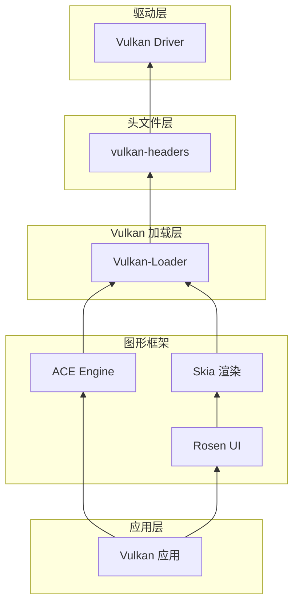
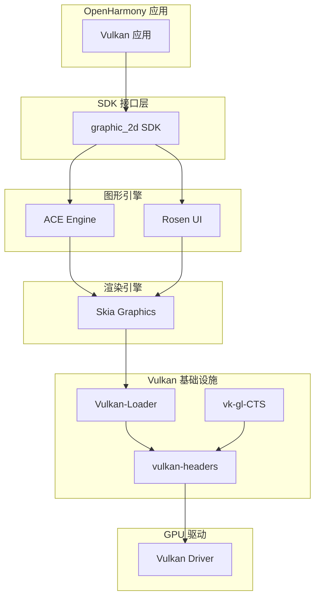

# 依赖关系与使用

## 4.1 直接依赖者

### 依赖模块清单

| 模块 | BUILD.gn 路径 | 依赖类型 | 用途 |
|-----|--------------|---------|------|
| **graphic_2d (SDK)** | interface/sdk_c/graphic/graphic_2d/vulkan/BUILD.gn | 头文件引用 | Vulkan 头文件直接引用 |
| **graphicvulkannapitest** | test/xts/acts/graphic/graphicvulkannapitest/BUILD.gn | static_deps | 静态库依赖 |
| **rosen/dtk** | foundation/graphic/graphic_2d/rosen/test/dtk/BUILD.gn | 路径引用 | 二进制路径引用 |
| **skia** | third_party/skia/m133/BUILD.gn | public_deps | 图形渲染库依赖 |
| **vk-gl-cts** | third_party/vk-gl-cts/external/vulkancts/modules/vulkan/amber/BUILD.gn | include 路径 | 测试引用 |

### 详细依赖分析

#### 1. interface/sdk_c/graphic/graphic_2d

**路径**: `interface/sdk_c/graphic/graphic_2d/vulkan/BUILD.gn`

**引用方式**:
```gn
include_dirs += [
  "//interface/sdk_c/third_party/vulkan-headers/vulkan/vk_platform.h",
  "//interface/sdk_c/third_party/vulkan-headers/vulkan/vulkan.h",
  "//interface/sdk_c/third_party/vulkan-headers/vulkan/vulkan_core.h",
  "//interface/sdk_c/third_party/vulkan-headers/vulkan/vulkan_ohos.h",
  "//interface/sdk_c/third_party/vulkan-headers/vk_video/vulkan_video_codec_*.h",
]
```

**用途**:
- 为 SDK 图形接口提供 Vulkan API 定义
- 支持 OH 特有扩展 (`vulkan_ohos.h`)
- 支持视频编解码扩展 (`vk_video/*.h`)

#### 2. third_party/skia

**路径**: `third_party/skia/m133/BUILD.gn`

**引用方式**:
```gn
public_deps += [ "//third_party/vulkan-headers:vulkan_headers" ]
```

**用途**:
- Skia 是 OpenHarmony 的 2D/3D 图形渲染引擎
- 依赖 vulkan-headers 进行 Vulkan 后端实现
- 支持 Vulkan 加速的图形渲染

**重要性**: ⭐⭐⭐⭐⭐（关键依赖）

#### 3. test/xts/acts/graphic/graphicvulkannapitest

**路径**: `test/xts/acts/graphic/graphicvulkannapitest/BUILD.gn`

**引用方式**:
```gn
deps = [ "//third_party/vulkan-headers:vulkan_headers" ]
```

**用途**:
- Vulkan Native API 测试套件
- 验证 Vulkan API 在 OH 平台的功能正确性
- 测试 OH 特有扩展 (`VK_OHOS_surface` 等)

#### 4. foundation/graphic/graphic_2d/rosen/test/dtk

**路径**: `foundation/graphic/graphic_2d/rosen/test/dtk/BUILD.gn`

**引用方式**:
```gn
dtk_test_indep_build_path = [
  "//binarys/third_party/vulkan-headers/innerapis/vulkan-headers/includes"
]
```

**用途**:
- DTK (Developer Toolkit) 测试构建路径
- 引用编译好的头文件二进制

#### 5. third_party/vk-gl-cts

**路径**: `third_party/vk-gl-cts/external/vulkancts/modules/vulkan/amber/BUILD.gn`

**引用方式**:
```gn
include_dirs += [ "//third_party/vulkan-headers/include" ]
```

**用途**:
- Vulkan Conformance Test Suite (CTS)
- 验证 Vulkan 实现是否符合 Khronos 标准
- 确保 OpenHarmony Vulkan 实现的合规性

## 4.2 使用方式

### 头文件引用方式

#### 1. 标准 Vulkan API 引用

```c
// Vulkan 核心头文件
#include <vulkan/vulkan.h>
#include <vulkan/vulkan_core.h>
```

#### 2. OH 特有扩展引用

```c
// OHOS Surface 扩展
#include <vulkan/vulkan_ohos.h>

// OH Native Buffer 扩展
#include <vulkan/vk_ohos_native_buffer.h>
```

#### 3. 视频编解码引用

```c
// H.264 编解码
#include <vk_video/vulkan_video_codec_h264std.h>
#include <vk_video/vulkan_video_codec_h264std_decode.h>
#include <vk_video/vulkan_video_codec_h264std_encode.h>

// H.265/HEVC 编解码
#include <vk_video/vulkan_video_codec_h265std.h>
#include <vk_video/vulkan_video_codec_h265std_decode.h>
#include <vk_video/vulkan_video_codec_h265std_encode.h>

// AV1 编解码
#include <vk_video/vulkan_video_codec_av1std.h>
#include <vk_video/vulkan_video_codec_av1std_decode.h>
#include <vk_video/vulkan_video_codec_av1std_encode.h>
```

### GN 构建引用

#### 1. 静态库依赖

```gn
deps = [
  "//third_party/vulkan-headers:vulkan_headers",
]
```

#### 2. 配置传递

```gn
public_configs = [
  "//third_party/vulkan-headers:vulkan_headers_config",
]
```

#### 3. 头文件路径

```gn
include_dirs += [
  "//third_party/vulkan-headers/include",
]
```

### 关键使用场景

#### 场景 1：创建 OHOS Surface

```c
// 创建 Vulkan Surface 关联到 OH NativeWindow
OHNativeWindow* nativeWindow = /* 获取 OH NativeWindow */;

VkSurfaceCreateInfoOHOS surfaceInfo = {
    .sType = VK_STRUCTURE_TYPE_SURFACE_CREATE_INFO_OHOS,
    .pNext = NULL,
    .flags = 0,
    .window = nativeWindow,
};

VkSurfaceKHR surface;
VkResult result = vkCreateSurfaceOHOS(
    instance,
    &surfaceInfo,
    NULL,  // allocator
    &surface
);
```

#### 场景 2：获取 Native Buffer 属性

```c
// 获取 OH NativeBuffer 的 Vulkan 内存属性
OH_NativeBuffer* nativeBuffer = /* 获取 OH NativeBuffer */;

VkNativeBufferPropertiesOHOS properties = {
    .sType = VK_STRUCTURE_TYPE_NATIVE_BUFFER_PROPERTIES_OHOS,
    .pNext = NULL,
};

VkResult result = vkGetNativeBufferPropertiesOHOS(
    device,
    nativeBuffer,
    &properties
);

// properties.allocationSize  - 分配的内存大小
// properties.memoryTypeBits  - 支持的内存类型
```

#### 场景 3：Vulkan 视频解码

```c
// 使用 H.264 视频解码
VkVideoSessionKHRSession = /* 创建的视频会话 */;
VkVideoPictureResourceKHRSrcPictureResource = {
    .sType = VK_STRUCTURE_TYPE_VIDEO_PICTURE_RESOURCE_KHR,
    .codedOffset = {0, 0},
    .codedExtent = {1920, 1080},
    .baseArrayLayer = 0,
    .layerCount = 1,
};

// ... 更多视频解码配置
```

## 4.3 依赖关系图

### Vulkan 栈依赖关系



### 更详细的依赖图



### 依赖热力图

| 依赖模块 | 依赖深度 | 重要性 | 说明 |
|---------|---------|--------|------|
| **skia** | 2 | ⭐⭐⭐⭐⭐ | 关键图形渲染引擎 |
| **graphic_2d** | 2 | ⭐⭐⭐⭐ | SDK 图形接口 |
| **vulkan-loader** | 1 | ⭐⭐⭐⭐ | Vulkan 加载程序 |
| **vk-gl-cts** | 2 | ⭐⭐⭐ | 合规测试 |
| **测试模块** | 3 | ⭐⭐ | 测试用途 |

## 4.4 头文件使用统计

### 按功能分类

| 头文件类别 | 文件数 | 主要使用者 |
|-----------|--------|-----------|
| **核心 Vulkan** | 5 | 所有 Vulkan 应用 |
| **OH 特有扩展** | 3 | OH 平台应用 |
| **视频编解码** | 10 | 视频播放/编码应用 |
| **平台扩展** | 15 | 跨平台应用 |

### 按依赖者分类

| 依赖者 | 引用头文件数 | 主要用途 |
|-------|-------------|---------|
| **skia** | 核心 + 视频 | Vulkan 后端渲染 |
| **graphic_2d** | 核心 + OH + 视频 | SDK 图形接口 |
| **vk-gl-cts** | 完整集合 | 合规测试 |
| **测试模块** | 核心 | 功能测试 |

## 4.5 使用建议

### 最佳实践

1. **按需引用**
   ```c
   // 只引用需要的头文件
   #include <vulkan/vulkan.h>              // 核心 API
   #include <vulkan/vulkan_ohos.h>         // OH 扩展（仅 OH 平台）
   ```

2. **条件编译**
   ```c
   #ifdef VK_USE_PLATFORM_OHOS
   // OH 特有代码
   #endif
   ```

3. **错误处理**
   ```c
   VkResult result = vkCreateSurfaceOHOS(...);
   if (result != VK_SUCCESS) {
       // 错误处理
   }
   ```

### 常见问题

#### 问题 1：OH 扩展未定义

**症状**：
```
error: 'VK_OHOS_surface' undeclared
```

**原因**：
- 未定义 `VK_USE_PLATFORM_OHOS` 宏
- 未包含 `vulkan_ohos.h`

**解决方案**：
```gn
# 在 BUILD.gn 中确保配置正确
deps = [ "//third_party/vulkan-headers:vulkan_headers" ]
```

```c
// 在代码中
#define VK_USE_PLATFORM_OHOS
#include <vulkan/vulkan_ohos.h>
```

#### 问题 2：视频编解码扩展不可用

**症状**：
```
error: 'VkVideoSessionKHR' undeclared
```

**原因**：
- 未包含视频编解码头文件
- 驱动不支持视频扩展

**解决方案**：
```c
// 包含视频头文件
#include <vk_video/vulkan_video_codec_h264std.h>

// 检查扩展是否可用
vkEnumerateInstanceExtensionProperties(NULL, &count, properties);
```
