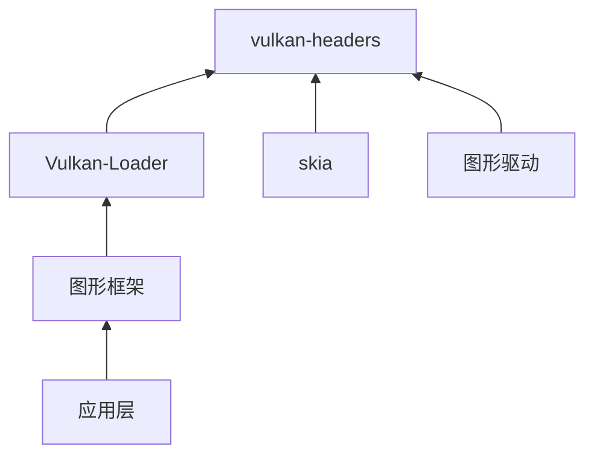

# Vulkan-Headers OpenHarmony Wiki

## 库概览

Vulkan-Headers 是 OpenHarmony 第三方库中的 Vulkan 图形 API 头文件库，提供 Vulkan 规范的完整类型定义、常量声明和接口声明。

### 核心信息

| 属性 | 值 |
|------|-----|
| **库名称** | Vulkan-Headers |
| **上游版本** | v1.4.309 |
| **OH 版本** | 3.2 |
| **许可证** | Apache-2.0 |
| **上游地址** | https://github.com/KhronosGroup/Vulkan-Headers.git |
| **适配状态** | 已适配 OpenHarmony |

### 在 OpenHarmony 中的定位

Vulkan-Headers 是 OpenHarmony 图形子系统的**基础设施层**，为整个平台的 Vulkan 支持提供 API 定义。具体作用包括：

1. **Vulkan 核心规范定义**：包含 Vulkan 1.4 完整 API 和扩展
2. **OH 特有扩展**：定义 OpenHarmony 平台专用的 Vulkan 扩展
3. **图形栈基础**：被 Vulkan-Loader、图形驱动和上层图形框架依赖

## OH 适配概述

### 适配方式

Vulkan-Headers 通过以下方式适配 OpenHarmony：

1. **OH 特有头文件**：新增 `vulkan_ohos.h`、`vulkan_screen.h`、`vk_ohos_native_buffer.h`
2. **构建配置适配**：在 BUILD.gn 中添加 `VK_USE_PLATFORM_OHOS` 宏定义
3. **零 Patch**：该库是纯头文件库，无需传统 Patch 即可完成适配

### 关键 OH 扩展

| 扩展名称 | 头文件 | 功能 |
|---------|--------|------|
| `VK_OHOS_surface` | vulkan_ohos.h | OHOS 平台 Surface 创建 |
| `VK_OHOS_native_buffer` | vulkan_ohos.h | OH Native Buffer 操作 |
| `VK_OHOS_external_memory` | vulkan_ohos.h | 外部内存扩展 |

## 文档导航

### 必读文档

- **[01_Overview.md](./01_Overview.md)**：库功能概览和 OH 定位
- **[02_Patches.md](./02_Patches.md)**：Patch 分析（本库无 Patch）
- **[03_Build_Integration.md](./03_Build_Integration.md)**：构建适配说明
- **[04_Usage_in_OH.md](./04_Usage_in_OH.md)**：依赖关系和使用场景

### 扩展阅读

- **[05_API_Differences.md](./05_API_Differences.md)**：API 差异分析
- **[06_Security.md](./06_Security.md)**：安全风险分析

## 快速索引

### 依赖关系

### 主要依赖者

- `interface/sdk_c/graphic/graphic_2d`：SDK Vulkan 接口
- `third_party/skia`：2D/3D 图形渲染
- `third_party/vk-gl-cts`：Vulkan 合规测试

## 相关资源

- **上游文档**：https://registry.khronos.org/vulkan/
- **OpenHarmony Vulkan 文档**：[Vulkan-Loader README](../vulkan-loader/README_OpenHarmony.md)
- **Loader 接口规范**：https://github.com/KhronosGroup/Vulkan-Loader/blob/master/docs/LoaderDriverInterface.md
