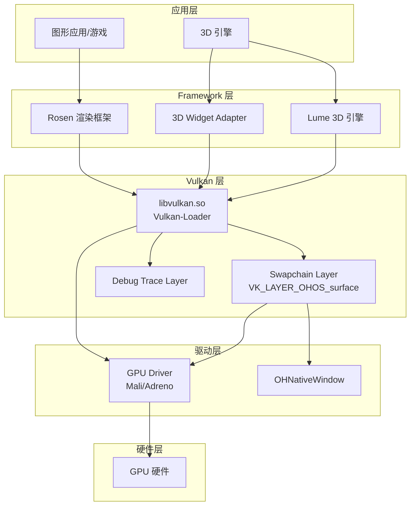
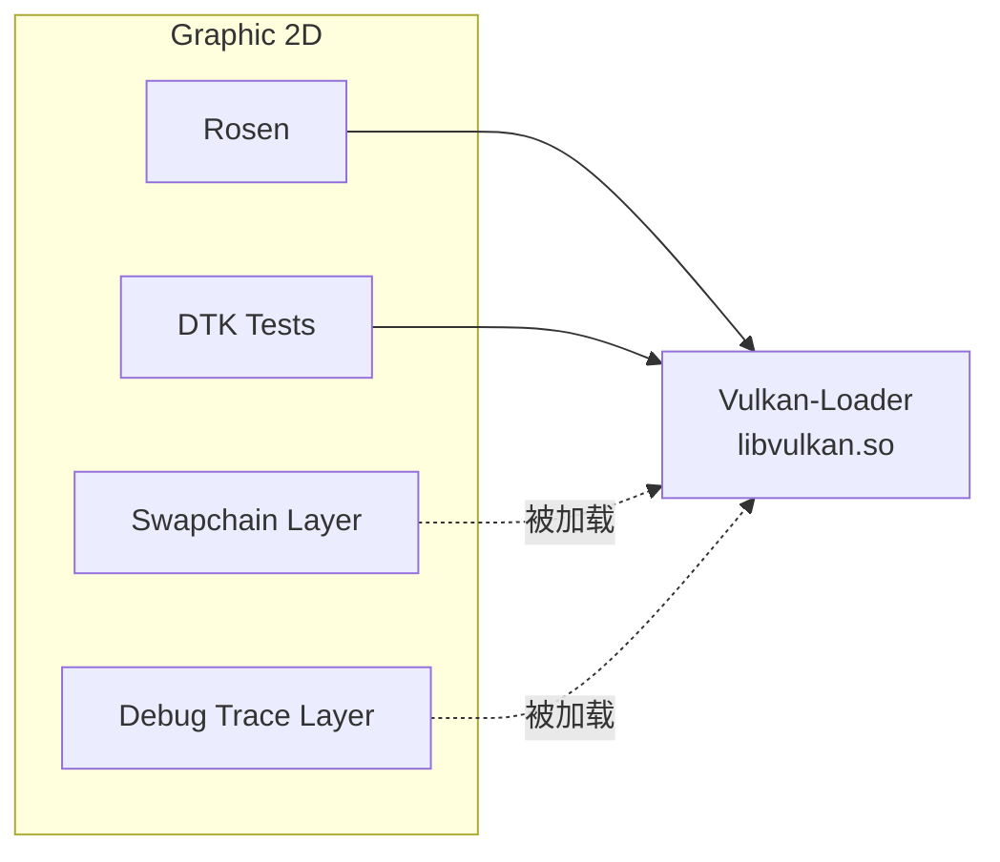
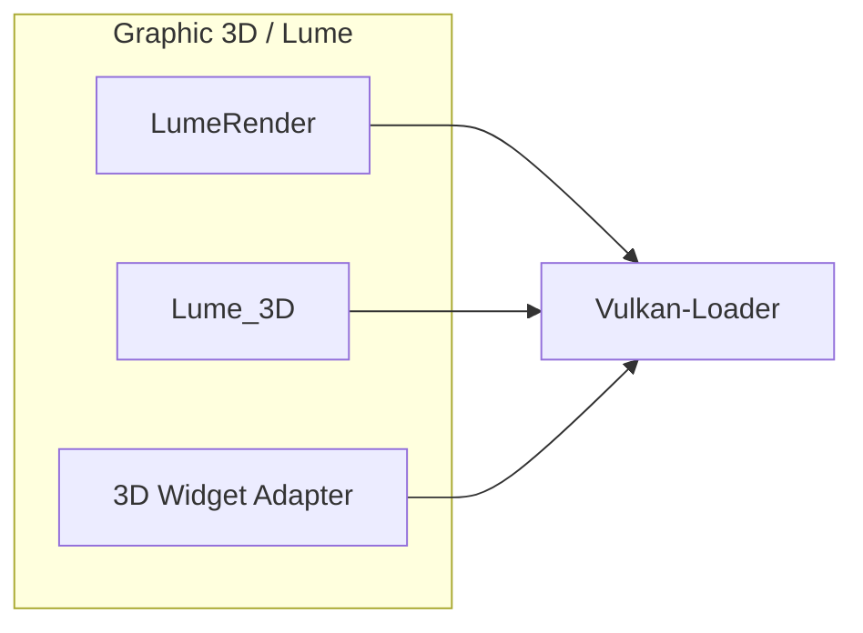

# 04 - OpenHarmony 中的依赖关系与使用

## 4.1 直接依赖者列表

根据 OpenHarmony 代码库分析，以下模块直接依赖 vulkan-loader：

### 1. Graphic 2D 框架 (`foundation/graphic/graphic_2d`)

| 模块名 | BUILD.gn 路径 | 用途 | 使用方式 |
|--------|--------------|------|----------|
| **vulkan_swapchain_layer** | `frameworks/vulkan_layers/BUILD.gn` | 窗口系统集成 | 实现 `VK_LAYER_OHOS_surface`，被 Loader 加载 |
| **vulkan_debug_trace_layer** | `openharmony/debug_trace_layer/BUILD.gn` | 调试追踪 | 提供调试/追踪功能，可动态加载 |
| **dtk_tests** | `rosen/test/dtk/BUILD.gn` | 渲染测试 | 单元测试使用 Vulkan API |
| **swapchain_unittest** | `frameworks/vulkan_layers/test/unittest/BUILD.gn` | 单元测试 | 测试 swapchain layer 功能 |
| **swapchain_systemtest** | `frameworks/vulkan_layers/test/systemtest/BUILD.gn` | 系统测试 | 系统级集成测试 |
| **swapchain_fuzzer** | `frameworks/vulkan_layers/test/fuzztest/swapchainlayer_fuzzer/BUILD.gn` | 模糊测试 | 安全模糊测试 |

### 2. Graphic 3D 框架 (`foundation/graphic/graphic_3d`)

| 模块名 | BUILD.gn 路径 | 用途 | 使用方式 |
|--------|--------------|------|----------|
| **3d_widget_adapter** | `3d_widget_adapter/BUILD.gn` | 3D 控件适配 | 静态链接，提供 Vulkan/GLES 双后端 |
| **LumeRender** | `lume/LumeRender/BUILD.gn` | 3D 渲染引擎 | 核心渲染器，Vulkan 是主要后端 |
| **LumeRender_test** | `lume/LumeRender/test/unittest/BUILD.gn` | 渲染测试 | 单元测试 |
| **Lume_3D** | `lume/Lume_3D/BUILD.gn` | 3D 图形核心 | 基础 3D 能力 |
| **Lume_3D_test** | `lume/Lume_3D/test/unittest/BUILD.gn` | 3D 测试 | 单元测试 |
| **LumeScene_test** | `lume/LumeScene/test/unittest/BUILD.gn` | 场景测试 | 场景管理测试 |
| **LumeDotfield_test** | `lume/LumeDotfield/test/unittest/BUILD.gn` | 点场测试 | 点场渲染测试 |

### 3. Vulkan-Loader 内部

| 模块名 | BUILD.gn 路径 | 用途 | 使用方式 |
|--------|--------------|------|----------|
| **vulkan_loader** | `BUILD.gn` | 主库 | 提供 `libvulkan.so` |
| **debug_trace_layer** | `openharmony/debug_trace_layer/BUILD.gn` | 调试 Layer | 内部调试功能 |
| **unittest** | `openharmony/test/unittest/BUILD.gn` | 单元测试 | 自身功能测试 |

---

## 4.2 依赖关系图

### 整体依赖关系



### Graphic 2D 详细依赖



### Graphic 3D 详细依赖



---

## 4.3 使用方式详解

### 方式 1：动态链接（主要方式）

**使用模块**：应用层、3D 引擎、渲染框架

**BUILD.gn 配置**：
```gn
ohos_shared_library("my_module") {
    external_deps = [
        "vulkan-loader:vulkan_loader",  # 依赖 vulkan-loader
    ]
}
```

**代码示例**：
```cpp
#include <vulkan/vulkan.h>

// 动态加载，通过 libvulkan.so
VkInstance instance;
VkInstanceCreateInfo createInfo = {};
vkCreateInstance(&createInfo, nullptr, &instance);
```

### 方式 2：Layer 动态加载

**使用模块**：Swapchain Layer、Debug Trace Layer

**原理**：
- Layer 作为独立 `.so` 文件存在
- Vulkan-Loader 根据 JSON 配置加载
- 通过 Layer chain 拦截/扩展 API

**JSON 配置示例**（Swapchain Layer）：
```json
{
    "file_format_version" : "1.0.0",
    "layer" : {
        "name": "VK_LAYER_OHOS_surface",
        "library_path": "libvulkan_swapchain.so",
        "api_version": "1.3.231",
        "type": "GLOBAL"
    }
}
```

### 方式 3：头文件引用

**使用模块**：所有使用 Vulkan API 的模块

**BUILD.gn 配置**：
```gn
external_deps = [
    "vulkan-headers:vulkan_headers",  # 仅头文件
]
```

**说明**：
- `vulkan-headers` 提供 Vulkan API 声明
- 实际实现在 `libvulkan.so` 中
- 运行时通过 `dlopen` 加载

---

## 4.4 典型使用场景

### 场景 1：2D 图形渲染（Rosen 框架）

```
应用 -> Rosen Canvas -> Vulkan RenderContext 
    -> libvulkan.so -> Swapchain Layer 
    -> GPU Driver -> OHNativeWindow
```

**代码路径**：`foundation/graphic/graphic_2d/rosen`

**关键点**：
- Rosen 使用 Vulkan 作为后端渲染 API
- Swapchain Layer 将 Vulkan 与 OH 窗口系统对接
- 通过 `vkCreateSurfaceOHOS` 创建 Surface

### 场景 2：3D 渲染（Lume 引擎）

```
3D 应用 -> LumeRender -> Vulkan Backend
    -> libvulkan.so -> GPU Driver
```

**代码路径**：`foundation/graphic/graphic_3d/lume`

**关键点**：
- Lume 是多后端渲染引擎（Vulkan/GLES）
- 现代 3D 功能优先使用 Vulkan
- 通过 Vulkan API 直接控制 GPU

### 场景 3：3D Widget 渲染

```
ArkUI -> 3D Widget Adapter -> Vulkan/GLES
    -> libvulkan.so -> GPU Driver
```

**代码路径**：`foundation/graphic/graphic_3d/3d_widget_adapter`

**关键点**：
- 在 ArkUI 中嵌入 3D 内容
- 根据硬件能力选择 Vulkan 或 GLES
- 定义 `CORE_HAS_VULKAN_BACKEND=1`

### 场景 4：开发者调试

```
调试应用 -> libvulkan.so -> Debug Trace Layer
    -> 打印日志 -> hilog
```

**使用方式**：
```bash
# 启用调试 Layer
hdc shell param set debug.graphic.debug_layer debug_trace
hdc shell param set debug.graphic.debug_hap com.example.myapp
```

**关键点**：
- 仅调试版本应用可用
- 通过 Bundle 管理器验证应用身份
- 日志输出到 HiLog

---

## 4.5 产品配置

vulkan-loader 被包含在以下产品配置中：

| 产品 | 配置文件 | 说明 |
|------|---------|------|
| 可穿戴设备 | `productdefine/common/inherit/wearable.json` | 智能手表等 |
| TV | `productdefine/common/inherit/tv.json` | 电视 |
| RK3568 | `vendor/hihope/rk3568/config.json` | 开发板 |
| Dayu210 | `vendor/hihope/dayu210/config.json` | 开发板 |

---

## 4.6 依赖统计

| 类别 | 数量 | 说明 |
|------|------|------|
| Framework 模块 | 2 个 | graphic_2d, graphic_3d |
| 直接依赖模块 | 14+ 个 | Layer、测试等 |
| 产品配置 | 4+ 个 | 可穿戴、TV、开发板 |
| 间接依赖应用 | 所有 Vulkan 应用 | 游戏、图形应用等 |

---

## 4.7 使用建议

### 对于 Framework 开发者

1. **优先使用 Vulkan**：新功能优先考虑 Vulkan 实现
2. **测试覆盖**：添加 Vulkan 相关的单元测试和系统测试
3. **版本兼容**：关注 vulkan-loader 版本升级

### 对于应用开发者

1. **NDK 使用**：通过 NDK 调用 Vulkan API
2. **功能检测**：运行时检测 Vulkan 支持情况
3. **错误处理**：处理设备不支持 Vulkan 的 fallback

### 对于驱动开发者

1. **ICD 实现**：按照 LoaderDriverInterface 实现驱动
2. **JSON 配置**：正确配置驱动 manifest 文件
3. **WSI 支持**：实现 VK_OHOS_surface 等扩展

---

*文档版本：v1.0*
*最后更新：2026-02-07*
