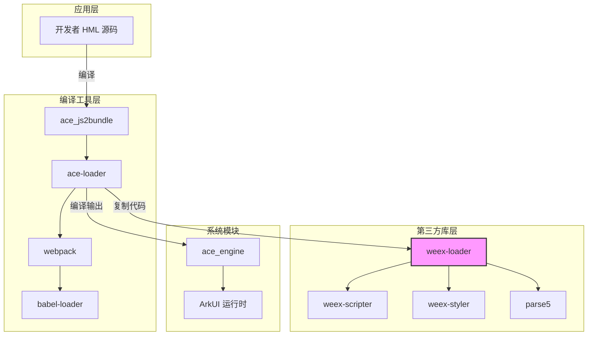
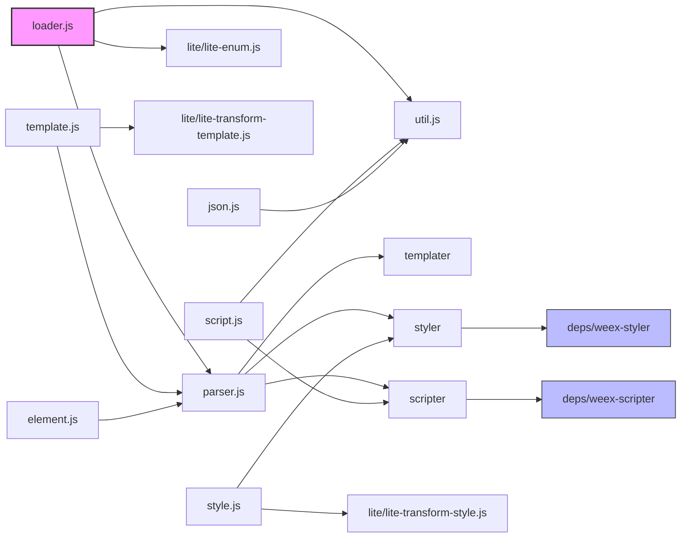

# 04 - 依赖关系与使用

本文档详细介绍 weex-loader 在 OpenHarmony 中的依赖关系、使用方式以及典型使用场景。

---

## 4.1 直接依赖者

### 4.1.1 依赖者列表

通过搜索 OH 代码库中包含 `third_party/weex-loader` 的 BUILD.gn 文件，找到以下依赖者：

| 模块 | BUILD.gn 路径 | 用途 | 依赖方式 |
|------|--------------|------|----------|
| **ace_js2bundle** | `//developtools/ace_js2bundle/BUILD.gn` | JS FA 应用编译 | 引用 deps 目录 |
| **device_manager** | `//foundation/distributedhardware/device_manager/.../js/BUILD.gn` | 对话框 UI 构建 | 路径引用 |

### 4.1.2 主要依赖者: ace_js2bundle

**模块信息**:
- **路径**: `//developtools/ace_js2bundle`
- **名称**: ace_js2bundle (JS FA 应用编译工具)
- **描述**: 提供语法编译转换、语法验证、友好的语法错误提示

**依赖方式**:

ace_js2bundle 通过两种方式使用 weex-loader：

1. **引用 deps 目录**:

```javascript
// developtools/ace_js2bundle/ace-loader/copy_deps_source.js
moduleSource.copyResource(
  path.resolve(__dirname, './third_party/weex-loader/deps/weex-scripter'),
  process.argv[2] + '/scripter'
);
moduleSource.copyResource(
  path.resolve(__dirname, './third_party/weex-loader/deps/weex-styler'),
  process.argv[2] + '/styler'
);
```

2. **构建时引用**:

```json
// developtools/ace_js2bundle/ace-loader/package.json
{
  "scripts": {
    "build": "./node_modules/.bin/babel ./third_party/weex-loader/src ./src --out-dir lib && ..."
  }
}
```

### 4.1.3 次要依赖者: device_manager

**模块信息**:
- **路径**: `//foundation/distributedhardware/device_manager/common/include/show_confirm_dialog/dialog_ui/js`
- **用途**: 设备管理模块的对话框 UI

**依赖方式**:

在 BUILD.gn 中引用 weex-loader 路径：

```gn
# dialog_ui/js/BUILD.gn
rebase_path("//developtools/ace_js2bundle", root_build_dir),
rebase_path("//third_party/weex-loader", root_build_dir),
```

**说明**: device_manager 使用 ace_js2bundle 编译其 JS UI，间接依赖 weex-loader。

---

## 4.2 使用方式

### 4.2.1 ace_js2bundle 的使用方式

#### 使用方式 1: 复制 weex-loader 代码

ace-loader 将 weex-loader 的源代码复制到自己的目录中：

```
developtools/ace_js2bundle/ace-loader/
├── src/                           # ace-loader 自身代码
├── third_party/
│   └── weex-loader/
│       └── src/                   # 复制的 weex-loader 代码
│           ├── loader.js
│           ├── parser.js
│           ├── template.js
│           ├── style.js
│           ├── script.js
│           └── util.js
└── deps/
    └── weex-scripter/             # 从 weex-loader/deps 复制
    └── weex-styler/               # 从 weex-loader/deps 复制
```

**复制原因**:
1. 允许 ace-loader 对 weex-loader 进行定制化修改
2. 保持版本一致性
3. 简化依赖管理

#### 使用方式 2: 作为 webpack loader 使用

```javascript
// ace-loader 的 webpack 配置
module.exports = {
  module: {
    rules: [
      {
        test: /\.hml$/,
        use: [
          {
            loader: path.resolve(__dirname, 'lib/loader.js'),
            options: { ... }
          }
        ]
      }
    ]
  }
};
```

### 4.2.2 头文件/模块引用方式

#### JavaScript 模块引用

```javascript
// 在 ace-loader 中引用 weex-loader 模块
const loader = require('./lib/loader');
const parser = require('./lib/parser');
const util = require('./lib/util');
```

#### deps 库引用

```javascript
// 引用 weex-scripter
const scripter = require('./lib/scripter');

// 引用 weex-styler
const styler = require('./lib/styler');
```

### 4.2.3 静态链接 vs 动态链接

weex-loader 在 OH 中的使用方式为**静态链接**：

- **构建时**: ace_js2bundle 将 weex-loader 的代码复制到自己的目录
- **编译时**: ace_js2bundle 将 weex-loader 编译到输出产物中
- **运行时**: 无运行时依赖，weex-loader 已完成编译任务

**说明**: weex-loader 是一个**构建时工具**，不参与运行时。

---

## 4.3 依赖关系图

### 4.3.1 整体依赖图



### 4.3.2 weex-loader 内部依赖图



### 4.3.3 模块关系图

```
┌─────────────────────────────────────────────────────────────┐
│                        应用项目                              │
│  ┌─────────────┐  ┌─────────────┐  ┌─────────────┐         │
│  │  pages/     │  │  app.js     │  │  config.json│         │
│  │   page.hml  │  │             │  │             │         │
│  │   page.css  │  │             │  │             │         │
│  │   page.js   │  │             │  │             │         │
│  └──────┬──────┘  └─────────────┘  └─────────────┘         │
└─────────┼───────────────────────────────────────────────────┘
          │
          ▼
┌─────────────────────────────────────────────────────────────┐
│                    ace_js2bundle                            │
│  ┌─────────────────────────────────────────────────────┐   │
│  │                   ace-loader                         │   │
│  │  ┌─────────────┐  ┌─────────────┐  ┌─────────────┐  │   │
│  │  │ webpack     │──│ babel-loader│──│ loader.js   │  │   │
│  │  │             │  │             │  │ (weex)      │  │   │
│  │  └─────────────┘  └─────────────┘  └──────┬──────┘  │   │
│  │                                           │         │   │
│  │  ┌────────────────────────────────────────┘         │   │
│  │  ▼                                                   │   │
│  │  ┌─────────────┐  ┌─────────────┐  ┌─────────────┐  │   │
│  │  │ template.js │  │  style.js   │  │  script.js  │  │   │
│  │  └─────────────┘  └─────────────┘  └─────────────┘  │   │
│  └─────────────────────────────────────────────────────┘   │
└─────────────────────────────────────────────────────────────┘
          │
          ▼
┌─────────────────────────────────────────────────────────────┐
│                    weex-loader (本库)                        │
│  ┌─────────────┐  ┌─────────────────────────────────────┐   │
│  │  src/       │  │  deps/                              │   │
│  │  loader.js  │  │  ┌─────────────┐  ┌─────────────┐  │   │
│  │  parser.js  │  │  │weex-scripter│  │weex-styler  │  │   │
│  │  ...        │  │  └─────────────┘  └─────────────┘  │   │
│  └─────────────┘  └─────────────────────────────────────┘   │
└─────────────────────────────────────────────────────────────┘
          │
          ▼
┌─────────────────────────────────────────────────────────────┐
│                    编译输出                                  │
│  ┌─────────────┐  ┌─────────────┐  ┌─────────────┐         │
│  │  pages/     │  │  app.js     │  │  manifest   │         │
│  │   page.js   │  │  (compiled) │  │  .json      │         │
│  └─────────────┘  └─────────────┘  └─────────────┘         │
└─────────────────────────────────────────────────────────────┘
          │
          ▼
┌─────────────────────────────────────────────────────────────┐
│                    ArkUI 运行时                              │
│                    (Rich/Lite/Card)                          │
└─────────────────────────────────────────────────────────────┘
```

---

## 4.4 典型使用场景

### 4.4.1 场景 1: JS FA 应用编译

**场景描述**: 开发者开发一个 JS Feature Ability 应用，需要编译 HML 文件。

**流程**:

```
开发者编写 HML
       ↓
┌──────────────────┐
│  pages/index.hml │
│  pages/index.css │
│  pages/index.js  │
└────────┬─────────┘
         │
         ▼
┌──────────────────┐
│ ace_js2bundle    │
│  调用 webpack    │
│   使用 weex-loader
└────────┬─────────┘
         │
         ▼
┌──────────────────┐
│ weex-loader      │
│  - loader.js     │
│  - template.js   │ 解析 HML 模板
│  - style.js      │ 解析 CSS
│  - script.js     │ 处理 JS
└────────┬─────────┘
         │
         ▼
┌──────────────────┐
│ 编译输出          │
│  pages/index.js   │ (包含渲染函数)
└──────────────────┘
```

**关键代码**:

```javascript
// 输入: pages/index.hml
<template>
  <div class="container">
    <text>{{title}}</text>
  </div>
</template>

// 输出: pages/index.js (简化)
$app_define$('@app-component/index', [], function($app_require$, $app_exports$, $app_module$) {
  $app_module$.exports = {
    template: function() {
      return {
        type: 'div',
        attr: { class: 'container' },
        children: [{
          type: 'text',
          attr: { value: this.title }
        }]
      }
    },
    style: { container: { flex: 1 } }
  }
})
```

### 4.4.2 场景 2: Lite 设备适配

**场景描述**: 应用需要在 Lite 设备（如 IoT 设备）上运行，需要简化编译输出。

**流程**:

```
设置 DEVICE_LEVEL=lite
         ↓
┌──────────────────┐
│ weex-loader      │
│  检测环境变量     │
└────────┬─────────┘
         │
    ┌────┴────┐
    ▼         ▼
 Rich格式   Lite格式
 (完整)     (简化)
```

**关键差异**:

```javascript
// Rich 设备输出
$app_define$('@app-component/index', [], function($app_require$, $app_exports$, $app_module$) {
  $app_script$($app_module$, $app_exports$, $app_require$)
  if ($app_exports$.__esModule && $app_exports$.default) {
    $app_module$.exports = $app_exports$.default
  }
  $app_module$.exports.template = $app_template$
  $app_module$.exports.style = $app_style$
})

// Lite 设备输出
var options = $app_script$
if ($app_script$.__esModule) {
  options = $app_script$.default;
}
options.styleSheet = $app_style$
options.render = $app_template$
module.exports = new ViewModel(options)
```

### 4.4.3 场景 3: OH 模块导入

**场景描述**: 应用需要导入 OpenHarmony 的系统模块。

**输入**:

```javascript
// pages/index.js
import router from '@system.router';
import prompt from '@ohos.prompt';

export default {
  navigate() {
    router.push({ uri: 'pages/detail' });
  },
  showPrompt() {
    prompt.showToast({ message: 'Hello' });
  }
}
```

**weex-loader 处理** (通过 util.js 的 parseRequireModule):

```javascript
// 处理后的输出
function requireModule(moduleName) {
  // 系统模块
  if (moduleName === '@system.router') {
    return $app_require$('@app-module/system.router');
  }
  // OHOS 模块
  if (moduleName === '@ohos.prompt') {
    return requireNapi('prompt');
  }
}

// 转换后的代码
const router = requireModule('@system.router');
const prompt = requireModule('@ohos.prompt');
```

---

## 4.5 依赖版本管理

### 4.5.1 版本对应关系

| weex-loader 版本 | ace_js2bundle 版本 | 兼容性 |
|------------------|-------------------|--------|
| 3.1 | (待确认) | ✅ 正常 |

**注意**: weex-loader 与 ace_js2bundle 版本需要保持兼容。

### 4.5.2 升级注意事项

升级 weex-loader 时需要：

1. **验证 ace_js2bundle 兼容性**:
   - 确保 ace_js2bundle 能正确引用新版本
   - 测试编译流程

2. **验证设备分级功能**:
   - Rich 设备: 完整功能测试
   - Lite 设备: 简化输出测试
   - Card: 卡片特殊处理测试

3. **验证模块导入**:
   - `@system.xxx` 模块
   - `@ohos.xxx` 模块
   - `libxxx.so` NAPI 模块

---

## 4.6 常见问题

### Q1: 为什么 ace_js2bundle 要复制 weex-loader 的代码？

**回答**:
1. 允许对 weex-loader 进行定制化修改
2. 避免版本冲突
3. 简化构建流程

### Q2: weex-loader 是否支持独立使用？

**回答**: 理论上可以，但在 OH 中主要作为 ace_js2bundle 的依赖使用。

### Q3: 如何知道哪个版本的 ace_js2bundle 使用了哪个版本的 weex-loader？

**回答**: 需要查看 ace_js2bundle 的提交历史或文档。

---

**下一步**: 了解 API 差异和环境变量 → [05_API_Differences.md](./05_API_Differences.md)
