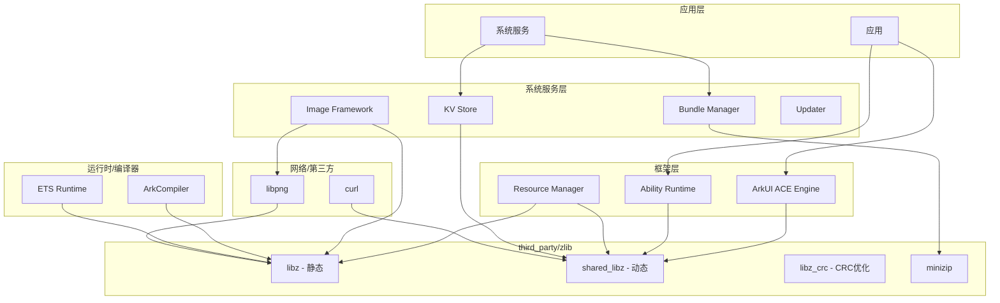

# OH 中的依赖关系与使用

本文档详细说明 zlib 在 OpenHarmony 中的依赖关系、主要使用场景和集成方式。

## 依赖关系概览

### 直接依赖者列表

| 模块 | BUILD.gn 路径 | 使用方式 | 主要用途 |
|-----|---------------|---------|---------|
| **ArkUI ACE Engine** | `foundation/arkui/ace_engine/frameworks/base/BUILD.gn` | `shared_libz` | UI 引擎资源压缩/解压 |
| **Ability Runtime** | `foundation/ability/ability_runtime/interfaces/inner_api/runtime/BUILD.gn` | `shared_libz` | 运行时数据压缩 |
| **Image Framework** | `foundation/multimedia/image_framework/interfaces/innerkits/BUILD.gn` | `libz` + `shared_libz` | 图像编解码 (PNG) |
| **Distributed DB** | `foundation/distributeddatamgr/kv_store/frameworks/libs/distributeddb/BUILD.gn` | `shared_libz` | 数据库数据压缩 |
| **Resource Manager** | `base/global/resource_management/frameworks/resmgr/BUILD.gn` | `libz` / `shared_libz` | 资源文件压缩 |
| **Bundle Manager Lite** | `foundation/bundlemanager/bundle_framework_lite/services/bundlemgr_lite/BUILD.gn` | 源文件 + minizip | Lite 设备 HAP 包处理 |
| **libziparchive** | `arkcompiler/runtime_core/libziparchive/BUILD.gn` | `libz` | 字节码归档 |
| **ETS Runtime** | `arkcompiler/ets_runtime/BUILD.gn` | `libz` | 运行时压缩支持 |
| **libpng** | `third_party/libpng/BUILD.gn` | `libz` | PNG 图像压缩 |
| **curl** | `third_party/curl/BUILD.gn` | `shared_libz` | HTTP gzip 支持 |

### 依赖类型统计

```
依赖类型分布:
┌──────────────────┬─────────┬────────────────────────────────────┐
│ 类型             │ 数量    │ 模块                               │
├──────────────────┼─────────┼────────────────────────────────────┤
│ shared_libz      │ 6       │ ACE, Runtime, Image, DB, curl...  │
│ libz (静态)      │ 4       │ libpng, ziparchive, ETS Runtime   │
│ libz_crc         │ 0       │ (供特定高性能场景使用)             │
│ 源文件+minizip   │ 1       │ Bundle Manager Lite               │
└──────────────────┴─────────┴────────────────────────────────────┘
```

---

## 依赖关系图

### 整体依赖图



---

## 核心使用场景详解

### 1. HAP 包解压 (Bundle Manager)

**场景**: 应用安装时解压 HAP (HarmonyOS Ability Package) 文件

**实现**:
```cpp
// foundation/bundlemanager/.../src/zip_file.cpp
#include "contrib/minizip/unzip.h"

// 打开 ZIP 文件
unzFile zf = unzOpen(zipPath.c_str());

// 遍历 ZIP 内容
if (unzGoToFirstFile(zf) == UNZ_OK) {
    do {
        // 读取文件信息
        unzGetCurrentFileInfo(zf, &fileInfo, fileName, ...);
        
        // 解压当前文件
        unzOpenCurrentFile(zf);
        unzReadCurrentFile(zf, buffer, size);
        unzCloseCurrentFile(zf);
    } while (unzGoToNextFile(zf) == UNZ_OK);
}

unzClose(zf);
```

**依赖方式**:
- Lite 设备: 直接包含 minizip 源文件
- 标准系统: 依赖 `//third_party/zlib:libz`

### 2. PNG 图像解码 (Image Framework → libpng)

**场景**: 加载和解码 PNG 格式图像

**调用链**:
```
Image Framework → libpng → zlib
```

**zlib 在 PNG 中的作用**:
- PNG 使用 zlib/deflate 压缩图像数据 (IDAT 块)
- libpng 调用 zlib 进行解压

**依赖方式**:
```gn
# foundation/multimedia/image_framework/.../BUILD.gn
ohos_shared_library("image") {
    deps = [
        "//third_party/libpng:libpng",
    ]
}

# third_party/libpng/BUILD.gn
ohos_static_library("libpng") {
    deps = [
        "//third_party/zlib:libz",
    ]
}
```

### 3. HTTP 压缩传输 (curl)

**场景**: HTTP 请求/响应的 gzip/deflate 内容编码

**zlib 在 HTTP 中的作用**:
- **请求**: `Accept-Encoding: gzip, deflate`
- **响应**: 解压 gzip 压缩的响应体

**依赖方式**:
```gn
# third_party/curl/BUILD.gn
ohos_shared_library("libcurl") {
    deps = [
        "//third_party/zlib:shared_libz",
    ]
    defines = [
        "HAVE_LIBZ",
        "HAVE_ZLIB_H",
    ]
}
```

### 4. 数据库压缩 (KV Store)

**场景**: 分布式键值存储的数据压缩

**用途**:
- 压缩存储数据减少磁盘占用
- 网络传输前压缩减少带宽

**依赖方式**:
```gn
# foundation/distributeddatamgr/kv_store/.../BUILD.gn
ohos_shared_library("distributeddb") {
    external_deps = [
        "zlib:shared_libz",
    ]
}
```

### 5. 字节码归档 (ArkCompiler)

**场景**: 方舟字节码 (.abc) 文件的压缩存储

**用途**:
- 压缩字节码文件减少包体积
- 运行时解压执行

**依赖方式**:
```gn
# arkcompiler/runtime_core/libziparchive/BUILD.gn
ohos_static_library("libziparchive") {
    deps = [
        "//third_party/zlib:libz",
    ]
}
```

### 6. 资源压缩 (Resource Manager)

**场景**: 系统资源文件的压缩存储和解压

**用途**:
- 压缩静态资源文件
- 运行时按需解压到内存

**依赖方式**:
```gn
# base/global/resource_management/.../BUILD.gn
ohos_shared_library("resmgr") {
    deps = [
        "//third_party/zlib:libz",        # 静态
        "//third_party/zlib:shared_libz", # 或动态
    ]
}
```

---

## 集成方式对比

### 方式 1: 静态链接 (libz)

**适用场景**:
- 需要独立部署的模块
- 避免共享库依赖

**优点**:
- 无运行时依赖
- 版本锁定

**缺点**:
- 增加二进制体积
- 多模块各自独立，无法共享内存

**示例模块**: libpng, arkcompiler, 部分轻量级模块

### 方式 2: 动态链接 (shared_libz)

**适用场景**:
- 多个模块共享使用
- 系统核心组件

**优点**:
- 节省内存 (代码段共享)
- 更新方便 (替换 so 即可)

**缺点**:
- 运行时依赖 libz.so
- 需要处理符号版本

**示例模块**: ArkUI, curl, Ability Runtime, Image Framework

### 方式 3: 直接源码包含 (Bundle Manager Lite)

**适用场景**:
- 轻量级设备 (Lite 系统)
- 最小化依赖

**实现**:
```gn
# 直接包含源文件
sources += [
    "//third_party/zlib/adler32.c",
    "//third_party/zlib/crc32.c",
    "//third_party/zlib/contrib/minizip/unzip.c",
    ...
]
```

**优点**:
- 零外部依赖
- 完全控制编译选项

**缺点**:
- 难以同步上游更新
- 重复代码

---

## 典型依赖配置示例

### 示例 1: 依赖静态库

```gn
# 你的模块 BUILD.gn
ohos_static_library("my_module") {
    sources = [ "my_file.cpp" ]
    
    deps = [
        # 直接依赖 zlib 静态库
        "//third_party/zlib:libz",
    ]
    
    # 头文件路径会自动继承
}
```

### 示例 2: 依赖共享库

```gn
# 你的模块 BUILD.gn
ohos_shared_library("my_module") {
    sources = [ "my_file.cpp" ]
    
    external_deps = [
        # 通过 external_deps 引用
        "zlib:shared_libz",
    ]
}
```

### 示例 3: 依赖 minizip

```gn
# 你的模块 BUILD.gn
ohos_static_library("my_module") {
    sources = [ "my_file.cpp" ]
    
    deps = [
        # minizip 包含在 libz 中
        "//third_party/zlib:libz",
    ]
    
    # 头文件
    # include "contrib/minizip/zip.h"
    # include "contrib/minizip/unzip.h"
}
```

---

## 依赖关系维护建议

### 1. 选择合适的依赖方式

| 场景 | 推荐方式 | 原因 |
|-----|---------|-----|
| 基础系统组件 | `shared_libz` | 节省内存，便于统一更新 |
| 第三方库适配 | `libz` | 避免循环依赖，版本锁定 |
| 高性能 CRC | `libz_crc` | 最小化依赖，最优性能 |
| Lite 设备 | 源码包含 | 最小化体积 |

### 2. 避免重复依赖

**问题**: 同时依赖静态和动态版本
```gn
# 不推荐
deps = [ "//third_party/zlib:libz" ]          # 静态
external_deps = [ "zlib:shared_libz" ]       # 动态
```

**解决**: 统一使用一种方式

### 3. 版本兼容性

- zlib ABI 向后兼容性好
- 升级 zlib 通常无需修改依赖模块
- 关注 `ZLIB_VERSION` 宏进行功能检测

---

## 测试与验证

### XTS 测试

测试路径: `//test/xts/acts/bundlemanager/zlib/actszlibtest/`

测试内容:
- 压缩/解压功能
- CRC32 校验
- gzip 文件操作

### 验证依赖

```bash
# 查看模块依赖
gn desc out //your/module:target deps

# 查看动态链接依赖
readelf -d out/lib/libmy_module.so | grep NEEDED
```
